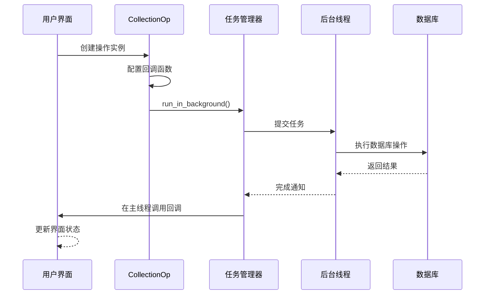
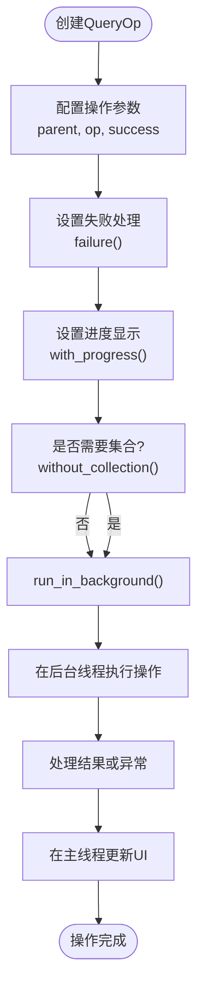
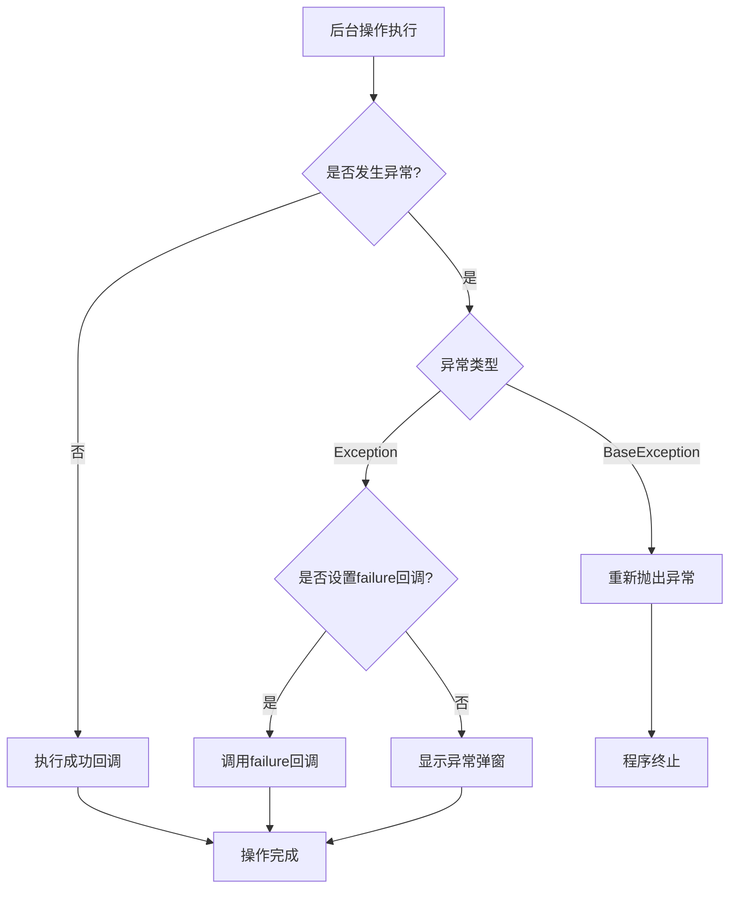
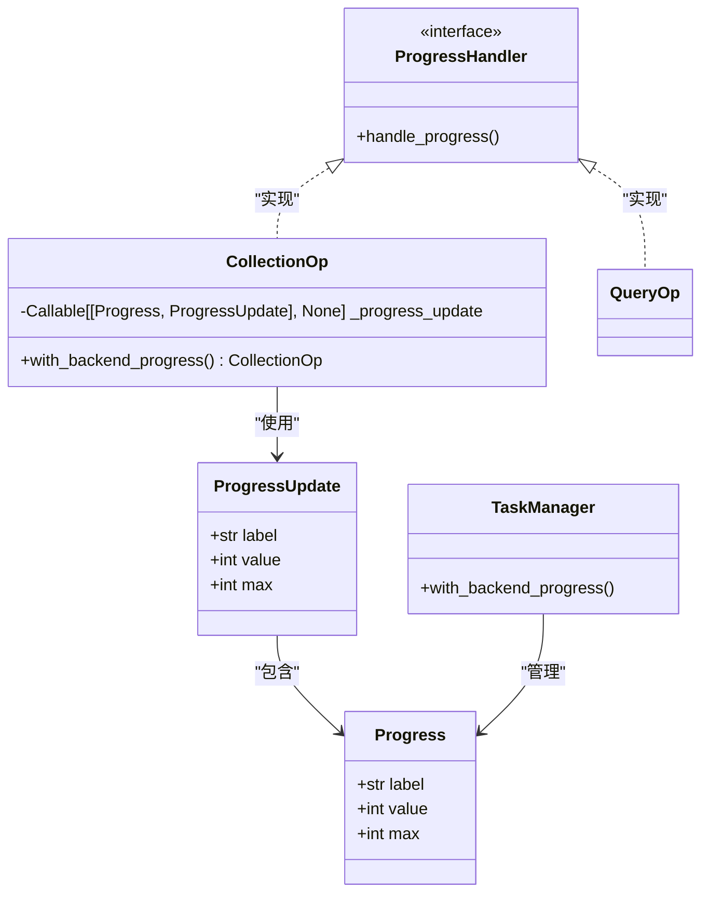
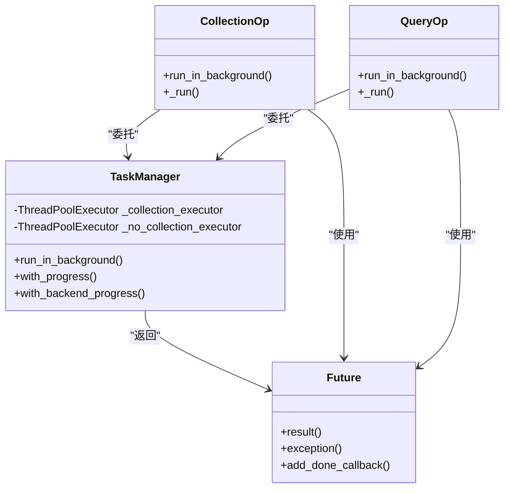
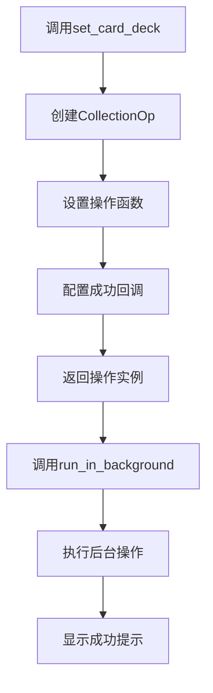

# 操作封装

<cite>
**本文档中引用的文件**  
- [__init__.py](file://qt/aqt/operations/__init__.py)
- [card.py](file://qt/aqt/operations/card.py)
- [collection.py](file://qt/aqt/operations/collection.py)
- [deck.py](file://qt/aqt/operations/deck.py)
- [note.py](file://qt/aqt/operations/note.py)
- [notetype.py](file://qt/aqt/operations/notetype.py)
- [scheduling.py](file://qt/aqt/operations/scheduling.py)
- [tag.py](file://qt/aqt/operations/tag.py)
- [taskman.py](file://qt/aqt/taskman.py)
</cite>

## 目录
1. [简介](#简介)
2. [操作类设计模式](#操作类设计模式)
3. [异步操作封装](#异步操作封装)
4. [错误处理机制](#错误处理机制)
5. [进度报告系统](#进度报告系统)
6. [后台任务管理器集成](#后台任务管理器集成)
7. [线程安全保证](#线程安全保证)
8. [操作类复用模式](#操作类复用模式)
9. [扩展点分析](#扩展点分析)
10. [初学者异步编程指南](#初学者异步编程指南)
11. [复杂操作链构建](#复杂操作链构建)

## 简介
Anki操作类封装系统为桌面应用程序提供了一套完整的异步操作管理框架。该系统通过`CollectionOp`和`QueryOp`两个核心类，实现了对数据库操作和查询任务的统一管理。操作类封装不仅处理了异步执行的复杂性，还集成了进度显示、错误处理、UI更新等关键功能，为开发者提供了简洁而强大的API接口。

**Section sources**
- [__init__.py](file://qt/aqt/operations/__init__.py#L1-L285)

## 操作类设计模式
Anki操作类系统采用生成器模式和链式调用设计，通过`CollectionOp`和`QueryOp`两个泛型类实现。`CollectionOp`专门用于处理会修改数据库的写操作，而`QueryOp`则用于处理读取操作或不涉及集合撤销系统的修改操作。

这两个类都采用链式调用语法，允许开发者通过连续的方法调用来配置操作行为。例如，可以依次调用`success()`、`failure()`和`with_progress()`方法来设置成功回调、失败处理和进度显示，最后通过`run_in_background()`方法启动操作。

**Section sources**
- [__init__.py](file://qt/aqt/operations/__init__.py#L48-L284)

## 异步操作封装
### CollectionOp异步封装
`CollectionOp`类负责封装需要修改数据库的后台操作。它通过`run_in_background()`方法将操作提交到后台线程执行，确保UI不会被长时间运行的操作阻塞。操作函数以`Collection`对象为参数，返回包含变更信息的`OpChanges`对象或具有`changes`属性的对象。



**Diagram sources**
- [__init__.py](file://qt/aqt/operations/__init__.py#L98-L144)
- [taskman.py](file://qt/aqt/taskman.py#L44-L90)

### QueryOp异步封装
`QueryOp`类用于封装查询操作，支持是否需要访问集合的灵活配置。通过`without_collection()`方法可以标记操作不需要访问集合，从而允许多个此类操作并行执行，提高网络请求等I/O密集型任务的效率。



**Diagram sources**
- [__init__.py](file://qt/aqt/operations/__init__.py#L167-L284)
- [taskman.py](file://qt/aqt/taskman.py#L92-L137)

## 错误处理机制
操作类系统提供了完善的错误处理机制。当后台操作抛出异常时，系统会自动捕获并根据配置进行处理。如果设置了`failure`回调函数，则调用该函数处理异常；否则，系统会通过`show_exception`函数显示异常信息弹窗。

对于非`Exception`类型的`BaseException`（如`SystemExit`），系统会重新抛出，确保程序能够正常退出。这种分层的错误处理策略既保证了常规错误的友好提示，又不影响程序的正常终止流程。



**Diagram sources**
- [__init__.py](file://qt/aqt/operations/__init__.py#L108-L122)
- [__init__.py](file://qt/aqt/operations/__init__.py#L243-L254)

## 进度报告系统
### 简单进度显示
操作类支持通过`with_progress()`方法添加简单的进度提示。当操作执行时间较长时，系统会显示一个进度对话框，提示用户操作正在进行。如果未指定标签文本，则默认显示"Processing..."。

### 后端进度更新
对于需要更精细进度控制的操作，可以使用`with_backend_progress()`方法。该方法接受一个进度更新回调函数，允许后端操作在执行过程中报告进度详情。这种机制特别适用于批量操作，可以实时显示已完成的项目数量和总进度。



**Diagram sources**
- [__init__.py](file://qt/aqt/operations/__init__.py#L73-L75)
- [__init__.py](file://qt/aqt/operations/__init__.py#L215-L218)
- [taskman.py](file://qt/aqt/taskman.py#L114-L137)

## 后台任务管理器集成
操作类与`TaskManager`紧密集成，通过`_run()`方法将任务委托给任务管理器处理。`TaskManager`使用两个独立的线程池：一个用于处理访问集合的任务（`_collection_executor`），另一个用于处理不访问集合的任务（`_no_collection_executor`）。

这种设计确保了数据库操作的串行化执行，避免了并发访问导致的数据竞争问题，同时允许非数据库操作并行执行，提高了系统整体效率。



**Diagram sources**
- [__init__.py](file://qt/aqt/operations/__init__.py#L133-L144)
- [__init__.py](file://qt/aqt/operations/__init__.py#L264-L284)
- [taskman.py](file://qt/aqt/taskman.py#L44-L137)

## 线程安全保证
系统通过多种机制确保线程安全。首先，访问集合的任务被限制在单线程执行，避免了数据库并发访问问题。其次，所有UI更新操作都通过`run_on_main()`方法调度到主线程执行，防止了跨线程UI操作导致的崩溃。

`TaskManager`在提交后台任务前会确保所有待处理的`on_done`闭包已在主线程执行，避免了因数据库长时锁定导致的UI冻结问题。这种精心设计的线程交互模式保证了系统的稳定性和响应性。

**Section sources**
- [taskman.py](file://qt/aqt/taskman.py#L58-L68)
- [taskman.py](file://qt/aqt/taskman.py#L149-L153)

## 操作类复用模式
### 卡片操作复用
卡片操作类（如`set_card_deck`、`set_card_flag`）采用函数式设计，返回预配置的`CollectionOp`实例。这些函数封装了常见的卡片操作，包括成功后的提示信息显示，实现了功能的高复用性。



**Diagram sources**
- [card.py](file://qt/aqt/operations/card.py#L1-L34)

### 笔记操作复用
笔记操作类提供了从添加、更新到删除的完整操作链。每个操作函数都返回一个配置好的`CollectionOp`实例，开发者只需调用`run_in_background()`即可执行操作。这种设计模式大大简化了笔记管理功能的实现。

**Section sources**
- [note.py](file://qt/aqt/operations/note.py#L1-L70)

### 甲板操作复用
甲板操作类不仅提供了基本的增删改功能，还包含了重命名、重新组织父子关系、设置折叠状态等高级功能。这些操作都遵循统一的设计模式，确保了API的一致性和易用性。

**Section sources**
- [deck.py](file://qt/aqt/operations/deck.py#L1-L103)

## 扩展点分析
### 自定义操作类型
开发者可以通过继承`CollectionOp`或`QueryOp`创建自定义操作类型，满足特定业务需求。也可以直接使用这两个类创建一次性操作，通过lambda表达式定义操作逻辑。

### 操作链组合
通过在成功回调中启动下一个操作，可以构建复杂的操作链。系统提供的`initiator`参数可用于跟踪操作链的源头，便于实现更精细的UI更新逻辑。

### 钩子系统集成
操作完成后会触发`operation_did_execute`和`state_did_reset`等钩子，允许其他模块监听操作结果并做出相应反应。这种事件驱动的设计提高了系统的可扩展性。

**Section sources**
- [__init__.py](file://qt/aqt/operations/__init__.py#L147-L161)
- [collection.py](file://qt/aqt/operations/collection.py#L1-L42)

## 初学者异步编程指南
### 基本概念
异步编程允许程序在执行耗时操作时不阻塞用户界面。Anki操作类系统将复杂的异步编程细节封装起来，开发者只需关注业务逻辑的实现。

### 简单操作示例
```python
# 创建一个修改卡片甲板的操作
op = set_card_deck(parent=parent, card_ids=[1,2,3], deck_id=4)
# 设置成功后的处理
op.success(lambda out: tooltip("卡片已更新"))
# 在后台执行操作
op.run_in_background()
```

### 错误处理最佳实践
始终考虑操作可能失败的情况，通过`failure()`方法设置适当的错误处理逻辑，为用户提供清晰的错误信息。

**Section sources**
- [__init__.py](file://qt/aqt/operations/__init__.py#L48-L284)

## 复杂操作链构建
### 串行操作链
通过在成功回调中启动下一个操作，可以构建串行执行的操作链。这种方式适用于需要按特定顺序执行的多个相关操作。

### 并行操作管理
对于可以并行执行的独立操作，可以同时启动多个`QueryOp`实例（设置`without_collection=True`），提高整体执行效率。

### 事务性操作
对于需要保证原子性的多个数据库操作，应将其合并为单个`CollectionOp`，利用Anki的事务机制确保操作的完整性。

**Section sources**
- [scheduling.py](file://qt/aqt/operations/scheduling.py#L1-L305)
- [tag.py](file://qt/aqt/operations/tag.py#L1-L118)