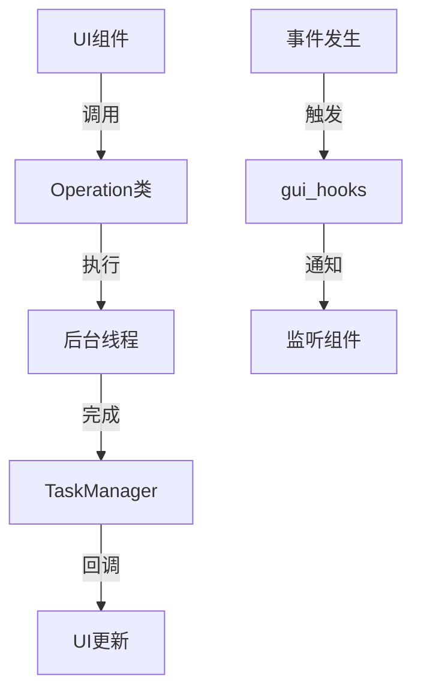
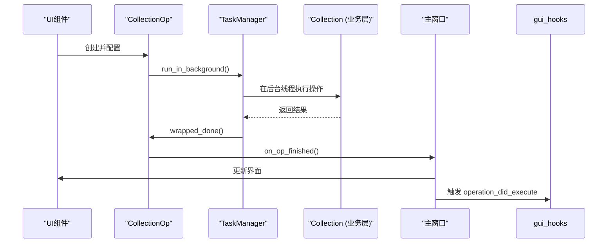

# 界面架构

<cite>
**本文档中引用的文件**  
- [gui_hooks.py](file://qt/aqt/gui_hooks.py)
- [operations/__init__.py](file://qt/aqt/operations/__init__.py)
- [operations/card.py](file://qt/aqt/operations/card.py)
- [operations/note.py](file://qt/aqt/operations/note.py)
- [operations/deck.py](file://qt/aqt/operations/deck.py)
- [operations/scheduling.py](file://qt/aqt/operations/scheduling.py)
- [operations/tag.py](file://qt/aqt/operations/tag.py)
- [taskman.py](file://qt/aqt/taskman.py)
- [main.py](file://qt/aqt/main.py)
</cite>

## 目录
1. [引言](#引言)
2. [整体架构设计原则](#整体架构设计原则)
3. [模块化组织方式](#模块化组织方式)
4. [组件间通信机制](#组件间通信机制)
5. [钩子系统实现](#钩子系统实现)
6. [操作类封装与交互](#操作类封装与交互)
7. [Qt信号槽机制基础](#qt信号槽机制基础)
8. [界面层与业务层集成](#界面层与业务层集成)
9. [高级架构模式](#高级架构模式)
10. [结论](#结论)

## 引言
Anki的Qt界面架构采用分层设计，将用户界面与核心业务逻辑分离。该架构通过模块化组织、事件驱动通信和后台任务处理机制，实现了可扩展性和响应性。本文档详细解释其设计原则、关键组件和集成方式，为初学者提供基础概念，为高级开发者展示架构模式。

## 整体架构设计原则
Anki Qt界面遵循清晰的架构设计原则：分离关注点、模块化、事件驱动和线程安全。界面层（Qt）与Python业务层通过明确定义的接口进行通信，所有耗时操作都在后台线程执行以保持UI响应性。架构强调可维护性和可扩展性，通过钩子系统支持插件集成。

**Section sources**
- [gui_hooks.py](file://qt/aqt/gui_hooks.py#L0-L11)
- [operations/__init__.py](file://qt/aqt/operations/__init__.py#L0-L285)

## 模块化组织方式
界面代码按功能模块化组织在`qt/aqt/`目录下。核心模块包括`operations`（业务操作）、`gui_hooks`（扩展点）和`taskman`（任务管理）。这种组织方式将相关功能分组，降低耦合度，提高代码可读性和可维护性。每个模块有明确职责，通过导入和调用实现协作。

**Section sources**
- [operations/__init__.py](file://qt/aqt/operations/__init__.py#L0-L285)
- [taskman.py](file://qt/aqt/taskman.py#L0-L154)

## 组件间通信机制
组件间通信主要通过函数调用、回调和事件钩子实现。`TaskManager`协调主线程与后台线程的交互，确保线程安全。`CollectionOp`和`QueryOp`封装操作并提供成功/失败回调。`gui_hooks`提供事件通知机制，允许组件在特定事件发生时响应。



**Diagram sources**
- [operations/__init__.py](file://qt/aqt/operations/__init__.py#L48-L144)
- [taskman.py](file://qt/aqt/taskman.py#L0-L154)

**Section sources**
- [operations/__init__.py](file://qt/aqt/operations/__init__.py#L48-L144)
- [taskman.py](file://qt/aqt/taskman.py#L0-L154)

## 钩子系统实现
`gui_hooks.py`定义了Anki的钩子系统，作为功能扩展和插件集成的主要机制。这些钩子是可调用对象，在特定事件（如操作执行、状态重置）发生时触发。插件可以注册监听器函数到这些钩子，从而在不修改核心代码的情况下扩展功能。钩子系统实现了松耦合的事件通知模式。

**Section sources**
- [gui_hooks.py](file://qt/aqt/gui_hooks.py#L0-L11)

## 操作类封装与交互
`operations`目录中的类封装了业务逻辑操作。`CollectionOp`用于可变数据库操作，自动处理进度显示、UI冻结、撤销状态更新和钩子触发。`QueryOp`用于只读操作或非集合操作。这些操作类通过lambda表达式调用Python业务层的`Collection`方法，实现界面与核心的交互。

```mermaid
classDiagram
class CollectionOp~ResultWithChanges~ {
+_parent : QWidget
+_op : Callable[[Collection], ResultWithChanges]
+_success : Callable[[ResultWithChanges], Any]
+_failure : Callable[[Exception], Any]
+success() : CollectionOp
+failure() : CollectionOp
+run_in_background() : None
+_run() : None
}
class QueryOp~T~ {
+_parent : QWidget
+_op : Callable[[Collection], T]
+_success : Callable[[T], Any]
+_failure : Callable[[Exception], Any]
+failure() : QueryOp
+without_collection() : QueryOp
+with_progress() : QueryOp
+run_in_background() : None
+_run() : None
}
class TaskManager {
+_collection_executor : ThreadPoolExecutor
+_no_collection_executor : ThreadPoolExecutor
+run_in_background() : Future
+with_progress() : None
+with_backend_progress() : None
+run_on_main() : None
}
CollectionOp --> TaskManager : "使用"
QueryOp --> TaskManager : "使用"
TaskManager --> "mw.progress" : "控制"
```

**Diagram sources**
- [operations/__init__.py](file://qt/aqt/operations/__init__.py#L48-L144)
- [taskman.py](file://qt/aqt/taskman.py#L0-L154)

**Section sources**
- [operations/__init__.py](file://qt/aqt/operations/__init__.py#L48-L144)
- [operations/card.py](file://qt/aqt/operations/card.py#L0-L34)
- [operations/note.py](file://qt/aqt/operations/note.py#L0-L70)
- [operations/deck.py](file://qt/aqt/operations/deck.py#L0-L103)
- [operations/scheduling.py](file://qt/aqt/operations/scheduling.py#L0-L305)
- [operations/tag.py](file://qt/aqt/operations/tag.py#L0-L118)

## Qt信号槽机制基础
Qt信号槽机制是Anki界面通信的基础。信号在特定事件发生时发射，槽函数作为响应被调用。这种机制实现了对象间的松耦合通信。在Anki中，虽然直接的信号槽使用较少，但`TaskManager`的`run_on_main`和`_closures_pending`信号体现了类似模式，确保UI更新在主线程安全执行。

**Section sources**
- [taskman.py](file://qt/aqt/taskman.py#L0-L154)

## 界面层与业务层集成
界面层通过`CollectionOp`和`QueryOp`与Python业务层集成。操作类中的lambda函数调用`mw.col`（`Collection`实例）的方法。`TaskManager`确保这些调用在后台线程执行，避免阻塞UI。结果通过回调返回，触发UI更新和钩子事件，完成整个交互循环。这种集成方式保持了清晰的层次分离。



**Diagram sources**
- [operations/__init__.py](file://qt/aqt/operations/__init__.py#L48-L144)
- [taskman.py](file://qt/aqt/taskman.py#L0-L154)
- [main.py](file://qt/aqt/main.py#L198)

**Section sources**
- [operations/__init__.py](file://qt/aqt/operations/__init__.py#L48-L144)
- [taskman.py](file://qt/aqt/taskman.py#L0-L154)
- [main.py](file://qt/aqt/main.py#L198)

## 高级架构模式
Anki Qt架构采用了多种高级模式：命令模式（`CollectionOp`封装操作）、观察者模式（`gui_hooks`事件通知）、线程池模式（`TaskManager`管理线程）和进度更新模式（`with_backend_progress`）。`CollectionOp`的流式接口（fluent interface）提供了优雅的配置方式。这些模式共同构建了一个健壮、可扩展的桌面应用架构。

**Section sources**
- [operations/__init__.py](file://qt/aqt/operations/__init__.py#L48-L144)
- [gui_hooks.py](file://qt/aqt/gui_hooks.py#L0-L11)
- [taskman.py](file://qt/aqt/taskman.py#L0-L154)

## 结论
Anki的Qt界面架构通过模块化设计、清晰的分层和强大的扩展机制，成功实现了复杂功能与良好用户体验的平衡。钩子系统和操作类封装为插件开发和业务逻辑集成提供了强大支持。理解这一架构有助于有效开发和维护Anki功能，也为构建类似的桌面应用提供了优秀范例。