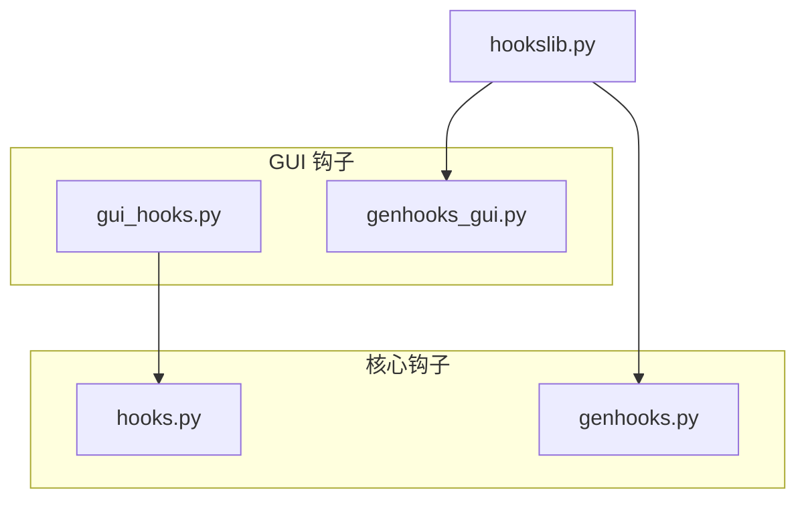
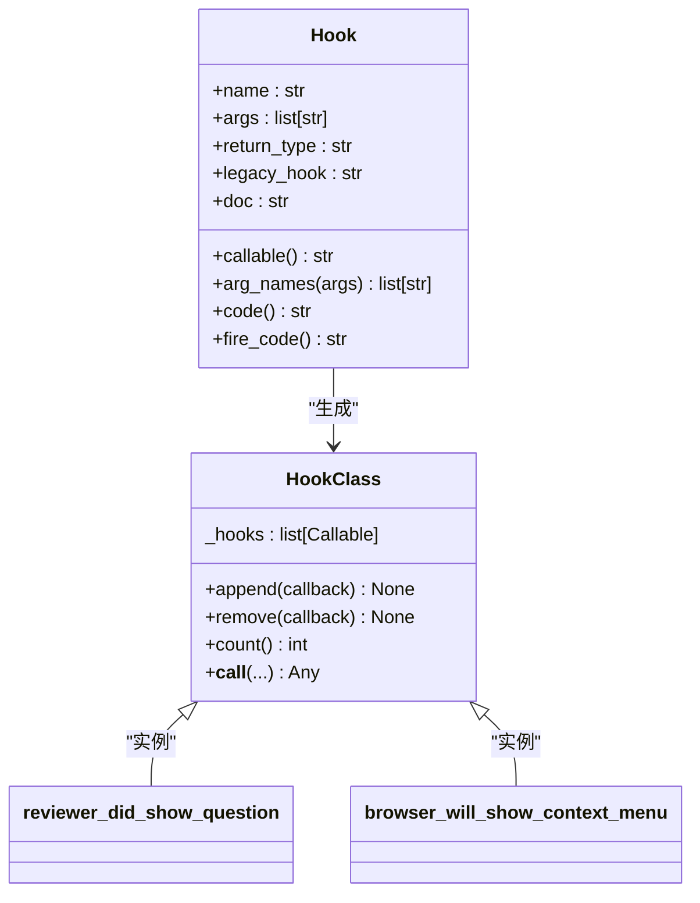
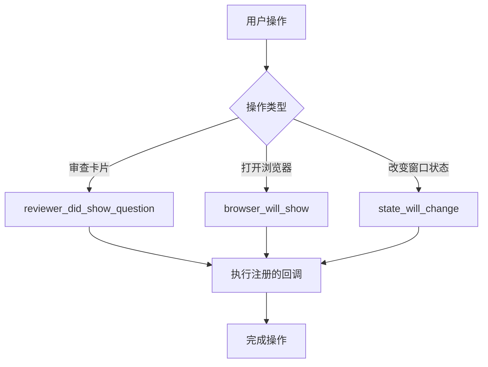
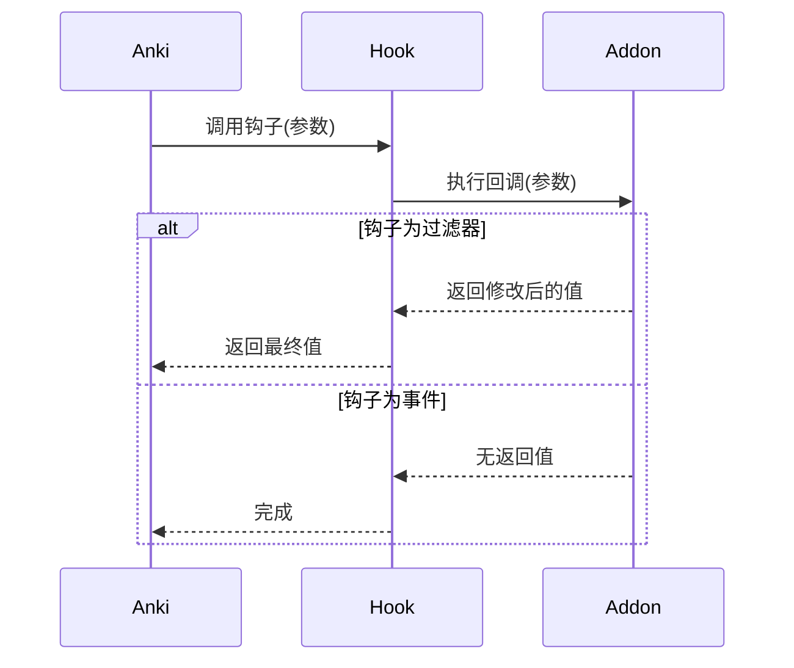
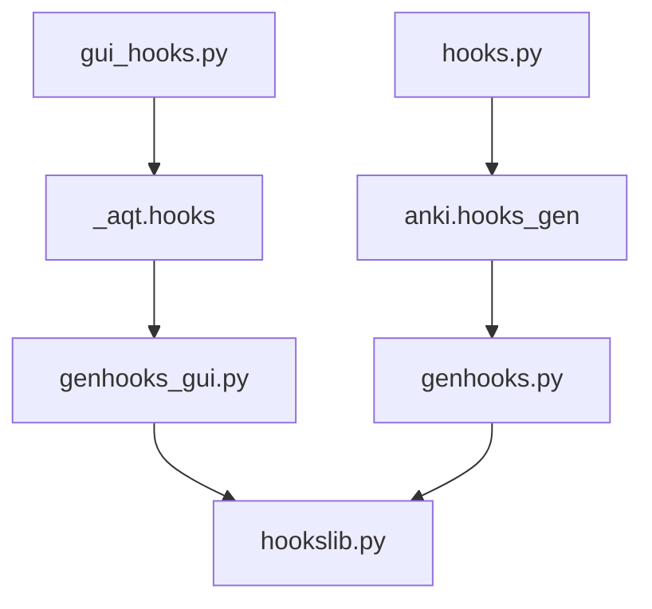

# 钩子系统

<cite>
**本文档中引用的文件**  
- [gui_hooks.py](file://qt/aqt/gui_hooks.py)
- [genhooks_gui.py](file://qt/tools/genhooks_gui.py)
- [hooks.py](file://pylib/anki/hooks.py)
- [hookslib.py](file://pylib/tools/hookslib.py)
- [genhooks.py](file://pylib/tools/genhooks.py)
</cite>

## 目录
1. [简介](#简介)
2. [项目结构](#项目结构)
3. [核心组件](#核心组件)
4. [架构概述](#架构概述)
5. [详细组件分析](#详细组件分析)
6. [依赖分析](#依赖分析)
7. [性能考虑](#性能考虑)
8. [故障排除指南](#故障排除指南)
9. [结论](#结论)

## 简介
Anki的钩子系统为插件开发者提供了一种强大的事件驱动编程机制，允许在特定操作发生时注入自定义逻辑。该系统分为两个主要部分：GUI钩子（位于`gui_hooks.py`）和核心钩子（位于`hooks.py`）。GUI钩子专门处理用户界面事件，如卡片审查、浏览器操作和窗口状态变化，而核心钩子则处理数据层事件，如笔记添加和卡片刷新。钩子系统通过在`genhooks_gui.py`和`genhooks.py`中定义的代码生成机制自动创建，确保类型安全和文档完整性。开发者可以使用`append()`方法注册回调函数，并使用`remove()`方法注销，从而实现灵活的功能扩展和定制。

## 项目结构
Anki的钩子系统分布在多个目录中，主要位于`qt/aqt/`和`pylib/anki/`下。GUI相关的钩子定义在`qt/aqt/gui_hooks.py`中，而核心功能钩子则位于`pylib/anki/hooks.py`。钩子的定义和代码生成逻辑分别在`qt/tools/genhooks_gui.py`和`pylib/tools/genhooks.py`中实现。`hookslib.py`提供了生成钩子类的通用逻辑。这种分离的设计使得GUI和核心功能的扩展可以独立进行，同时保持一致的编程接口。

**Diagram sources**
- [gui_hooks.py](file://qt/aqt/gui_hooks.py)
- [genhooks_gui.py](file://qt/tools/genhooks_gui.py)
- [hooks.py](file://pylib/anki/hooks.py)
- [genhooks.py](file://pylib/tools/genhooks.py)
- [hookslib.py](file://pylib/tools/hookslib.py)

**Section sources**
- [gui_hooks.py](file://qt/aqt/gui_hooks.py)
- [genhooks_gui.py](file://qt/tools/genhooks_gui.py)

## 核心组件
钩子系统的核心由`Hook`类和代码生成机制组成。`Hook`类在`hookslib.py`中定义，包含了钩子的名称、参数、返回类型和文档字符串等元数据。代码生成器（`genhooks_gui.py`和`genhooks.py`）使用这些元数据动态创建类型化的钩子类。每个钩子类都提供了`append()`、`remove()`和`count()`方法，以及一个可调用的实例，用于触发所有注册的回调函数。GUI钩子通过`_aqt.hooks`模块导入，该模块由代码生成器自动创建。

**Section sources**
- [hookslib.py](file://pylib/tools/hookslib.py)
- [genhooks_gui.py](file://qt/tools/genhooks_gui.py)
- [gui_hooks.py](file://qt/aqt/gui_hooks.py)

## 架构概述
Anki的钩子系统采用生成式编程和事件驱动架构。在构建时，`genhooks_gui.py`和`genhooks.py`脚本读取`Hook`对象列表，并生成包含类型化钩子类的Python代码。这些生成的类继承自一个通用基类，该基类实现了观察者模式。当特定事件发生时，Anki的核心代码会调用相应的钩子实例，该实例会遍历其内部的回调函数列表并依次执行它们。系统还提供了对旧版钩子的向后兼容支持，确保现有插件可以平稳过渡。

**Diagram sources**
- [hookslib.py](file://pylib/tools/hookslib.py)
- [genhooks_gui.py](file://qt/tools/genhooks_gui.py)

## 详细组件分析
### GUI钩子分析
GUI钩子系统为Anki的用户界面提供了丰富的扩展点。例如，`reviewer_did_show_question`钩子在问题面显示后触发，允许插件执行自定义操作。`browser_will_show_context_menu`钩子允许在浏览器上下文菜单显示前添加新的菜单项。每个钩子都有明确的触发时机和参数传递机制。返回值为`None`的钩子（如`reviewer_did_show_question`）仅用于执行副作用，而返回值不为`None`的钩子（如`reviewer_will_answer_card`）则作为过滤器，可以修改其输入参数。

#### 钩子类型和触发时机

**Diagram sources**
- [genhooks_gui.py](file://qt/tools/genhooks_gui.py)

#### 参数传递和返回值处理

**Diagram sources**
- [hookslib.py](file://pylib/tools/hookslib.py)

**Section sources**
- [genhooks_gui.py](file://qt/tools/genhooks_gui.py)
- [hookslib.py](file://pylib/tools/hookslib.py)

### 事件驱动编程概念
事件驱动编程是一种编程范式，其中程序的执行流程由事件（如用户操作或消息）决定。在Anki中，钩子系统是这种范式的具体实现。开发者注册对特定事件感兴趣的回调函数，当事件发生时，系统会自动调用这些函数。这种方法实现了关注点分离，使得核心代码和扩展代码可以独立开发和维护。

## 依赖分析
钩子系统的依赖关系清晰且分层明确。`gui_hooks.py`依赖于由`genhooks_gui.py`生成的`_aqt.hooks`模块。`genhooks_gui.py`本身依赖于`hookslib.py`中的通用逻辑。核心的`hooks.py`文件依赖于`genhooks.py`生成的代码。这种设计确保了代码的可维护性和可扩展性，同时避免了循环依赖。

**Diagram sources**
- [gui_hooks.py](file://qt/aqt/gui_hooks.py)
- [genhooks_gui.py](file://qt/tools/genhooks_gui.py)
- [hooks.py](file://pylib/anki/hooks.py)
- [genhooks.py](file://pylib/tools/genhooks.py)
- [hookslib.py](file://pylib/tools/hookslib.py)

**Section sources**
- [gui_hooks.py](file://qt/aqt/gui_hooks.py)
- [genhooks_gui.py](file://qt/tools/genhooks_gui.py)
- [hooks.py](file://pylib/anki/hooks.py)
- [genhooks.py](file://pylib/tools/genhooks.py)

## 性能考虑
钩子系统对性能的影响主要取决于注册的回调函数的数量和复杂度。每个钩子调用都会遍历其回调函数列表，因此过多的注册函数会导致性能下降。最佳实践是仅在必要时注册钩子，并在完成后及时注销。对于计算密集型操作，应考虑使用异步任务或延迟执行，以避免阻塞UI线程。此外，避免在钩子回调中进行数据库操作，因为这可能导致死锁或性能瓶颈。

## 故障排除指南
常见的钩子相关问题包括回调函数未被调用、参数类型错误和性能问题。调试时，首先检查钩子名称是否正确拼写，并确认`append()`方法已被调用。使用`count()`方法可以验证回调函数是否已成功注册。对于类型错误，应参考`genhooks_gui.py`中的类型注解。性能问题通常源于在钩子回调中执行了耗时操作，应使用性能分析工具定位瓶颈。

**Section sources**
- [gui_hooks.py](file://qt/aqt/gui_hooks.py)
- [hookslib.py](file://pylib/tools/hookslib.py)

## 结论
Anki的钩子系统是一个强大而灵活的扩展机制，它通过生成式编程和事件驱动架构为插件开发者提供了丰富的定制能力。通过深入理解钩子的定义、触发时机和使用模式，开发者可以创建出功能强大且性能优良的插件。未来的工作可以集中在优化钩子调用性能、提供更详细的文档和示例，以及探索更高级的扩展模式。