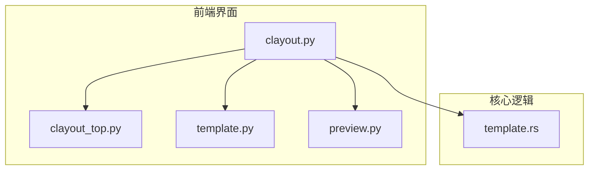
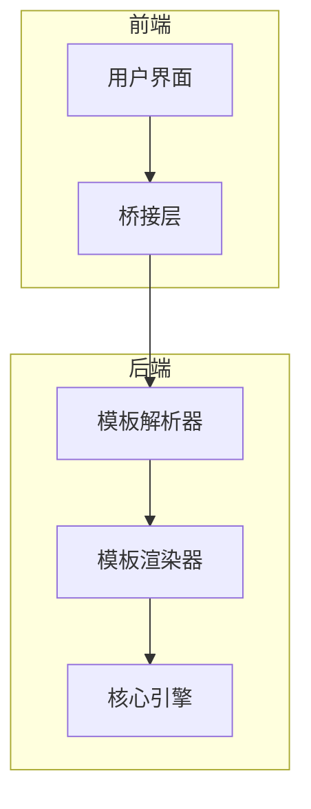
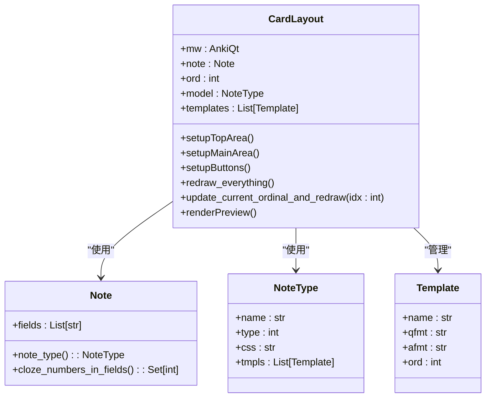
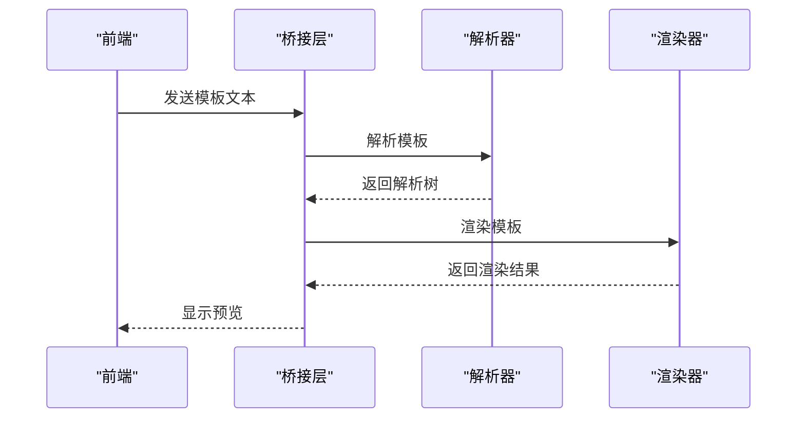
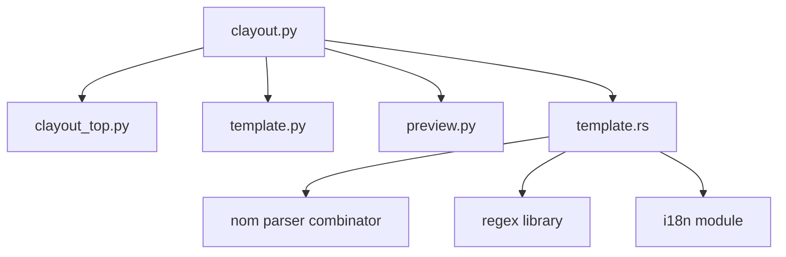

# 卡片模板编辑

<cite>
**本文档中引用的文件**  
- [clayout.py](file://qt/aqt/clayout.py)
- [clayout_top.py](file://qt/aqt/forms/clayout_top.py)
- [template.rs](file://rslib/src/template.rs)
</cite>

## 目录
1. [简介](#简介)
2. [项目结构](#项目结构)
3. [核心组件](#核心组件)
4. [架构概述](#架构概述)
5. [详细组件分析](#详细组件分析)
6. [依赖分析](#依赖分析)
7. [性能考虑](#性能考虑)
8. [故障排除指南](#故障排除指南)
9. [结论](#结论)

## 简介
本文件详细分析了 Anki 应用程序中卡片模板编辑器的实现。重点包括卡片布局编辑器（clayout.py）的正面/背面模板编辑、字段映射和实时预览功能，UI 表单设计与数据绑定机制（clayout_top.py），以及 Rust 核心对模板解析和渲染的处理逻辑（template.rs）。此外，还提供了模板语法的完整参考，并包含模板继承、共享模板和样式定制的使用示例，为开发者提供模板验证、错误处理和性能优化的指导。

## 项目结构
Anki 项目的结构清晰地划分为多个模块，主要包括 Python 前端界面（pylib）、Qt 用户界面（qt）、Rust 核心逻辑（rslib）和 TypeScript 前端逻辑（ts）。卡片模板编辑功能主要涉及 `qt/aqt/clayout.py` 中的布局编辑器实现、`qt/aqt/forms/clayout_top.py` 的 UI 表单定义，以及 `rslib/src/template.rs` 中的模板解析与渲染核心逻辑。

**Diagram sources**
- [clayout.py](file://qt/aqt/clayout.py#L1-L50)
- [clayout_top.py](file://qt/aqt/forms/clayout_top.py#L1-L10)
- [template.py](file://qt/aqt/forms/template.py#L1-L10)
- [preview.py](file://qt/aqt/forms/preview.py#L1-L10)
- [template.rs](file://rslib/src/template.rs#L1-L50)

**Section sources**
- [clayout.py](file://qt/aqt/clayout.py#L1-L100)
- [clayout_top.py](file://qt/aqt/forms/clayout_top.py#L1-L20)
- [template.rs](file://rslib/src/template.rs#L1-L100)

## 核心组件
卡片模板编辑功能的核心组件包括：
- **CardLayout 类**：负责管理卡片模板编辑器的整体布局和交互逻辑。
- **clayout_top UI 表单**：提供顶部区域的用户界面元素，如模板选择框和选项按钮。
- **模板解析引擎**：基于 Rust 实现的高效模板解析与渲染系统，支持复杂的模板语法。

**Section sources**
- [clayout.py](file://qt/aqt/clayout.py#L50-L200)
- [clayout_top.py](file://qt/aqt/forms/clayout_top.py#L1-L20)
- [template.rs](file://rslib/src/template.rs#L100-L300)

## 架构概述
卡片模板编辑器采用分层架构设计，前端使用 PyQt 实现用户界面，后端使用 Rust 处理模板解析和渲染。前端通过桥接机制与后端通信，确保高性能和响应性。

**Diagram sources**
- [clayout.py](file://qt/aqt/clayout.py#L1-L50)
- [template.rs](file://rslib/src/template.rs#L1-L50)

## 详细组件分析

### CardLayout 类分析
CardLayout 类是卡片模板编辑器的核心，负责管理整个编辑器的生命周期和用户交互。

#### 类图

**Diagram sources**
- [clayout.py](file://qt/aqt/clayout.py#L50-L200)

**Section sources**
- [clayout.py](file://qt/aqt/clayout.py#L50-L500)

### 模板解析与渲染分析
template.rs 文件实现了模板的词法分析、语法解析和渲染逻辑，支持标准和替代语法。

#### 序列图

**Diagram sources**
- [template.rs](file://rslib/src/template.rs#L100-L300)

**Section sources**
- [template.rs](file://rslib/src/template.rs#L100-L500)

## 依赖分析
卡片模板编辑器依赖于多个内部和外部组件，确保功能完整性和可扩展性。

**Diagram sources**
- [clayout.py](file://qt/aqt/clayout.py#L1-L50)
- [template.rs](file://rslib/src/template.rs#L1-L50)

**Section sources**
- [clayout.py](file://qt/aqt/clayout.py#L1-L100)
- [template.rs](file://rslib/src/template.rs#L1-L100)

## 性能考虑
为了确保卡片模板编辑器的高性能，采用了以下优化策略：
- 使用 Rust 实现核心解析和渲染逻辑，提高执行效率。
- 采用延迟渲染机制，避免不必要的重新渲染。
- 利用缓存机制存储解析结果，减少重复解析开销。

## 故障排除指南
常见问题及解决方案：
- **模板语法错误**：检查模板中的括号是否匹配，确保条件语句正确闭合。
- **字段引用失败**：确认字段名称拼写正确，且字段存在于当前笔记类型中。
- **预览不更新**：尝试手动触发重新渲染，或检查是否有未保存的更改。

**Section sources**
- [clayout.py](file://qt/aqt/clayout.py#L700-L800)
- [template.rs](file://rslib/src/template.rs#L1200-L1300)

## 结论
Anki 的卡片模板编辑器通过结合 Python 前端界面和 Rust 核心逻辑，实现了高效、灵活的模板编辑功能。通过对 clayout.py、clayout_top.py 和 template.rs 的深入分析，我们理解了其架构设计和实现细节，为开发者提供了宝贵的参考和指导。