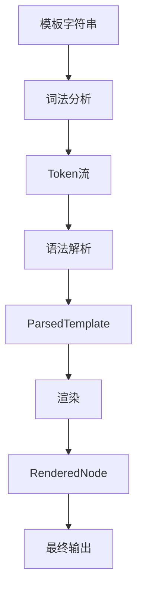
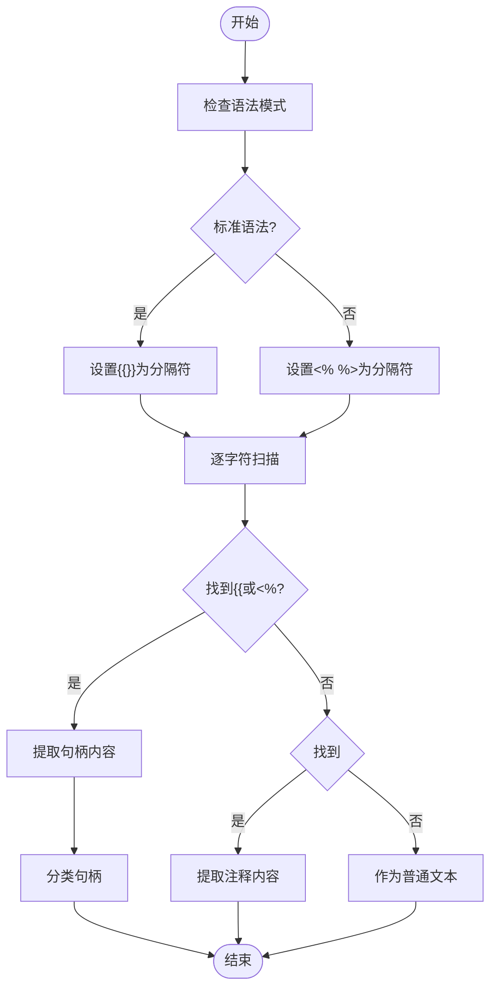
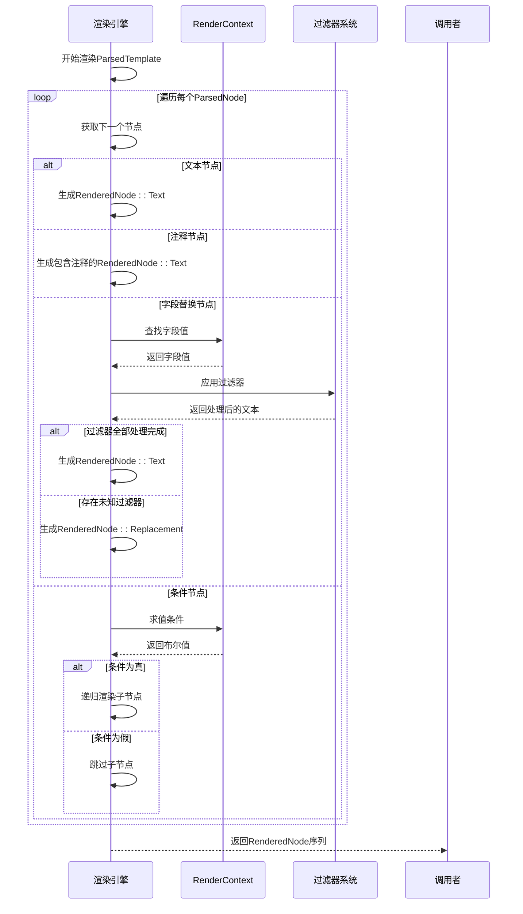
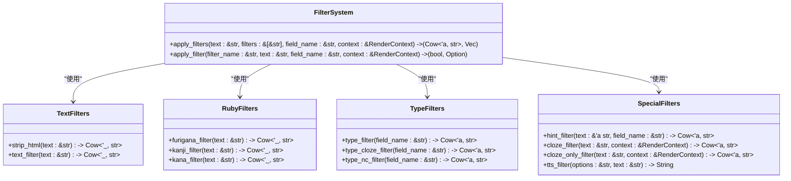
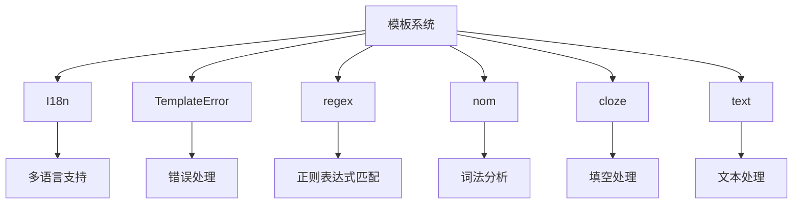

# 模板解析与渲染

<cite>
**本文档引用的文件**  
- [template.rs](file://rslib/src/template.rs)
- [template_filters.rs](file://rslib/src/template_filters.rs)
</cite>

## 目录
1. [简介](#简介)
2. [项目结构](#项目结构)
3. [核心组件](#核心组件)
4. [架构概述](#架构概述)
5. [详细组件分析](#详细组件分析)
6. [依赖分析](#依赖分析)
7. [性能考虑](#性能考虑)
8. [故障排除指南](#故障排除指南)
9. [结论](#结论)
10. [附录](#附录)（如有必要）

## 简介
本文档深入分析Anki中的卡片模板解析与渲染引擎，重点研究`template.rs`中模板解析器的实现机制。文档涵盖词法分析、语法树构建、指令节点处理等核心功能，详细解释模板渲染流程，包括字段替换、条件判断求值和循环展开的执行机制。同时，文档描述`template_filters.rs`中内置过滤器（如日期格式化、字符串处理）的注册和调用方式，提供模板安全沙箱、性能监控和错误恢复的实现细节。此外，文档还包含自定义模板函数扩展、解析性能优化和内存管理的最佳实践，以及与前端渲染的集成方案。

## 项目结构
Anki的模板系统主要由Rust后端实现，核心文件位于`rslib/src/`目录下。`template.rs`文件负责模板的词法分析、语法解析和渲染逻辑，而`template_filters.rs`文件则实现了各种内置过滤器。系统通过`ParsedTemplate`结构体表示解析后的模板，并通过`RenderContext`上下文进行渲染。模板引擎支持标准和替代两种语法模式，能够处理复杂的条件逻辑和嵌套结构。



**Diagram sources**
- [template.rs](file://rslib/src/template.rs#L0-L1383)

**Section sources**
- [template.rs](file://rslib/src/template.rs#L0-L1383)
- [template_filters.rs](file://rslib/src/template_filters.rs#L0-L304)

## 核心组件
模板解析与渲染系统的核心组件包括词法分析器、语法解析器、渲染引擎和过滤器系统。词法分析器将模板字符串分解为Token流，语法解析器将Token流构建成抽象语法树（AST），渲染引擎根据上下文数据执行AST并生成最终输出，过滤器系统则提供对字段值的转换和处理功能。系统通过`ParsedTemplate`结构体统一表示解析后的模板，通过`RenderContext`传递渲染所需的上下文信息。

**Section sources**
- [template.rs](file://rslib/src/template.rs#L0-L1383)
- [template_filters.rs](file://rslib/src/template_filters.rs#L0-L304)

## 架构概述
模板系统的整体架构采用经典的编译器设计模式，分为词法分析、语法解析和代码生成（渲染）三个阶段。系统首先通过`tokens`函数进行词法分析，将模板字符串分解为`Token`枚举类型的流。然后通过`parse_inner`函数进行递归下降语法解析，构建出`ParsedNode`组成的抽象语法树。最后通过`render_into`函数遍历语法树，结合`RenderContext`中的上下文数据，生成`RenderedNode`序列。整个过程通过`ParsedTemplate`结构体进行封装和管理。

```mermaid
classDiagram
class ParsedTemplate {
+Vec<ParsedNode> nodes
+from_text(template : &str) -> TemplateResult<ParsedTemplate>
+render(context : &RenderContext, tr : &I18n) -> TemplateResult<Vec<RenderedNode>>
+requirements(field_map : &FieldMap) -> FieldRequirements
+rename_and_remove_fields(fields : &HashMap<String, Option<String>>)
}
class RenderContext {
+&HashMap<&str, Cow<str>> fields
+&HashSet<&str> nonempty_fields
+Option<&str> frontside
+u16 card_ord
+bool partial_for_python
+evaluate_conditional(key : &str, negated : bool) -> TemplateResult<bool>
}
class ParsedNode {
<<enumeration>>
Text(String)
Comment(String)
Replacement{key : String, filters : Vec<String>}
Conditional{key : String, children : Vec<ParsedNode>}
NegatedConditional{key : String, children : Vec<ParsedNode>}
}
class RenderedNode {
<<enumeration>>
Text{text : String}
Replacement{field_name : String, current_text : String, filters : Vec<String>}
}
ParsedTemplate --> ParsedNode : "包含"
ParsedTemplate --> RenderedNode : "生成"
RenderContext --> ParsedTemplate : "用于渲染"
```

**Diagram sources**
- [template.rs](file://rslib/src/template.rs#L169-L205)
- [template.rs](file://rslib/src/template.rs#L378-L378)

## 详细组件分析

### 模板解析器分析
模板解析器采用两阶段处理模式：词法分析和语法解析。词法分析阶段通过`tokens`函数将模板字符串分解为`Token`流，支持标准语法`{{}}`和替代语法`<% %>`。语法解析阶段通过递归下降算法将Token流构建成`ParsedNode`组成的抽象语法树。系统能够正确处理文本、注释、字段替换和条件指令等不同类型的节点，并通过`parse_inner`函数的递归调用处理嵌套的条件结构。

#### 词法分析流程


**Diagram sources**
- [template.rs](file://rslib/src/template.rs#L123-L170)

**Section sources**
- [template.rs](file://rslib/src/template.rs#L0-L1383)

### 模板渲染流程
模板渲染流程通过`render_into`函数实现，该函数遍历`ParsedNode`语法树，根据节点类型和`RenderContext`上下文生成`RenderedNode`序列。对于文本和注释节点，直接生成对应的`RenderedNode::Text`；对于字段替换节点，查找上下文中的字段值并应用过滤器；对于条件节点，根据条件求值结果决定是否渲染子节点。渲染过程支持部分渲染模式，当遇到未知过滤器时可以保留待处理的`RenderedNode::Replacement`节点。

#### 渲染执行机制


**Diagram sources**
- [template.rs](file://rslib/src/template.rs#L406-L438)
- [template_filters.rs](file://rslib/src/template_filters.rs#L24-L24)

### 过滤器系统分析
过滤器系统通过`apply_filters`函数实现，该函数按顺序应用过滤器链，支持内置过滤器和自定义过滤器。系统预定义了多种实用过滤器，如`text`（去除HTML标签）、`furigana`（日语假名标注）、`cloze`（填空处理）等。过滤器可以组合使用，通过冒号分隔，系统按从右到左的顺序应用过滤器。当遇到未知过滤器时，系统可以根据`partial_for_python`标志决定是忽略还是保留待处理。

#### 内置过滤器注册与调用


**Diagram sources**
- [template_filters.rs](file://rslib/src/template_filters.rs#L24-L24)

**Section sources**
- [template_filters.rs](file://rslib/src/template_filters.rs#L0-L304)

## 依赖分析
模板系统的主要依赖包括国际化支持（`I18n`）、错误处理（`AnkiError`、`TemplateError`）、正则表达式（`regex`）和词法分析库（`nom`）。系统通过`I18n`提供多语言错误信息，通过`TemplateError`枚举类型表示各种模板错误。`regex`库用于实现字段空值检测和假名标注等功能，`nom`库则用于实现词法分析器。此外，系统还依赖`cloze`模块处理填空逻辑，依赖`text`模块提供文本处理功能。



**Diagram sources**
- [template.rs](file://rslib/src/template.rs#L0-L1383)

**Section sources**
- [template.rs](file://rslib/src/template.rs#L0-L1383)
- [template_filters.rs](file://rslib/src/template_filters.rs#L0-L304)

## 性能考虑
模板系统在设计时充分考虑了性能因素。词法分析和语法解析采用流式处理，避免一次性加载整个模板到