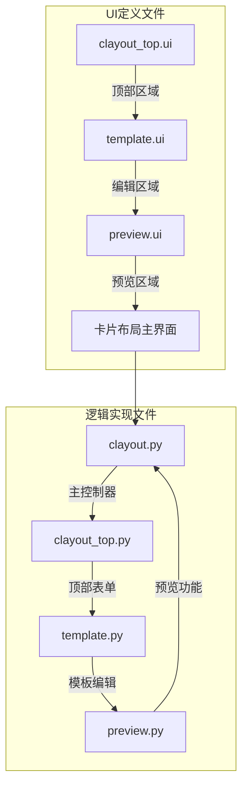
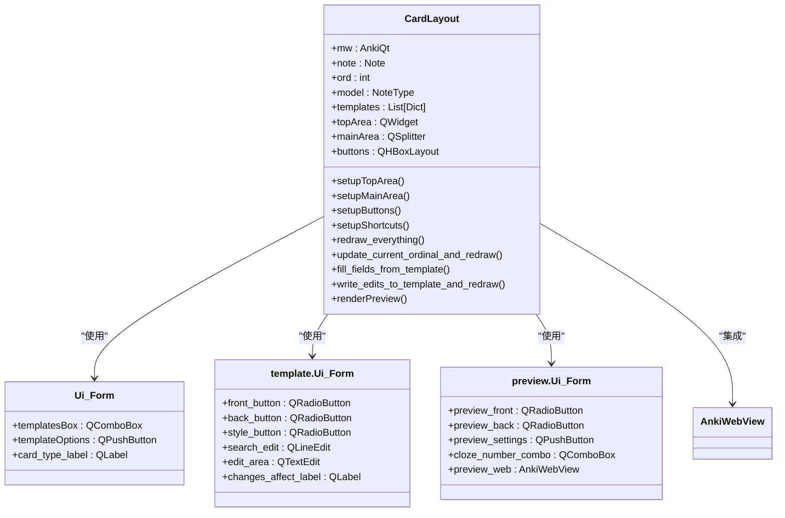
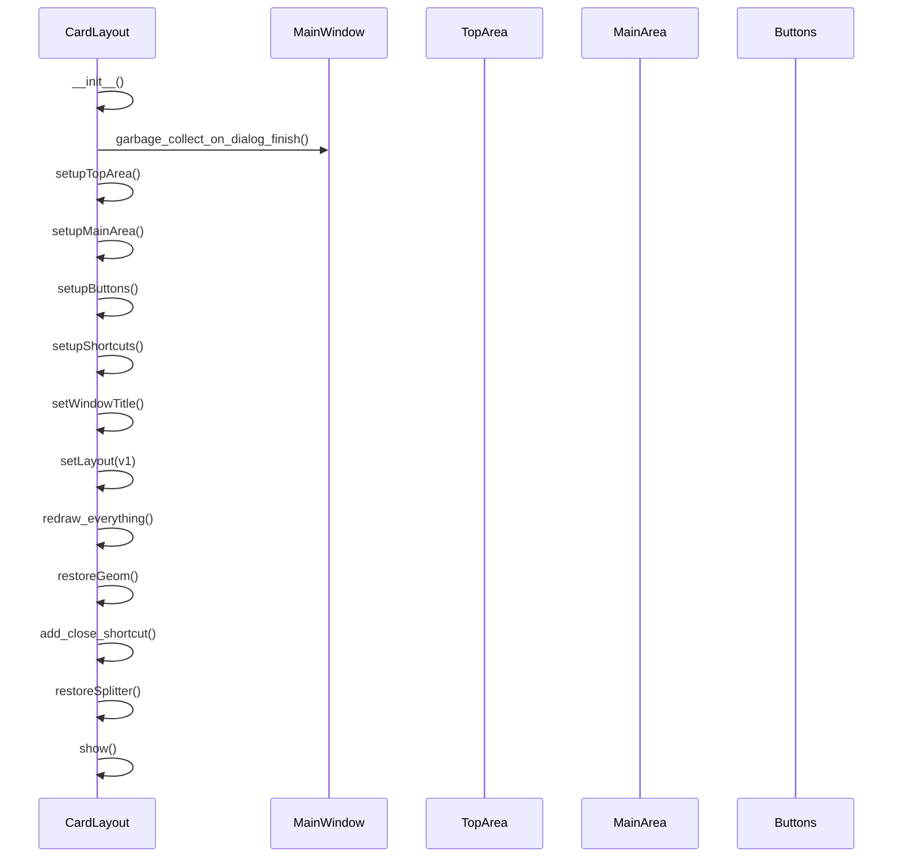
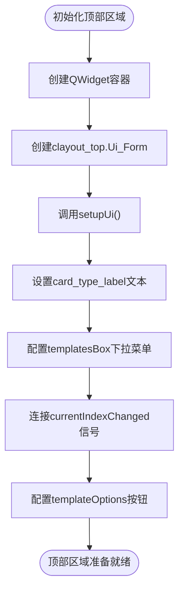
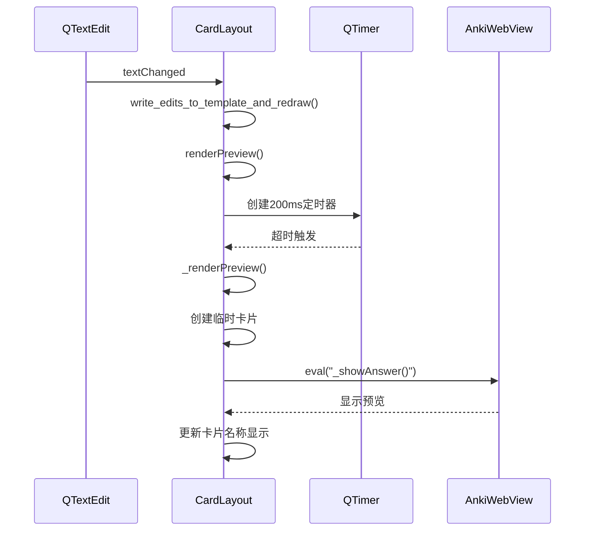
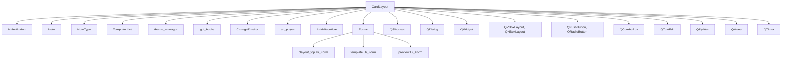

# 模板设计与编辑

<cite>
**本文档中引用的文件**  
- [clayout.py](file://qt/aqt/clayout.py)
- [clayout_top.py](file://qt/aqt/forms/clayout_top.py)
- [template.py](file://qt/aqt/forms/template.py)
- [preview.py](file://qt/aqt/forms/preview.py)
- [clayout_top.ui](file://qt/aqt/forms/clayout_top.ui)
- [template.ui](file://qt/aqt/forms/template.ui)
- [preview.ui](file://qt/aqt/forms/preview.ui)
</cite>

## 目录
1. [简介](#简介)
2. [项目结构](#项目结构)
3. [核心组件](#核心组件)
4. [架构概述](#架构概述)
5. [详细组件分析](#详细组件分析)
6. [依赖分析](#依赖分析)
7. [性能考虑](#性能考虑)
8. [故障排除指南](#故障排除指南)
9. [结论](#结论)

## 简介
本文件详细阐述了Anki中卡片模板设计与编辑功能的实现机制。重点分析了`clayout.py`中卡片布局编辑器的结构与逻辑，包括正面/背面模板的文本编辑区域、字段选择下拉菜单和CSS样式编辑器的集成方式。同时解释了`clayout_top.py`中UI表单的布局结构和控件绑定逻辑，涵盖模板名称输入、卡片类型选择和字段映射配置。文档还描述了编辑器中的实时语法高亮、错误提示和自动补全功能的实现原理，并提供了模板字段引用、条件显示、循环结构等语法特性的使用示例，为开发者提供界面元素定制、事件处理和数据验证的最佳实践指导。

## 项目结构
卡片模板编辑功能主要由Qt界面文件和Python逻辑文件共同构成。UI布局通过`.ui`文件定义，包括顶部区域、编辑区域和预览区域三个主要部分。Python代码文件负责实现UI控件的绑定、事件处理和数据同步逻辑。



**Diagram sources**
- [clayout_top.ui](file://qt/aqt/forms/clayout_top.ui)
- [template.ui](file://qt/aqt/forms/template.ui)
- [preview.ui](file://qt/aqt/forms/preview.ui)

**Section sources**
- [clayout.py](file://qt/aqt/clayout.py)
- [clayout_top.py](file://qt/aqt/forms/clayout_top.py)

## 核心组件
卡片布局编辑器的核心组件包括三个主要区域：顶部控制区、模板编辑区和实时预览区。顶部控制区包含模板选择下拉菜单和选项按钮，模板编辑区提供正面、背面和样式三个标签页的文本编辑功能，实时预览区则显示当前模板的渲染效果。这些组件通过`CardLayout`类进行协调管理，实现了编辑与预览的实时同步。

**Section sources**
- [clayout.py](file://qt/aqt/clayout.py#L48-L908)
- [template.py](file://qt/aqt/forms/template.py)

## 架构概述
卡片模板编辑器采用MVC（模型-视图-控制器）架构模式，将数据模型、用户界面和业务逻辑分离。`CardLayout`类作为控制器，负责协调视图组件和数据模型之间的交互。



**Diagram sources**
- [clayout.py](file://qt/aqt/clayout.py#L48-L908)
- [clayout_top.py](file://qt/aqt/forms/clayout_top.py)
- [template.py](file://qt/aqt/forms/template.py)
- [preview.py](file://qt/aqt/forms/preview.py)

## 详细组件分析

### 卡片布局控制器分析
`CardLayout`类是卡片模板编辑器的核心控制器，负责管理整个编辑界面的生命周期和用户交互。

#### 初始化与布局设置


**Diagram sources**
- [clayout.py](file://qt/aqt/clayout.py#L48-L90)

#### 顶部区域实现
顶部区域包含模板选择下拉菜单和选项按钮，允许用户在不同卡片模板之间切换并访问更多操作。



**Diagram sources**
- [clayout.py](file://qt/aqt/clayout.py#L120-L148)
- [clayout_top.ui](file://qt/aqt/forms/clayout_top.ui)

### 模板编辑区域分析
模板编辑区域提供了正面、背面和CSS样式三个编辑面板，支持语法高亮和实时预览功能。

#### 编辑区域设置
```mermaid
classDiagram
class QTextEdit {
+setAcceptRichText(bool)
+setFont(QFont)
+setTabStopDistance(float)
+setPalette(QPalette)
+find(text) boolean
}
class CardLayout {
+setup_edit_area()
+on_editor_toggled()
+on_search_changed()
+on_search_next()
+fill_fields_from_template()
+write_edits_to_template_and_redraw()
}
QTextEdit <|-- CardLayout : "组合"
CardLayout --> "编辑器配置" : "字体 : Consolas或系统等宽字体"
CardLayout --> "编辑器配置" : "调色板 : 夜间模式适配"
CardLayout --> "功能" : "搜索高亮"
CardLayout --> "功能" : "实时保存"
```

**Diagram sources**
- [clayout.py](file://qt/aqt/clayout.py#L270-L338)
- [template.ui](file://qt/aqt/forms/template.ui)

#### 实时预览机制


**Diagram sources**
- [clayout.py](file://qt/aqt/clayout.py#L550-L650)
- [preview.py](file://qt/aqt/forms/preview.py)

## 依赖分析
卡片模板编辑器依赖于多个Anki核心组件和Qt框架功能，形成了复杂的依赖关系网络。



**Diagram sources**
- [clayout.py](file://qt/aqt/clayout.py)
- [clayout_top.py](file://qt/aqt/forms/clayout_top.py)
- [template.py](file://qt/aqt/forms/template.py)
- [preview.py](file://qt/aqt/forms/preview.py)

**Section sources**
- [clayout.py](file://qt/aqt/clayout.py)
- [clayout_top.py](file://qt/aqt/forms/clayout_top.py)

## 性能考虑
卡片模板编辑器在性能方面进行了多项优化，确保编辑体验流畅。通过使用定时器延迟预览更新，避免了频繁的DOM操作；采用等宽字体和固定调色板配置，保证了编辑器的渲染性能；利用Qt的信号-槽机制实现高效的事件处理。此外，编辑器还实现了变更跟踪功能，仅在必要时才标记数据模型为已修改状态，减少了不必要的持久化操作。

## 故障排除指南
在开发和使用卡片模板编辑器时，可能会遇到一些常见问题。对于预览不更新的问题，应检查`_previewTimer`是否正常工作，确保`renderPreview`方法被正确调用。对于编辑器文本不同步的问题，需要验证`write_edits_to_template_and_redraw`方法中的信号阻断机制是否正确实现。当遇到字段引用显示异常时，应检查`_fieldsOnTemplate`方法的正则表达式匹配逻辑。对于样式应用失败的情况，需要确认CSS代码是否正确写入`model["css"]`字段并及时刷新预览。

**Section sources**
- [clayout.py](file://qt/aqt/clayout.py#L550-L650)
- [clayout.py](file://qt/aqt/clayout.py#L450-L470)

## 结论
Anki的卡片模板设计与编辑功能通过精心设计的架构和实现，为用户提供了一个强大而直观的模板编辑体验。`CardLayout`类作为核心控制器，有效地协调了UI组件和数据模型之间的交互，实现了编辑与预览的实时同步。通过分析其代码结构和实现机制，开发者可以更好地理解该功能的工作原理，并在此基础上进行定制和扩展，为用户提供更加丰富的模板编辑功能。