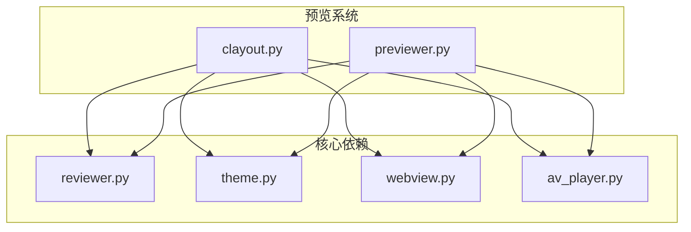
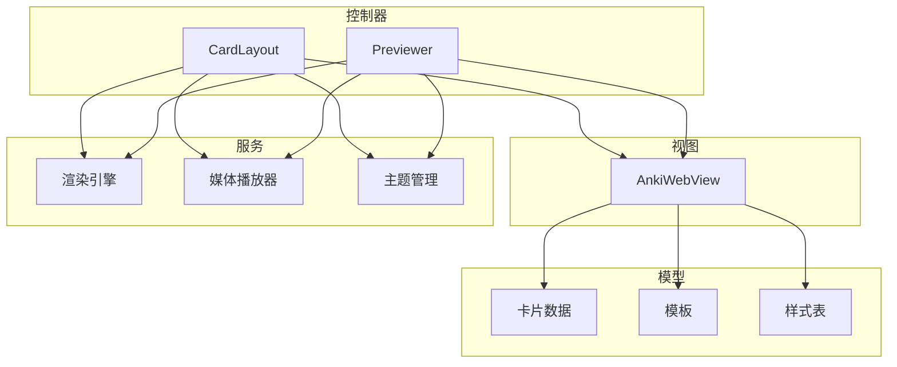
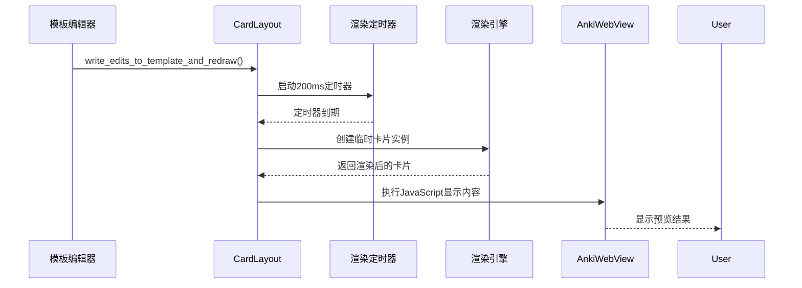
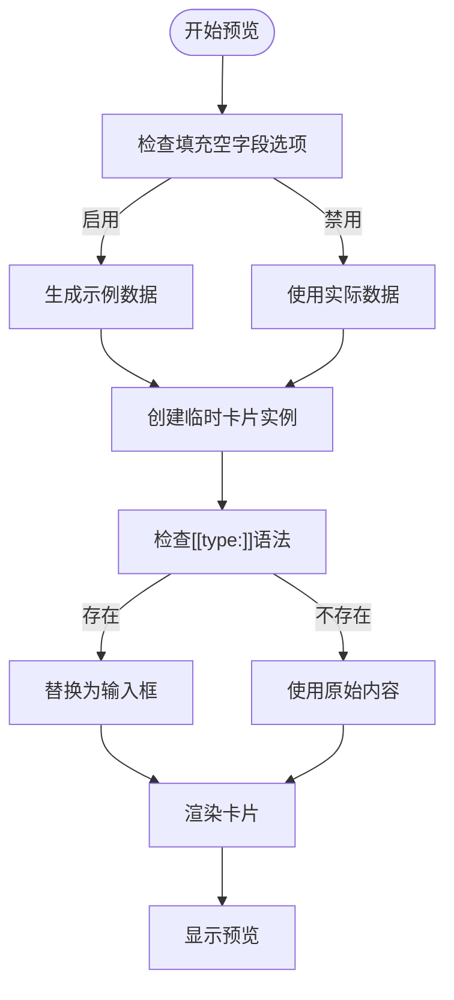
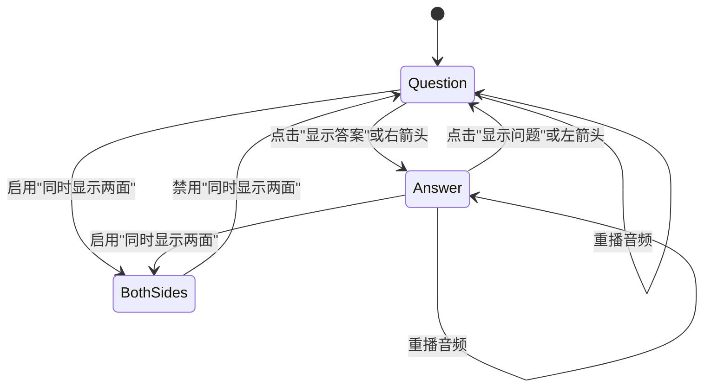
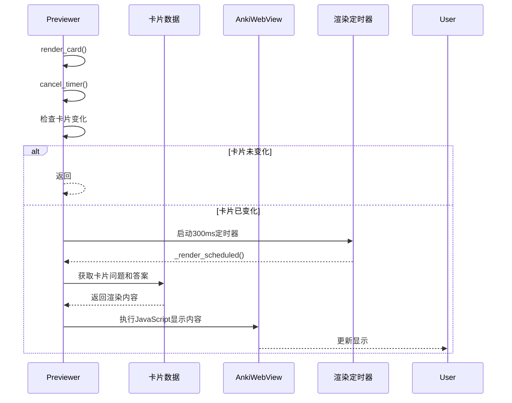
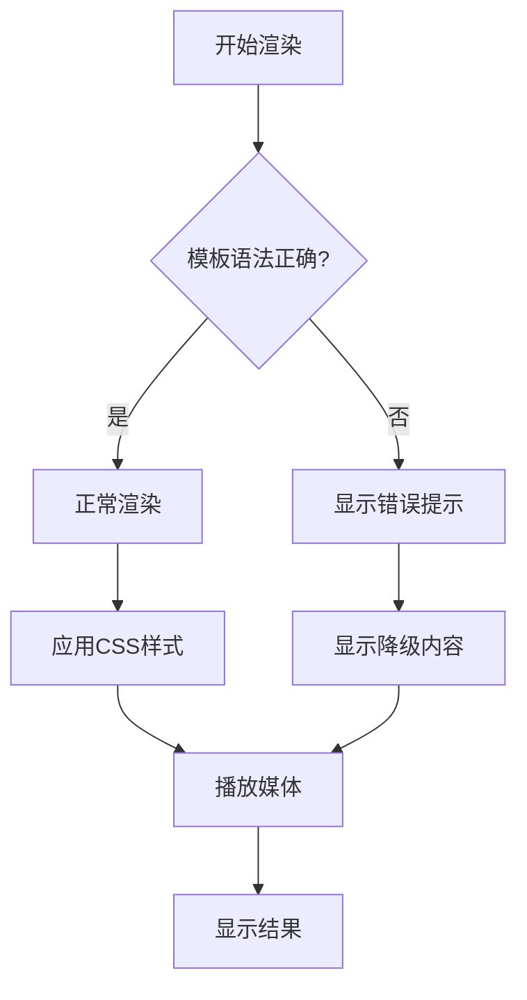
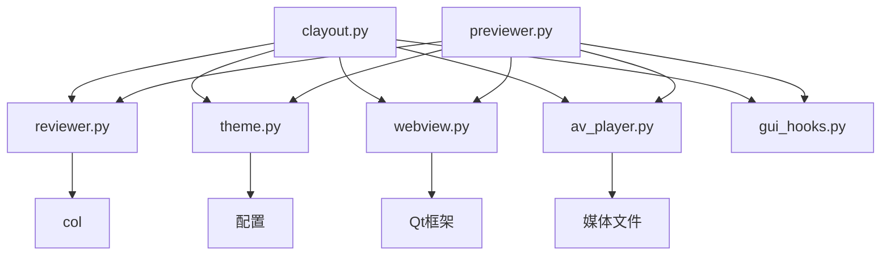

# 模板预览系统

<cite>
**本文档中引用的文件**  
- [clayout.py](file://qt/aqt/clayout.py)
- [previewer.py](file://qt/aqt/browser/previewer.py)
</cite>

## 目录
1. [简介](#简介)
2. [项目结构](#项目结构)
3. [核心组件](#核心组件)
4. [架构概述](#架构概述)
5. [详细组件分析](#详细组件分析)
6. [依赖分析](#依赖分析)
7. [性能考虑](#性能考虑)
8. [故障排除指南](#故障排除指南)
9. [结论](#结论)

## 简介
Anki的模板预览系统为用户提供了一个实时查看卡片模板渲染效果的界面。该系统主要由两个核心组件构成：`clayout.py`中的卡片布局预览功能和`previewer.py`中的浏览器预览器。预览系统允许用户在编辑模板时即时查看正面、背面和答案显示等不同状态下的渲染效果，支持夜间模式、移动端模拟等显示设置，并能处理模板语法错误时的降级显示。系统通过异步渲染机制确保界面响应性，同时实现了与主编辑器的数据同步。

## 项目结构
Anki的模板预览功能主要分布在Qt用户界面模块中，具体位于`qt/aqt/`目录下。核心预览功能由`clayout.py`文件实现，该文件包含`CardLayout`类，负责卡片模板的编辑和预览。浏览器中的预览功能由`browser/previewer.py`文件实现，包含`Previewer`和`BrowserPreviewer`类。预览系统依赖于Anki的核心功能模块，如卡片渲染、媒体播放和主题管理，这些功能通过`mw.reviewer`和`theme_manager`等对象提供。

**Diagram sources**
- [clayout.py](file://qt/aqt/clayout.py)
- [previewer.py](file://qt/aqt/browser/previewer.py)

**Section sources**
- [clayout.py](file://qt/aqt/clayout.py)
- [previewer.py](file://qt/aqt/browser/previewer.py)

## 核心组件
模板预览系统的核心组件包括`CardLayout`类和`Previewer`类。`CardLayout`类负责在卡片模板编辑界面中提供预览功能，它通过`AnkiWebView`组件显示渲染后的卡片效果。`Previewer`类则为浏览器界面提供卡片预览功能，支持多卡片浏览和状态切换。两个组件都实现了类似的预览逻辑，包括状态管理、定时渲染和多媒体播放。系统通过`gui_hooks`机制与Anki的其他部分进行集成，确保预览功能与其他系统组件的协调工作。

**Section sources**
- [clayout.py](file://qt/aqt/clayout.py#L49-L113)
- [previewer.py](file://qt/aqt/browser/previewer.py#L43-L57)

## 架构概述
模板预览系统的架构采用MVC（模型-视图-控制器）模式，其中`CardLayout`和`Previewer`类作为控制器，`AnkiWebView`作为视图，卡片数据和模板作为模型。系统通过异步定时器机制实现防抖渲染，避免频繁的界面更新影响性能。预览器与Anki的核心渲染引擎紧密集成，使用相同的HTML模板和CSS样式，确保预览效果与实际学习时完全一致。系统还实现了完整的错误处理机制，在模板语法错误时提供降级显示，保证用户体验的连续性。

**Diagram sources**
- [clayout.py](file://qt/aqt/clayout.py)
- [previewer.py](file://qt/aqt/browser/previewer.py)

## 详细组件分析

### CardLayout 预览机制分析
`CardLayout`类实现了卡片模板编辑界面的预览功能。当用户编辑模板或切换预览设置时，系统会触发预览更新流程。预览机制通过`renderPreview`方法启动，该方法使用定时器实现防抖，确保在用户停止输入200毫秒后才进行渲染，避免频繁的界面更新。实际的渲染工作由`_renderPreview`方法完成，该方法创建一个临时卡片实例，使用当前编辑的模板进行渲染，并将结果显示在`AnkiWebView`组件中。

#### 预览触发与数据传递流程

**Diagram sources**
- [clayout.py](file://qt/aqt/clayout.py#L522-L527)
- [clayout.py](file://qt/aqt/clayout.py#L534-L585)

**Section sources**
- [clayout.py](file://qt/aqt/clayout.py#L481-L484)
- [clayout.py](file://qt/aqt/clayout.py#L486-L498)

### 示例数据生成机制
预览系统需要根据当前笔记类型生成示例数据以供预览。在`clayout.py`中，`CardLayout`类通过`note`对象的`ephemeral_card`方法创建临时卡片实例。该方法使用当前笔记的字段数据，如果字段为空且启用了"填充空字段"选项，则会生成示例数据。对于包含`[[type:]]`语法的模板，系统会使用`maybeTextInput`方法生成模拟的输入框，显示"example"作为占位符文本，帮助用户预览填空题的效果。

**Diagram sources**
- [clayout.py](file://qt/aqt/clayout.py#L587-L611)
- [clayout.py](file://qt/aqt/clayout.py#L534-L585)

**Section sources**
- [clayout.py](file://qt/aqt/clayout.py#L440-L445)
- [clayout.py](file://qt/aqt/clayout.py#L587-L611)

### Previewer 窗口实现分析
`Previewer`类实现了浏览器界面的卡片预览功能。该类继承自`QDialog`，包含一个`AnkiWebView`组件用于显示卡片内容。预览窗口支持正面、背面和答案显示的切换逻辑，通过`_state`变量跟踪当前显示状态。当用户点击"重播音频"按钮或使用快捷键时，系统会调用`_on_replay_audio`方法重新播放卡片的音频内容。预览器还支持同时显示正反两面的功能，用户可以通过复选框切换此模式。

#### 多卡片状态切换逻辑

**Diagram sources**
- [previewer.py](file://qt/aqt/browser/previewer.py#L122-L132)
- [previewer.py](file://qt/aqt/browser/previewer.py#L271-L286)

**Section sources**
- [previewer.py](file://qt/aqt/browser/previewer.py#L179-L192)
- [previewer.py](file://qt/aqt/browser/previewer.py#L199-L269)

### 样式渲染与数据同步
预览系统的样式渲染通过`_setup_web_view`方法完成，该方法配置`AnkiWebView`组件加载必要的CSS和JavaScript文件。系统使用与实际学习界面相同的`reviewer.css`样式表，确保预览效果的一致性。数据同步机制通过`render_card`方法实现，该方法在每次渲染前检查卡片是否发生变化，只有在卡片数据或状态改变时才进行重新渲染，避免不必要的性能开销。预览器还监听Anki的全局事件，确保在笔记数据发生变化时及时更新预览内容。

**Diagram sources**
- [previewer.py](file://qt/aqt/browser/previewer.py#L143-L158)
- [previewer.py](file://qt/aqt/browser/previewer.py#L199-L269)

**Section sources**
- [previewer.py](file://qt/aqt/browser/previewer.py#L167-L177)
- [previewer.py](file://qt/aqt/browser/previewer.py#L288-L295)

### 模板错误处理与降级显示
预览系统实现了完善的错误处理机制，确保在模板语法错误时仍能提供可用的预览。当模板包含无效语法时，系统会捕获异常并显示降级内容，通常是一个错误提示或空白卡片。对于`[[type:]]`语法，系统使用正则表达式进行安全替换，即使模板存在其他错误，也能正确处理填空题的显示。预览器还提供了"恢复为默认"功能，允许用户将模板重置为初始状态，快速解决复杂的模板问题。

**Section sources**
- [clayout.py](file://qt/aqt/clayout.py#L407-L430)
- [previewer.py](file://qt/aqt/browser/previewer.py#L271-L286)

## 依赖分析
模板预览系统依赖于Anki的多个核心模块。主要依赖包括`reviewer.py`提供的卡片渲染功能、`theme.py`提供的主题管理、`webview.py`提供的Web视图组件以及`av_player.py`提供的媒体播放功能。系统通过`gui_hooks`机制与Anki的其他部分进行松耦合集成，允许其他插件扩展预览功能。预览器还依赖于Qt框架的GUI组件，如`QDialog`、`QWebView`和各种按钮控件。

**Diagram sources**
- [clayout.py](file://qt/aqt/clayout.py)
- [previewer.py](file://qt/aqt/browser/previewer.py)

**Section sources**
- [clayout.py](file://qt/aqt/clayout.py)
- [previewer.py](file://qt/aqt/browser/previewer.py)

## 性能考虑
预览系统通过多种机制优化性能。首先，使用定时器实现防抖渲染，`CardLayout`的预览延迟为200毫秒，`Previewer`的延迟为300毫秒，避免频繁的界面更新。其次，系统缓存渲染状态，只有在卡片数据或显示状态真正改变时才进行重新渲染。此外，预览器限制同时播放的媒体数量，避免资源过度消耗。对于大型笔记集合，系统还实现了分页加载机制，确保浏览器预览的流畅性。

**Section sources**
- [clayout.py](file://qt/aqt/clayout.py#L522-L527)
- [previewer.py](file://qt/aqt/browser/previewer.py#L179-L192)

## 故障排除指南
当预览功能出现问题时，可以按照以下步骤进行排查：首先检查JavaScript控制台是否有错误信息，这通常能揭示模板语法问题。其次确认CSS样式表是否正确加载，样式问题往往导致预览效果异常。如果音频无法播放，检查媒体文件路径是否正确，并确认浏览器是否阻止了自动播放。对于显示空白的问题，检查卡片数据是否为空，或尝试重启Anki以清除可能的缓存问题。开发者可以使用Anki的调试工具查看详细的渲染日志，定位具体的问题根源。

**Section sources**
- [clayout.py](file://qt/aqt/clayout.py#L534-L585)
- [previewer.py](file://qt/aqt/browser/previewer.py#L199-L269)

## 结论
Anki的模板预览系统是一个功能完善、性能优良的用户界面组件。它通过合理的架构设计和高效的实现机制，为用户提供流畅的模板编辑体验。系统的核心优势在于实时预览、多状态切换和错误处理能力，这些功能极大地提升了用户的使用效率。未来的发展方向可以包括更智能的示例数据生成、增强的移动端预览功能以及更丰富的调试工具，进一步提升用户体验和开发效率。