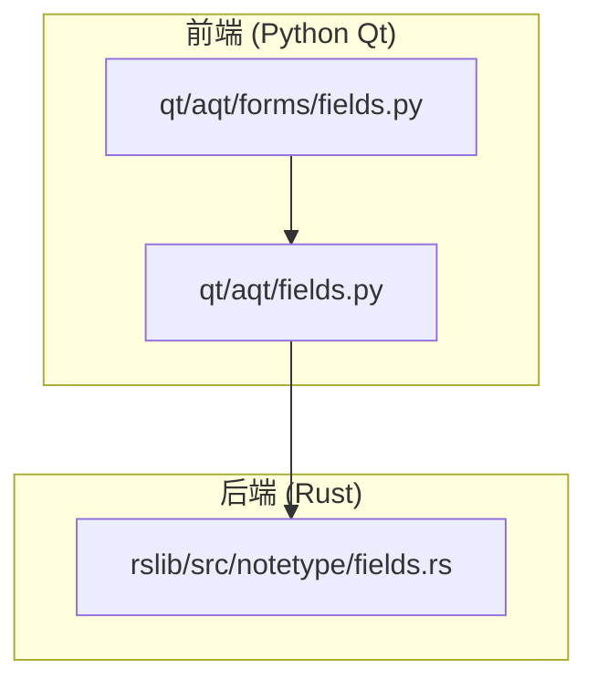
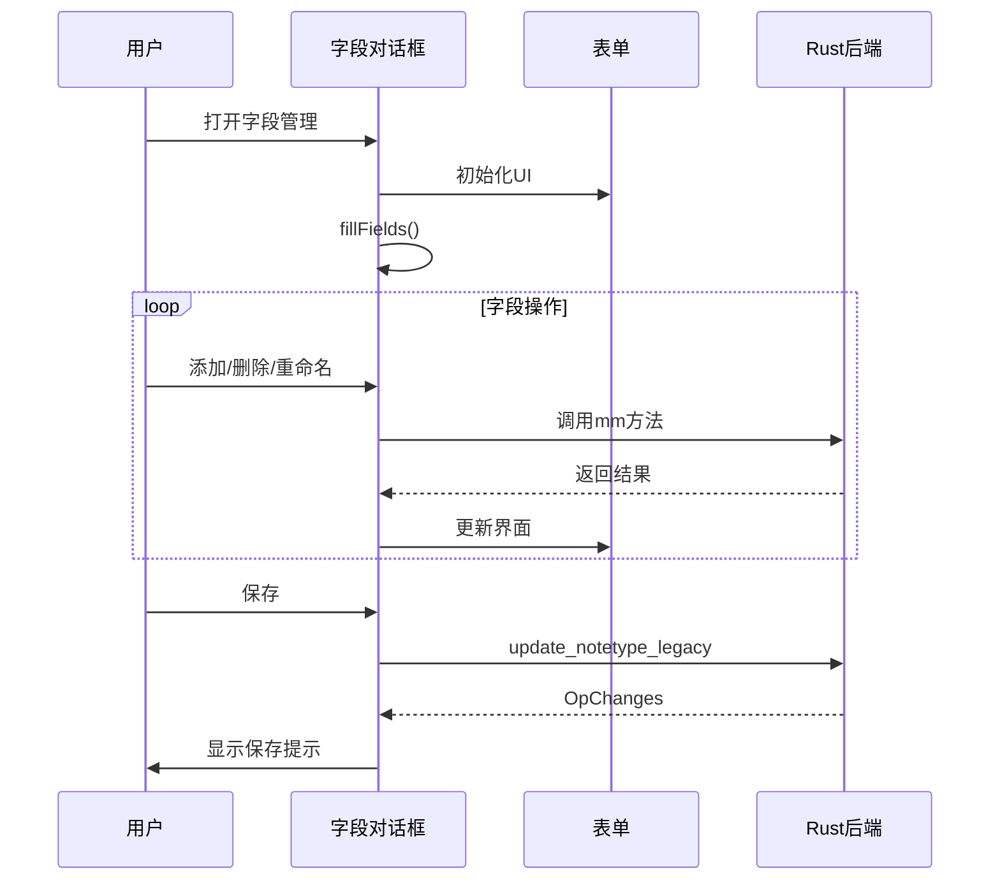
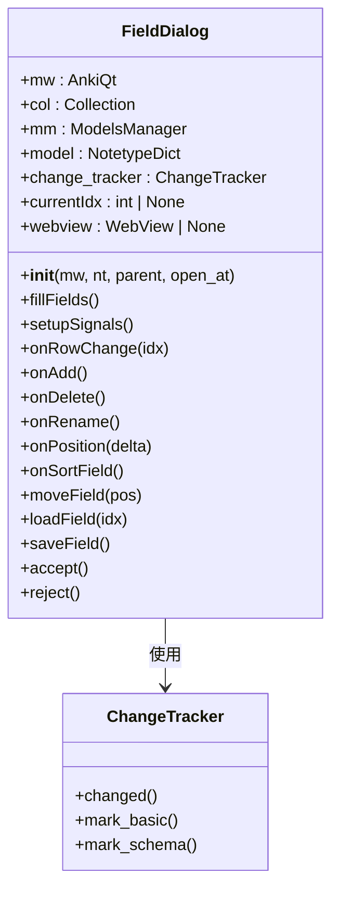
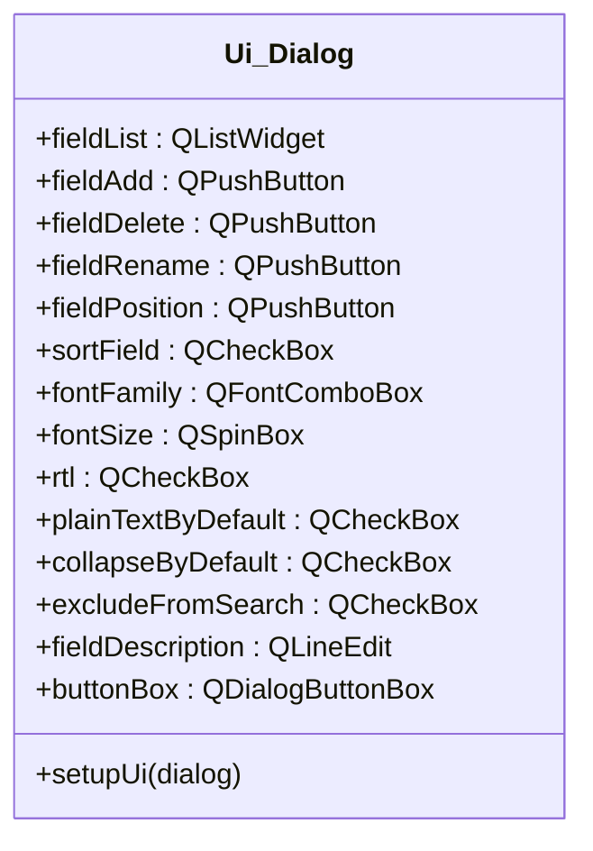
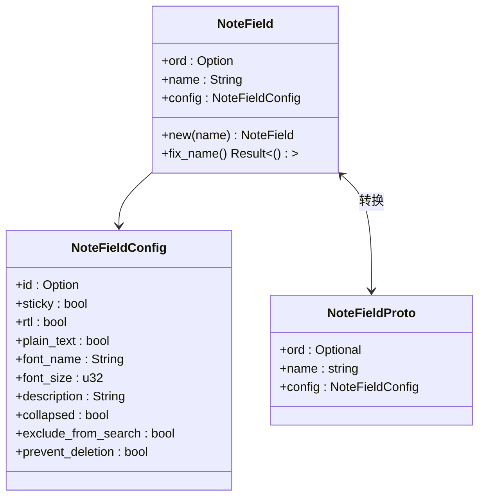
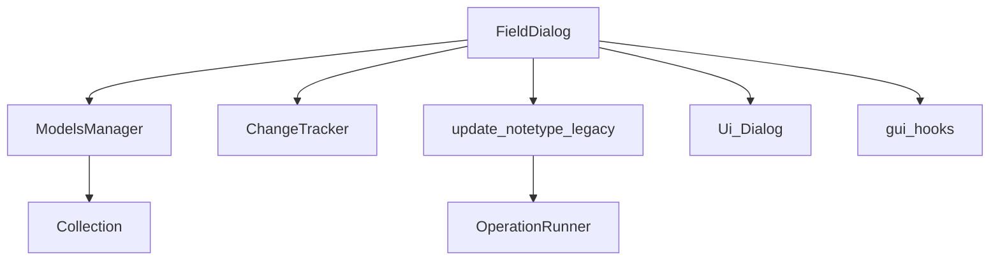

# 字段管理系统

<cite>
**本文档中引用的文件**
- [fields.py](file://qt/aqt/fields.py)
- [forms/fields.py](file://qt/aqt/forms/fields.py)
- [fields.rs](file://rslib/src/notetype/fields.rs)
</cite>

## 目录
1. [简介](#简介)
2. [项目结构](#项目结构)
3. [核心组件](#核心组件)
4. [架构概述](#架构概述)
5. [详细组件分析](#详细组件分析)
6. [依赖分析](#依赖分析)
7. [性能考虑](#性能考虑)
8. [故障排除指南](#故障排除指南)
9. [结论](#结论)

## 简介
Anki 是一个基于间隔重复的记忆辅助工具，其字段管理系统是笔记类型（Note Type）的核心组成部分。本文件详细分析了 Anki 中字段管理系统的实现，包括字段对话框的用户界面、表单设计、Rust 核心数据结构以及字段操作的完整功能。系统支持字段的添加、删除、重命名和排序，并提供丰富的配置选项如字体、大小、文本方向、默认折叠状态等。

## 项目结构
字段管理功能分布在多个模块中，主要涉及 Python Qt 前端和 Rust 后端。前端负责用户交互和界面展示，后端处理数据结构定义和持久化逻辑。

**Diagram sources**
- [fields.py](file://qt/aqt/fields.py)
- [forms/fields.py](file://qt/aqt/forms/fields.py)
- [fields.rs](file://rslib/src/notetype/fields.rs)

**Section sources**
- [fields.py](file://qt/aqt/fields.py)
- [fields.rs](file://rslib/src/notetype/fields.rs)

## 核心组件
字段管理系统的核心组件包括字段对话框（FieldDialog）、字段表单（Ui_Dialog）和 Rust 中的 NoteField 结构体。这些组件协同工作，实现了字段的增删改查和配置管理功能。系统通过 ChangeTracker 跟踪变更，并在用户关闭对话框时提示保存更改。

**Section sources**
- [fields.py](file://qt/aqt/fields.py#L1-L50)
- [fields.rs](file://rslib/src/notetype/fields.rs#L1-L20)

## 架构概述
系统采用前后端分离架构，Python Qt 层负责用户界面和交互逻辑，Rust 层负责数据模型和业务逻辑。字段操作通过 update_notetype_legacy 异步操作执行，确保 UI 响应性。

**Diagram sources**
- [fields.py](file://qt/aqt/fields.py#L50-L100)
- [fields.rs](file://rslib/src/notetype/fields.rs#L20-L40)

## 详细组件分析

### 字段对话框分析
FieldDialog 类实现了完整的字段管理功能，包括添加、删除、重命名和排序。

#### 类图

**Diagram sources**
- [fields.py](file://qt/aqt/fields.py#L20-L310)

**Section sources**
- [fields.py](file://qt/aqt/fields.py#L20-L310)

### UI表单设计分析
forms/fields.py 模块定义了字段管理对话框的用户界面布局和控件。

**Diagram sources**
- [forms/fields.py](file://qt/aqt/forms/fields.py)

**Section sources**
- [forms/fields.py](file://qt/aqt/forms/fields.py)

### Rust核心数据结构分析
notetype/fields.rs 定义了字段的核心数据结构和验证逻辑。

**Diagram sources**
- [fields.rs](file://rslib/src/notetype/fields.rs#L10-L85)

**Section sources**
- [fields.rs](file://rslib/src/notetype/fields.rs#L1-L85)

## 依赖分析
字段管理系统依赖于多个核心组件，包括模型管理器（ModelsManager）、变更跟踪器（ChangeTracker）和异步操作框架。

**Diagram sources**
- [fields.py](file://qt/aqt/fields.py)
- [fields.rs](file://rslib/src/notetype/fields.rs)

**Section sources**
- [fields.py](file://qt/aqt/fields.py)
- [fields.rs](file://rslib/src/notetype/fields.rs)

## 性能考虑
字段管理操作通过异步执行避免阻塞 UI 线程。变更跟踪器（ChangeTracker）优化了保存检查，仅在必要时标记模式变更。Rust 后端提供了高效的字段操作实现。

## 故障排除指南
常见问题包括字段名称无效、删除受保护字段和保存冲突。系统通过输入验证和用户确认对话框预防这些问题。

**Section sources**
- [fields.py](file://qt/aqt/fields.py#L150-L250)
- [fields.rs](file://rslib/src/notetype/fields.rs#L50-L85)

## 结论
Anki 的字段管理系统提供了完整且用户友好的字段管理功能。前后端分离架构确保了系统的可维护性和性能。通过详细的输入验证和变更跟踪，系统保证了数据的完整性和一致性。