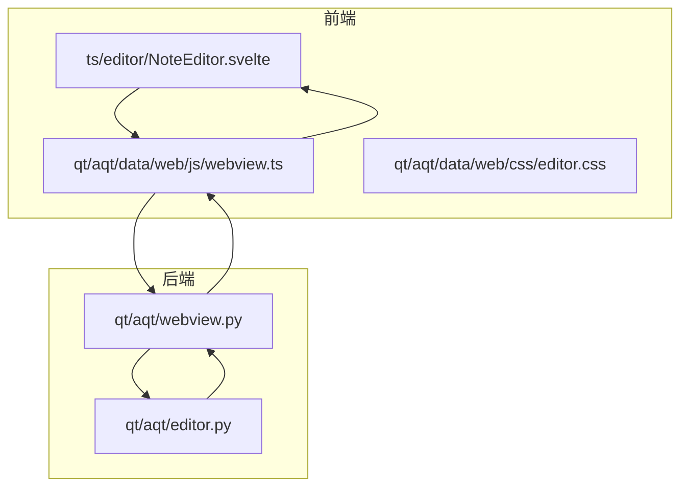
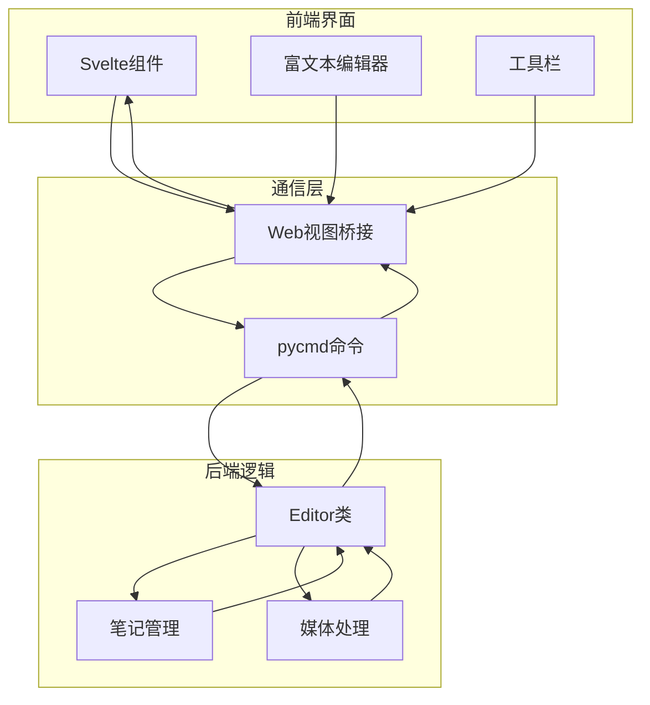
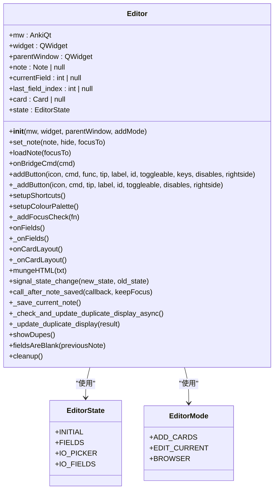
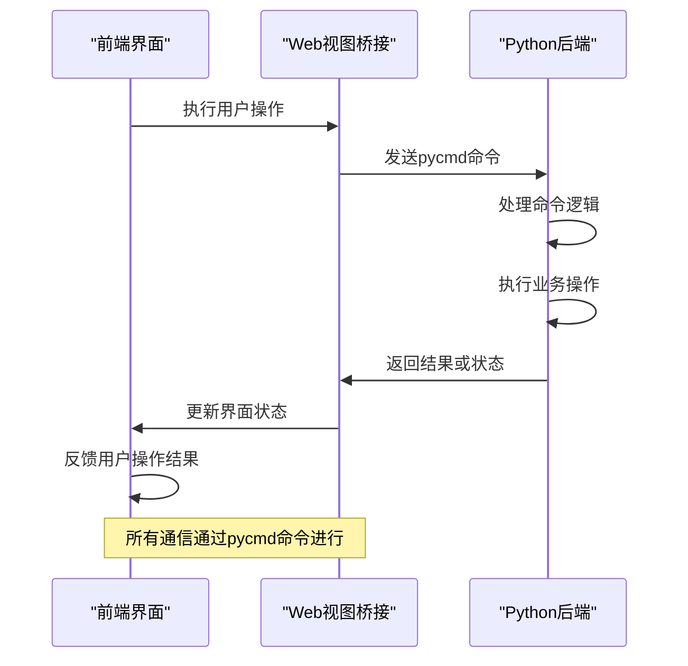

# 内容编辑与格式化

<cite>
**本文档引用的文件**
- [editor.py](file://qt/aqt/editor.py)
- [webview.ts](file://qt/aqt/data/web/js/webview.ts)
- [NoteEditor.svelte](file://ts/editor/NoteEditor.svelte)
- [pycmd.d.ts](file://qt/aqt/data/web/js/pycmd.d.ts)
</cite>

## 目录
1. [简介](#简介)
2. [项目结构](#项目结构)
3. [核心组件](#核心组件)
4. [架构概述](#架构概述)
5. [详细组件分析](#详细组件分析)
6. [依赖分析](#依赖分析)
7. [性能考虑](#性能考虑)
8. [故障排除指南](#故障排除指南)
9. [结论](#结论)

## 简介
Anki的富文本编辑器为用户提供了一个功能丰富的界面，用于创建和编辑学习卡片内容。该系统基于Qt WebEngine构建，结合了Python后端与前端JavaScript/Svelte组件，实现了强大的内容编辑功能。编辑器支持文本格式化、HTML内容处理、数学公式渲染以及图像遮罩等高级功能。本文档深入分析了编辑器的实现机制、通信协议和架构设计，为开发者提供全面的技术参考。

## 项目结构
Anki的编辑器功能分布在多个目录和文件中，形成了一个分层的架构体系。Python后端逻辑主要位于`qt/aqt/`目录下，而前端界面和交互逻辑则分布在`qt/aqt/data/web/`和`ts/`目录中。这种分离的设计使得前后端可以独立开发和维护，同时通过清晰的通信协议进行交互。



**图示来源**
- [editor.py](file://qt/aqt/editor.py)
- [webview.ts](file://qt/aqt/data/web/js/webview.ts)
- [NoteEditor.svelte](file://ts/editor/NoteEditor.svelte)

**本节来源**
- [editor.py](file://qt/aqt/editor.py#L1-L50)
- [webview.ts](file://qt/aqt/data/web/js/webview.ts#L1-L10)

## 核心组件
Anki编辑器的核心组件包括基于Qt WebEngine的Web视图、Svelte构建的用户界面组件以及Python实现的业务逻辑。这些组件通过pycmd命令进行通信，形成了一个完整的编辑环境。编辑器支持多种编辑模式，包括添加卡片、编辑当前卡片和浏览器模式，每种模式都有特定的功能和行为。

**本节来源**
- [editor.py](file://qt/aqt/editor.py#L25-L100)
- [NoteEditor.svelte](file://ts/editor/NoteEditor.svelte#L15-L80)

## 架构概述
Anki编辑器采用前后端分离的架构设计，前端负责用户界面展示和交互，后端处理业务逻辑和数据持久化。这种架构通过Web视图作为桥梁，实现了Python和JavaScript之间的双向通信。编辑器的状态管理采用响应式设计，确保用户界面能够实时反映数据变化。



**图示来源**
- [editor.py](file://qt/aqt/editor.py#L10-L50)
- [webview.ts](file://qt/aqt/data/web/js/webview.ts#L20-L40)

## 详细组件分析

### 编辑器类分析
`Editor`类是Anki编辑器的核心，负责管理编辑会话的整个生命周期。它处理笔记的加载、保存、字段管理以及与前端的通信。该类通过信号和槽机制响应用户操作，并确保数据的一致性和完整性。



**图示来源**
- [editor.py](file://qt/aqt/editor.py#L15-L45)
- [editor.py](file://qt/aqt/editor.py#L5-L20)

### 前端通信机制分析
前端JavaScript与Python后端的通信通过pycmd命令实现。当用户在编辑器中执行操作时，前端会生成相应的pycmd命令并发送到后端。后端处理命令后，可能会返回结果或执行相应的操作。这种通信机制确保了前后端的松耦合，同时提供了灵活的扩展能力。



**图示来源**
- [webview.ts](file://qt/aqt/data/web/js/webview.ts#L20-L60)
- [editor.py](file://qt/aqt/editor.py#L30-L80)

### Svelte组件架构分析
Svelte组件构成了Anki编辑器的用户界面，采用响应式设计模式。`NoteEditor.svelte`作为主组件，协调其他子组件的工作。组件之间通过属性传递和事件通信实现数据流动，确保界面状态与数据模型保持同步。

```mermaid
flowchart TD
Start([NoteEditor.svelte启动]) --> Initialize["初始化组件状态"]
Initialize --> SetupContext["设置上下文属性"]
SetupContext --> Mount["onMount生命周期"]
Mount --> RegisterAPI["注册全局API函数"]
RegisterAPI --> SetupEvent["设置事件监听器"]
SetupEvent --> MainLoop["主循环等待用户交互"]
MainLoop --> UserAction{"用户操作?"}
UserAction --> |是| HandleAction["处理用户操作"]
HandleAction --> UpdateState["更新组件状态"]
UpdateState --> SyncBackend["同步后端数据"]
SyncBackend --> RenderUI["重新渲染界面"]
RenderUI --> MainLoop
UserAction --> |否| WaitAction["等待用户操作"]
WaitAction --> MainLoop
Note over Start,RenderUI: Svelte组件采用响应式更新机制
```

**图示来源**
- [NoteEditor.svelte](file://ts/editor/NoteEditor.svelte#L45-L120)
- [webview.ts](file://qt/aqt/data/web/js/webview.ts#L15-L50)

**本节来源**
- [editor.py](file://qt/aqt/editor.py#L1-L100)
- [NoteEditor.svelte](file://ts/editor/NoteEditor.svelte#L10-L50)

## 依赖分析
Anki编辑器的组件之间存在复杂的依赖关系，这些依赖确保了功能的完整性和一致性。Python后端依赖于Qt框架提供的Web视图组件，而前端Svelte组件则依赖于TypeScript库和CSS样式表。通过分析这些依赖关系，可以更好地理解系统的整体架构和潜在的优化方向。

```mermaid
graph TD
editor.py --> webview.py : "使用"
editor.py --> forms.py : "导入"
editor.py --> operations.py : "使用"
editor.py --> sound.py : "使用"
webview.ts --> editor.css : "依赖"
webview.ts --> editor.js : "依赖"
NoteEditor.svelte --> RichTextInput : "使用"
NoteEditor.svelte --> PlainTextInput : "使用"
NoteEditor.svelte --> EditorToolbar : "使用"
NoteEditor.svelte --> FieldState : "使用"
RichTextInput --> content-editable.ts : "依赖"
PlainTextInput --> code-mirror.ts : "依赖"
EditorToolbar --> index.ts : "依赖"
```

**图示来源**
- [editor.py](file://qt/aqt/editor.py#L1-L20)
- [webview.ts](file://qt/aqt/data/web/js/webview.ts#L10-L30)

**本节来源**
- [editor.py](file://qt/aqt/editor.py#L1-L30)
- [webview.ts](file://qt/aqt/data/web/js/webview.ts#L1-L50)

## 性能考虑
Anki编辑器在设计时考虑了性能优化，特别是在处理大量内容和频繁用户交互时。通过异步操作、防抖技术和状态缓存等手段，确保了编辑器的响应性和流畅性。此外，资源的懒加载和按需加载策略也有效减少了初始加载时间。

## 故障排除指南
当遇到编辑器相关问题时，可以参考以下常见问题的解决方案。这些问题包括光标定位异常、内容序列化错误和跨浏览器兼容性问题。通过检查日志输出、验证HTML结构和测试不同环境，可以快速定位和解决大多数问题。

**本节来源**
- [editor.py](file://qt/aqt/editor.py#L10-L50)
- [webview.ts](file://qt/aqt/data/web/js/webview.ts#L15-L40)

## 结论
Anki的富文本编辑器是一个复杂而强大的系统，结合了现代前端技术和成熟的后端架构。通过深入分析其组件、通信机制和架构设计，开发者可以更好地理解和扩展这一功能。未来的工作可以集中在性能优化、用户体验改进和新功能开发上，进一步提升Anki作为学习工具的价值。