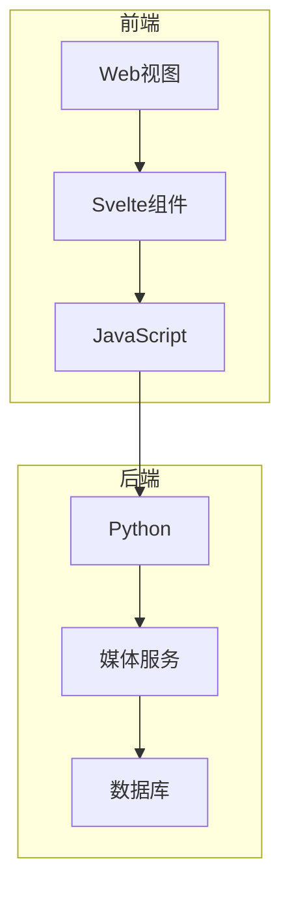
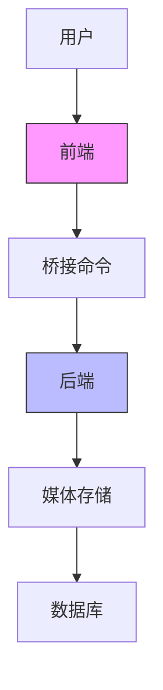
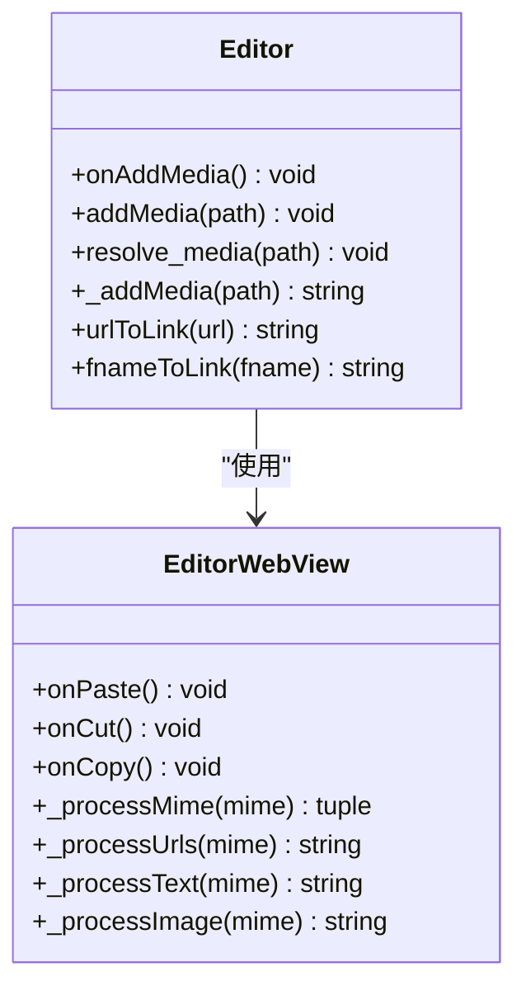
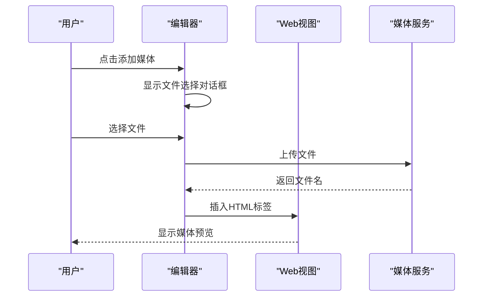
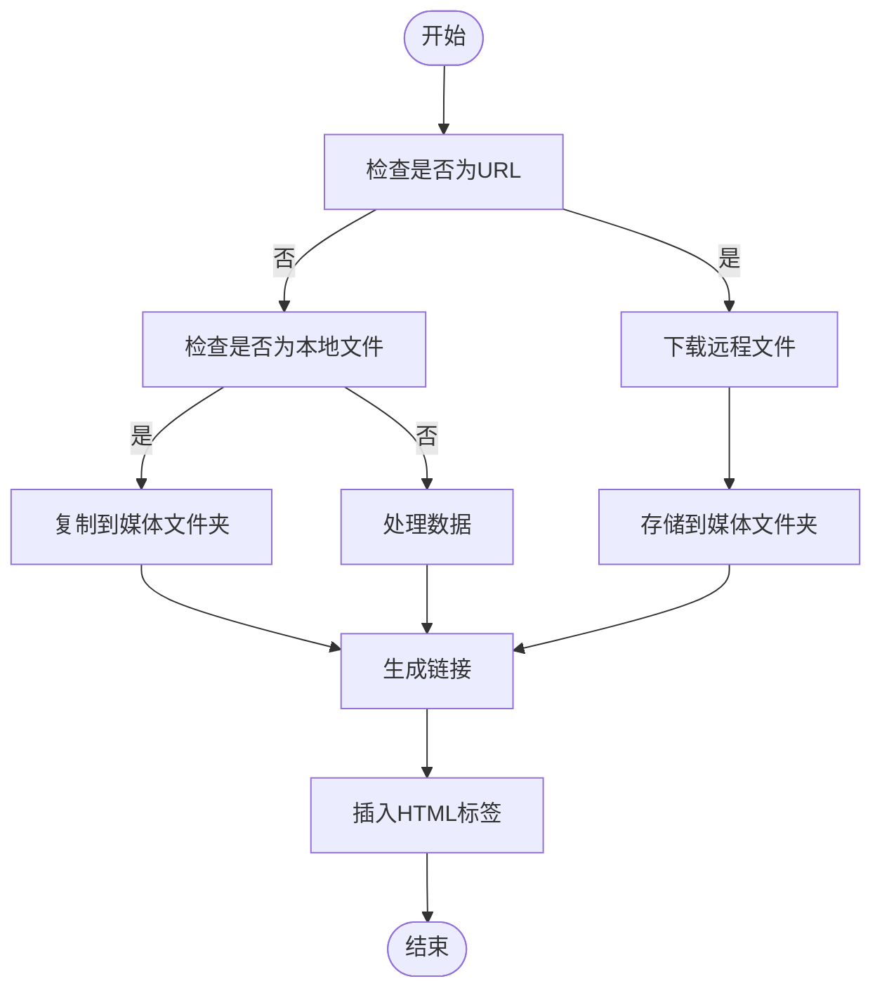
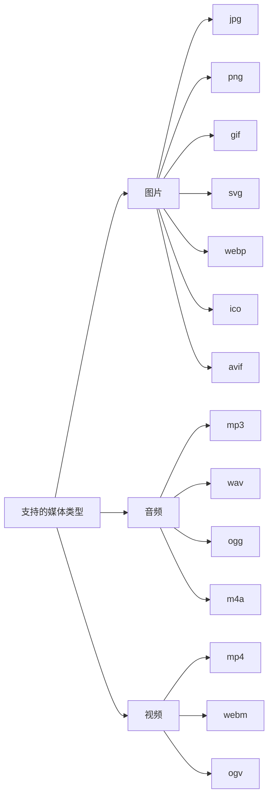
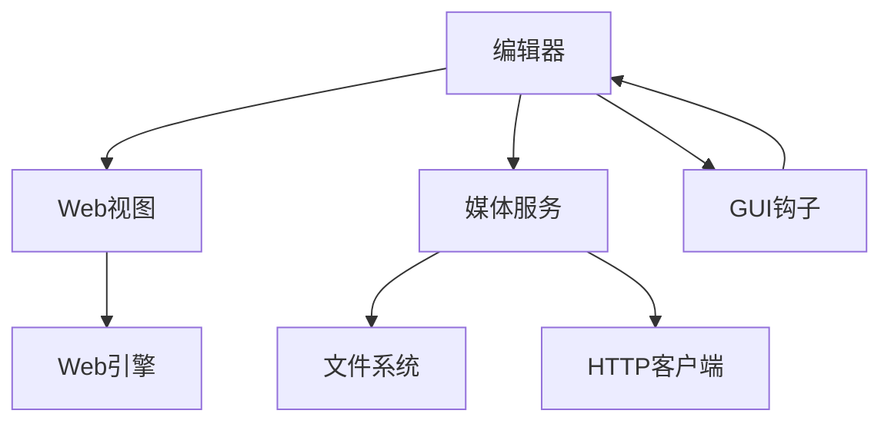

# 媒体插入与管理

<cite>
**本文档引用的文件**   
- [editor.py](file://qt/aqt/editor.py)
- [webview.py](file://qt/aqt/webview.py)
- [base.ts](file://ts/editor/base.ts)
- [index.ts](file://ts/editor/index.ts)
</cite>

## 目录
1. [简介](#简介)
2. [项目结构](#项目结构)
3. [核心组件](#核心组件)
4. [架构概述](#架构概述)
5. [详细组件分析](#详细组件分析)
6. [依赖分析](#依赖分析)
7. [性能考虑](#性能考虑)
8. [故障排除指南](#故障排除指南)
9. [结论](#结论)
10. [附录](#附录)（如有必要）

## 简介
本文档深入分析Anki富文本编辑器中媒体处理功能的实现机制。重点探讨了图片、音频、视频等媒体文件的插入与管理流程，包括文件上传、URL生成和HTML嵌入等核心环节。文档详细解释了前端与后端之间的通信协议，特别是文件选择对话框的调用和媒体资源的异步加载机制。同时，文档还涵盖了数学公式（MathJax）、代码块、表格等特殊内容的处理方法，并为开发者提供了自定义媒体处理插件的开发指南。

## 项目结构
Anki的媒体处理功能分布在多个模块中，主要涉及Python后端和TypeScript前端的协同工作。系统采用分层架构，将用户界面、业务逻辑和数据存储分离，确保了代码的可维护性和扩展性。

**图表来源**
- [editor.py](file://qt/aqt/editor.py#L109-L1802)
- [webview.py](file://qt/aqt/webview.py#L0-L1014)

**章节来源**
- [editor.py](file://qt/aqt/editor.py#L1-L1802)
- [webview.py](file://qt/aqt/webview.py#L0-L1014)

## 核心组件
Anki的媒体处理功能由多个核心组件构成，包括编辑器、Web视图、媒体服务和Svelte组件。这些组件通过清晰的接口进行通信，实现了媒体文件的无缝插入和管理。

**章节来源**
- [editor.py](file://qt/aqt/editor.py#L109-L1802)
- [base.ts](file://ts/editor/base.ts#L0-L87)

## 架构概述
Anki的媒体处理架构采用前后端分离的设计模式。前端负责用户交互和界面展示，后端负责文件处理和数据存储。两者通过桥接命令进行通信，确保了系统的稳定性和安全性。

**图表来源**
- [editor.py](file://qt/aqt/editor.py#L109-L1802)
- [webview.py](file://qt/aqt/webview.py#L0-L1014)

## 详细组件分析
### 编辑器组件分析
编辑器组件是Anki媒体处理的核心，负责处理用户的所有媒体插入请求。它通过一系列方法实现文件选择、上传和嵌入功能。

#### 对象导向组件：

**图表来源**
- [editor.py](file://qt/aqt/editor.py#L109-L1802)

#### API/服务组件：

**图表来源**
- [editor.py](file://qt/aqt/editor.py#L109-L1802)
- [webview.py](file://qt/aqt/webview.py#L0-L1014)

#### 复杂逻辑组件：

**图表来源**
- [editor.py](file://qt/aqt/editor.py#L109-L1802)

**章节来源**
- [editor.py](file://qt/aqt/editor.py#L109-L1802)
- [webview.py](file://qt/aqt/webview.py#L0-L1014)

### 概念概述
媒体处理功能支持多种文件格式，包括图片（jpg, png, gif, svg, webp, ico, avif）、音频（mp3, wav, ogg, m4a等）和视频（mp4, webm, ogv等）。系统对文件大小没有硬性限制，但建议保持合理大小以确保性能。

[无来源，因为此图表显示概念工作流，而非实际代码结构]

[无来源，因为此章节不分析特定文件]

## 依赖分析
媒体处理功能依赖于多个内部和外部组件，包括Qt框架、Web引擎、媒体服务器和文件系统。这些依赖关系确保了功能的完整性和稳定性。

**图表来源**
- [editor.py](file://qt/aqt/editor.py#L109-L1802)
- [webview.py](file://qt/aqt/webview.py#L0-L1014)

**章节来源**
- [editor.py](file://qt/aqt/editor.py#L1-L1802)
- [webview.py](file://qt/aqt/webview.py#L0-L1014)

## 性能考虑
媒体处理功能在设计时充分考虑了性能因素。系统采用异步加载机制，避免阻塞用户界面。对于大文件，建议使用压缩格式以减少存储空间和加载时间。此外，系统支持拖放功能，提高了用户体验。

[无来源，因为此章节提供一般指导]

## 故障排除指南
当遇到媒体处理问题时，可以检查以下常见情况：确保文件路径正确、检查文件格式是否支持、确认网络连接正常（对于远程文件）、验证媒体文件夹权限。如果问题持续存在，可以尝试重启Anki或重新安装相关插件。

**章节来源**
- [editor.py](file://qt/aqt/editor.py#L109-L1802)
- [webview.py](file://qt/aqt/webview.py#L0-L1014)

## 结论
Anki的媒体处理功能通过精心设计的架构和清晰的组件划分，实现了高效、稳定的媒体文件管理。系统支持多种文件格式和操作方式，为用户提供了丰富的学习体验。未来可以通过优化文件压缩算法和增加缓存机制来进一步提升性能。

[无来源，因为此章节总结而不分析特定文件]