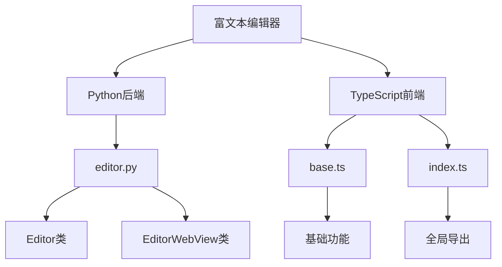
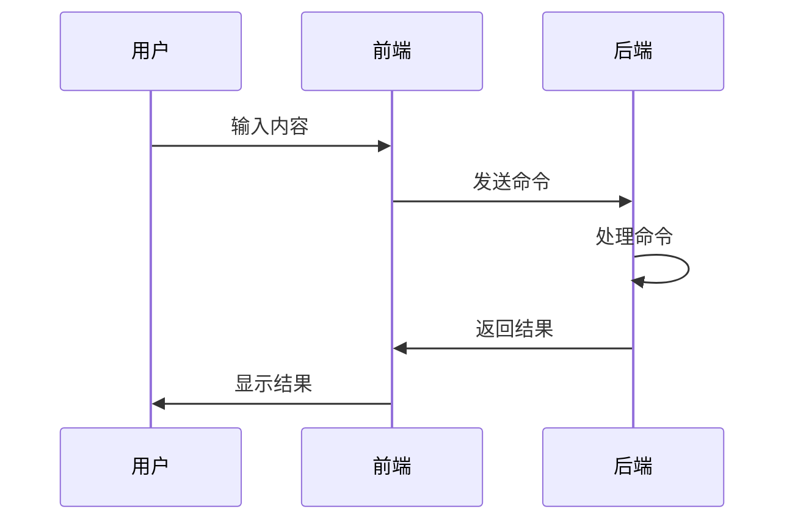

# 富文本编辑器

<cite>
**本文档中引用的文件**  
- [editor.py](file://qt/aqt/editor.py)
- [base.ts](file://ts/editor/base.ts)
- [index.ts](file://ts/editor/index.ts)
- [post.ts](file://ts/lib/generated/post.ts)
</cite>

## 目录
1. [简介](#简介)
2. [项目结构](#项目结构)
3. [核心组件](#核心组件)
4. [架构概述](#架构概述)
5. [详细组件分析](#详细组件分析)
6. [依赖分析](#依赖分析)
7. [性能考虑](#性能考虑)
8. [故障排除指南](#故障排除指南)
9. [结论](#结论)

## 简介
Anki的富文本编辑器是一个基于Qt WebEngine的复杂系统，为用户提供强大的内容编辑功能。该编辑器支持格式化、媒体插入和HTML处理，通过Python后端与前端JavaScript的紧密通信实现。本文件深入分析了`editor.py`中的实现细节，`webview.ts`中的通信协议，以及`editor.ts`中的Svelte组件架构。此外，还涵盖了富文本编辑API的完整文档，包括支持的HTML标签、CSS样式和JavaScript接口，以及数学公式、代码块和表格等高级格式的支持和配置方法。

## 项目结构
Anki的富文本编辑器主要由Python和TypeScript文件组成，位于`qt/aqt/editor.py`和`ts/editor/`目录下。Python文件负责后端逻辑和与Qt WebEngine的交互，而TypeScript文件则处理前端逻辑和用户界面。



**Diagram sources**
- [editor.py](file://qt/aqt/editor.py)
- [base.ts](file://ts/editor/base.ts)
- [index.ts](file://ts/editor/index.ts)

**Section sources**
- [editor.py](file://qt/aqt/editor.py)
- [base.ts](file://ts/editor/base.ts)
- [index.ts](file://ts/editor/index.ts)

## 核心组件
富文本编辑器的核心组件包括`Editor`类和`EditorWebView`类，分别负责编辑逻辑和Web视图的管理。`Editor`类处理笔记的加载、保存和格式化，而`EditorWebView`类则负责与Web页面的交互和剪贴板操作。

**Section sources**
- [editor.py](file://qt/aqt/editor.py#L109-L1468)

## 架构概述
Anki的富文本编辑器采用前后端分离的架构，通过Qt WebEngine实现。Python后端通过`onBridgeCmd`方法接收来自前端的命令，执行相应的操作并返回结果。前端则通过JavaScript调用后端方法，实现用户交互。



**Diagram sources**
- [editor.py](file://qt/aqt/editor.py#L401-L523)

## 详细组件分析
### Editor类分析
`Editor`类是富文本编辑器的核心，负责管理笔记的生命周期和用户交互。它通过`setupWeb`方法初始化Web视图，加载CSS和JavaScript文件，并设置编辑模式。

#### 初始化和设置
```mermaid
classDiagram
    class Editor {
        +mw: AnkiQt
        +widget: QWidget
        +parentWindow: QWidget
        +note: Note | None
        +addMode: bool
        +editorMode: EditorMode
        +currentField: int | None
        +last_field_index: int | None
        +orig_note_id: NoteId | None
        +card: Card | None
        +state: EditorState
        +last_io