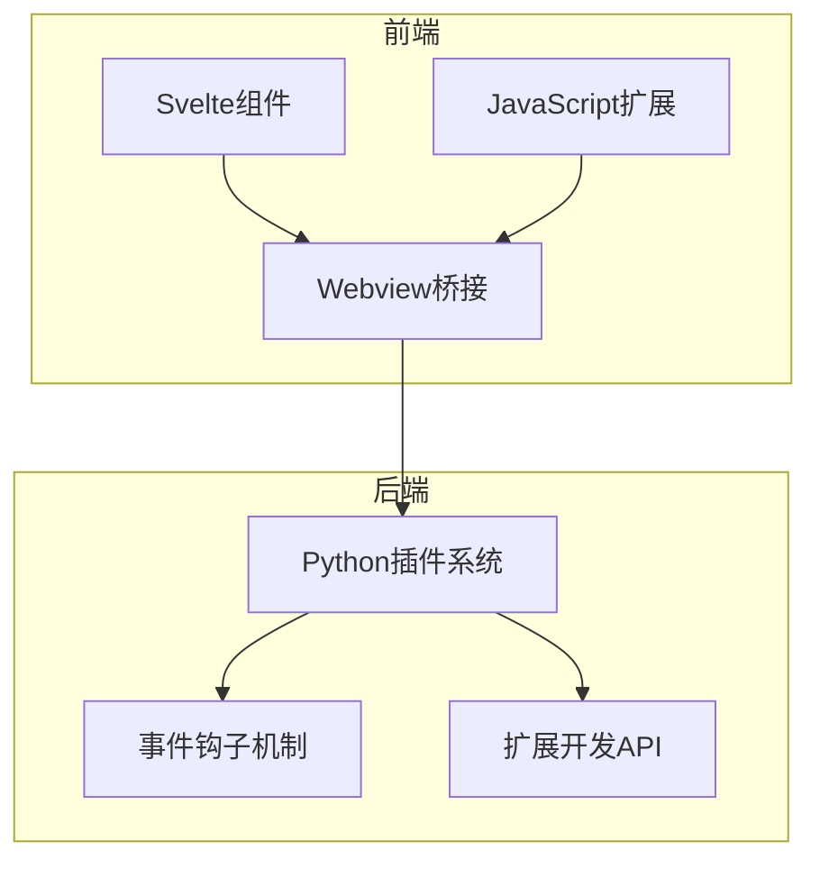
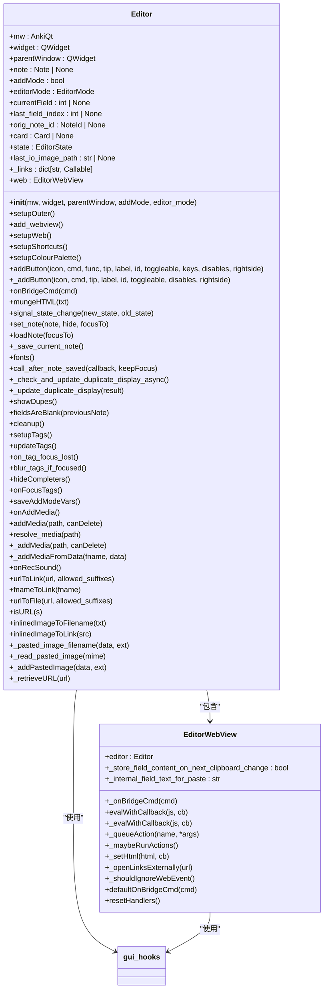
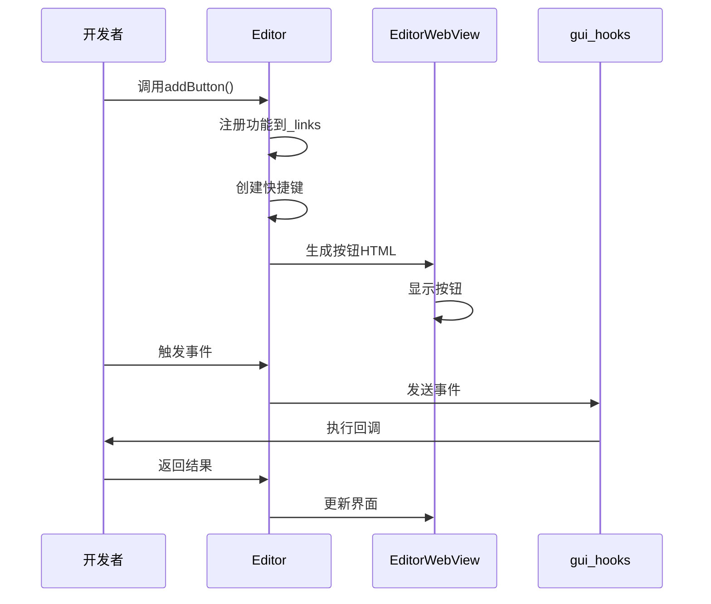
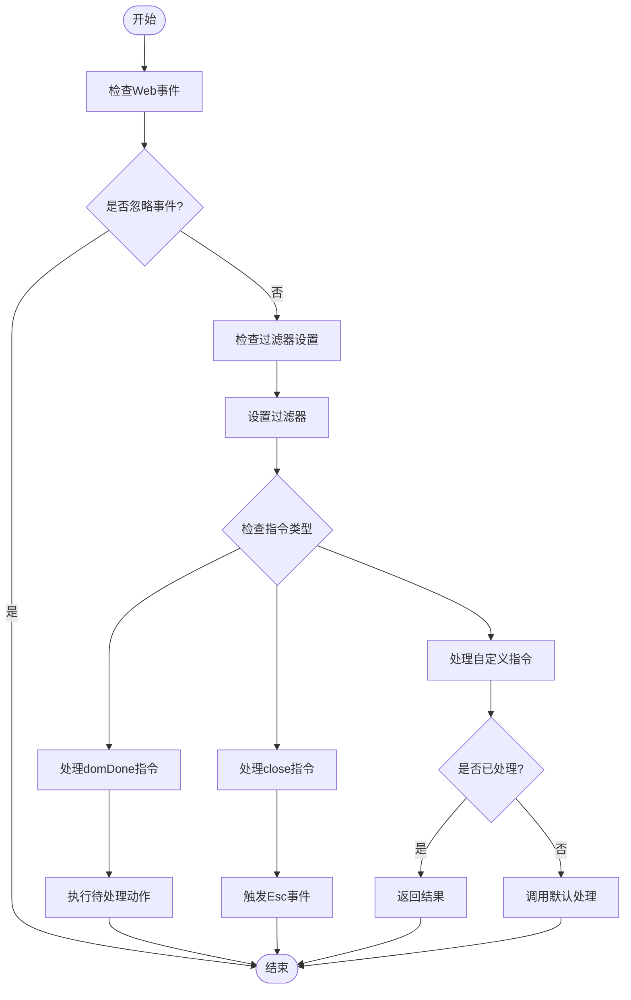
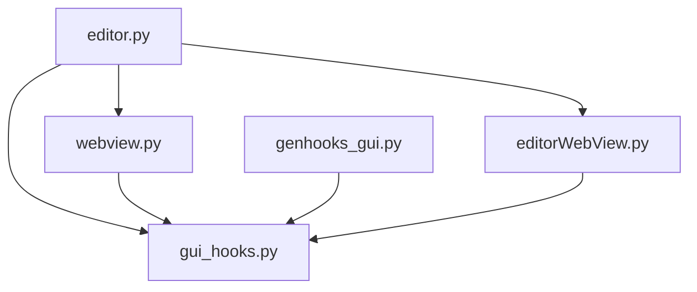

# 插件与扩展开发

<cite>
**本文档中引用的文件**  
- [editor.py](file://qt/aqt/editor.py)
- [webview.ts](file://qt/aqt/data/web/js/webview.ts)
- [gui_hooks.py](file://qt/aqt/gui_hooks.py)
- [genhooks_gui.py](file://qt/tools/genhooks_gui.py)
</cite>

## 目录
1. [引言](#引言)
2. [核心组件](#核心组件)
3. [架构概述](#架构概述)
4. [详细组件分析](#详细组件分析)
5. [依赖分析](#依赖分析)
6. [性能考虑](#性能考虑)
7. [故障排除指南](#故障排除指南)
8. [结论](#结论)

## 引言
Anki的富文本编辑器扩展机制为开发者提供了强大的功能扩展能力。该系统通过Python后端与TypeScript前端的紧密集成，实现了灵活的插件架构。编辑器扩展主要围绕三个核心文件构建：`editor.py`中的Python插件系统、`webview.ts`中的前端JavaScript扩展以及`editor.ts`中的Svelte组件架构。这种分层设计使得开发者可以轻松地添加自定义按钮、工具栏扩展和功能模块，同时保持系统的稳定性和可维护性。

## 核心组件
Anki编辑器扩展系统由多个核心组件构成，包括自定义按钮注册、功能扩展点和事件钩子机制。这些组件共同构成了一个完整的扩展开发API，支持插件注册接口、事件监听机制和安全沙箱策略。系统通过`gui_hooks`模块提供了一系列事件钩子，允许开发者在特定操作发生时注入自定义逻辑。此外，编辑器还支持动态组件加载和状态共享，为开发者提供了丰富的扩展可能性。

**Section sources**
- [editor.py](file://qt/aqt/editor.py#L109-L1468)
- [gui_hooks.py](file://qt/aqt/gui_hooks.py#L0-L11)

## 架构概述
Anki编辑器扩展系统采用前后端分离的架构设计。Python后端负责处理业务逻辑和数据操作，而TypeScript前端则专注于用户界面和交互体验。两者通过Webview桥接进行通信，实现了高效的数据交换和指令传递。系统使用Svelte框架构建动态组件，支持实时更新和状态管理。这种架构设计不仅提高了系统的响应速度，还增强了扩展的灵活性和可维护性。

**Diagram sources **
- [editor.py](file://qt/aqt/editor.py#L109-L1468)
- [webview.ts](file://qt/aqt/data/web/js/webview.ts#L0-L20)

## 详细组件分析

### 编辑器扩展机制分析
Anki编辑器扩展机制的核心在于其灵活的插件系统和丰富的事件钩子。开发者可以通过`addButton`方法注册自定义按钮，这些按钮可以绑定到特定的功能或命令。系统还提供了多种事件钩子，如`editor_did_init_buttons`和`editor_did_init_shortcuts`，允许开发者在编辑器初始化时添加自定义功能。此外，通过`gui_hooks`模块，开发者可以监听和响应各种编辑器事件，实现更复杂的扩展功能。

#### 对于对象导向组件：

**Diagram sources **
- [editor.py](file://qt/aqt/editor.py#L109-L1468)

#### 对于API/服务组件：

**Diagram sources **
- [editor.py](file://qt/aqt/editor.py#L109-L1468)
- [gui_hooks.py](file://qt/aqt/gui_hooks.py#L0-L11)

### 前端JavaScript扩展分析
前端JavaScript扩展通过`webview.ts`文件实现，主要负责处理用户界面交互和事件响应。系统通过`_onBridgeCmd`方法接收来自Python后端的指令，并根据指令类型执行相应的操作。例如，当接收到"domDone"指令时，系统会触发`_maybeRunActions`方法，执行队列中的待处理动作。这种设计确保了前后端通信的可靠性和及时性，同时也为开发者提供了灵活的扩展接口。

#### 对于复杂逻辑组件：

**Diagram sources **
- [webview.ts](file://qt/aqt/data/web/js/webview.ts#L0-L20)

**Section sources**
- [editor.py](file://qt/aqt/editor.py#L109-L1468)
- [webview.ts](file://qt/aqt/data/web/js/webview.ts#L0-L20)

## 依赖分析
Anki编辑器扩展系统依赖于多个关键模块和文件。`editor.py`作为核心组件，依赖于`gui_hooks.py`提供的事件钩子机制和`webview.py`实现的Webview桥接功能。前端JavaScript扩展则依赖于`webview.ts`文件中的桥接命令处理逻辑。此外，系统还依赖于`genhooks_gui.py`生成的钩子定义，确保前后端通信的一致性和可靠性。这些依赖关系构成了一个完整的扩展开发生态系统，为开发者提供了丰富的功能和灵活的扩展选项。

**Diagram sources **
- [editor.py](file