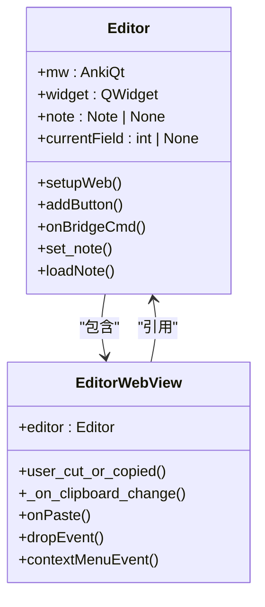
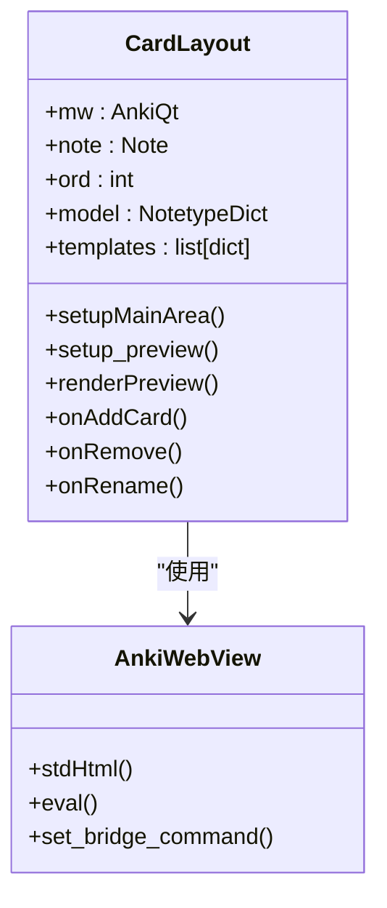
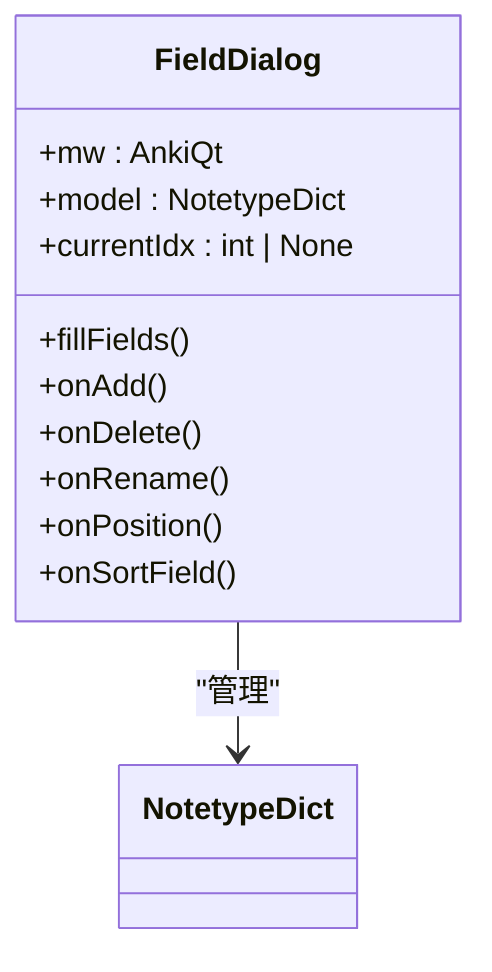
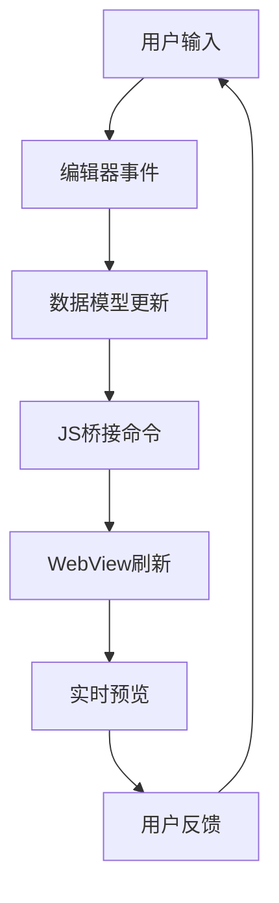

# 编辑器系统

<cite>
**本文档中引用的文件**   
- [editor.py](file://qt/aqt/editor.py)
- [clayout.py](file://qt/aqt/clayout.py)
- [fields.py](file://qt/aqt/fields.py)
- [forms/fields.py](file://qt/aqt/forms/fields.py)
</cite>

## 目录
1. [简介](#简介)
2. [富文本编辑器实现](#富文本编辑器实现)
3. [卡片模板布局编辑器](#卡片模板布局编辑器)
4. [字段管理对话框](#字段管理对话框)
5. [数据绑定与实时预览](#数据绑定与实时预览)
6. [扩展点开发指南](#扩展点开发指南)
7. [高级功能使用示例](#高级功能使用示例)
8. [性能优化技巧](#性能优化技巧)

## 简介
Anki编辑器系统是Anki应用程序的核心组件，负责笔记内容的创建、编辑和格式化。该系统由多个相互协作的模块组成，包括富文本编辑器、卡片模板布局编辑器和字段管理对话框。这些组件共同提供了强大的内容编辑功能，支持HTML内容编辑、媒体插入、数学公式渲染和代码高亮等高级特性。编辑器系统通过JavaScript与Python的桥接机制实现前后端交互，并采用数据绑定技术确保用户界面与数据模型的实时同步。

## 富文本编辑器实现
Anki的富文本编辑器基于Web技术实现，通过嵌入式WebView组件提供HTML内容编辑功能。编辑器支持丰富的格式化操作，包括字体样式、颜色、对齐方式等，并允许用户插入图片、音频和视频等多媒体内容。

编辑器的核心实现位于`editor.py`文件中，主要由`Editor`和`EditorWebView`两个类构成。`Editor`类负责管理编辑器的整体状态和用户交互，而`EditorWebView`类则处理Web内容的渲染和用户输入事件。



**图源**
- [editor.py](file://qt/aqt/editor.py#L109-L1468)

**节源**
- [editor.py](file://qt/aqt/editor.py#L109-L1468)

## 卡片模板布局编辑器
卡片模板布局编辑器（Card Layout Editor）允许用户自定义卡片模板，包括问题面、答案面和CSS样式。该编辑器提供实时预览功能，用户可以即时查看模板更改的效果。

`CardLayout`类实现了卡片模板编辑器的主要功能，包括模板管理、预览渲染和用户交互。编辑器界面分为左右两个面板：左侧用于编辑模板内容，右侧用于实时预览。



**图源**
- [clayout.py](file://qt/aqt/clayout.py#L48-L981)

**节源**
- [clayout.py](file://qt/aqt/clayout.py#L48-L981)

## 字段管理对话框
字段管理对话框（Field Dialog）用于管理笔记类型中的字段，包括添加、删除、重命名和重新排序字段。该对话框还允许用户配置字段的显示属性，如字体、大小、文本方向和折叠状态。

`FieldDialog`类实现了字段管理对话框的功能，通过`Ui_Dialog`界面组件提供用户交互界面。对话框支持拖放操作来重新排列字段顺序，并提供实时验证确保字段名称的唯一性。



**图源**
- [fields.py](file://qt/aqt/fields.py#L28-L309)

**节源**
- [fields.py](file://qt/aqt/fields.py#L28-L309)

## 数据绑定与实时预览
Anki编辑器系统采用双向数据绑定机制，确保用户界面与数据模型的实时同步。当用户在编辑器中修改内容时，更改会立即反映到数据模型中，反之亦然。

实时预览功能通过`AnkiWebView`组件实现，该组件加载并渲染卡片模板的HTML内容。预览区域会根据用户在编辑区域的更改自动更新，提供即时的视觉反馈。



**图源**
- [editor.py](file://qt/aqt/editor.py#L109-L1468)
- [clayout.py](file://qt/aqt/clayout.py#L48-L981)

**节源**
- [editor.py](file://qt/aqt/editor.py#L109-L1468)
- [clayout.py](file://qt/aqt/clayout.py#L48-L981)

## 扩展点开发指南
Anki编辑器系统提供了丰富的扩展点，允许开发者通过插件扩展编辑器功能。主要扩展点包括自定义按钮、上下文菜单和编辑器钩子。

### 自定义按钮
开发者可以通过`addButton`方法在编辑器工具栏中添加自定义按钮。该方法接受图标、命令、回调函数和快捷键等参数，返回生成的按钮HTML代码。

```python
editor.addButton(
    icon="myicon.png",
    cmd="myCommand",
    func=my_function,
    tip="我的功能",
    keys="Ctrl+Shift+M"
)
```

### 插件集成
Anki提供了多个GUI钩子（gui_hooks），允许插件在编辑器生命周期的各个阶段注入自定义逻辑。常用的钩子包括：
- `editor_did_init`：编辑器初始化完成后
- `editor_did_init_buttons`：工具栏按钮初始化时
- `editor_will_munge_html`：HTML内容处理前
- `editor_did_unfocus_field`：字段失去焦点时

**节源**
- [editor.py](file://qt/aqt/editor.py#L109-L1468)

## 高级功能使用示例
### 数学公式支持
Anki编辑器内置MathJax支持，允许用户在笔记中插入数学公式。公式使用LaTeX语法编写，前后用`$$`或`\\(`和`\\)`包围。

示例：
```
$$E=mc^2$$
\\(\\int_0^\\infty e^{-x^2} dx = \\frac{\\sqrt{\\pi}}{2}\\)
```

### 代码高亮
通过插入预格式化代码块并应用CSS样式，可以实现代码高亮效果。Anki支持多种编程语言的语法高亮。

示例：
```html
<pre><code class="language-python">def hello_world():
    print("Hello, World!")
</code></pre>
```

**节源**
- [editor.py](file://qt/aqt/editor.py#L109-L1468)

## 性能优化技巧
1. **批量操作**：在进行大量笔记修改时，使用批量操作API减少数据库事务开销
2. **延迟渲染**：对于复杂的模板预览，采用延迟渲染策略，避免阻塞UI线程
3. **缓存机制**：合理利用缓存，避免重复计算和数据加载
4. **资源管理**：及时释放不再使用的资源，防止内存泄漏
5. **异步处理**：将耗时操作移至后台线程执行，保持UI响应性

**节源**
- [editor.py](file://qt/aqt/editor.py#L109-L1468)
- [clayout.py](file://qt/aqt/clayout.py#L48-L981)