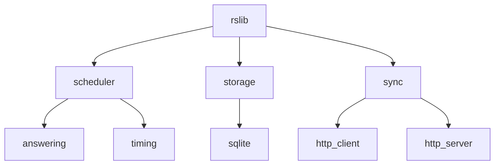
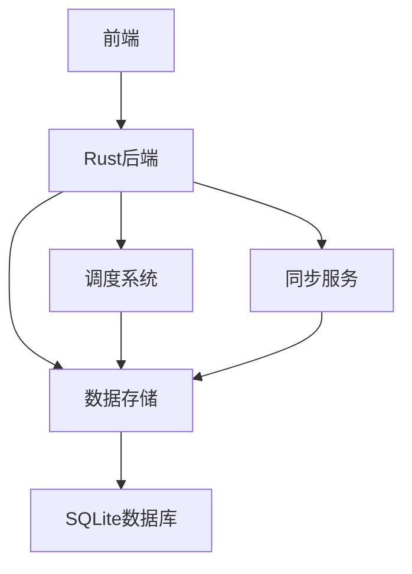
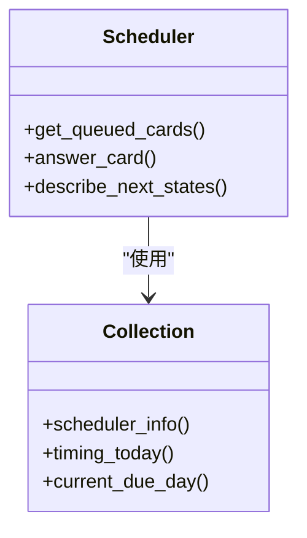
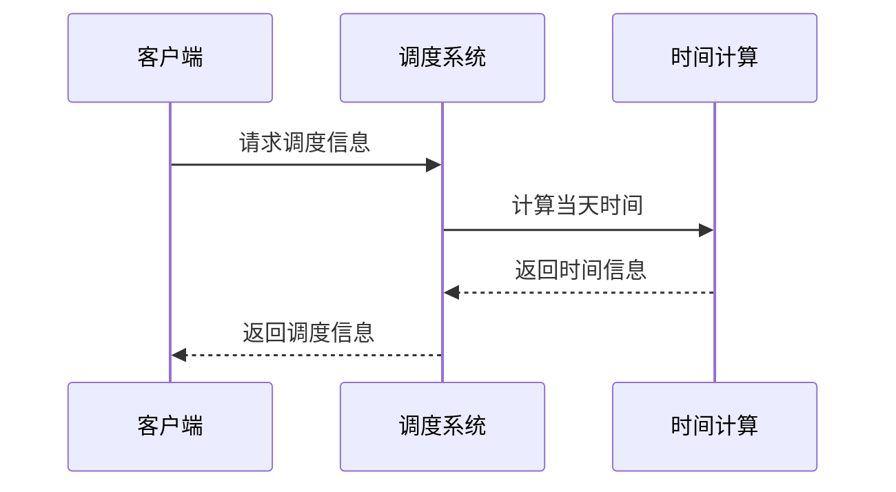
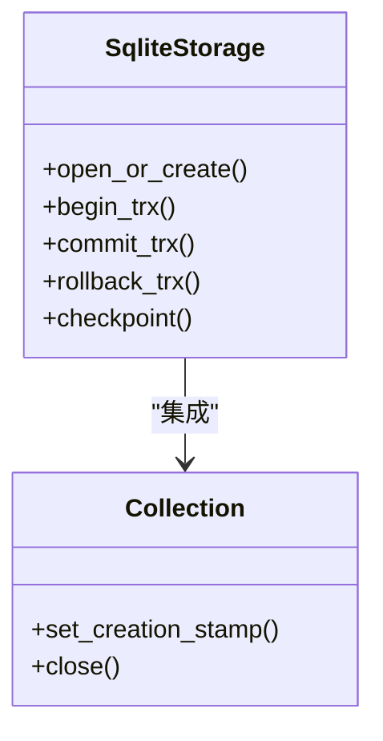
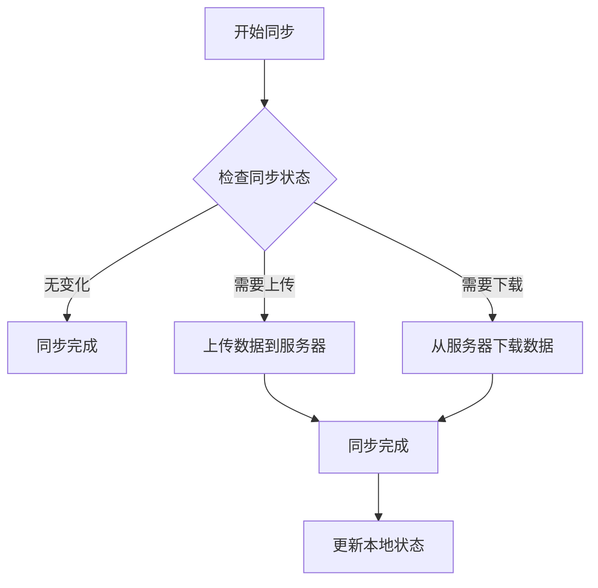
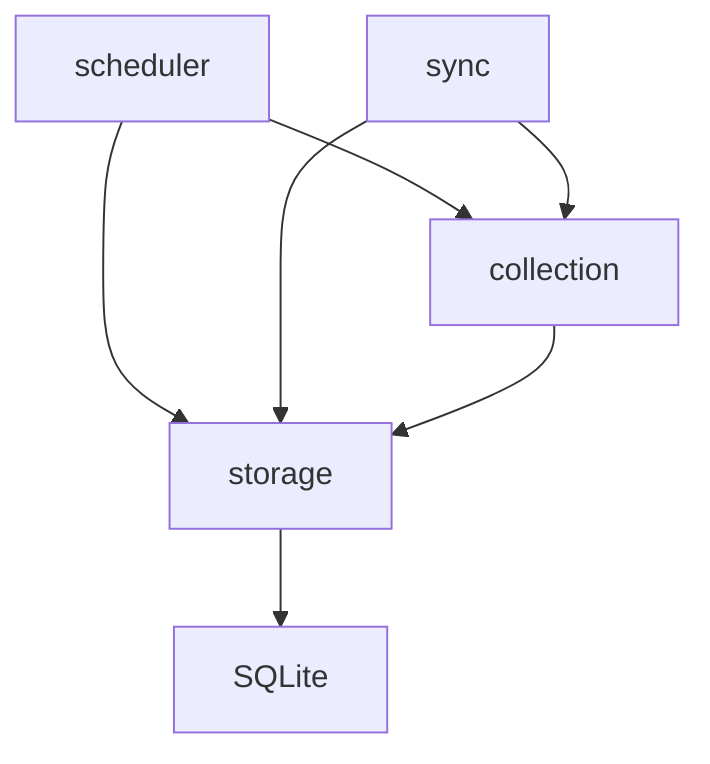

# Rust核心模块

<cite>
**本文档中引用的文件**  
- [mod.rs](file://rslib/src/scheduler/mod.rs)
- [answering.rs](file://rslib/src/scheduler/service/answering.rs)
- [timing.rs](file://rslib/src/scheduler/timing.rs)
- [sqlite.rs](file://rslib/src/storage/sqlite.rs)
- [mod.rs](file://rslib/src/storage/mod.rs)
- [mod.rs](file://rslib/src/sync/mod.rs)
- [sync.py](file://pylib/anki/sync.py)
- [v3.py](file://pylib/anki/scheduler/v3.py)
- [collection.rs](file://rslib/src/backend/collection.rs)
</cite>

## 目录
1. [介绍](#介绍)
2. [项目结构](#项目结构)
3. [核心组件](#核心组件)
4. [架构概述](#架构概述)
5. [详细组件分析](#详细组件分析)
6. [依赖分析](#依赖分析)
7. [性能考虑](#性能考虑)
8. [故障排除指南](#故障排除指南)
9. [结论](#结论)

## 介绍
Anki的Rust核心模块为应用程序提供了调度系统、数据存储和同步服务的关键功能。这些模块共同构成了Anki学习系统的基础，确保了卡片调度的准确性、数据的持久化以及跨设备的同步能力。本文档详细说明了这些核心模块的实现，包括设计原理、关键算法和性能优化。

## 项目结构
Anki的Rust代码库组织良好，主要模块包括调度器、存储和同步服务。这些模块位于rslib目录下，通过清晰的模块化设计实现了功能分离。

**图源**  
- [mod.rs](file://rslib/src/scheduler/mod.rs)
- [mod.rs](file://rslib/src/storage/mod.rs)
- [mod.rs](file://rslib/src/sync/mod.rs)

**节源**  
- [mod.rs](file://rslib/src/scheduler/mod.rs)
- [mod.rs](file://rslib/src/storage/mod.rs)
- [mod.rs](file://rslib/src/sync/mod.rs)

## 核心组件
Rust核心模块包含三个主要组件：调度系统、数据存储和同步服务。这些组件通过清晰的接口相互交互，确保了系统的稳定性和可维护性。

**节源**  
- [mod.rs](file://rslib/src/scheduler/mod.rs)
- [mod.rs](file://rslib/src/storage/mod.rs)
- [mod.rs](file://rslib/src/sync/mod.rs)

## 架构概述
Anki的Rust核心模块采用分层架构设计，各组件之间通过明确定义的接口进行通信。这种设计确保了模块间的松耦合，便于维护和扩展。

**图源**  
- [mod.rs](file://rslib/src/scheduler/mod.rs)
- [mod.rs](file://rslib/src/storage/mod.rs)
- [mod.rs](file://rslib/src/sync/mod.rs)

## 详细组件分析
对Anki Rust核心模块的详细分析，涵盖调度系统、数据存储和同步服务的实现细节。

### 调度系统分析
调度系统负责管理学习卡片的复习计划，基于间隔重复算法确定卡片的下一个复习时间。

#### 调度服务
调度服务实现了卡片调度的核心逻辑，包括获取待复习卡片和处理用户回答。

**图源**  
- [mod.rs](file://rslib/src/scheduler/mod.rs)
- [answering.rs](file://rslib/src/scheduler/service/answering.rs)

**节源**  
- [mod.rs](file://rslib/src/scheduler/mod.rs)
- [answering.rs](file://rslib/src/scheduler/service/answering.rs)

#### 时间计算
时间计算模块负责确定当前学习周期的开始和结束时间，这是调度系统的基础。

**图源**  
- [timing.rs](file://rslib/src/scheduler/timing.rs)

**节源**  
- [timing.rs](file://rslib/src/scheduler/timing.rs)

### 数据存储分析
数据存储模块负责管理Anki集合的持久化存储，使用SQLite数据库作为底层存储引擎。

#### 存储服务
存储服务提供了对SQLite数据库的抽象访问接口，确保了数据操作的安全性和效率。

**图源**  
- [sqlite.rs](file://rslib/src/storage/sqlite.rs)
- [mod.rs](file://rslib/src/storage/mod.rs)

**节源**  
- [sqlite.rs](file://rslib/src/storage/sqlite.rs)
- [mod.rs](file://rslib/src/storage/mod.rs)

### 同步服务分析
同步服务负责在本地设备和AnkiWeb服务器之间同步数据，确保用户在不同设备上获得一致的学习体验。

#### 同步流程
同步流程描述了本地数据与服务器数据同步的完整过程。

**图源**  
- [mod.rs](file://rslib/src/sync/mod.rs)
- [sync.py](file://pylib/anki/sync.py)

**节源**  
- [mod.rs](file://rslib/src/sync/mod.rs)
- [sync.py](file://pylib/anki/sync.py)

## 依赖分析
Anki Rust核心模块的依赖关系分析，展示了各组件之间的交互和依赖。

**图源**  
- [mod.rs](file://rslib/src/scheduler/mod.rs)
- [mod.rs](file://rslib/src/storage/mod.rs)
- [mod.rs](file://rslib/src/sync/mod.rs)
- [collection.rs](file://rslib/src/backend/collection.rs)

**节源**  
- [mod.rs](file://rslib/src/scheduler/mod.rs)
- [mod.rs](file://rslib/src/storage/mod.rs)
- [mod.rs](file://rslib/src/sync/mod.rs)
- [collection.rs](file://rslib/src/backend/collection.rs)

## 性能考虑
Rust核心模块在设计时充分考虑了性能因素，通过多种优化技术确保了系统的高效运行。

- 使用Rust语言的内存安全特性避免了常见的内存错误
- 采用SQLite的WAL模式提高并发性能
- 通过预编译SQL语句减少查询开销
- 使用连接池管理数据库连接
- 实现了高效的数据缓存机制

## 故障排除指南
常见问题及其解决方案：

1. **同步失败**：检查网络连接，确保AnkiWeb账户凭据正确
2. **数据库损坏**：使用内置的数据库检查工具修复
3. **性能问题**：优化查询，检查索引使用情况
4. **调度异常**：验证系统时间设置，检查调度配置

**节源**  
- [sync.py](file://pylib/anki/sync.py)
- [v3.py](file://pylib/anki/scheduler/v3.py)

## 结论
Anki的Rust核心模块通过精心设计的架构和高效的实现，为应用程序提供了可靠的调度、存储和同步功能。这些模块的模块化设计不仅确保了系统的稳定性，还为未来的扩展和维护提供了便利。