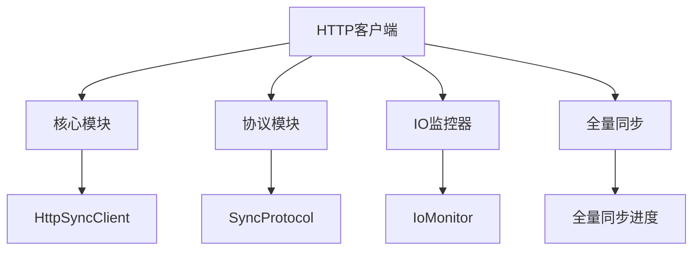
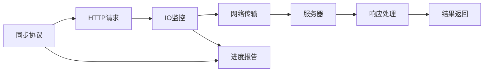
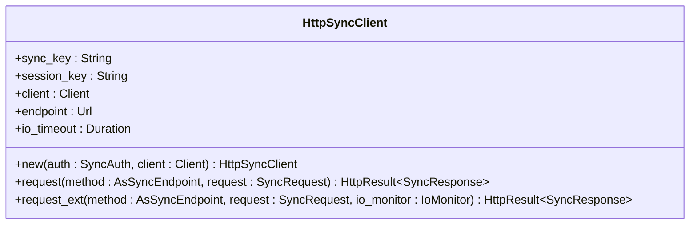
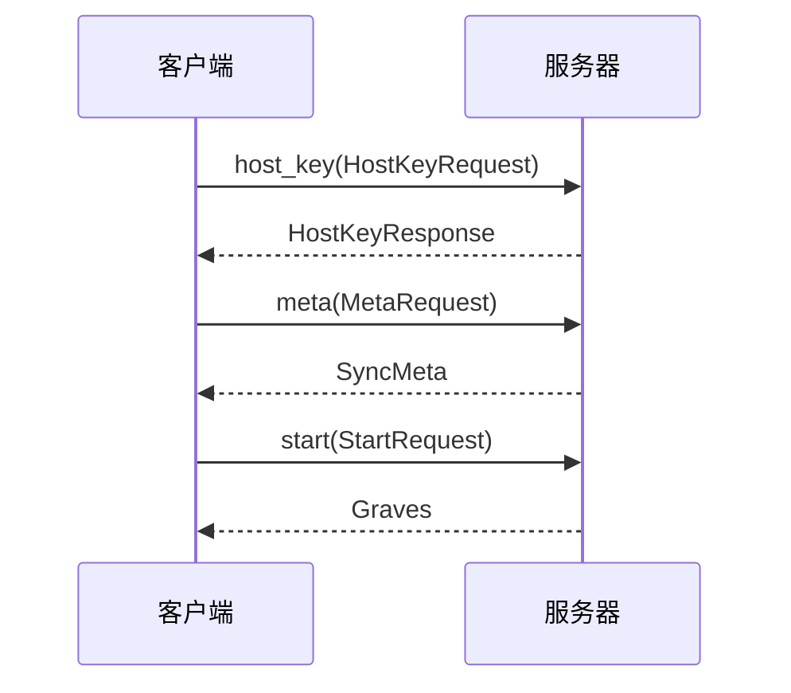
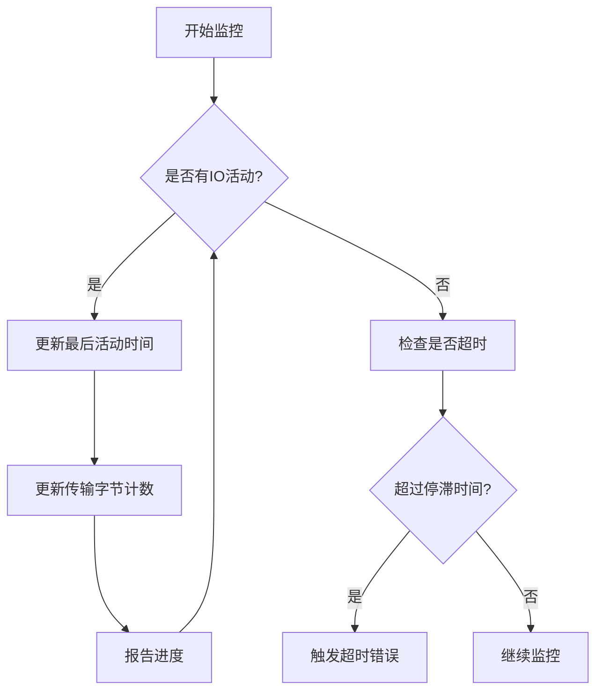
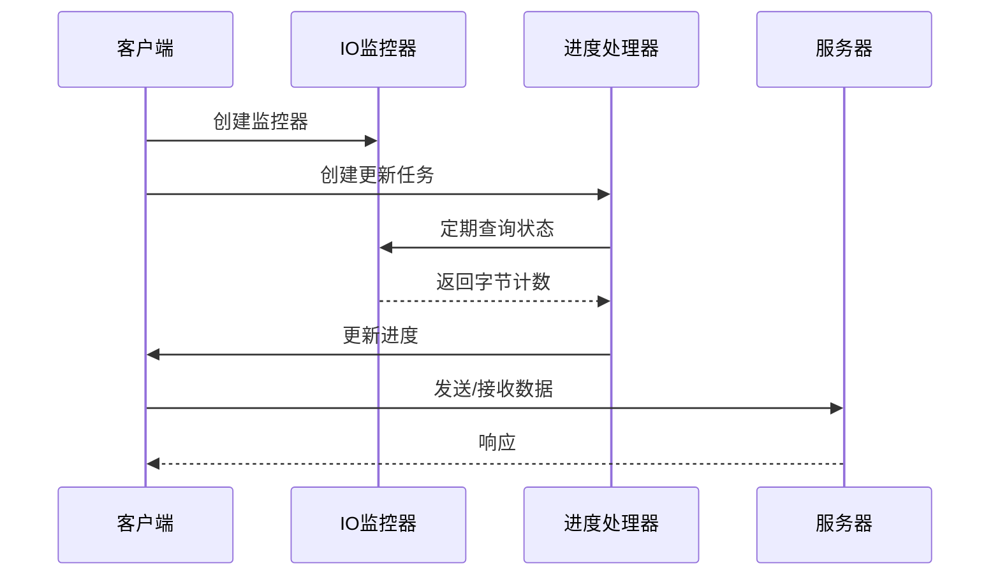
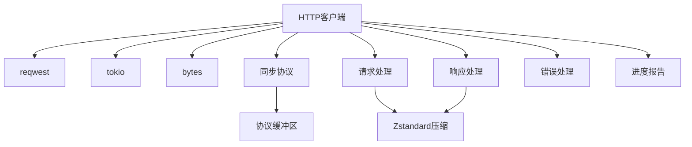

# HTTP客户端

<cite>
**本文档中引用的文件**
- [HttpSyncClient](file://rslib/src/sync/http_client/mod.rs)
- [protocol.rs](file://rslib/src/sync/http_client/protocol.rs)
- [io_monitor.rs](file://rslib/src/sync/http_client/io_monitor.rs)
- [full_sync.rs](file://rslib/src/sync/http_client/full_sync.rs)
- [error.rs](file://rslib/src/sync/error.rs)
- [login.rs](file://rslib/src/sync/login.rs)
- [request.rs](file://rslib/src/sync/request/mod.rs)
- [response.rs](file://rslib/src/sync/response.rs)
</cite>

## 目录
1. [简介](#简介)
2. [项目结构](#项目结构)
3. [核心组件](#核心组件)
4. [架构概述](#架构概述)
5. [详细组件分析](#详细组件分析)
6. [依赖分析](#依赖分析)
7. [性能考虑](#性能考虑)
8. [故障排除指南](#故障排除指南)
9. [结论](#结论)

## 简介
Anki同步HTTP客户端是Anki桌面应用程序与AnkiWeb服务器之间通信的核心组件。该客户端实现了完整的同步协议，包括认证、会话管理、全量同步和增量同步功能。客户端使用Rust语言编写，基于reqwest HTTP库构建，通过协议缓冲区（Protocol Buffers）进行数据序列化。它支持Zstandard压缩以优化网络传输，并实现了详细的IO监控和超时处理机制。客户端设计注重安全性，使用HTTPS加密通信，并通过多层认证机制保护用户数据。

## 项目结构
Anki同步HTTP客户端的代码位于rslib/src/sync/http_client目录下，采用模块化设计，各组件职责分明。主要模块包括核心客户端实现、协议定义、IO监控器和全量同步处理器。这种结构化设计使得代码易于维护和扩展，同时确保了同步功能的可靠性和性能。

**图示来源**
- [mod.rs](file://rslib/src/sync/http_client/mod.rs)
- [protocol.rs](file://rslib/src/sync/http_client/protocol.rs)
- [io_monitor.rs](file://rslib/src/sync/http_client/io_monitor.rs)
- [full_sync.rs](file://rslib/src/sync/http_client/full_sync.rs)

**节来源**
- [mod.rs](file://rslib/src/sync/http_client/mod.rs)
- [protocol.rs](file://rslib/src/sync/http_client/protocol.rs)

## 核心组件
Anki同步HTTP客户端的核心组件包括HttpSyncClient结构体、同步协议实现、IO监控器和全量同步处理器。HttpSyncClient管理与服务器的连接状态，包括同步密钥、会话密钥和端点URL。同步协议定义了客户端与服务器之间的通信方法，如元数据获取、变更应用和完整性检查。IO监控器负责监控数据传输进度和超时检测，确保同步过程的稳定性和可靠性。全量同步处理器则专门处理大型数据传输的进度报告和网络中断恢复。

**节来源**
- [mod.rs](file://rslib/src/sync/http_client/mod.rs)
- [protocol.rs](file://rslib/src/sync/http_client/protocol.rs)
- [io_monitor.rs](file://rslib/src/sync/http_client/io_monitor.rs)

## 架构概述
Anki同步HTTP客户端采用分层架构设计，上层为同步协议接口，中层为HTTP请求处理器，底层为IO监控和网络传输组件。这种架构实现了关注点分离，使得协议逻辑与网络细节解耦。客户端通过reqwest库发送HTTP POST请求，使用自定义头部传递同步元数据，请求体采用Zstandard压缩的二进制格式。响应处理包括解压缩、错误检测和重定向处理，确保了通信的健壮性。

**图示来源**
- [mod.rs](file://rslib/src/sync/http_client/mod.rs)
- [io_monitor.rs](file://rslib/src/sync/http_client/io_monitor.rs)
- [protocol.rs](file://rslib/src/sync/http_client/protocol.rs)

## 详细组件分析

### HttpSyncClient分析
HttpSyncClient是同步客户端的主要结构体，封装了与AnkiWeb服务器通信所需的所有状态和方法。它包含同步密钥、会话密钥、HTTP客户端实例、服务器端点和IO超时设置。客户端初始化时，根据提供的认证信息配置这些参数，建立与服务器的安全连接。

**图示来源**
- [mod.rs](file://rslib/src/sync/http_client/mod.rs)

**节来源**
- [mod.rs](file://rslib/src/sync/http_client/mod.rs)

### 同步协议分析
同步协议通过异步特质（async trait）实现，定义了客户端与服务器之间的标准通信方法。协议包括主机密钥获取、元数据查询、同步开始、墓碑应用、变更应用、块传输、完整性检查、完成和中止等操作。媒体同步协议则专门处理媒体文件的同步，包括开始、媒体变更、上传变更、下载文件和媒体完整性检查。

**图示来源**
- [protocol.rs](file://rslib/src/sync/http_client/protocol.rs)

**节来源**
- [protocol.rs](file://rslib/src/sync/http_client/protocol.rs)

### IO监控器分析
IO监控器是确保同步过程稳定性的关键组件，具有双重功能：监控数据传输活动以检测停滞，以及监控数据量以提供进度报告。监控器使用tokio定时器定期检查最后活动时间，如果超过指定的停滞时间，则触发超时。同时，它精确跟踪已发送和接收的字节数，为用户界面提供实时进度更新。

**图示来源**
- [io_monitor.rs](file://rslib/src/sync/http_client/io_monitor.rs)

**节来源**
- [io_monitor.rs](file://rslib/src/sync/http_client/io_monitor.rs)

### 全量同步分析
全量同步处理器专门处理大型数据传输的进度监控。它创建一个IO监控器和一个进度更新任务，两者并行运行。进度更新任务定期查询IO监控器的状态，计算传输百分比，并通过进度处理器更新用户界面。主同步任务使用select!宏同时等待进度更新和实际网络请求，确保在超时发生时能够及时响应。

**图示来源**
- [full_sync.rs](file://rslib/src/sync/http_client/full_sync.rs)

**节来源**
- [full_sync.rs](file://rslib/src/sync/http_client/full_sync.rs)

## 依赖分析
Anki同步HTTP客户端依赖多个外部库和内部模块，形成了复杂的依赖网络。主要外部依赖包括reqwest（HTTP客户端）、tokio（异步运行时）和bytes（字节操作）。内部依赖包括同步协议定义、请求/响应处理、错误处理和进度报告组件。这些依赖关系确保了客户端功能的完整性和可靠性。

**图示来源**
- [Cargo.toml](file://rslib/Cargo.toml)
- [mod.rs](file://rslib/src/sync/http_client/mod.rs)

**节来源**
- [mod.rs](file://rslib/src/sync/http_client/mod.rs)
- [Cargo.toml](file://rslib/Cargo.toml)

## 性能考虑
Anki同步HTTP客户端在设计时充分考虑了性能因素。通过Zstandard压缩减少网络传输量，使用流式处理避免大内存分配，以及异步非阻塞IO确保主线程不被阻塞。IO监控器的精细超时控制防止了网络停滞导致的无限等待，而进度报告的节流机制避免了过于频繁的UI更新。这些优化措施共同确保了同步过程的高效和流畅。

## 故障排除指南
当同步出现问题时，首先检查网络连接和服务器状态。认证失败通常由无效的同步密钥或会话超时引起，需要重新登录。网络超时可能是由于连接不稳定或防火墙限制，建议检查网络设置。服务器返回的特定HTTP状态码提供了详细的错误信息：403表示认证失败，409表示同步冲突，500系列表示服务器内部错误。对于持续性问题，查看同步日志可以提供更深入的诊断信息。

**节来源**
- [error.rs](file://rslib/src/sync/error.rs)
- [mod.rs](file://rslib/src/sync/http_client/mod.rs)

## 结论
Anki同步HTTP客户端是一个功能完整、设计精良的网络通信组件，实现了Anki桌面应用程序与AnkiWeb服务器之间的可靠数据同步。通过模块化设计、异步编程和精细的错误处理，客户端提供了稳定、高效的同步体验。其架构既满足了基本的同步需求，又为未来的功能扩展留下了充足的空间。对于开发者而言，理解客户端的工作原理有助于更好地维护和优化同步功能，为用户提供更优质的服务。