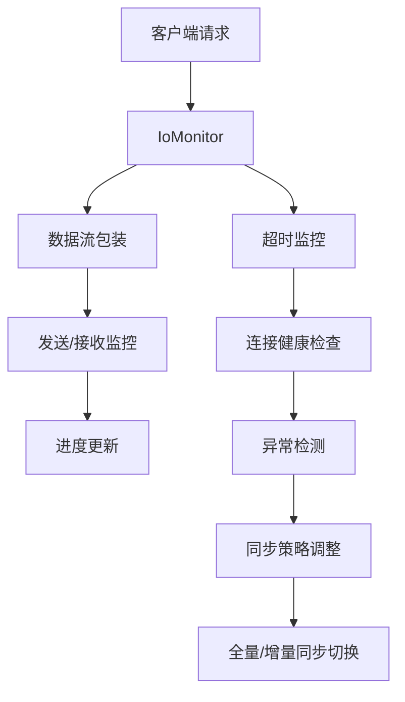
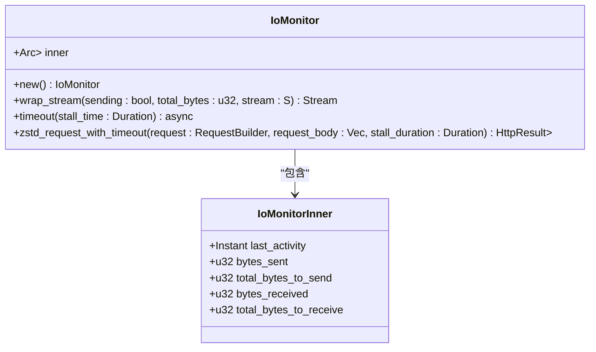
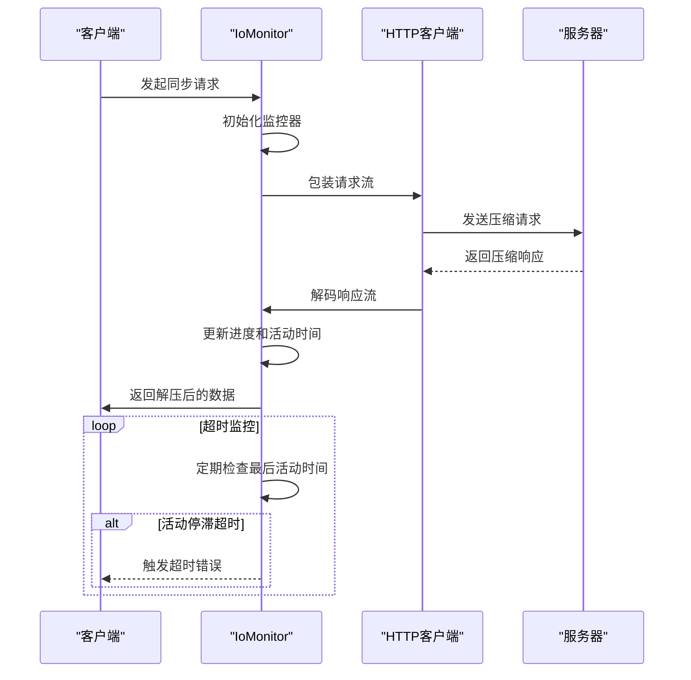
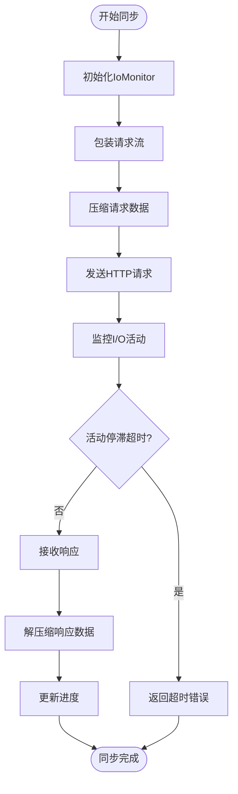
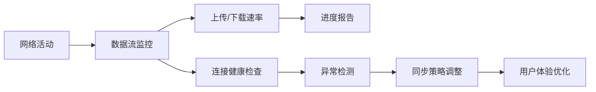
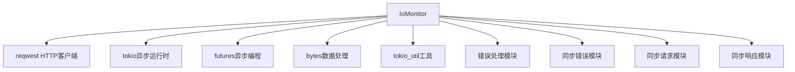

# IO监控

<cite>
**本文档中引用的文件**
- [io_monitor.rs](file://rslib/src/sync/http_client/io_monitor.rs)
- [mod.rs](file://rslib/src/sync/http_client/mod.rs)
- [full_sync.rs](file://rslib/src/sync/http_client/full_sync.rs)
- [response.rs](file://rslib/src/sync/response.rs)
- [header_and_stream.rs](file://rslib/src/sync/request/header_and_stream.rs)
</cite>

## 目录
1. [简介](#简介)
2. [项目结构](#项目结构)
3. [核心组件](#核心组件)
4. [架构概述](#架构概述)
5. [详细组件分析](#详细组件分析)
6. [依赖分析](#依赖分析)
7. [性能考虑](#性能考虑)
8. [故障排除指南](#故障排除指南)
9. [结论](#结论)
10. [附录](#附录)（如有必要）

## 简介
Anki同步IO监控系统是一个关键的网络性能监控组件，负责监控网络活动、测量带宽使用情况和检查连接健康状况。该系统通过实时跟踪上传/下载速率、计算传输耗时和检测网络异常来确保同步过程的稳定性和效率。IO监控器不仅提供流量统计和超时控制，还实现了拥塞避免算法，以优化网络资源的使用。监控数据被用于动态调整同步策略，例如根据网络状况自动切换全量/增量同步模式。系统还解决了高延迟网络适应、移动网络计费周期优化和后台同步能耗控制等常见问题，为用户提供最佳的同步体验。

## 项目结构
Anki的项目结构清晰地组织了各个功能模块，其中IO监控系统位于rslib/src/sync/http_client目录下。该结构体现了功能分离和模块化设计的原则，使得代码易于维护和扩展。

```mermaid
graph TB
subgraph "rslib"
subgraph "src"
subgraph "sync"
subgraph "http_client"
io_monitor["io_monitor.rs"]
mod["mod.rs"]
full_sync["full_sync.rs"]
end
subgraph "request"
header_and_stream["header_and_stream.rs"]
end
subgraph "response"
response["response.rs"]
end
end
end
end
```

**图示来源**
- [io_monitor.rs](file://rslib/src/sync/http_client/io_monitor.rs#L1-L300)
- [mod.rs](file://rslib/src/sync/http_client/mod.rs#L1-L100)
- [full_sync.rs](file://rslib/src/sync/http_client/full_sync.rs#L1-L60)

**本节来源**
- [io_monitor.rs](file://rslib/src/sync/http_client/io_monitor.rs#L1-L300)
- [mod.rs](file://rslib/src/sync/http_client/mod.rs#L1-L100)

## 核心组件
IO监控系统的核心组件包括IoMonitor结构体，它负责监控数据发送/接收并允许在传输停滞时中止，同时监控移动的数据量以提供进度报告。该系统通过包装数据流来实现监控，实时更新发送和接收的字节数，并记录最后的活动时间。当检测到I/O活动停滞超过指定时间时，系统会触发超时机制，确保同步过程不会无限期挂起。

**本节来源**
- [io_monitor.rs](file://rslib/src/sync/http_client/io_monitor.rs#L1-L300)

## 架构概述
IO监控系统的架构设计围绕着实时网络性能监控和连接健康检查展开。系统通过异步I/O操作和流式数据处理来实现高效的网络活动监控。主要组件包括数据流包装器、超时监控器和进度报告器，它们协同工作以确保同步过程的稳定性和效率。



**图示来源**
- [io_monitor.rs](file://rslib/src/sync/http_client/io_monitor.rs#L1-L300)
- [mod.rs](file://rslib/src/sync/http_client/mod.rs#L1-L100)

## 详细组件分析

### IoMonitor分析
IoMonitor是IO监控系统的核心，它通过包装数据流来实现对网络活动的实时监控。该组件不仅跟踪上传/下载速率，还负责检测网络异常和计算传输耗时。

#### 对象导向组件


**图示来源**
- [io_monitor.rs](file://rslib/src/sync/http_client/io_monitor.rs#L1-L300)

#### API/服务组件


**图示来源**
- [io_monitor.rs](file://rslib/src/sync/http_client/io_monitor.rs#L1-L300)
- [mod.rs](file://rslib/src/sync/http_client/mod.rs#L1-L100)

#### 复杂逻辑组件


**图示来源**
- [io_monitor.rs](file://rslib/src/sync/http_client/io_monitor.rs#L1-L300)
- [header_and_stream.rs](file://rslib/src/sync/request/header_and_stream.rs#L1-L80)
- [response.rs](file://rslib/src/sync/response.rs#L1-L90)

**本节来源**
- [io_monitor.rs](file://rslib/src/sync/http_client/io_monitor.rs#L1-L300)
- [mod.rs](file://rslib/src/sync/http_client/mod.rs#L1-L100)
- [full_sync.rs](file://rslib/src/sync/http_client/full_sync.rs#L1-L60)

### 概念概述
IO监控系统通过实时监控网络活动来确保Anki同步过程的稳定性和效率。系统不仅跟踪数据传输速率，还通过超时机制检测网络异常，从而实现智能的同步策略调整。



## 依赖分析
IO监控系统依赖于多个关键组件和外部库，这些依赖关系确保了系统的完整功能和高性能。



**图示来源**
- [io_monitor.rs](file://rslib/src/sync/http_client/io_monitor.rs#L1-L300)
- [Cargo.toml](file://Cargo.toml#L1-L50)

**本节来源**
- [io_monitor.rs](file://rslib/src/sync/http_client/io_monitor.rs#L1-L300)
- [Cargo.toml](file://Cargo.toml#L1-L50)

## 性能考虑
IO监控系统在设计时充分考虑了性能因素，通过异步I/O操作和流式数据处理来最小化内存使用和提高处理效率。系统使用zstd压缩算法来减少网络传输的数据量，同时通过进度报告和超时监控来确保同步过程的及时性和可靠性。在低功耗模式下，系统可以调整同步策略以减少能耗，同时允许用户根据带宽偏好设置来优化同步行为。

## 故障排除指南
当遇到同步问题时，可以检查以下常见情况：
- 网络连接是否稳定
- 是否达到网络超时限制
- 上传数据是否过大
- 服务器是否返回重定向
- 时钟是否与服务器同步

系统会根据不同的错误类型提供相应的错误信息，帮助用户诊断和解决问题。

**本节来源**
- [io_monitor.rs](file://rslib/src/sync/http_client/io_monitor.rs#L1-L300)
- [error.rs](file://rslib/src/error/network.rs#L1-L60)
- [network.ftl](file://ftl/core/network.ftl#L1-L4)

## 结论
Anki同步IO监控系统是一个功能强大且设计精良的网络性能监控组件。它通过实时监控网络活动、测量带宽使用情况和检查连接健康状况，确保了同步过程的稳定性和效率。系统不仅提供了详细的流量统计和超时控制，还实现了智能的同步策略调整，以适应不同的网络环境和用户需求。通过深入理解该系统的架构和实现细节，开发者可以更好地优化同步性能，为用户提供更流畅的使用体验。

## 附录
### 网络错误代码
| 错误代码 | 描述 |
|---------|------|
| Offline | 网络离线 |
| Timeout | 连接超时 |
| ProxyAuth | 代理认证失败 |
| Other | 其他网络错误 |

### 同步状态
| 状态 | 描述 |
|------|------|
| NoChanges | 无需同步 |
| NormalSync | 正常同步 |
| FullSync | 全量同步 |