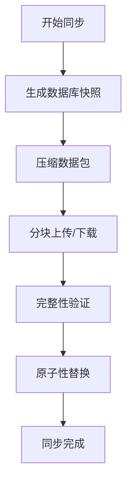
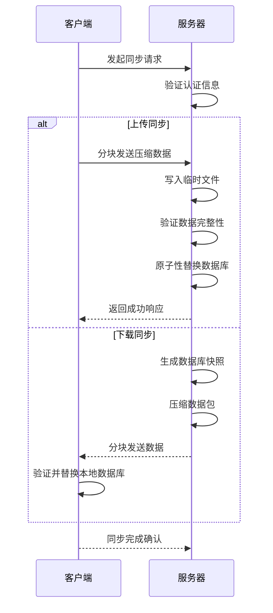
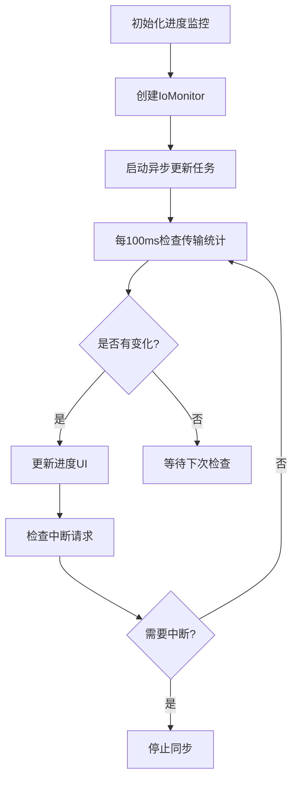

# 全量同步

<cite>
**本文档中引用的文件**  
- [full_sync.rs](file://rslib/src/sync/http_client/full_sync.rs)
- [io_monitor.rs](file://rslib/src/sync/http_client/io_monitor.rs)
- [request.rs](file://rslib/src/sync/request/mod.rs)
- [handlers.rs](file://rslib/src/sync/http_server/handlers.rs)
- [upload.rs](file://rslib/src/sync/collection/upload.rs)
- [download.rs](file://rslib/src/sync/collection/download.rs)
- [progress.rs](file://rslib/src/progress.rs)
</cite>

## 目录
1. [简介](#简介)
2. [全量同步流程概述](#全量同步流程概述)
3. [核心组件分析](#核心组件分析)
4. [进度监控与用户反馈](#进度监控与用户反馈)
5. [数据完整性与原子性保障](#数据完整性与原子性保障)
6. [异常处理与恢复机制](#异常处理与恢复机制)
7. [性能优化建议](#性能优化建议)
8. [全量同步与增量同步对比](#全量同步与增量同步对比)
9. [结论](#结论)

## 简介
Anki的全量同步机制是确保用户数据在不同设备间保持一致性的核心功能。该机制通过完整的数据库快照传输，实现卡片、笔记、媒体等所有数据表的原子性同步。本文档深入分析`full_sync.rs`中实现的完整数据同步流程，涵盖本地数据库快照生成、压缩包构建、分块上传和完整性验证等关键环节。

## 全量同步流程概述
全量同步流程始于客户端生成本地数据库的完整快照，并将其压缩为单一数据包。该数据包通过HTTP协议传输到服务器，服务器在接收后进行完整性验证并替换现有数据库。整个过程采用原子性操作，确保数据一致性。同步过程中，系统通过进度监控器实时报告传输状态，提供用户友好的界面反馈。

**图示来源**  
- [full_sync.rs](file://rslib/src/sync/http_client/full_sync.rs)
- [upload.rs](file://rslib/src/sync/collection/upload.rs)
- [download.rs](file://rslib/src/sync/collection/download.rs)

**本节来源**  
- [full_sync.rs](file://rslib/src/sync/http_client/full_sync.rs#L20-L81)
- [handlers.rs](file://rslib/src/sync/http_server/handlers.rs#L161-L189)

## 核心组件分析

### 同步客户端实现
`HttpSyncClient`是全量同步的核心组件，负责管理与服务器的通信。该组件提供了`download_with_progress`和`upload_with_progress`两个主要方法，支持带进度监控的数据传输。同步过程中，客户端使用`IoMonitor`跟踪字节发送和接收情况，确保网络活动的实时监控。

### 服务器端处理
服务器端通过`handle_received_upload`函数处理上传请求。该函数首先检查数据包大小是否超过限制，然后将数据写入临时文件进行完整性验证。验证通过后，系统会原子性地替换现有数据库文件，确保数据一致性。下载过程则通过`server_download`函数实现，该函数在发送数据前会递增USN（更新序列号）。

**图示来源**  
- [full_sync.rs](file://rslib/src/sync/http_client/full_sync.rs)
- [handlers.rs](file://rslib/src/sync/http_server/handlers.rs)
- [upload.rs](file://rslib/src/sync/collection/upload.rs)

**本节来源**  
- [full_sync.rs](file://rslib/src/sync/http_client/full_sync.rs#L56-L81)
- [handlers.rs](file://rslib/src/sync/http_server/handlers.rs#L161-L189)
- [upload.rs](file://rslib/src/sync/collection/upload.rs#L69-L101)

## 进度监控与用户反馈
系统通过`ThrottlingProgressHandler`实现高效的进度监控。该处理器以100毫秒的间隔更新进度信息，避免频繁的UI刷新影响性能。`full_sync_progress_monitor`函数创建一个异步任务，持续监控`IoMonitor`中的字节传输统计，并更新进度状态。这种设计确保了即使在大文件传输过程中，用户界面也能保持流畅响应。

**图示来源**  
- [full_sync.rs](file://rslib/src/sync/http_client/full_sync.rs)
- [progress.rs](file://rslib/src/progress.rs)
- [io_monitor.rs](file://rslib/src/sync/http_client/io_monitor.rs)

**本节来源**  
- [full_sync.rs](file://rslib/src/sync/http_client/full_sync.rs#L20-L54)
- [progress.rs](file://rslib/src/progress.rs#L25-L59)
- [io_monitor.rs](file://rslib/src/sync/http_client/io_monitor.rs#L159-L199)

## 数据完整性与原子性保障
全量同步机制通过多重措施确保数据完整性。首先，系统在传输前设置最大数据包大小限制，防止过大的数据包导致问题。接收端会将数据写入临时文件，并使用`CollectionBuilder`进行完整性验证。只有验证通过后，才会通过原子性重命名操作替换原始数据库文件。这种设计确保了即使在同步过程中断电或崩溃，也不会导致数据库损坏。

**本节来源**  
- [upload.rs](file://rslib/src/sync/collection/upload.rs#L69-L101)
- [download.rs](file://rslib/src/sync/collection/download.rs#L25-L62)
- [collection/mod.rs](file://rslib/src/collection/mod.rs#L160-L188)

## 异常处理与恢复机制
系统实现了完善的异常处理机制。`IoMonitor`能够检测网络超时和中断，及时通知上层应用。同步过程中，任何步骤的失败都会导致操作回滚，保持数据一致性。服务器端的`abort`接口允许客户端主动中断正在进行的同步操作。此外，系统通过`check_upload_limit`函数验证数据大小，防止因存储空间不足导致的同步失败。

**本节来源**  
- [io_monitor.rs](file://rslib/src/sync/http_client/io_monitor.rs#L198-L224)
- [upload.rs](file://rslib/src/sync/collection/upload.rs#L103-L143)
- [handlers.rs](file://rslib/src/sync/http_server/handlers.rs#L161-L189)

## 性能优化建议
为优化全量同步性能，建议实施以下措施：首先，控制内存使用，避免在移动设备上因内存不足导致应用崩溃。其次，实现带宽限制功能，允许用户在弱网络环境下调整同步速度。第三，采用后台任务调度机制，在设备空闲时自动执行同步操作。最后，考虑实现断点续传功能，对于大文件传输可在网络中断后从中断点继续。

**本节来源**  
- [full_sync.rs](file://rslib/src/sync/http_client/full_sync.rs)
- [progress.rs](file://rslib/src/progress.rs)
- [io_monitor.rs](file://rslib/src/sync/http_client/io_monitor.rs)

## 全量同步与增量同步对比
全量同步与增量同步各有适用场景。全量同步传输完整的数据库快照，适合数据量较小或需要完全同步的场景，确保数据绝对一致性。增量同步仅传输变更部分，适合频繁同步和大数据库场景，节省带宽和时间。开发者应根据具体需求选择合适的同步策略，或结合两者优势实现混合同步方案。

**本节来源**  
- [full_sync.rs](file://rslib/src/sync/http_client/full_sync.rs)
- [handlers.rs](file://rslib/src/sync/http_server/handlers.rs)

## 结论
Anki的全量同步机制通过精心设计的架构和严谨的实现，确保了用户数据的安全性和一致性。系统采用原子性操作、完整性验证和进度监控等多重机制，提供了可靠的同步体验。未来可进一步优化断点续传和带宽管理功能，提升大文件传输效率。开发者在实现类似功能时，应重点关注数据完整性、异常处理和用户体验等方面。