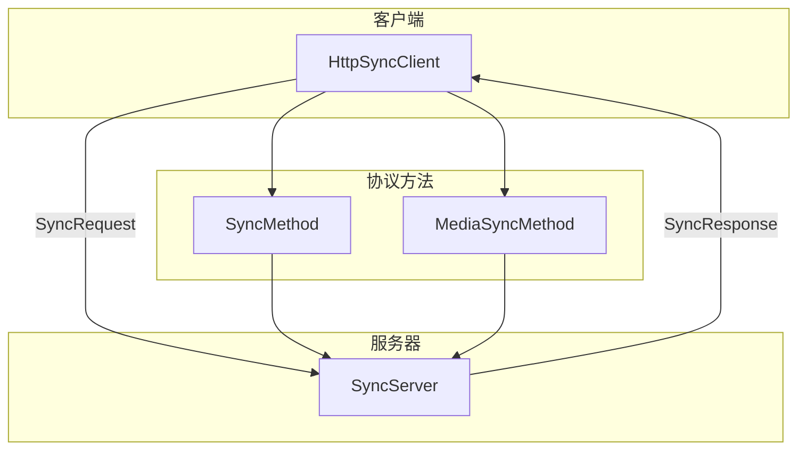
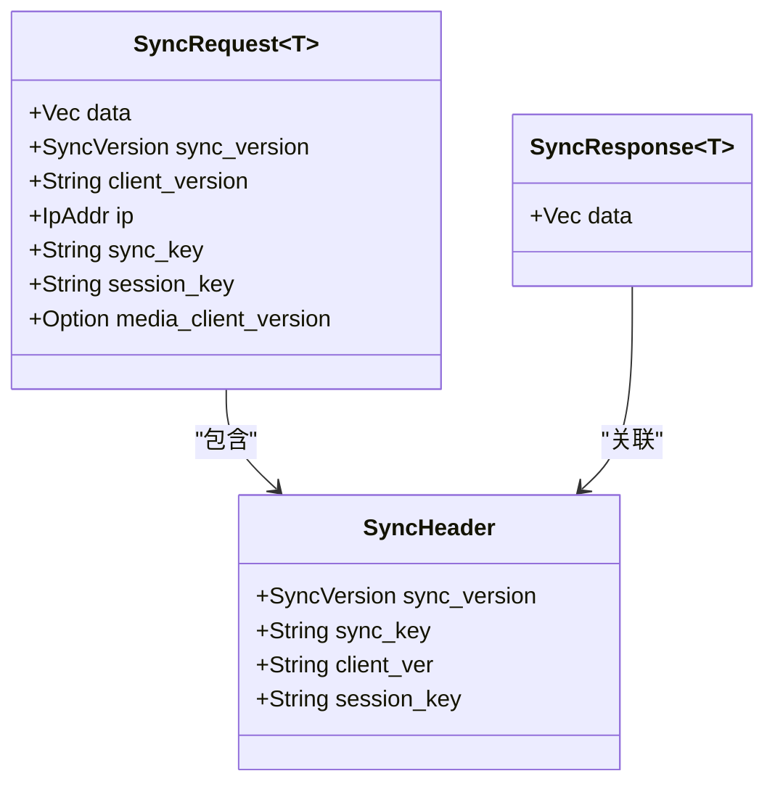
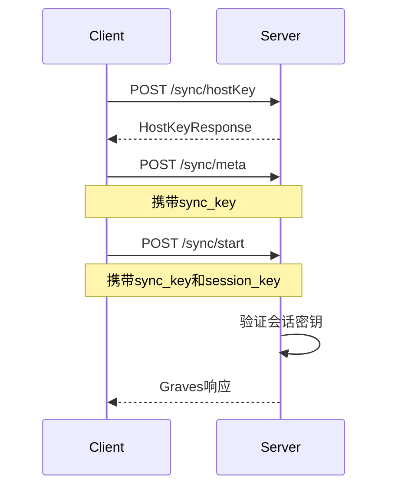
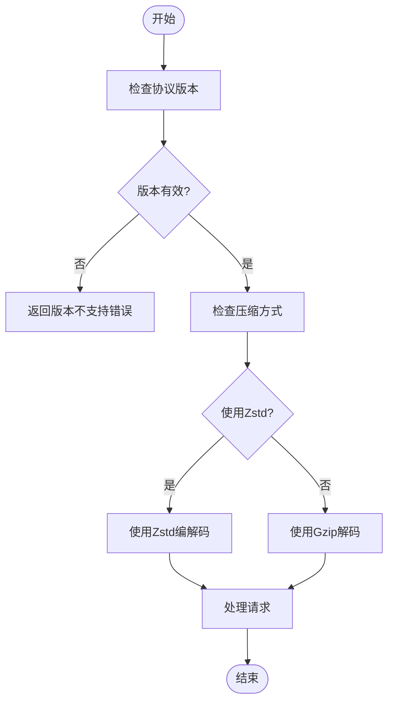
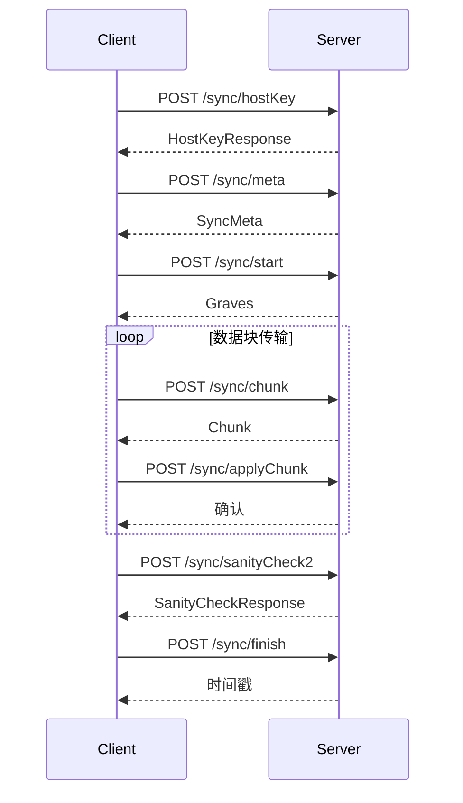
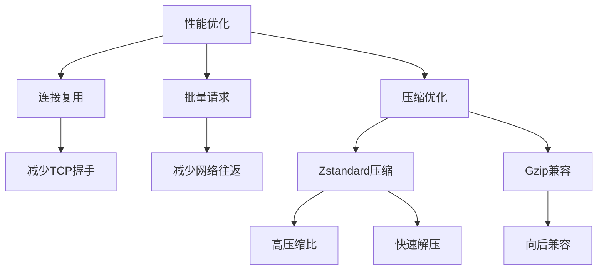

# 协议处理

<cite>
**本文档中引用的文件**  
- [protocol.rs](file://rslib/src/sync/collection/protocol.rs)
- [protocol.rs](file://rslib/src/sync/http_client/protocol.rs)
- [protocol.rs](file://rslib/src/sync/media/protocol.rs)
- [mod.rs](file://rslib/src/sync/request/mod.rs)
- [header_and_stream.rs](file://rslib/src/sync/request/header_and_stream.rs)
- [multipart.rs](file://rslib/src/sync/request/multipart.rs)
- [mod.rs](file://rslib/src/sync/http_client/mod.rs)
- [routes.rs](file://rslib/src/sync/http_server/routes.rs)
- [version.rs](file://rslib/src/sync/version.rs)
</cite>

## 目录
1. [简介](#简介)
2. [协议架构概述](#协议架构概述)
3. [请求/响应消息格式](#请求响应消息格式)
4. [认证头构造与会话管理](#认证头构造与会话管理)
5. [协议版本协商机制](#协议版本协商机制)
6. [HTTP通信流程时序图](#http通信流程时序图)
7. [分块传输与流式解析](#分块传输与流式解析)
8. [性能优化策略](#性能优化策略)
9. [常见问题与解决方案](#常见问题与解决方案)
10. [附录](#附录)

## 简介
Anki同步系统采用基于HTTP的自定义协议实现客户端与服务器之间的数据同步。该协议设计支持增量同步、媒体文件同步和全量同步等多种模式，通过Protocol Buffers进行消息序列化，并结合Zstandard压缩算法优化传输效率。本文档深入解析Anki同步协议的核心机制，包括消息格式、认证流程、版本协商和错误处理等关键组件。

**Section sources**
- [protocol.rs](file://rslib/src/sync/collection/protocol.rs#L1-L112)

## 协议架构概述
Anki同步协议采用模块化设计，分为集合同步和媒体同步两个主要部分。集合同步处理卡片、笔记、牌组等核心数据的同步，而媒体同步专门处理音频、图片等媒体文件的传输。协议通过`SyncProtocol`和`MediaSyncProtocol`两个trait定义了客户端与服务器之间的交互接口。

**Diagram sources**
- [protocol.rs](file://rslib/src/sync/collection/protocol.rs#L59-L91)
- [protocol.rs](file://rslib/src/sync/media/protocol.rs#L42-L100)

**Section sources**
- [protocol.rs](file://rslib/src/sync/collection/protocol.rs#L1-L112)
- [protocol.rs](file://rslib/src/sync/media/protocol.rs#L1-L101)

## 请求/响应消息格式
Anki同步协议使用Protocol Buffers作为序列化格式，所有消息都封装在`SyncRequest<T>`和`SyncResponse<T>`结构中。请求消息包含实际数据和元数据，其中元数据通过HTTP头或multipart表单传递。

### 消息结构
`SyncRequest<T>`结构包含以下字段：
- `data`: 序列化后的消息体
- `sync_version`: 协议版本号
- `client_version`: 客户端版本信息
- `ip`: 客户端IP地址
- `sync_key`: 同步密钥（主机密钥）
- `session_key`: 会话密钥
- `media_client_version`: 媒体客户端版本（可选）

**Diagram sources**
- [mod.rs](file://rslib/src/sync/request/mod.rs#L32-L74)
- [header_and_stream.rs](file://rslib/src/sync/request/header_and_stream.rs#L29-L72)

**Section sources**
- [mod.rs](file://rslib/src/sync/request/mod.rs#L32-L74)
- [header_and_stream.rs](file://rslib/src/sync/request/header_and_stream.rs#L29-L72)

## 认证头构造与会话管理
Anki同步协议采用多层认证机制，结合同步密钥和会话密钥确保通信安全。认证信息通过自定义HTTP头`anki-sync`传递，该头包含序列化的JSON对象。

### 认证头结构
认证头`SyncHeader`包含以下字段：
- `v`: 协议版本号
- `k`: 同步密钥（主机密钥）
- `c`: 客户端版本
- `s`: 会话密钥

### 会话管理机制
会话密钥用于防止并发同步冲突。客户端在登录后获取会话密钥，并在后续请求中携带该密钥。服务器会验证会话密钥的有效性，如果检测到并发访问，会返回相应的错误。

**Diagram sources**
- [mod.rs](file://rslib/src/sync/http_client/mod.rs#L49-L95)
- [header_and_stream.rs](file://rslib/src/sync/request/header_and_stream.rs#L100-L150)

**Section sources**
- [mod.rs](file://rslib/src/sync/http_client/mod.rs#L49-L95)
- [header_and_stream.rs](file://rslib/src/sync/request/header_and_stream.rs#L100-L150)

## 协议版本协商机制
Anki同步协议支持向后兼容，通过版本号机制实现平滑升级。当前支持的协议版本范围为8到11，其中版本11引入了直接POST和Zstandard压缩等重要改进。

### 版本定义
- `SYNC_VERSION_08_SESSIONKEY` (8): 引入会话密钥
- `SYNC_VERSION_09_V2_SCHEDULER` (9): 支持V2调度器
- `SYNC_VERSION_10_V2_TIMEZONE` (10): 支持V2时区
- `SYNC_VERSION_11_DIRECT_POST` (11): 使用直接POST和Zstandard压缩

### 版本检查
协议在处理请求时会进行版本检查，确保客户端和服务器使用兼容的协议版本。如果版本不兼容，会返回"unsupported sync version"错误。

**Diagram sources**
- [version.rs](file://rslib/src/sync/version.rs#L30-L79)
- [header_and_stream.rs](file://rslib/src/sync/request/header_and_stream.rs#L29-L72)
- [multipart.rs](file://rslib/src/sync/request/multipart.rs#L20-L101)

**Section sources**
- [version.rs](file://rslib/src/sync/version.rs#L30-L79)
- [header_and_stream.rs](file://rslib/src/sync/request/header_and_stream.rs#L29-L72)
- [multipart.rs](file://rslib/src/sync/request/multipart.rs#L20-L101)

## HTTP通信流程时序图
Anki同步过程遵循严格的协议流程，从获取主机密钥开始，经过元数据交换、数据同步到最终确认。

**Diagram sources**
- [protocol.rs](file://rslib/src/sync/collection/protocol.rs#L59-L91)
- [routes.rs](file://rslib/src/sync/http_server/routes.rs#L33-L56)

**Section sources**
- [protocol.rs](file://rslib/src/sync/collection/protocol.rs#L59-L91)
- [routes.rs](file://rslib/src/sync/http_server/routes.rs#L33-L56)

## 分块传输与流式解析
Anki同步协议采用分块传输机制处理大量数据，避免内存溢出问题。数据被分割成多个块进行传输，并在接收端进行流式解析。

### 分块传输流程
1. 客户端请求数据块
2. 服务器返回数据块
3. 客户端应用数据块
4. 重复直到所有数据传输完成

### 流式解析优化
协议支持流式解析Zstandard压缩数据，通过`decode_zstd_body_for_server`函数实现。该函数使用`tokio_util::io::StreamReader`和`async_compression::tokio::bufread::ZstdDecoder`进行高效解码。

**Diagram sources**
- [protocol.rs](file://rslib/src/sync/collection/protocol.rs#L59-L91)
- [header_and_stream.rs](file://rslib/src/sync/request/header_and_stream.rs#L29-L72)

**Section sources**
- [protocol.rs](file://rslib/src/sync/collection/protocol.rs#L59-L91)
- [header_and_stream.rs](file://rslib/src/sync/request/header_and_stream.rs#L29-L72)

## 性能优化策略
Anki同步协议采用多种技术优化性能，包括连接复用、批量请求和高效压缩算法。

### 连接复用
客户端在同步会话期间复用HTTP连接，减少TCP握手开销。通过`HttpSyncClient`的`client`字段维护持久连接。

### 批量请求合并
协议支持将多个小请求合并为批量请求，减少网络往返次数。例如，`apply_changes`方法可以一次性处理多个变更。

### 压缩算法选择
协议根据版本选择压缩算法：
- 版本11及以上：使用Zstandard压缩
- 旧版本：使用Gzip压缩

Zstandard提供更好的压缩比和更快的解压速度，显著提升同步性能。

**Diagram sources**
- [mod.rs](file://rslib/src/sync/http_client/mod.rs#L49-L95)
- [version.rs](file://rslib/src/sync/version.rs#L30-L79)
- [header_and_stream.rs](file://rslib/src/sync/request/header_and_stream.rs#L29-L72)

**Section sources**
- [mod.rs](file://rslib/src/sync/http_client/mod.rs#L49-L95)
- [version.rs](file://rslib/src/sync/version.rs#L30-L79)
- [header_and_stream.rs](file://rslib/src/sync/request/header_and_stream.rs#L29-L72)

## 常见问题与解决方案
### 版本不匹配
**问题**: 客户端和服务器使用不兼容的协议版本
**解决方案**: 确保客户端和服务器都支持相同的协议版本范围，当前推荐使用版本11

### 签名验证失败
**问题**: 同步密钥或会话密钥验证失败
**解决方案**: 检查认证头构造是否正确，确保密钥值准确无误

### 会话过期
**问题**: 会话密钥失效或被服务器拒绝
**解决方案**: 重新获取会话密钥，检查是否有并发同步尝试

### 数据完整性问题
**问题**: 同步后数据不一致
**解决方案**: 执行完整性检查（sanity check），验证客户端和服务器数据的一致性

**Section sources**
- [protocol.rs](file://rslib/src/sync/collection/protocol.rs#L59-L91)
- [version.rs](file://rslib/src/sync/version.rs#L30-L79)
- [mod.rs](file://rslib/src/sync/http_client/mod.rs#L49-L95)

## 附录
### 协议方法列表
- `hostKey`: 获取主机密钥
- `meta`: 获取元数据
- `start`: 开始同步
- `applyGraves`: 应用删除标记
- `applyChanges`: 应用变更
- `chunk`: 获取数据块
- `applyChunk`: 应用数据块
- `sanityCheck2`: 完整性检查
- `finish`: 完成同步
- `abort`: 中止同步
- `upload`: 上传数据
- `download`: 下载数据

### 媒体同步方法
- `begin`: 开始媒体同步
- `mediaChanges`: 获取媒体变更
- `uploadChanges`: 上传媒体变更
- `downloadFiles`: 下载媒体文件
- `mediaSanity`: 媒体完整性检查

**Section sources**
- [protocol.rs](file://rslib/src/sync/collection/protocol.rs#L1-L112)
- [protocol.rs](file://rslib/src/sync/media/protocol.rs#L1-L101)