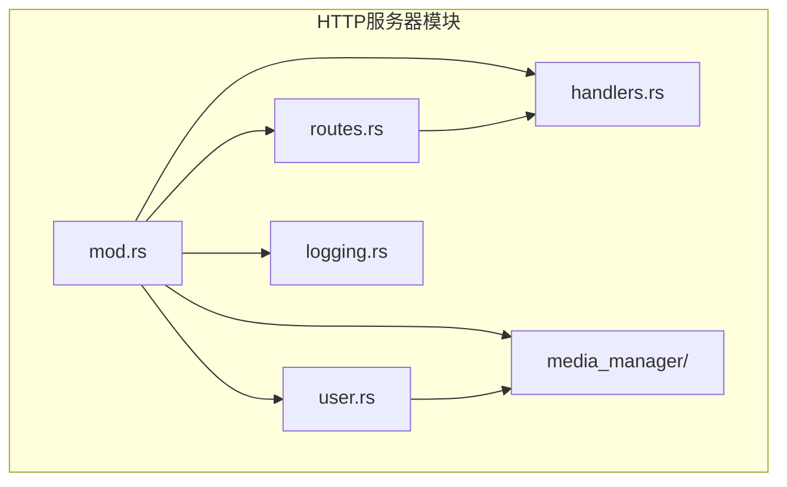
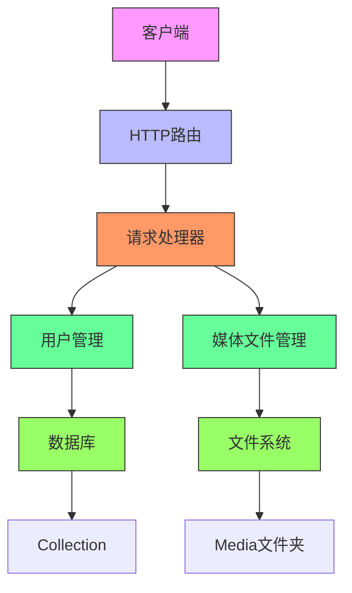
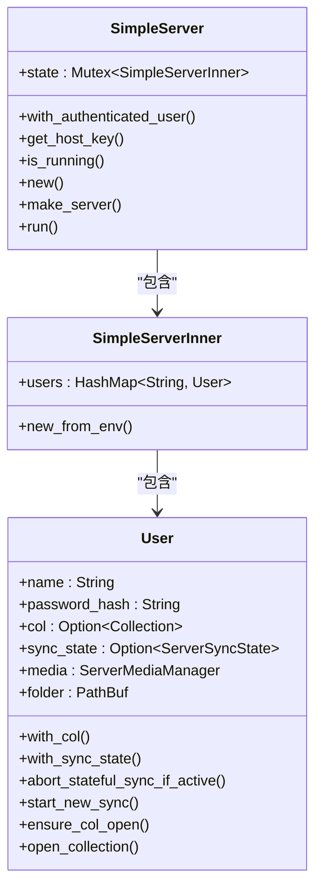
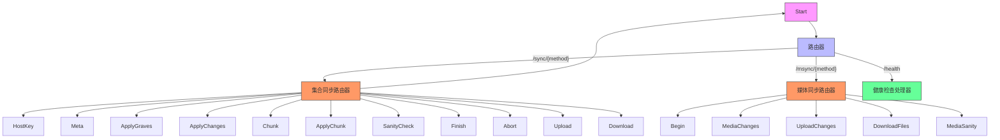
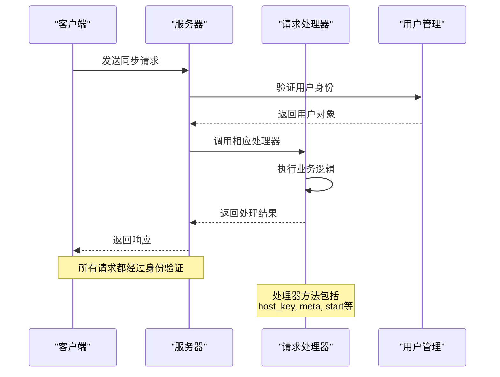
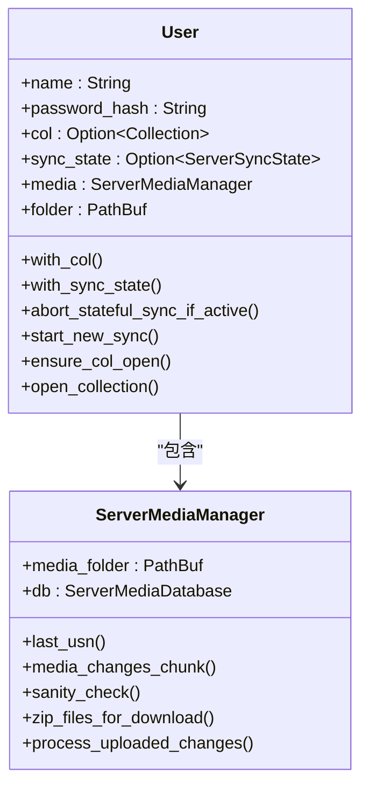
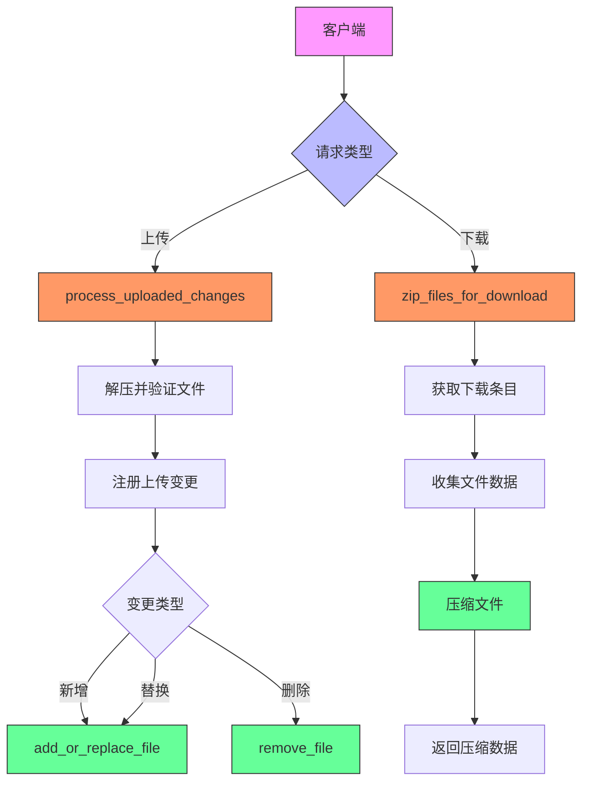
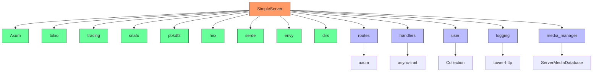

# HTTP服务器

<cite>
**本文档引用的文件**
- [mod.rs](file://rslib/src/sync/http_server/mod.rs)
- [routes.rs](file://rslib/src/sync/http_server/routes.rs)
- [handlers.rs](file://rslib/src/sync/http_server/handlers.rs)
- [user.rs](file://rslib/src/sync/http_server/user.rs)
- [logging.rs](file://rslib/src/sync/http_server/logging.rs)
- [media_manager/mod.rs](file://rslib/src/sync/http_server/media_manager/mod.rs)
- [media_manager/upload.rs](file://rslib/src/sync/http_server/media_manager/upload.rs)
- [media_manager/download.rs](file://rslib/src/sync/http_server/media_manager/download.rs)
- [sync/main.rs](file://rslib/sync/main.rs)
</cite>

## 目录
1. [简介](#简介)
2. [项目结构](#项目结构)
3. [核心组件](#核心组件)
4. [架构概述](#架构概述)
5. [详细组件分析](#详细组件分析)
6. [依赖分析](#依赖分析)
7. [性能考虑](#性能考虑)
8. [故障排除指南](#故障排除指南)
9. [结论](#结论)

## 简介
Anki同步HTTP服务器是Anki应用程序的核心组件，负责处理客户端与服务器之间的数据同步。该服务器实现了RESTful API端点，支持用户会话管理、媒体文件传输和状态查询等功能。服务器采用Rust语言编写，利用Axum框架构建高性能的异步HTTP服务。通过环境变量配置用户认证信息，服务器能够安全地处理来自不同客户端的同步请求。本文档将深入解析服务器的路由配置、请求处理程序、用户会话管理以及安全防护措施，为开发者提供全面的技术参考。

## 项目结构
Anki同步HTTP服务器的代码组织遵循清晰的模块化设计，主要功能分布在rslib/src/sync/http_server目录下。该目录包含处理HTTP请求的核心组件，包括路由配置、请求处理器、用户管理、日志记录和媒体文件管理等模块。每个模块都有明确的职责，通过合理的依赖关系协同工作，确保服务器的稳定性和可维护性。

**图源**
- [mod.rs](file://rslib/src/sync/http_server/mod.rs)
- [routes.rs](file://rslib/src/sync/http_server/routes.rs)

**本节来源**
- [mod.rs](file://rslib/src/sync/http_server/mod.rs)
- [routes.rs](file://rslib/src/sync/http_server/routes.rs)

## 核心组件
Anki同步HTTP服务器的核心组件包括SimpleServer、路由系统、请求处理器、用户管理和媒体文件管理。SimpleServer是服务器的主要入口点，负责初始化用户状态和启动HTTP服务。路由系统定义了服务器的API端点，将不同的HTTP请求映射到相应的处理程序。请求处理器实现了具体的业务逻辑，处理来自客户端的同步请求。用户管理模块负责用户认证和会话管理，确保每个请求都在正确的用户上下文中执行。媒体文件管理模块处理媒体文件的上传、下载和同步，保证多媒体内容的一致性。

**本节来源**
- [mod.rs](file://rslib/src/sync/http_server/mod.rs)
- [handlers.rs](file://rslib/src/sync/http_server/handlers.rs)
- [user.rs](file://rslib/src/sync/http_server/user.rs)

## 架构概述
Anki同步HTTP服务器采用分层架构设计，各层之间通过清晰的接口进行通信。最上层是HTTP路由层，负责接收和分发HTTP请求。中间是业务逻辑层，包含各种请求处理器，实现具体的同步功能。底层是数据访问层，负责与数据库和文件系统交互。这种分层设计使得代码结构清晰，便于维护和扩展。

**图源**
- [mod.rs](file://rslib/src/sync/http_server/mod.rs)
- [routes.rs](file://rslib/src/sync/http_server/routes.rs)
- [handlers.rs](file://rslib/src/sync/http_server/handlers.rs)

## 详细组件分析

### SimpleServer分析
SimpleServer是Anki同步HTTP服务器的核心类，负责管理服务器状态和处理HTTP请求。它通过内部的SimpleServerInner结构体维护用户信息，包括用户名、密码哈希、集合对象和媒体管理器等。服务器启动时，从环境变量中读取用户配置，创建相应的用户对象并初始化其工作目录。

**图源**
- [mod.rs](file://rslib/src/sync/http_server/mod.rs)
- [user.rs](file://rslib/src/sync/http_server/user.rs)

**本节来源**
- [mod.rs](file://rslib/src/sync/http_server/mod.rs)
- [user.rs](file://rslib/src/sync/http_server/user.rs)

### 路由系统分析
Anki同步HTTP服务器的路由系统基于Axum框架构建，提供了灵活的路由配置和中间件支持。服务器定义了两个主要的API前缀：/sync用于处理集合同步请求，/msync用于处理媒体文件同步请求。此外，还提供了一个/health端点用于健康检查。

**图源**
- [routes.rs](file://rslib/src/sync/http_server/routes.rs)

**本节来源**
- [routes.rs](file://rslib/src/sync/http_server/routes.rs)

### 请求处理器分析
请求处理器是Anki同步HTTP服务器的业务逻辑核心，负责处理各种同步请求。处理器通过实现SyncProtocol和MediaSyncProtocol trait来提供具体的同步功能。每个处理器方法都遵循相同的模式：首先验证用户身份，然后执行相应的业务逻辑，最后返回响应结果。

**图源**
- [handlers.rs](file://rslib/src/sync/http_server/handlers.rs)

**本节来源**
- [handlers.rs](file://rslib/src/sync/http_server/handlers.rs)

### 用户管理分析
用户管理模块负责处理用户认证、会话管理和集合访问控制。每个用户都有独立的工作目录，包含集合文件和媒体文件。模块提供了多种方法来确保操作的安全性和一致性，如with_col用于访问集合，with_sync_state用于管理同步状态。

**图源**
- [user.rs](file://rslib/src/sync/http_server/user.rs)
- [media_manager/mod.rs](file://rslib/src/sync/http_server/media_manager/mod.rs)

**本节来源**
- [user.rs](file://rslib/src/sync/http_server/user.rs)
- [media_manager/mod.rs](file://rslib/src/sync/http_server/media_manager/mod.rs)

### 媒体文件管理分析
媒体文件管理模块负责处理媒体文件的上传、下载和同步。它通过ServerMediaManager类提供统一的接口，内部使用ServerMediaDatabase管理媒体文件的元数据，确保文件操作的一致性和完整性。

**图源**
- [media_manager/upload.rs](file://rslib/src/sync/http_server/media_manager/upload.rs)
- [media_manager/download.rs](file://rslib/src/sync/http_server/media_manager/download.rs)

**本节来源**
- [media_manager/upload.rs](file://rslib/src/sync/http_server/media_manager/upload.rs)
- [media_manager/download.rs](file://rslib/src/sync/http_server/media_manager/download.rs)

## 依赖分析
Anki同步HTTP服务器依赖于多个外部库和内部模块，形成了复杂的依赖网络。服务器主要依赖Axum框架处理HTTP请求，tokio提供异步运行时支持，tracing用于日志记录和监控。内部模块之间通过清晰的接口进行通信，确保了代码的模块化和可测试性。

**图源**
- [mod.rs](file://rslib/src/sync/http_server/mod.rs)
- [Cargo.toml](file://rslib/Cargo.toml)

**本节来源**
- [mod.rs](file://rslib/src/sync/http_server/mod.rs)
- [Cargo.toml](file://rslib/Cargo.toml)

## 性能考虑
Anki同步HTTP服务器在设计时充分考虑了性能因素，采用了多种优化策略。服务器使用异步I/O模型，能够高效处理大量并发请求。通过连接复用和响应压缩，减少了网络传输开销。日志记录采用结构化日志，便于分析和监控。此外，服务器还实现了优雅的关闭机制，确保在关闭时能够完成正在进行的请求。

**本节来源**
- [mod.rs](file://rslib/src/sync/http_server/mod.rs)
- [logging.rs](file://rslib/src/sync/http_server/logging.rs)

## 故障排除指南
在使用Anki同步HTTP服务器时，可能会遇到各种问题。常见的问题包括请求队列积压、内存泄漏和DDoS攻击。为了解决这些问题，建议定期监控服务器性能指标，及时发现异常情况。对于请求队列积压，可以增加服务器资源或优化请求处理逻辑。对于内存泄漏，可以使用Rust的内存安全特性来避免常见错误。对于DDoS攻击，可以实施速率限制和IP黑名单等安全措施。

**本节来源**
- [mod.rs](file://rslib/src/sync/http_server/mod.rs)
- [handlers.rs](file://rslib/src/sync/http_server/handlers.rs)

## 结论
Anki同步HTTP服务器是一个功能强大、设计精良的同步服务，为Anki应用程序提供了可靠的后端支持。通过深入分析其架构和实现，我们可以更好地理解其工作原理，为开发和维护提供指导。服务器的模块化设计和清晰的接口使得代码易于理解和扩展。未来的工作可以集中在性能优化、安全增强和功能扩展上，以满足不断增长的用户需求。