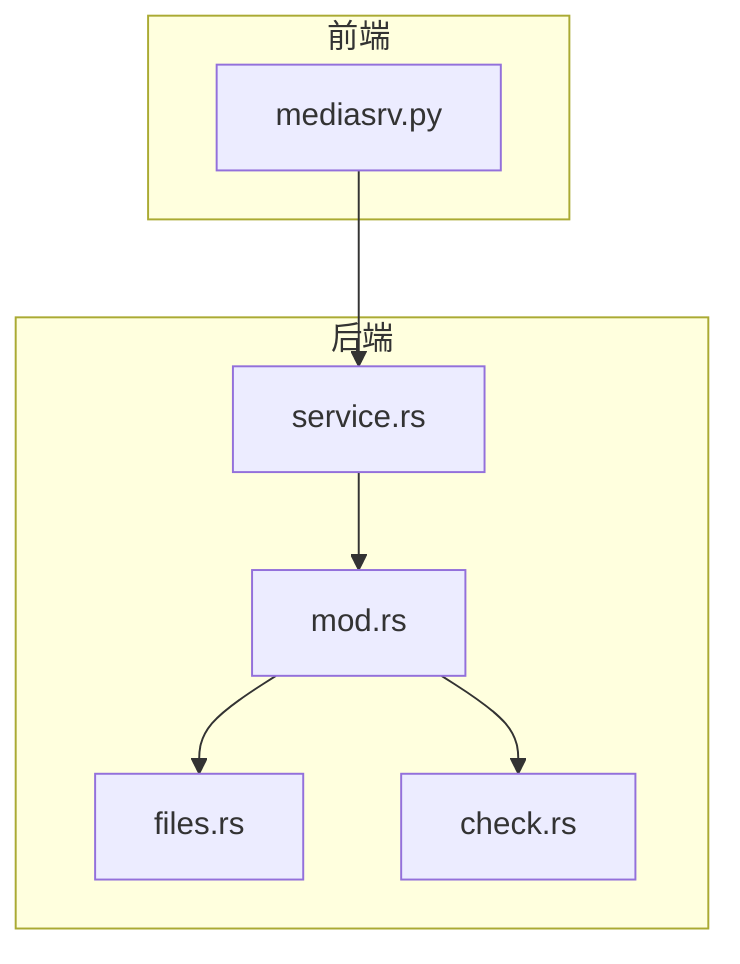
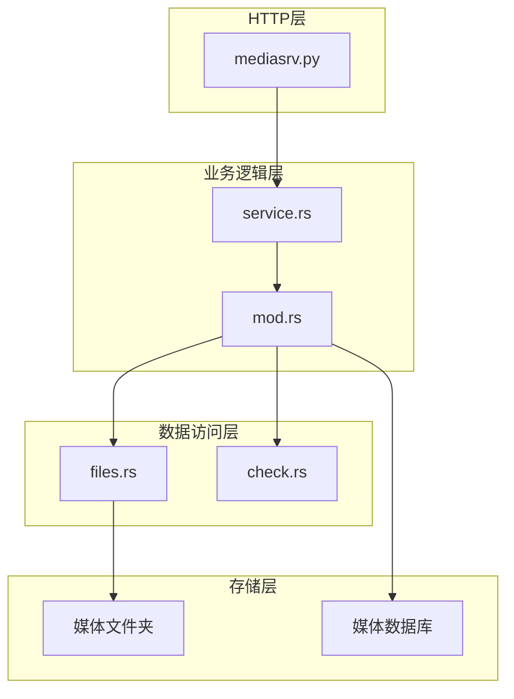
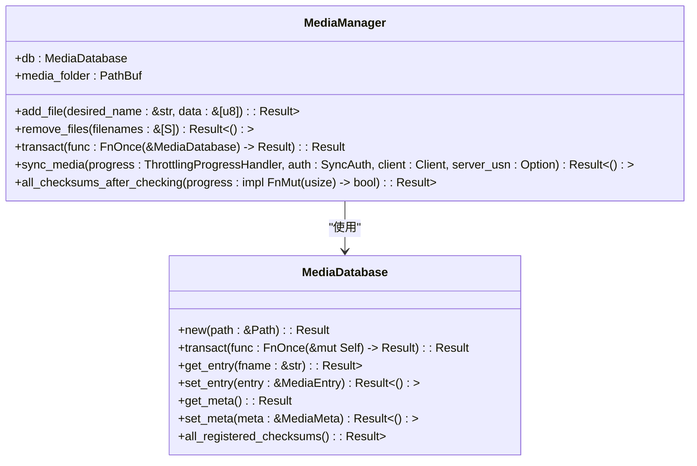
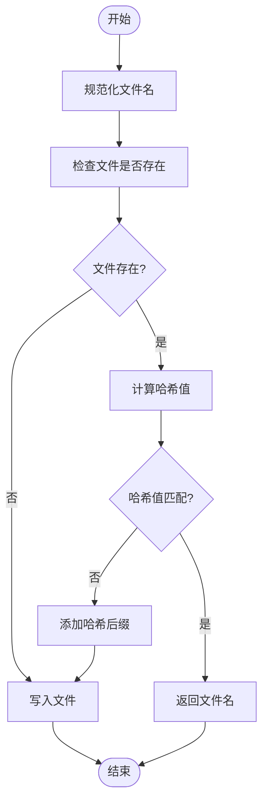
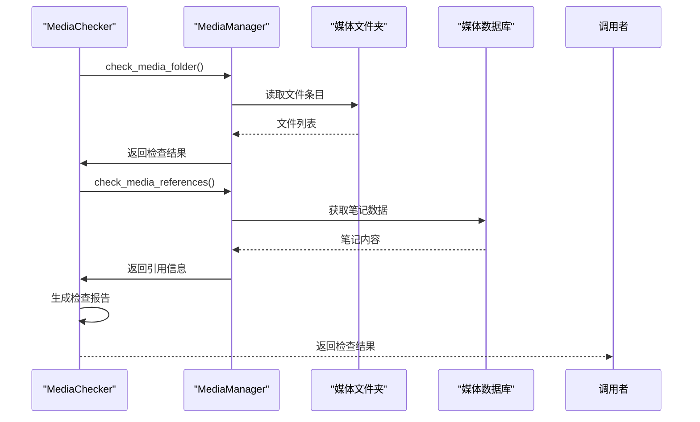
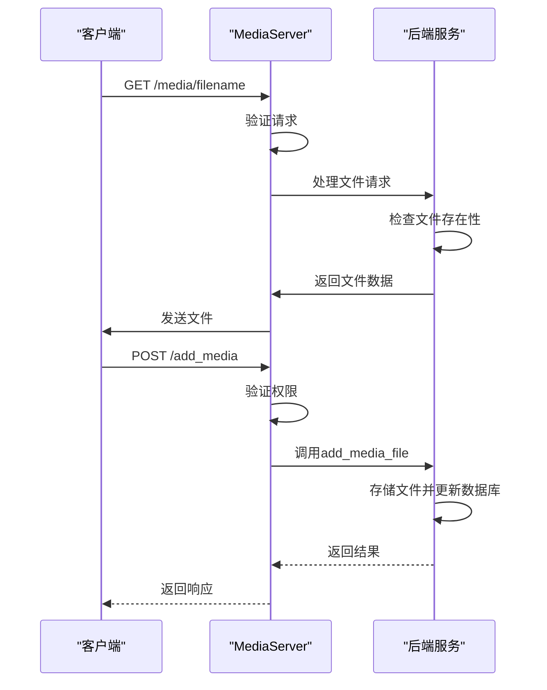
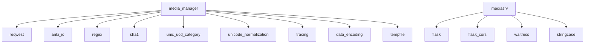

# 媒体文件传输

<cite>
**本文档中引用的文件**  
- [media.py](file://pylib/anki/media.py)
- [mediasrv.py](file://qt/aqt/mediasrv.py)
- [mod.rs](file://rslib/src/media/mod.rs)
- [files.rs](file://rslib/src/media/files.rs)
- [check.rs](file://rslib/src/media/check.rs)
- [service.rs](file://rslib/src/media/service.rs)
</cite>

## 目录
1. [简介](#简介)
2. [项目结构](#项目结构)
3. [核心组件](#核心组件)
4. [架构概述](#架构概述)
5. [详细组件分析](#详细组件分析)
6. [依赖分析](#依赖分析)
7. [性能考虑](#性能考虑)
8. [故障排除指南](#故障排除指南)
9. [结论](#结论)

## 简介
本文档深入分析Anki同步HTTP服务器中媒体文件传输功能的实现机制。重点解析`media_manager`模块中的媒体文件上传、下载、完整性校验、元数据管理及缓存策略。文档为初学者提供媒体同步流程的概念性解释，同时为高级开发者解析性能优化技巧。

## 项目结构
Anki的媒体文件传输功能分布在多个模块中，主要涉及Rust后端逻辑和Python前端服务。核心功能位于`rslib/src/media`目录下，而HTTP服务器实现位于`qt/aqt/mediasrv.py`。

**Diagram sources**
- [mediasrv.py](file://qt/aqt/mediasrv.py)
- [mod.rs](file://rslib/src/media/mod.rs)
- [files.rs](file://rslib/src/media/files.rs)
- [check.rs](file://rslib/src/media/check.rs)
- [service.rs](file://rslib/src/media/service.rs)

**Section sources**
- [mediasrv.py](file://qt/aqt/mediasrv.py)
- [mod.rs](file://rslib/src/media/mod.rs)

## 核心组件
媒体文件传输系统由多个核心组件构成，包括媒体管理器、文件操作模块、完整性检查器和HTTP服务器。这些组件协同工作，确保媒体文件的安全传输和完整性。

**Section sources**
- [mod.rs](file://rslib/src/media/mod.rs)
- [media.py](file://pylib/anki/media.py)

## 架构概述
Anki的媒体文件传输架构采用分层设计，将HTTP服务、业务逻辑和文件操作分离。Rust后端处理核心逻辑，Python前端提供HTTP接口。

**Diagram sources**
- [mediasrv.py](file://qt/aqt/mediasrv.py)
- [service.rs](file://rslib/src/media/service.rs)
- [mod.rs](file://rslib/src/media/mod.rs)
- [files.rs](file://rslib/src/media/files.rs)
- [check.rs](file://rslib/src/media/check.rs)

## 详细组件分析

### 媒体管理器分析
`MediaManager`是媒体文件传输的核心组件，负责管理媒体文件的生命周期。

**Diagram sources**
- [mod.rs](file://rslib/src/media/mod.rs)
- [files.rs](file://rslib/src/media/files.rs)

**Section sources**
- [mod.rs](file://rslib/src/media/mod.rs)

### 文件操作分析
文件操作模块负责媒体文件的底层读写、哈希计算和文件名规范化。

**Diagram sources**
- [files.rs](file://rslib/src/media/files.rs)

**Section sources**
- [files.rs](file://rslib/src/media/files.rs)

### 完整性检查分析
完整性检查器负责验证媒体文件的完整性和一致性，处理文件重命名和垃圾回收。

**Diagram sources**
- [check.rs](file://rslib/src/media/check.rs)

**Section sources**
- [check.rs](file://rslib/src/media/check.rs)

### HTTP服务器分析
HTTP服务器处理媒体文件的网络传输请求，提供RESTful接口。

**Diagram sources**
- [mediasrv.py](file://qt/aqt/mediasrv.py)

**Section sources**
- [mediasrv.py](file://qt/aqt/mediasrv.py)

## 依赖分析
媒体文件传输功能依赖于多个外部库和内部模块，形成复杂的依赖关系网络。

**Diagram sources**
- [mod.rs](file://rslib/src/media/mod.rs)
- [mediasrv.py](file://qt/aqt/mediasrv.py)

**Section sources**
- [mod.rs](file://rslib/src/media/mod.rs)
- [mediasrv.py](file://qt/aqt/mediasrv.py)

## 性能考虑
媒体文件传输系统在设计时考虑了多种性能优化策略，包括文件名规范化、哈希计算优化和并发处理。

### 文件名规范化
文件名规范化采用惰性计算和正则表达式预编译，提高处理效率。

### 哈希计算
使用SHA-1算法进行文件完整性校验，通过分块读取避免内存溢出。

### 并发处理
HTTP服务器使用多线程处理并发请求，确保高并发场景下的性能表现。

## 故障排除指南
本节提供常见问题的解决方案和调试技巧。

### 大文件传输超时
- 检查网络连接稳定性
- 调整HTTP服务器超时设置
- 使用分块传输协议

### 存储空间不足
- 清理媒体垃圾文件夹
- 检查并删除未使用的媒体文件
- 扩展存储空间

### 媒体文件损坏恢复
- 使用完整性检查功能
- 从备份恢复文件
- 重新同步媒体文件

**Section sources**
- [check.rs](file://rslib/src/media/check.rs)
- [mediasrv.py](file://qt/aqt/mediasrv.py)

## 结论
Anki的媒体文件传输系统采用分层架构设计，结合Rust后端的高性能和Python前端的灵活性，实现了可靠的媒体文件管理。系统通过哈希校验、文件名规范化和完整性检查等机制确保数据一致性，为用户提供稳定可靠的媒体同步体验。