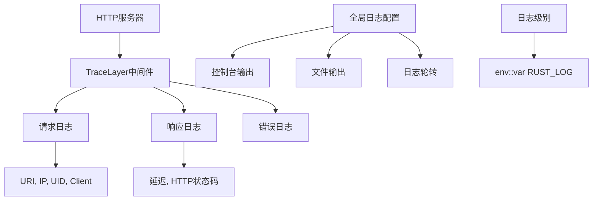
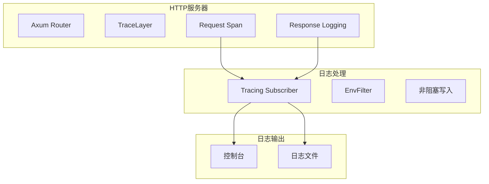
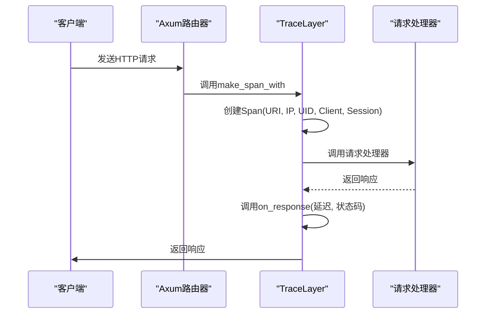
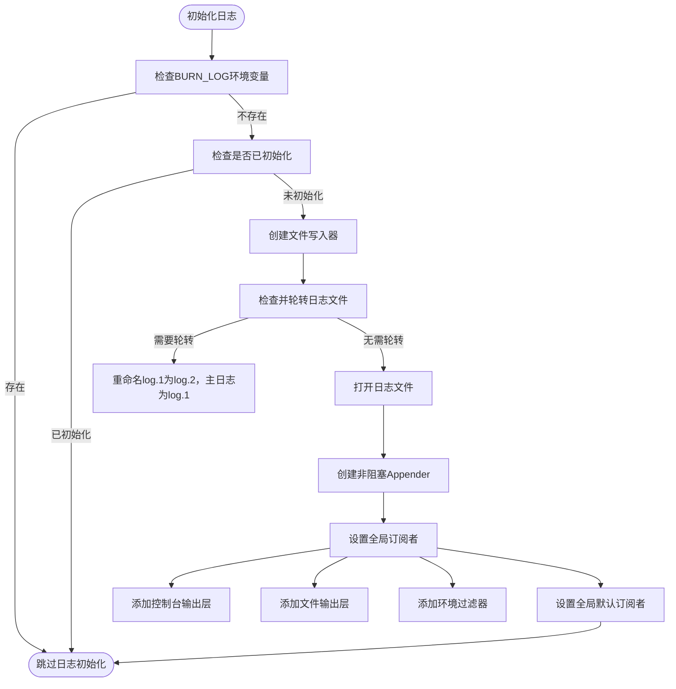
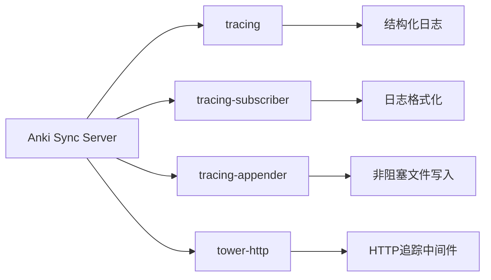

# 日志记录与监控

<cite>
**本文档中引用的文件**  
- [logging.rs](file://rslib/src/sync/http_server/logging.rs)
- [log.rs](file://rslib/src/log.rs)
- [mod.rs](file://rslib/src/sync/http_server/mod.rs)
- [handlers.rs](file://rslib/src/sync/http_server/handlers.rs)
- [user.rs](file://rslib/src/sync/http_server/user.rs)
- [main.rs](file://rslib/sync/main.rs)
</cite>

## 目录
1. [简介](#简介)
2. [项目结构](#项目结构)
3. [核心组件](#核心组件)
4. [架构概述](#架构概述)
5. [详细组件分析](#详细组件分析)
6. [依赖分析](#依赖分析)
7. [性能考虑](#性能考虑)
8. [故障排除指南](#故障排除指南)
9. [结论](#结论)

## 简介
本文档深入解析Anki同步HTTP服务器中的日志记录与监控系统。重点分析`logging.rs`中实现的结构化日志记录、请求追踪和性能监控机制。涵盖日志级别管理、敏感信息过滤、日志轮转策略，以及分布式追踪上下文传播、关键路径性能指标采集和异常行为检测。同时描述监控数据的收集、存储和告警机制，并为初学者和经验丰富的开发者提供相应的指导。

## 项目结构
Anki同步服务器的日志系统主要分布在`rslib/src/sync/http_server`目录下，核心日志功能由`logging.rs`实现，全局日志配置在`rslib/src/log.rs`中定义。系统采用Rust的`tracing`生态进行结构化日志记录，并通过`axum`框架的中间件集成到HTTP服务器中。

**Diagram sources**
- [logging.rs](file://rslib/src/sync/http_server/logging.rs#L1-L37)
- [log.rs](file://rslib/src/log.rs#L1-L84)

**Section sources**
- [logging.rs](file://rslib/src/sync/http_server/logging.rs#L1-L37)
- [log.rs](file://rslib/src/log.rs#L1-L84)

## 核心组件
日志系统的核心组件包括`with_logging_layer`函数，它为Axum路由器添加了`TraceLayer`中间件，实现了对HTTP请求的全面监控。该层负责创建包含请求上下文的`Span`，并在请求完成时记录响应时间和状态码。

**Section sources**
- [logging.rs](file://rslib/src/sync/http_server/logging.rs#L1-L37)

## 架构概述
Anki同步服务器的日志架构采用分层设计，底层使用`tracing`库进行结构化日志记录，中间层通过`tracing_subscriber`配置日志格式和输出目标，上层通过`axum`的`TraceLayer`将日志功能集成到HTTP处理流程中。

**Diagram sources**
- [logging.rs](file://rslib/src/sync/http_server/logging.rs#L1-L37)
- [log.rs](file://rslib/src/log.rs#L1-L84)

## 详细组件分析

### 日志记录组件分析
`logging.rs`中的`with_logging_layer`函数是日志系统的核心，它创建了一个`TraceLayer`实例，该实例在请求开始时创建一个包含关键信息的`Span`，并在请求结束时记录响应详情。

#### 对于API/服务组件：

**Diagram sources**
- [logging.rs](file://rslib/src/sync/http_server/logging.rs#L1-L37)

**Section sources**
- [logging.rs](file://rslib/src/sync/http_server/logging.rs#L1-L37)

### 全局日志配置分析
`log.rs`文件中的`set_global_logger`函数负责初始化全局日志订阅者，支持同时向控制台和文件输出日志，并实现了非阻塞写入和日志轮转功能。

#### 对于复杂逻辑组件：

**Diagram sources**
- [log.rs](file://rslib/src/log.rs#L1-L84)

**Section sources**
- [log.rs](file://rslib/src/log.rs#L1-L84)

## 依赖分析
日志系统依赖于多个Rust生态中的成熟库，包括`tracing`用于结构化日志记录，`tracing-subscriber`用于配置日志格式和输出，`tracing-appender`用于非阻塞文件写入，以及`axum`框架的`tower-http`中间件用于HTTP请求追踪。

**Diagram sources**
- [Cargo.toml](file://Cargo.toml)
- [logging.rs](file://rslib/src/sync/http_server/logging.rs#L1-L37)

**Section sources**
- [logging.rs](file://rslib/src/sync/http_server/logging.rs#L1-L37)
- [log.rs](file://rslib/src/log.rs#L1-L84)

## 性能考虑
日志系统通过非阻塞写入机制避免了I/O操作对服务器性能的影响。`tracing_appender::non_blocking`创建了一个后台线程来处理日志写入，确保主线程不会被阻塞。同时，日志轮转策略限制了单个日志文件的大小，防止日志文件无限增长。

## 故障排除指南
当遇到日志相关问题时，可以检查以下方面：
- 确认`RUST_LOG`环境变量是否正确设置
- 检查日志文件路径是否有写入权限
- 验证日志轮转是否按预期工作
- 确认非阻塞写入的`WorkerGuard`是否正确持有

**Section sources**
- [log.rs](file://rslib/src/log.rs#L1-L84)
- [main.rs](file://rslib/sync/main.rs#L1-L28)

## 结论
Anki同步HTTP服务器的日志系统设计精良，采用了现代Rust生态中的最佳实践。通过`tracing`库实现了结构化的、高性能的日志记录，结合`axum`框架的中间件提供了全面的请求追踪能力。系统不仅满足了基本的日志记录需求，还通过非阻塞写入和自动轮转等特性确保了在高负载下的稳定性和可靠性。