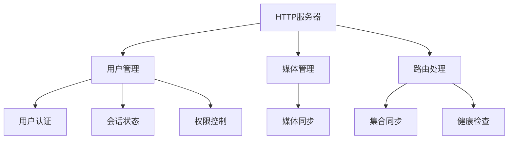
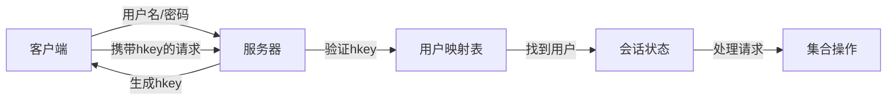
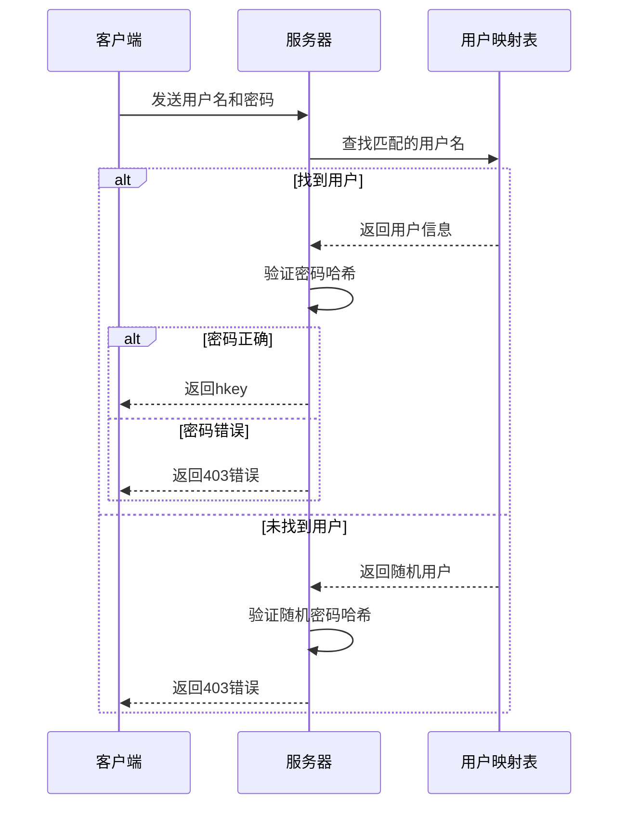
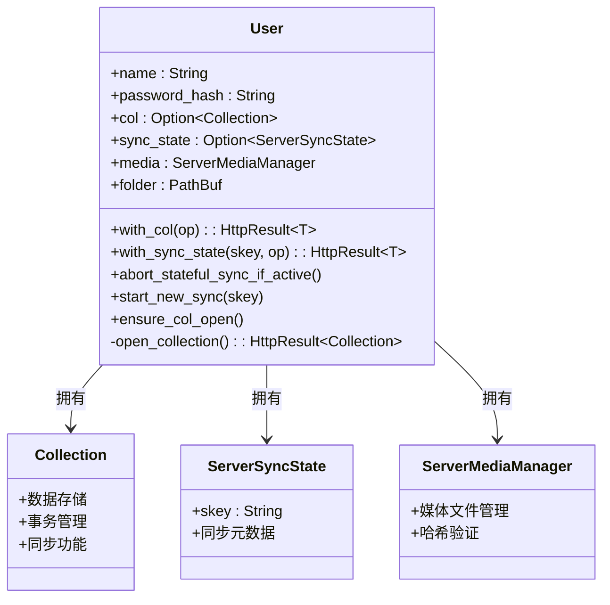
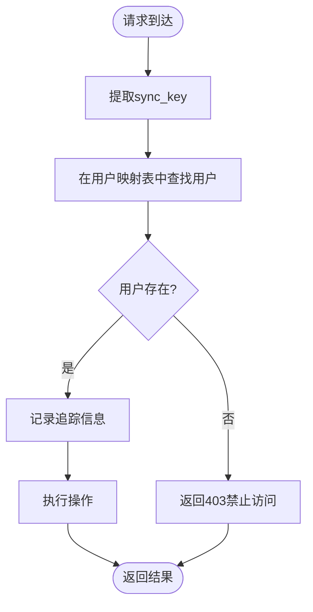

# 用户会话管理

<cite>
**本文档中引用的文件**  
- [user.rs](file://rslib/src/sync/http_server/user.rs)
- [mod.rs](file://rslib/src/sync/http_server/mod.rs)
- [login.rs](file://rslib/src/sync/login.rs)
</cite>

## 目录
1. [简介](#简介)
2. [项目结构](#项目结构)
3. [核心组件](#核心组件)
4. [架构概述](#架构概述)
5. [详细组件分析](#详细组件分析)
6. [依赖分析](#依赖分析)
7. [性能考虑](#性能考虑)
8. [故障排除指南](#故障排除指南)
9. [结论](#结论)

## 简介
本文档深入解析Anki同步HTTP服务器中的用户会话管理机制。重点分析基于令牌的身份验证流程、会话状态维护和权限控制策略。文档为初学者提供会话管理的概念性概述，同时为经验丰富的开发者深入解析分布式会话同步、负载均衡兼容性和安全审计日志。

## 项目结构
Anki同步服务器的会话管理功能主要集中在`rslib/src/sync/http_server`目录下，涉及用户认证、会话状态维护和权限控制的核心逻辑。

**Diagram sources**
- [mod.rs](file://rslib/src/sync/http_server/mod.rs#L1-L280)

**Section sources**
- [mod.rs](file://rslib/src/sync/http_server/mod.rs#L1-L280)

## 核心组件
用户会话管理的核心组件包括`User`结构体、`SimpleServer`结构体和相关的认证机制。这些组件共同实现了基于令牌的身份验证、会话状态维护和权限控制。

**Section sources**
- [user.rs](file://rslib/src/sync/http_server/user.rs#L1-L95)
- [mod.rs](file://rslib/src/sync/http_server/mod.rs#L1-L280)

## 架构概述
Anki同步服务器采用基于令牌的认证机制，通过`hkey`（主机密钥）来标识和验证用户身份。服务器维护一个用户映射表，将`hkey`与对应的用户会话状态关联起来。

**Diagram sources**
- [mod.rs](file://rslib/src/sync/http_server/mod.rs#L1-L280)
- [user.rs](file://rslib/src/sync/http_server/user.rs#L1-L95)

## 详细组件分析

### 用户认证分析
用户认证流程通过`get_host_key`方法实现，采用安全的密码验证机制来防止时序攻击。

**Diagram sources**
- [mod.rs](file://rslib/src/sync/http_server/mod.rs#L1-L280)

**Section sources**
- [mod.rs](file://rslib/src/sync/http_server/mod.rs#L1-L280)

### 会话状态维护分析
`User`结构体负责维护用户的会话状态，包括集合访问、同步状态和媒体管理。

**Diagram sources**
- [user.rs](file://rslib/src/sync/http_server/user.rs#L1-L95)

**Section sources**
- [user.rs](file://rslib/src/sync/http_server/user.rs#L1-L95)

### 权限控制分析
权限控制通过`with_authenticated_user`方法实现，确保只有经过认证的用户才能访问特定资源。

**Diagram sources**
- [mod.rs](file://rslib/src/sync/http_server/mod.rs#L1-L280)

**Section sources**
- [mod.rs](file://rslib/src/sync/http_server/mod.rs#L1-L280)

## 依赖分析
用户会话管理组件依赖于多个外部