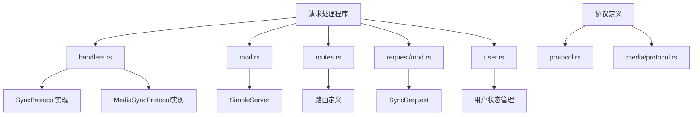
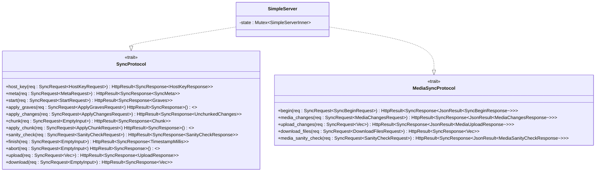
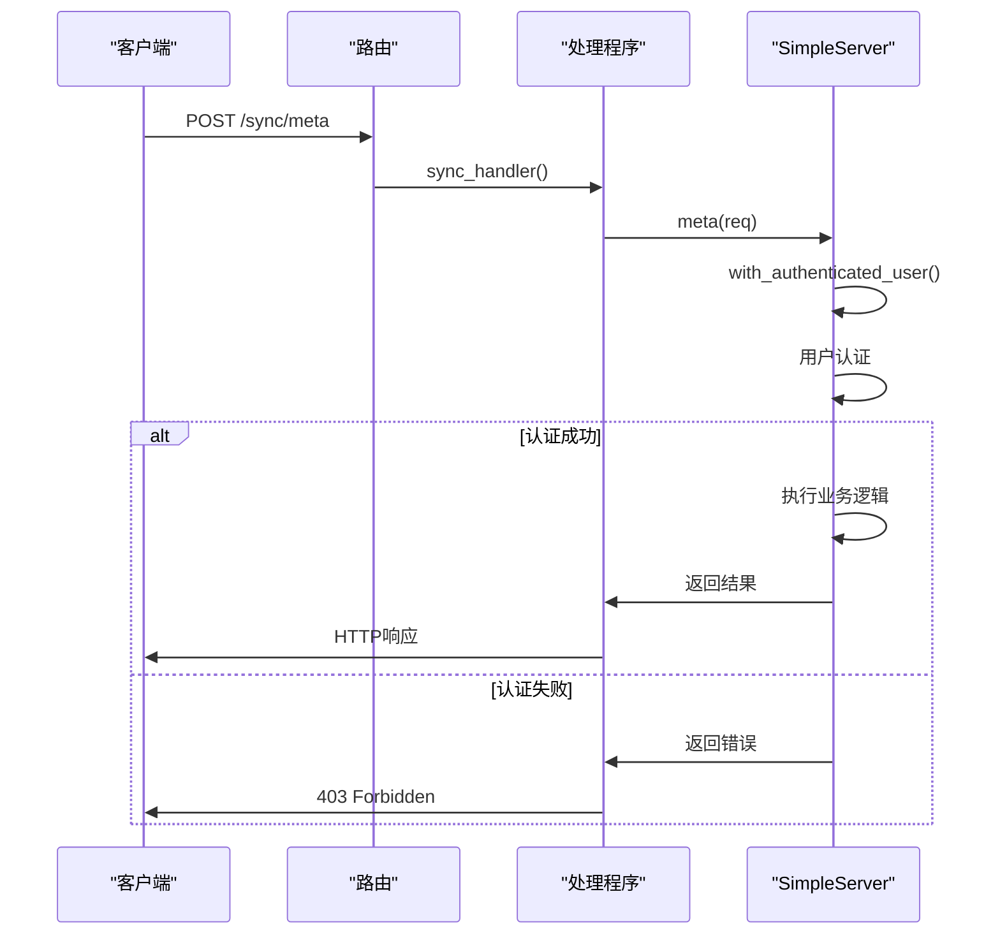
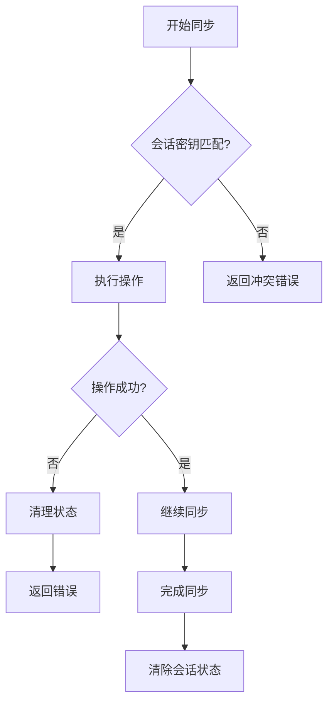
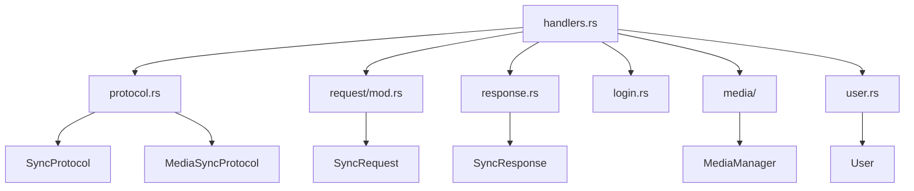

# 请求处理程序

<cite>
**本文档中引用的文件**  
- [handlers.rs](file://rslib/src/sync/http_server/handlers.rs)
- [mod.rs](file://rslib/src/sync/http_server/mod.rs)
- [routes.rs](file://rslib/src/sync/http_server/routes.rs)
- [request/mod.rs](file://rslib/src/sync/request/mod.rs)
- [user.rs](file://rslib/src/sync/http_server/user.rs)
- [protocol.rs](file://rslib/src/sync/collection/protocol.rs)
- [media/protocol.rs](file://rslib/src/sync/media/protocol.rs)
</cite>

## 目录
1. [简介](#简介)
2. [项目结构](#项目结构)
3. [核心组件](#核心组件)
4. [架构概述](#架构概述)
5. [详细组件分析](#详细组件分析)
6. [依赖分析](#依赖分析)
7. [性能考虑](#性能考虑)
8. [故障排除指南](#故障排除指南)
9. [结论](#结论)

## 简介
Anki同步HTTP服务器的请求处理程序实现了完整的同步协议，处理来自客户端的请求并返回相应的响应。该系统支持两种主要的同步协议：用于集合数据同步的`SyncProtocol`和用于媒体文件同步的`MediaSyncProtocol`。处理程序通过异步Rust实现，确保高并发场景下的性能和可扩展性。

## 项目结构
Anki同步服务器的请求处理逻辑主要分布在`rslib/src/sync/http_server`目录下，与其他同步相关组件协同工作。核心文件包括处理程序实现、路由定义和服务器配置。



**图源**
- [handlers.rs](file://rslib/src/sync/http_server/handlers.rs)
- [mod.rs](file://rslib/src/sync/http_server/mod.rs)
- [routes.rs](file://rslib/src/sync/http_server/routes.rs)
- [request/mod.rs](file://rslib/src/sync/request/mod.rs)
- [user.rs](file://rslib/src/sync/http_server/user.rs)
- [protocol.rs](file://rslib/src/sync/collection/protocol.rs)
- [media/protocol.rs](file://rslib/src/sync/media/protocol.rs)

**节源**
- [handlers.rs](file://rslib/src/sync/http_server/handlers.rs)
- [mod.rs](file://rslib/src/sync/http_server/mod.rs)
- [routes.rs](file://rslib/src/sync/http_server/routes.rs)

## 核心组件
请求处理程序的核心是`SimpleServer`结构体，它实现了`SyncProtocol`和`MediaSyncProtocol`两个异步特征。这些特征定义了同步过程中所有必要的方法，包括握手、数据上传下载和会话状态维护。

**节源**
- [handlers.rs](file://rslib/src/sync/http_server/handlers.rs)
- [mod.rs](file://rslib/src/sync/http_server/mod.rs)

## 架构概述
Anki同步服务器采用基于Axum框架的异步HTTP服务器架构，通过清晰的路由和协议分离实现可维护的代码结构。服务器处理两种类型的同步：集合数据同步和媒体文件同步，分别通过`/sync`和`/msync`端点处理。

```mermaid
graph TD
A[HTTP客户端] --> B[/sync/*]
A --> C[/msync/*]
A --> D[/health]
B --> E[SyncProtocol]
C --> F[MediaSyncProtocol]
E --> G[handlers.rs]
F --> G
G --> H[SimpleServer]
H --> I[用户认证]
H --> J[会话状态]
H --> K[集合操作]
H --> L[媒体操作]
I --> M[host_key]
J --> N[start/finish]
K --> O[上传/下载]
L --> P[媒体变更]
```

**图源**
- [handlers.rs](file://rslib/src/sync/http_server/handlers.rs)
- [mod.rs](file://rslib/src/sync/http_server/mod.rs)
- [routes.rs](file://rslib/src/sync/http_server/routes.rs)

## 详细组件分析

### 同步协议处理
`SyncProtocol`特征定义了集合数据同步的所有方法，包括元数据查询、变更应用、数据块处理和完整性检查。每个方法都以`SyncRequest<T>`作为输入，返回`HttpResult<SyncResponse<O>>`。



**图源**
- [handlers.rs](file://rslib/src/sync/http_server/handlers.rs)
- [protocol.rs](file://rslib/src/sync/collection/protocol.rs)
- [media/protocol.rs](file://rslib/src/sync/media/protocol.rs)

**节源**
- [handlers.rs](file://rslib/src/sync/http_server/handlers.rs)
- [protocol.rs](file://rslib/src/sync/collection/protocol.rs)

### 请求处理流程
请求处理流程从路由开始，通过`sync_handler`函数将HTTP请求分发到相应的协议方法。处理程序首先验证用户身份，然后执行具体的业务逻辑。



**图源**
- [handlers.rs](file://rslib/src/sync/http_server/handlers.rs)
- [routes.rs](file://rslib/src/sync/http_server/routes.rs)
- [mod.rs](file://rslib/src/sync/http_server/mod.rs)

**节源**
- [handlers.rs](file://rslib/src/sync/http_server/handlers.rs)
- [routes.rs](file://rslib/src/sync/http_server/routes.rs)

### 会话状态管理
会话状态管理是同步过程中的关键部分，确保同一用户在同一时间只能进行一个同步会话。`User`结构体维护了当前的同步状态，包括会话密钥和同步状态。



**图源**
- [handlers.rs](file://rslib/src/sync/http_server/handlers.rs)
- [user.rs](file://rslib/src/sync/http_server/user.rs)

**节源**
- [handlers.rs](file://rslib/src/sync/http_server/handlers.rs)
- [user.rs](file://rslib/src/sync/http_server/user.rs)

## 依赖分析
请求处理程序依赖于多个核心组件，包括同步协议定义、请求/响应结构、用户认证和媒体管理。这些组件通过清晰的接口分离，确保了代码的可测试性和可维护性。



**图源**
- [handlers.rs](file://rslib/src/sync/http_server/handlers.rs)
- [protocol.rs](file://rslib/src/sync/collection/protocol.rs)
- [request/mod.rs](file://rslib/src/sync/request/mod.rs)
- [user.rs](file://rslib/src/sync/http_server/user.rs)

**节源**
- [handlers.rs](file://rslib/src/sync/http_server/handlers.rs)
- [protocol.rs](file://rslib/src/sync/collection/protocol.rs)
- [request/mod.rs](file://rslib/src/sync/request/mod.rs)

## 性能考虑
请求处理程序通过异步Rust实现，充分利用了Tokio运行时的并发能力。服务器使用Arc包装的SimpleServer实例，允许多个任务共享同一服务器状态，同时通过Mutex确保线程安全。

对于大文件传输，系统实现了零拷贝传输优化，通过直接流式处理数据而不是在内存中缓冲整个文件来减少内存使用。此外，请求大小限制（MAXIMUM_SYNC_PAYLOAD_BYTES）防止了潜在的内存耗尽攻击。

## 故障排除指南
常见问题包括请求队列阻塞、内存泄漏和异常连接中断。对于请求队列阻塞，应检查会话状态是否正确清理，特别是在同步异常终止时。内存泄漏通常与未正确关闭资源相关，应确保所有数据库连接和文件句柄在使用后正确关闭。

异常连接中断处理通过`with_authenticated_user`方法中的错误处理机制实现，当同步操作失败时，会自动清理用户状态，防止后续请求因状态不一致而失败。

**节源**
- [handlers.rs](file://rslib/src/sync/http_server/handlers.rs)
- [user.rs](file://rslib/src/sync/http_server/user.rs)

## 结论
Anki同步HTTP服务器的请求处理程序是一个设计良好的异步系统，通过清晰的协议分离和状态管理实现了可靠的同步功能。其模块化设计使得扩展和维护变得容易，而异步实现确保了在高并发场景下的性能。通过遵循Rust的所有权和生命周期原则，系统在保证安全性的同时实现了高性能。