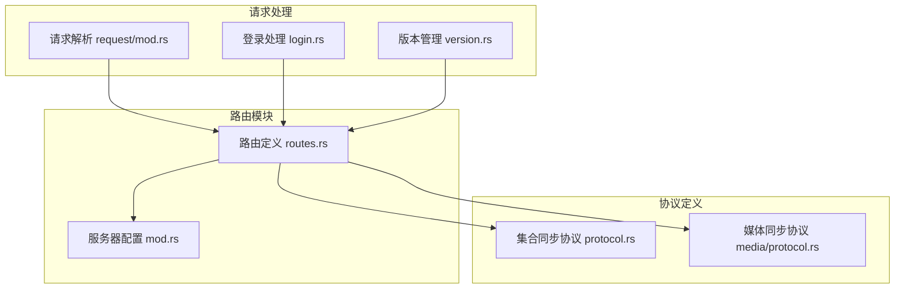
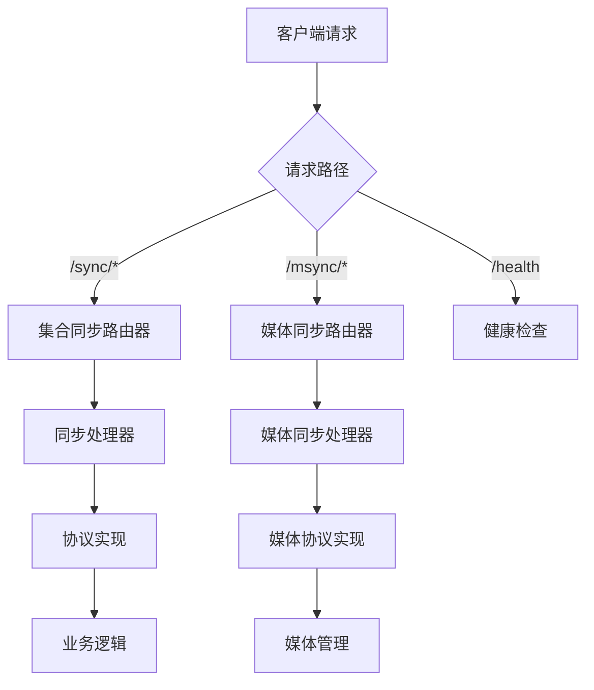
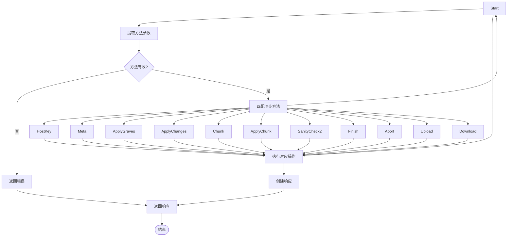
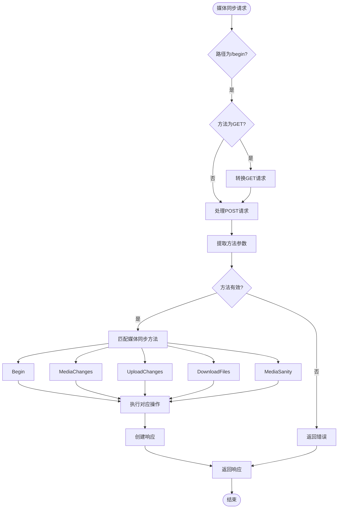
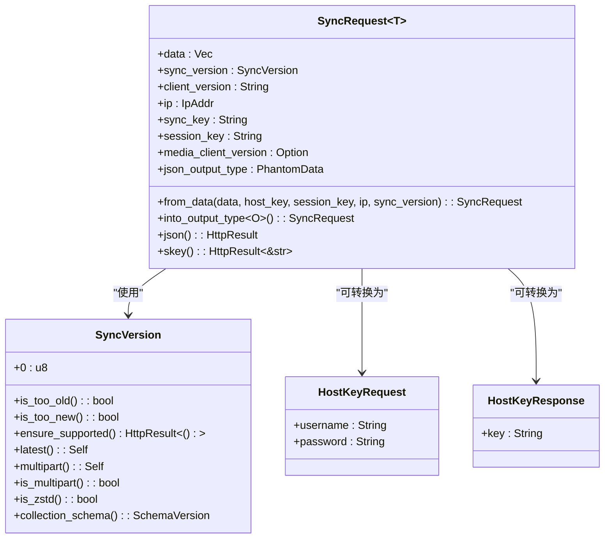
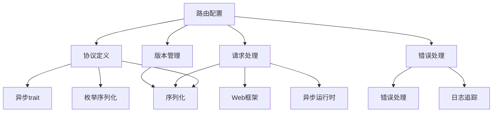

# 路由配置

<cite>
**本文档中引用的文件**   
- [routes.rs](file://rslib/src/sync/http_server/routes.rs)
- [protocol.rs](file://rslib/src/sync/collection/protocol.rs)
- [media/protocol.rs](file://rslib/src/sync/media/protocol.rs)
- [mod.rs](file://rslib/src/sync/http_server/mod.rs)
- [login.rs](file://rslib/src/sync/login.rs)
- [request/mod.rs](file://rslib/src/sync/request/mod.rs)
- [version.rs](file://rslib/src/sync/version.rs)
</cite>

## 目录
1. [简介](#简介)
2. [项目结构](#项目结构)
3. [核心组件](#核心组件)
4. [架构概述](#架构概述)
5. [详细组件分析](#详细组件分析)
6. [依赖分析](#依赖分析)
7. [性能考虑](#性能考虑)
8. [故障排除指南](#故障排除指南)
9. [结论](#结论)

## 简介
Anki同步HTTP服务器的路由配置实现了高效、安全的API端点注册机制，支持同步会话管理、媒体文件传输和状态查询等核心功能。该系统基于Axum框架构建，采用Rust宏和模式匹配实现URL分发，通过类型安全的路由定义确保了代码的可维护性和可靠性。路由系统分为集合同步和媒体同步两大模块，分别处理数据库同步和媒体文件同步请求。

## 项目结构
Anki同步服务器的路由配置主要位于`rslib/src/sync/http_server/`目录下，采用模块化设计，将路由定义、请求处理和协议定义分离。核心路由文件`routes.rs`定义了API端点的注册机制，而`mod.rs`文件负责服务器的整体配置和启动。

**图示来源**
- [routes.rs](file://rslib/src/sync/http_server/routes.rs)
- [mod.rs](file://rslib/src/sync/http_server/mod.rs)
- [protocol.rs](file://rslib/src/sync/collection/protocol.rs)

**本节来源**
- [routes.rs](file://rslib/src/sync/http_server/routes.rs)
- [mod.rs](file://rslib/src/sync/http_server/mod.rs)

## 核心组件
路由配置的核心组件包括集合同步路由器和媒体同步路由器，它们分别处理不同类型的同步请求。集合同步路由器负责处理数据库同步相关的API端点，而媒体同步路由器则专注于媒体文件的传输和管理。两个路由器都采用泛型设计，允许传入不同的协议实现，提高了代码的复用性和灵活性。

**本节来源**
- [routes.rs](file://rslib/src/sync/http_server/routes.rs)
- [protocol.rs](file://rslib/src/sync/collection/protocol.rs)
- [media/protocol.rs](file://rslib/src/sync/media/protocol.rs)

## 架构概述
Anki同步服务器的路由架构采用分层设计，将HTTP请求处理、路由分发和业务逻辑分离。服务器启动时，通过`SimpleServer::make_server`方法创建Axum路由器，将集合同步和媒体同步路由器分别挂载到`/sync`和`/msync`路径下。这种设计实现了关注点分离，使得路由配置和业务逻辑可以独立演进。

**图示来源**
- [mod.rs](file://rslib/src/sync/http_server/mod.rs)
- [routes.rs](file://rslib/src/sync/http_server/routes.rs)

## 详细组件分析

### 集合同步路由分析
集合同步路由处理数据库同步相关的所有API端点，包括会话管理、数据同步和状态查询。路由通过`collection_sync_router`函数创建，使用Axum的`Router::new().route()`方法注册动态路由`/{method}`，将所有POST请求转发到`sync_handler`处理器。

#### 集合同步处理器

**图示来源**
- [routes.rs](file://rslib/src/sync/http_server/routes.rs#L33-L56)
- [protocol.rs](file://rslib/src/sync/collection/protocol.rs#L59-L91)

### 媒体同步路由分析
媒体同步路由专门处理媒体文件的同步请求，支持GET和POST两种请求方法。与集合同步不同，媒体同步路由器需要处理旧版客户端的兼容性问题，因此提供了`media_begin_get`和`media_begin_post`两个处理器来处理`/begin`端点。

#### 媒体同步处理器

**图示来源**
- [routes.rs](file://rslib/src/sync/http_server/routes.rs#L70-L115)
- [media/protocol.rs](file://rslib/src/sync/media/protocol.rs#L42-L100)

### 请求处理机制
路由系统通过泛型和trait约束实现了类型安全的请求处理。`SyncRequest`结构体封装了请求数据、认证信息和版本控制，确保了请求处理的一致性和安全性。

**图示来源**
- [request/mod.rs](file://rslib/src/sync/request/mod.rs#L32-L74)
- [version.rs](file://rslib/src/sync/version.rs#L30-L79)
- [login.rs](file://rslib/src/sync/login.rs#L0-L60)

**本节来源**
- [routes.rs](file://rslib/src/sync/http_server/routes.rs)
- [request/mod.rs](file://rslib/src/sync/request/mod.rs)
- [version.rs](file://rslib/src/sync/version.rs)

## 依赖分析
路由系统依赖于多个核心模块，包括协议定义、请求处理和错误处理。这些模块通过清晰的接口定义实现了松耦合，使得各个组件可以独立开发和测试。

**图示来源**
- [routes.rs](file://rslib/src/sync/http_server/routes.rs)
- [protocol.rs](file://rslib/src/sync/collection/protocol.rs)
- [request/mod.rs](file://rslib/src/sync/request/mod.rs)

**本节来源**
- [routes.rs](file://rslib/src/sync/http_server/routes.rs)
- [protocol.rs](file://rslib/src/sync/collection/protocol.rs)
- [request/mod.rs](file://rslib/src/sync/request/mod.rs)

## 性能考虑
路由系统在设计时充分考虑了性能优化，采用了多种技术来提高请求处理效率。通过使用Axum框架的高效路由匹配算法，系统能够快速定位到正确的处理函数。同时，请求体大小限制和Zstd压缩确保了网络传输的效率。

对于同步会话管理，系统采用了基于host key的认证机制，避免了频繁的密码验证操作。媒体文件传输则通过分块处理和增量同步，减少了不必要的数据传输。版本管理机制允许客户端和服务器协商使用最优的通信协议，进一步提升了性能。

## 故障排除指南
常见的路由问题包括路径冲突、认证失败和版本不兼容。当遇到404错误时，应检查请求路径是否正确，特别是`/sync`和`/msync`前缀是否缺失。认证失败通常由无效的host key或session key引起，需要检查登录流程是否正确执行。

版本不兼容问题可以通过检查`SyncVersion`来诊断。服务器会验证客户端提供的版本号，如果版本过旧或过新，会返回相应的错误信息。媒体同步特有的问题是GET和POST请求的兼容性，旧版客户端可能使用GET请求发送`/begin`，需要确保`media_begin_get`处理器正确处理这种情况。

**本节来源**
- [routes.rs](file://rslib/src/sync/http_server/routes.rs)
- [login.rs](file://rslib/src/sync/login.rs)
- [version.rs](file://rslib/src/sync/version.rs)

## 结论
Anki同步HTTP服务器的路由配置展示了Rust语言在构建高性能、类型安全的Web服务方面的优势。通过Axum框架和Rust宏的结合，系统实现了简洁而强大的路由机制。泛型设计和trait约束确保了代码的可扩展性和可维护性，而详细的错误处理和版本管理机制则保证了系统的稳定性和兼容性。

该路由系统不仅满足了当前的功能需求，还为未来的扩展留下了充足的空间。通过清晰的模块划分和接口定义，新的同步功能可以很容易地集成到现有系统中，而不会影响现有的代码结构。