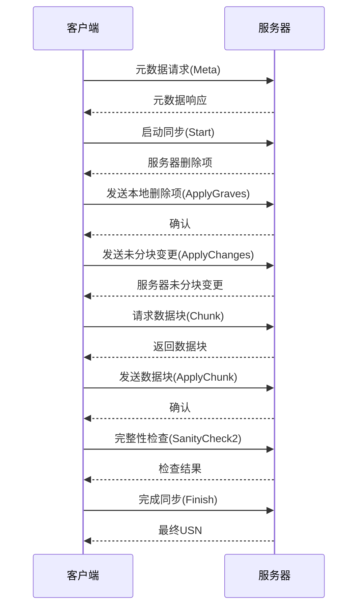
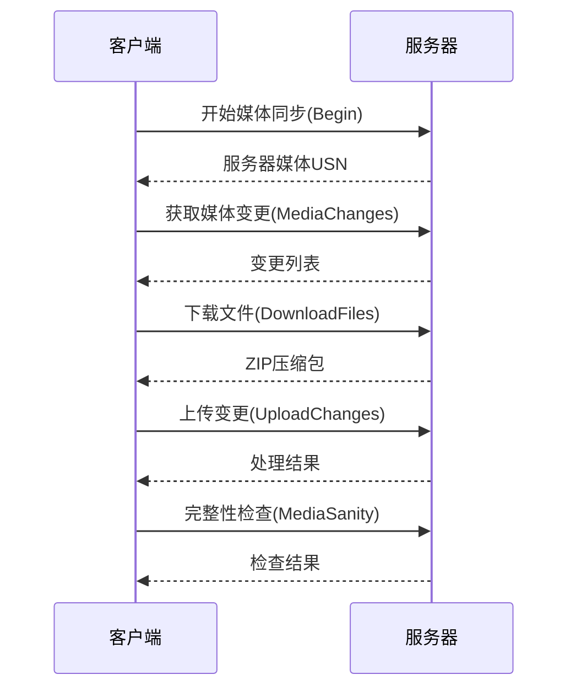
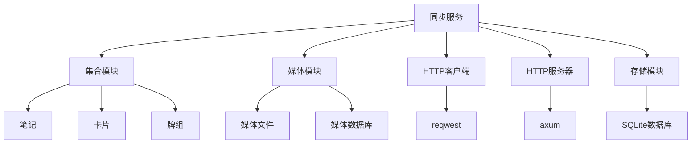

# 同步服务

<cite>
**本文档中引用的文件**  
- [mod.rs](file://rslib/src/sync/mod.rs)
- [collection/mod.rs](file://rslib/src/sync/collection/mod.rs)
- [media/mod.rs](file://rslib/src/sync/media/mod.rs)
- [http_client/mod.rs](file://rslib/src/sync/http_client/mod.rs)
- [http_server/mod.rs](file://rslib/src/sync/http_server/mod.rs)
- [collection/protocol.rs](file://rslib/src/sync/collection/protocol.rs)
- [media/protocol.rs](file://rslib/src/sync/media/protocol.rs)
- [collection/start.rs](file://rslib/src/sync/collection/start.rs)
- [collection/changes.rs](file://rslib/src/sync/collection/changes.rs)
- [collection/chunks.rs](file://rslib/src/sync/collection/chunks.rs)
- [collection/normal.rs](file://rslib/src/sync/collection/normal.rs)
- [collection/status.rs](file://rslib/src/sync/collection/status.rs)
- [collection/meta.rs](file://rslib/src/sync/collection/meta.rs)
- [media/syncer.rs](file://rslib/src/sync/media/syncer.rs)
</cite>

## 目录
1. [简介](#简介)
2. [同步会话生命周期](#同步会话生命周期)
3. [增量同步协议](#增量同步协议)
4. [冲突解决策略](#冲突解决策略)
5. [媒体文件同步](#媒体文件同步)
6. [变更检测算法](#变更检测算法)
7. [数据压缩技术](#数据压缩技术)
8. [同步服务依赖关系](#同步服务依赖关系)
9. [常见问题与解决方案](#常见问题与解决方案)
10. [安全考虑与最佳实践](#安全考虑与最佳实践)

## 简介
Anki同步服务实现了本地集合与云端之间的双向数据同步。该服务采用增量同步协议，仅传输发生变化的数据，从而优化网络带宽使用。同步过程分为多个阶段，包括元数据检查、删除处理、未分块变更同步和分块数据同步。系统通过USN（更新序列号）和时间戳机制来检测变更并解决冲突。媒体文件通过独立的同步通道进行处理，确保大文件不会阻塞主数据同步。整个同步过程在事务保护下进行，确保数据一致性。

## 同步会话生命周期
Anki同步会话的生命周期始于客户端向服务器发起元数据请求，以确定是否需要同步以及同步类型。如果需要同步，客户端将进入正常同步流程，该流程包括四个主要阶段：启动阶段处理删除项，未分块变更阶段同步笔记类型、牌组和标签等元数据，分块数据阶段同步大量的笔记、卡片和复习记录，最后是完整性检查和最终化阶段。每个阶段都通过特定的HTTP端点进行通信，会话状态通过会话密钥和USN进行跟踪。同步完成后，客户端更新本地状态以反映新的同步点。

**Section sources**
- [collection/normal.rs](file://rslib/src/sync/collection/normal.rs#L1-L178)
- [collection/status.rs](file://rslib/src/sync/collection/status.rs#L1-L57)
- [collection/meta.rs](file://rslib/src/sync/collection/meta.rs#L1-L185)

## 增量同步协议
Anki的增量同步协议基于USN（更新序列号）机制，仅同步自上次同步以来发生变化的数据。协议将同步过程分解为多个小的HTTP请求，避免单个大型请求可能带来的问题。同步开始时，客户端和服务器交换元数据，比较修改时间戳和模式时间戳以确定同步策略。数据同步分为未分块变更和分块数据两种类型：未分块变更包括笔记类型、牌组配置和标签等小量数据，而分块数据包括笔记、卡片和复习记录等大量数据，后者被分割成250条记录的块进行传输。这种设计确保了即使在网络不稳定的情况下，同步也能逐步完成。

**Diagram sources**
- [collection/protocol.rs](file://rslib/src/sync/collection/protocol.rs#L1-L112)
- [collection/start.rs](file://rslib/src/sync/collection/start.rs#L1-L185)
- [collection/changes.rs](file://rslib/src/sync/collection/changes.rs#L1-L325)

## 冲突解决策略
Anki采用最后写入获胜（Last Write Wins）的冲突解决策略，通过比较时间戳来确定哪个版本是最新的。当客户端和服务器都有自上次同步以来的变更时，系统会比较两者的修改时间戳，时间戳较新的版本将覆盖较旧的版本。对于笔记和卡片等具体数据项，系统在合并时会检查每个对象的修改时间，只有当远程对象的修改时间晚于或等于本地对象的修改时间时才会应用更新。这种策略确保了数据的一致性，同时避免了复杂的合并逻辑。在极少数情况下，如果检测到无法自动解决的冲突（如笔记类型模式变更），系统会要求用户执行完整同步。

**Section sources**
- [collection/changes.rs](file://rslib/src/sync/collection/changes.rs#L1-L325)
- [collection/chunks.rs](file://rslib/src/sync/collection/chunks.rs#L1-L432)

## 媒体文件同步
媒体文件同步通过独立于主数据同步的专用协议进行，以避免大文件传输影响主同步性能。媒体同步使用基于USN的增量同步机制，客户端和服务器通过比较媒体USN来确定需要同步的文件。文件变更被分为添加/修改和删除两类，分别处理。传输时，多个小文件被打包成ZIP压缩包进行批量传输，单个文件大小限制为100MB，ZIP包大小目标为2.5MB。同步过程包括三个阶段：从服务器获取变更列表并下载文件，向服务器上传本地变更，最后进行完整性检查。媒体数据库跟踪每个文件的状态，确保同步的准确性和完整性。

**Diagram sources**
- [media/protocol.rs](file://rslib/src/sync/media/protocol.rs#L1-L101)
- [media/syncer.rs](file://rslib/src/sync/media/syncer.rs#L1-L271)

## 变更检测算法
Anki的变更检测算法基于USN（更新序列号）和时间戳的双重机制。每个可同步的对象（如笔记、卡片、牌组等）都有一个USN字段，当对象被修改时，其USN会递增。同步时，系统查询所有USN大于上次同步点的对象ID，这些ID将被包含在同步过程中。对于未分块的变更（如笔记类型、标签），系统直接获取所有待同步的对象；对于分块数据，系统将对象ID分批处理，每次处理250个ID。此外，系统还使用模式时间戳和集合修改时间戳来检测重大变更，如模式修改或客户端/服务器角色反转，这些情况下可能需要执行完整同步而非增量同步。

**Section sources**
- [collection/chunks.rs](file://rslib/src/sync/collection/chunks.rs#L1-L432)
- [collection/changes.rs](file://rslib/src/sync/collection/changes.rs#L1-L325)
- [collection/meta.rs](file://rslib/src/sync/collection/meta.rs#L1-L185)

## 数据压缩技术
Anki同步服务在传输层使用Zstandard（Zstd）压缩算法来减少网络带宽使用。所有同步请求和响应在HTTP传输前都会经过Zstd压缩，这显著减少了数据传输量，特别是在同步大量复习记录或笔记时。对于媒体文件同步，系统采用额外的压缩策略：多个小媒体文件被打包成ZIP压缩包进行批量传输，这不仅减少了HTTP请求的数量，还通过ZIP的压缩算法进一步减小了总传输大小。系统设置了2.5MB的目标ZIP包大小，以平衡压缩效率和内存使用。这种多层压缩策略确保了即使在移动网络等带宽受限的环境下，同步也能高效进行。

**Section sources**
- [http_client/mod.rs](file://rslib/src/sync/http_client/mod.rs#L1-L113)
- [media/syncer.rs](file://rslib/src/sync/media/syncer.rs#L1-L271)
- [media/zip.rs](file://rslib/src/sync/media/zip.rs)

## 同步服务依赖关系
同步服务与Anki的多个核心模块紧密交互。它依赖于集合模块访问笔记、卡片和牌组数据，通过存储模块的API查询待同步的对象并应用远程变更。媒体同步服务依赖于媒体管理模块来访问文件系统和媒体数据库，跟踪文件的添加、修改和删除。网络通信由HTTP客户端和服务器模块处理，使用reqwest库进行HTTP请求，axum框架处理服务器端请求。同步协议的序列化和反序列化依赖于serde库，而安全功能如密码哈希则使用pbkdf2库。这种模块化设计使得同步服务可以独立测试和维护，同时保持与核心功能的紧密集成。

**Diagram sources**
- [mod.rs](file://rslib/src/sync/mod.rs)
- [collection/mod.rs](file://rslib/src/sync/collection/mod.rs)
- [media/mod.rs](file://rslib/src/sync/media/mod.rs)
- [http_client/mod.rs](file://rslib/src/sync/http_client/mod.rs)
- [http_server/mod.rs](file://rslib/src/sync/http_server/mod.rs)

## 常见问题与解决方案
常见的同步问题包括网络中断、冲突数据和时钟不同步。网络中断恢复通过同步协议的分块设计实现，客户端可以从断点继续同步，无需重新开始。对于冲突数据，系统通常采用最后写入获胜策略自动解决，但在检测到模式冲突时会要求用户执行完整同步。时钟不同步问题通过在元数据交换阶段检查客户端和服务器时间戳来检测，如果差异超过5分钟，同步将被中止以防止数据混乱。其他问题如文件名过长（超过120字符）或媒体文件过大（超过100MB）也会被相应处理，前者会被截断，后者将被拒绝同步。这些机制共同确保了同步过程的健壮性和用户体验。

**Section sources**
- [collection/error.rs](file://rslib/src/sync/collection/error.rs)
- [collection/status.rs](file://rslib/src/sync/collection/status.rs#L1-L57)
- [media/mod.rs](file://rslib