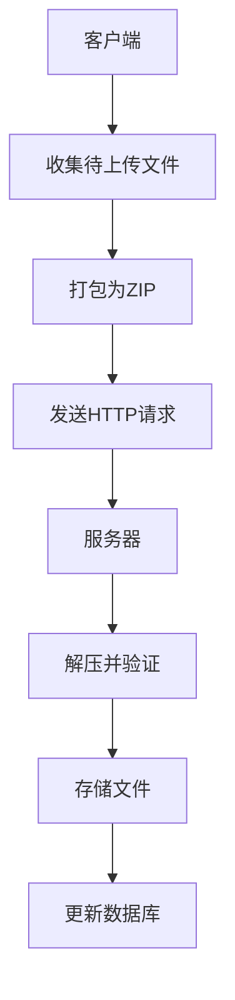
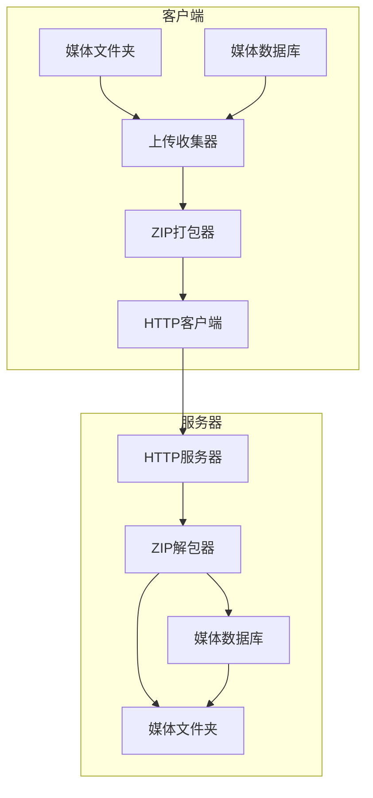
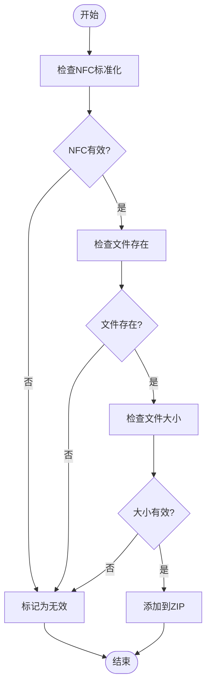
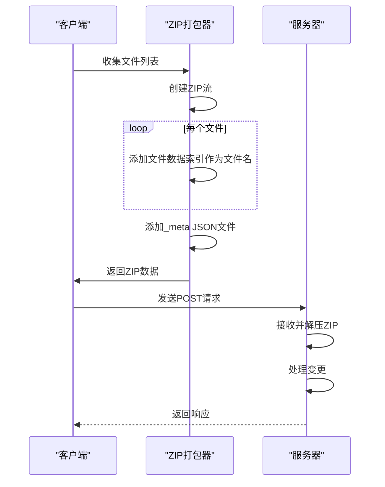
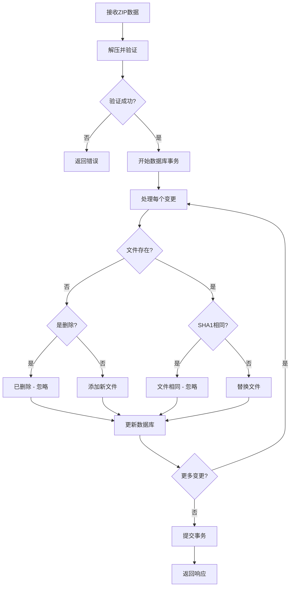
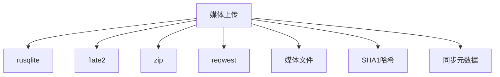

# 媒体上传

<cite>
**本文档中引用的文件**  
- [upload.rs](file://rslib/src/sync/media/upload.rs)
- [zip.rs](file://rslib/src/sync/media/zip.rs)
- [upload.rs](file://rslib/src/sync/http_server/media_manager/upload.rs)
- [entry/upload.rs](file://rslib/src/sync/media/database/server/entry/upload.rs)
- [files.rs](file://rslib/src/media/files.rs)
- [client/mod.rs](file://rslib/src/sync/media/database/client/mod.rs)
- [server/mod.rs](file://rslib/src/sync/media/database/server/mod.rs)
</cite>

## 目录
1. [简介](#简介)
2. [项目结构](#项目结构)
3. [核心组件](#核心组件)
4. [架构概述](#架构概述)
5. [详细组件分析](#详细组件分析)
6. [依赖分析](#依赖分析)
7. [性能考虑](#性能考虑)
8. [故障排除指南](#故障排除指南)
9. [结论](#结论)

## 简介
Anki的媒体上传机制是其同步系统的重要组成部分，负责在客户端和服务器之间可靠地传输音频、图像和其他媒体文件。该系统设计用于确保数据完整性、处理大文件并有效管理网络错误。上传流程包括文件分块、哈希计算、进度跟踪和错误重试等关键功能。本文件深入分析了`upload.rs`中的实现，解释了如何构造上传请求、处理身份验证以及解析服务器响应。它还涵盖了最佳实践，如上传队列管理、并发控制和用户体验优化。

## 项目结构
Anki的媒体上传功能分布在多个模块中，主要位于`rslib/src/sync/media`目录下。该系统由客户端和服务器组件组成，通过定义良好的协议进行通信。客户端负责收集待上传的文件，将其打包成ZIP格式，并通过HTTP请求发送。服务器接收上传，验证内容，并将文件存储到媒体文件夹中。关键文件包括`upload.rs`（处理上传逻辑）、`zip.rs`（处理ZIP打包和解包）以及`database`目录中的文件（管理媒体元数据）。

**图源**  
- [upload.rs](file://rslib/src/sync/media/upload.rs#L1-L112)
- [zip.rs](file://rslib/src/sync/media/zip.rs#L1-L157)
- [upload.rs](file://rslib/src/sync/http_server/media_manager/upload.rs#L1-L96)

**节源**  
- [upload.rs](file://rslib/src/sync/media/upload.rs#L1-L112)
- [zip.rs](file://rslib/src/sync/media/zip.rs#L1-L157)

## 核心组件
媒体上传的核心组件包括文件收集、ZIP打包、HTTP传输和服务器端处理。`gather_zip_data_for_upload`函数负责从媒体文件夹中收集待上传的文件，同时验证文件完整性和格式。`zip_files_for_upload`函数将文件数据打包成ZIP格式，其中包含一个元数据文件，描述每个文件的原始名称和在ZIP中的位置。服务器端的`process_uploaded_changes`函数处理传入的ZIP数据，将其解压并应用到媒体文件夹中。整个流程由USN（更新序列号）机制协调，确保变更按顺序应用。

**节源**  
- [upload.rs](file://rslib/src/sync/media/upload.rs#L1-L112)
- [zip.rs](file://rslib/src/sync/media/zip.rs#L1-L157)
- [upload.rs](file://rslib/src/sync/http_server/media_manager/upload.rs#L1-L96)

## 架构概述
Anki的媒体上传架构采用客户端-服务器模型，通过HTTP协议进行通信。客户端在上传前收集所有待处理的文件变更，包括添加、修改和删除操作。这些变更被打包成一个ZIP文件，其中包含实际的媒体数据和一个描述文件结构的元数据JSON文件。服务器接收ZIP文件，验证其内容，然后将变更应用到媒体存储中。该架构设计为幂等的，允许在失败后安全地重试上传。

**图源**  
- [upload.rs](file://rslib/src/sync/media/upload.rs#L1-L112)
- [zip.rs](file://rslib/src/sync/media/zip.rs#L1-L157)
- [upload.rs](file://rslib/src/sync/http_server/media_manager/upload.rs#L1-L96)
- [entry/upload.rs](file://rslib/src/sync/media/database/server/entry/upload.rs#L1-L100)

## 详细组件分析

### 文件收集与验证
文件收集过程从媒体数据库中获取待上传的条目，然后验证每个文件的可访问性和格式。`gather_zip_data_for_upload`函数遍历待上传的文件列表，检查文件是否存在、是否为空以及是否超过最大文件大小限制。它还确保文件名已标准化为NFC形式，这对于跨平台兼容性至关重要。如果发现任何无效条目，它们将从数据库中移除，上传过程将重新开始。

**图源**  
- [upload.rs](file://rslib/src/sync/media/upload.rs#L1-L112)
- [files.rs](file://rslib/src/media/files.rs#L1-L553)

**节源**  
- [upload.rs](file://rslib/src/sync/media/upload.rs#L1-L112)
- [files.rs](file://rslib/src/media/files.rs#L1-L553)

### ZIP打包与传输
ZIP打包过程将媒体文件数据和元数据组合成一个单一的ZIP文件。`zip_files_for_upload`函数为每个非删除操作的文件在ZIP中创建一个条目，使用其索引作为文件名。元数据文件`_meta`是一个JSON数组，将原始文件名映射到ZIP中的索引或null（对于删除操作）。这种设计允许客户端使用任意文件名，而服务器可以使用简单的数字索引来引用文件，从而简化了解包过程。

#### 对于API/服务组件：

**图源**  
- [zip.rs](file://rslib/src/sync/media/zip.rs#L1-L157)
- [upload.rs](file://rslib/src/sync/http_server/media_manager/upload.rs#L1-L96)

### 服务器端处理
服务器端的上传处理由`process_uploaded_changes`函数协调。它首先使用`unzip_and_validate_files`解压并验证传入的ZIP数据。验证包括检查文件名长度、NFC标准化和文件大小。然后，对于每个变更，它调用`register_uploaded_change`来确定如何处理该文件。可能的结果包括添加新文件、替换现有文件、删除文件或忽略已存在的相同文件。整个过程在一个数据库事务中执行，确保原子性。

#### 对于复杂逻辑组件：

**图源**  
- [upload.rs](file://rslib/src/sync/http_server/media_manager/upload.rs#L1-L96)
- [entry/upload.rs](file://rslib/src/sync/media/database/server/entry/upload.rs#L1-L100)
- [zip.rs](file://rslib/src/sync/media/zip.rs#L1-L157)

**节源**  
- [upload.rs](file://rslib/src/sync/http_server/media_manager/upload.rs#L1-L96)
- [entry/upload.rs](file://rslib/src/sync/media/database/server/entry/upload.rs#L1-L100)

## 依赖分析
媒体上传系统依赖于多个内部和外部组件。它依赖于`rusqlite`进行数据库操作，`flate2`和`zip`进行压缩，以及`reqwest`进行HTTP通信。在内部，它与媒体文件管理、哈希计算和同步元数据系统紧密耦合。客户端和服务器之间的接口由`MediaUploadResponse`和`UploadedChange`等数据结构定义，确保了版本兼容性。

**图源**  
- [upload.rs](file://rslib/src/sync/media/upload.rs#L1-L112)
- [Cargo.toml](file://Cargo.toml#L1-L50)

**节源**  
- [upload.rs](file://rslib/src/sync/media/upload.rs#L1-L112)
- [Cargo.toml](file://Cargo.toml#L1-L50)

## 性能考虑
媒体上传系统在设计时考虑了性能和资源使用。它通过限制单个ZIP文件的大小（默认为2.5MB）和单个文件的大小（100MB）来防止内存耗尽。文件名长度也受到限制，以确保跨文件系统的兼容性。上传过程是增量的，只发送自上次同步以来更改的文件，最大限度地减少了网络带宽使用。服务器端的处理在事务中进行，以确保数据一致性，同时避免长时间锁定。

## 故障排除指南
常见的上传问题包括文件名冲突、网络中断和服务器配额限制。如果上传因文件名无效而失败，系统会自动清理数据库中的条目并重试。对于网络错误，客户端应实现指数退避重试策略。服务器配额限制可以通过检查`MediaUploadResponse`中的`processed`字段来监控，该字段指示成功处理的文件数量。如果该数字小于上传的文件数量，可能需要检查服务器状态或网络连接。

**节源**  
- [upload.rs](file://rslib/src/sync/media/upload.rs#L1-L112)
- [upload.rs](file://rslib/src/sync/http_server/media_manager/upload.rs#L1-L96)

## 结论
Anki的媒体上传机制是一个健壮且高效的系统，能够可靠地同步媒体文件。通过仔细的文件验证、安全的传输协议和幂等的服务器处理，它确保了数据的完整性和一致性。该系统的设计允许在各种网络条件下进行可靠的同步，并为未来的扩展提供了坚实的基础。遵循最佳实践，如适当的错误处理和资源管理，可以确保上传过程对用户无缝且可靠。