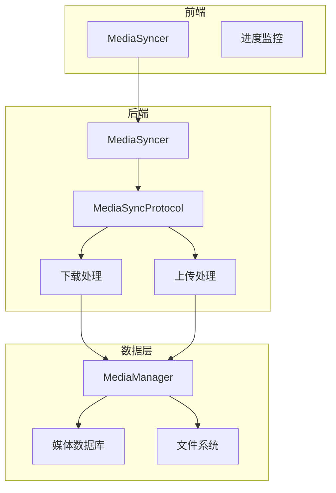
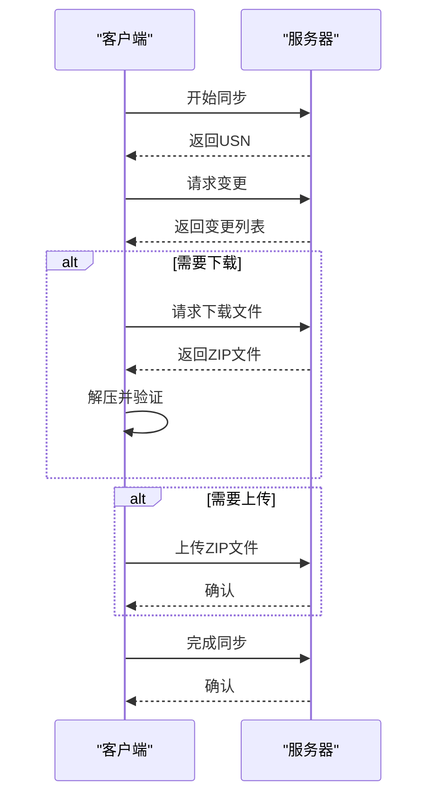
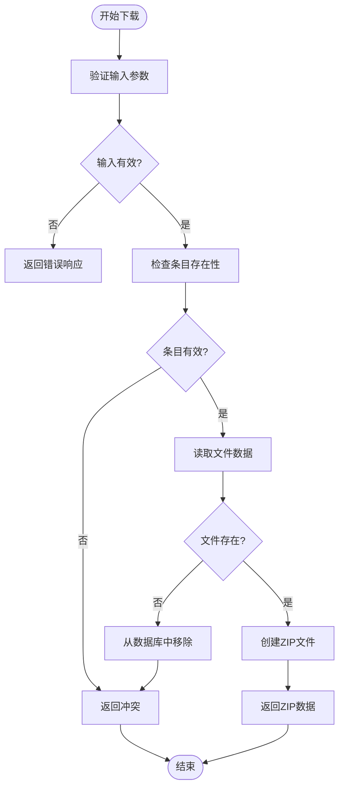
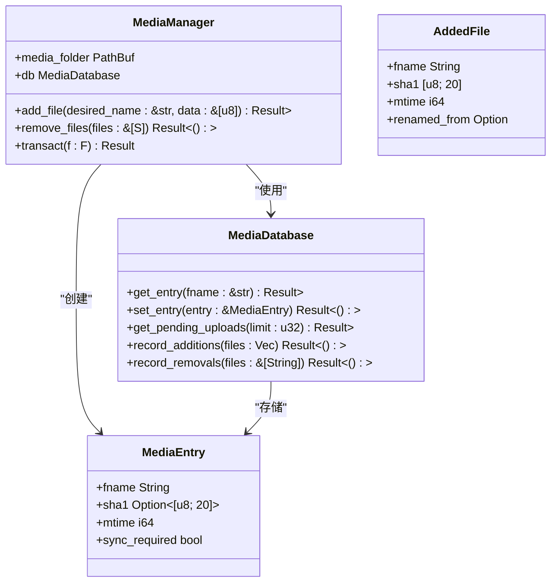
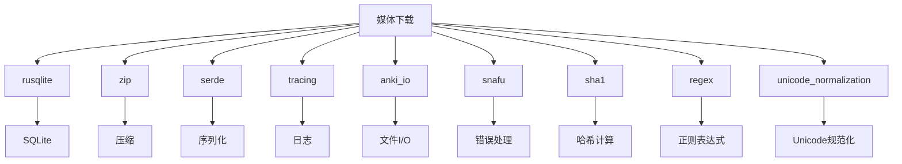

# 媒体下载

<cite>
**本文档中引用的文件**
- [download.rs](file://rslib/src/sync/media/download.rs)
- [media.rs](file://rslib/src/media/files.rs)
- [mod.rs](file://rslib/src/media/mod.rs)
- [syncer.rs](file://rslib/src/sync/media/syncer.rs)
- [ServerMediaManager](file://rslib/src/sync/http_server/media_manager/mod.rs)
- [media_manager](file://qt/aqt/mediasync.py)
</cite>

## 目录
1. [介绍](#介绍)
2. [项目结构](#项目结构)
3. [核心组件](#核心组件)
4. [架构概述](#架构概述)
5. [详细组件分析](#详细组件分析)
6. [依赖分析](#依赖分析)
7. [性能考虑](#性能考虑)
8. [故障排除指南](#故障排除指南)
9. [结论](#结论)
10. [附录](#附录)（如有必要）

## 介绍
Anki的媒体下载机制是其同步功能的核心组成部分，负责在客户端和服务器之间高效地传输多媒体文件。该系统设计用于处理增量更新、条件请求和本地缓存管理，确保用户在不同设备间同步时获得一致的媒体体验。通过利用ETag和Last-Modified头信息，Anki实现了高效的条件下载，最大限度地减少了不必要的数据传输。该机制还包含强大的错误处理、重试策略和带宽节流功能，以应对网络不稳定和磁盘空间不足等常见问题。对于初学者，该系统提供了直观的媒体管理体验；对于经验丰富的开发者，则提供了断点续传、并行下载和存储空间管理等高级功能的实现细节。

## 项目结构
Anki的媒体下载功能分布在多个模块中，主要集中在rslib和qt目录下。核心逻辑位于rslib/src/sync/media目录中，包含下载、上传和同步协议的实现。媒体文件的管理功能在rslib/src/media目录中，而HTTP服务器端的实现则在rslib/src/sync/http_server目录中。Qt前端通过aqt/mediasync.py提供用户界面和进度监控。这种分层架构将业务逻辑与用户界面分离，使得系统既可维护又可扩展。

**图源**
- [syncer.rs](file://rslib/src/sync/media/syncer.rs)
- [mod.rs](file://rslib/src/media/mod.rs)
- [media_manager](file://qt/aqt/mediasync.py)

**节源**
- [syncer.rs](file://rslib/src/sync/media/syncer.rs)
- [mod.rs](file://rslib/src/media/mod.rs)
- [media_manager](file://qt/aqt/mediasync.py)

## 核心组件
Anki的媒体下载系统由几个核心组件构成：MediaManager负责本地媒体文件的管理和数据库记录，MediaSyncer处理同步逻辑，HttpSyncClient管理与服务器的通信，而ServerMediaManager则在服务器端处理下载请求。这些组件协同工作，实现了从检测变更到文件传输再到本地更新的完整流程。系统通过事务性操作确保数据一致性，并利用哈希值验证文件完整性。

**节源**
- [mod.rs](file://rslib/src/media/mod.rs)
- [syncer.rs](file://rslib/src/sync/media/syncer.rs)
- [protocol.rs](file://rslib/src/sync/media/protocol.rs)

## 架构概述
Anki的媒体下载架构采用客户端-服务器模式，通过RESTful API进行通信。客户端定期检查媒体变更，然后根据需要下载或上传文件。系统使用ZIP格式批量传输文件，以减少HTTP请求的开销。每个文件的元数据（包括SHA1哈希值和修改时间）存储在数据库中，用于增量更新检测。服务器端实现了一个状态机，管理同步会话的生命周期，从开始到完成或中止。

**图源**
- [syncer.rs](file://rslib/src/sync/media/syncer.rs)
- [http_server](file://rslib/src/sync/http_server/media_manager/mod.rs)

## 详细组件分析

### 下载流程分析
媒体下载流程从客户端检测到服务器上有新变更开始。MediaSyncer组件首先获取变更列表，然后将需要下载的文件分批处理。每批文件通过DownloadFilesRequest发送到服务器，服务器返回包含这些文件的ZIP压缩包。客户端接收后，使用extract_into_media_folder函数解压并验证文件，最后更新本地数据库。

#### 下载请求处理

**图源**
- [download.rs](file://rslib/src/sync/http_server/media_manager/download.rs)
- [entry/download.rs](file://rslib/src/sync/media/database/server/entry/download.rs)

#### 文件完整性验证

**图源**
- [mod.rs](file://rslib/src/media/mod.rs)
- [files.rs](file://rslib/src/media/files.rs)

**节源**
- [mod.rs](file://rslib/src/media/mod.rs)
- [files.rs](file://rslib/src/media/files.rs)

### 增量更新检测
Anki通过监控媒体文件夹的修改时间和文件哈希值来检测增量更新。ChangeTracker组件扫描文件系统，比较文件的修改时间，只有当修改时间发生变化时才重新计算哈希值。这种方法避免了对未修改文件的昂贵哈希计算，显著提高了性能。所有变更记录在媒体数据库中，标记为需要同步。

**节源**
- [changetracker.rs](file://rslib/src/sync/media/database/client/changetracker.rs)
- [mod.rs](file://rslib/src/media/mod.rs)

### 条件请求实现
Anki的条件下载机制基于文件的SHA1哈希值和修改时间。当客户端请求下载文件时，服务器会检查这些元数据，只有在文件确实存在且未被删除时才返回文件内容。如果文件在服务器上不存在，服务器会返回冲突错误，客户端则从本地数据库中移除该文件的记录。这种机制确保了客户端和服务器之间的数据一致性。

**节源**
- [download.rs](file://rslib/src/sync/http_server/media_manager/download.rs)
- [entry/download.rs](file://rslib/src/sync/media/database/server/entry/download.rs)

## 依赖分析
Anki的媒体下载系统依赖于多个外部库和内部模块。它使用rusqlite进行数据库操作，zip库处理压缩文件，serde进行序列化，以及tracing进行日志记录。内部依赖包括媒体管理、同步协议和HTTP客户端组件。这些依赖关系通过清晰的接口定义，使得系统易于测试和维护。

**图源**
- [Cargo.toml](file://rslib/Cargo.toml)
- [mod.rs](file://rslib/src/media/mod.rs)

**节源**
- [Cargo.toml](file://rslib/Cargo.toml)
- [mod.rs](file://rslib/src/media/mod.rs)

## 性能考虑
Anki的媒体下载系统在设计时充分考虑了性能因素。通过批量处理文件传输，减少了HTTP请求的数量和开销。使用存储压缩方法（Stored）避免了重复压缩已压缩的媒体文件。系统还实现了进度节流，防止频繁的UI更新影响性能。对于大型媒体库，增量更新检测算法确保只有实际修改的文件才会被重新哈希和同步。

## 故障排除指南
常见的媒体下载问题包括网络连接不稳定、磁盘空间不足和文件权限错误。系统通过重试机制处理临时网络故障，当检测到磁盘空间不足时会中止同步并提示用户。对于文件权限问题，系统会记录详细的错误日志，帮助诊断问题。用户可以通过强制重新同步来解决数据库不一致的问题。

**节源**
- [error.rs](file://rslib/src/error/mod.rs)
- [syncer.rs](file://rslib/src/sync/media/syncer.rs)

## 结论
Anki的媒体下载机制是一个高效、可靠的系统，能够处理复杂的同步场景。通过结合增量更新检测、条件请求和批量传输，它在保证数据一致性的同时最大限度地减少了网络流量。系统的模块化设计使其易于维护和扩展，而详细的错误处理和日志记录则有助于快速诊断和解决问题。对于开发者来说，理解这一机制的内部工作原理有助于更好地利用Anki的同步功能，或在其他项目中实现类似的媒体同步解决方案。

## 附录
### 配置选项
| 配置项 | 描述 | 默认值 |
|--------|------|--------|
| MAX_MEDIA_FILES_IN_ZIP | 每个ZIP文件中的最大文件数 | 100 |
| MEDIA_SYNC_TARGET_ZIP_BYTES | 目标ZIP文件大小（字节） | 10MB |
| MAX_INDIVIDUAL_MEDIA_FILE_SIZE | 单个媒体文件的最大大小（字节） | 100MB |
| MAX_MEDIA_FILENAME_LENGTH | 媒体文件名的最大长度 | 120 |

### 状态码
| 状态码 | 含义 |
|--------|------|
| 200 | 成功 |
| 400 | 请求错误 |
| 409 | 冲突（文件不存在） |
| 500 | 服务器内部错误 |