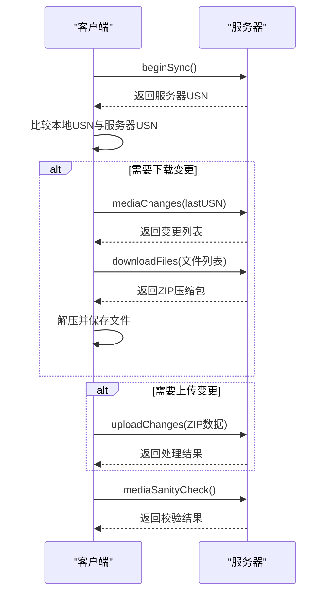
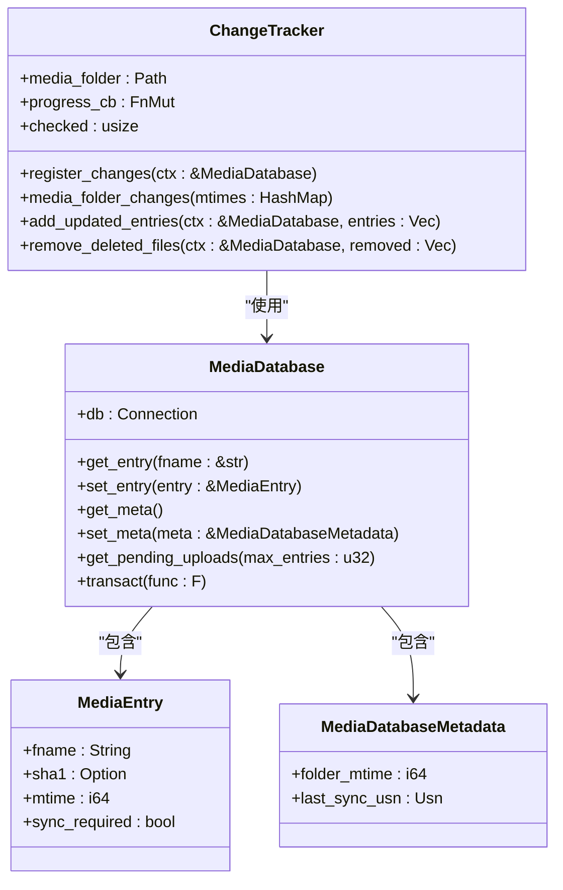
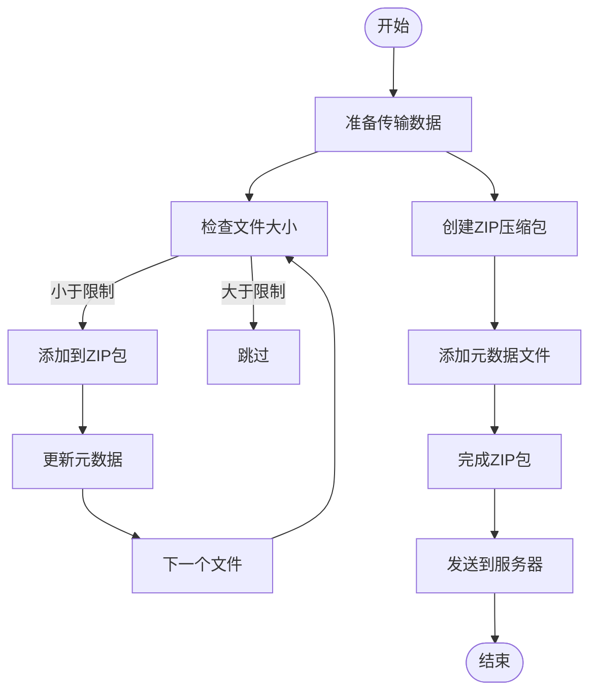
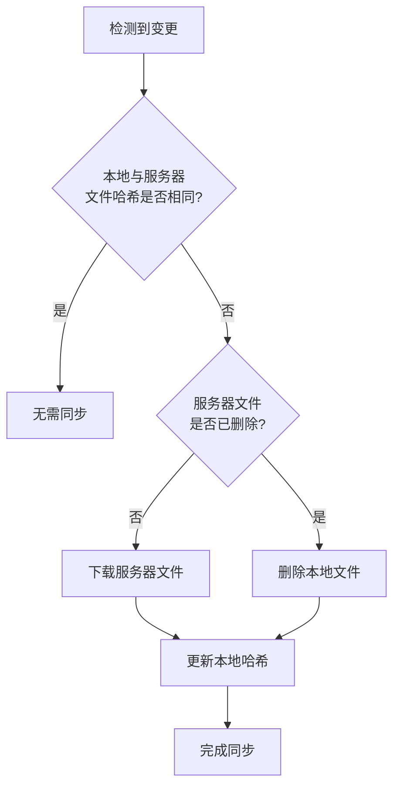
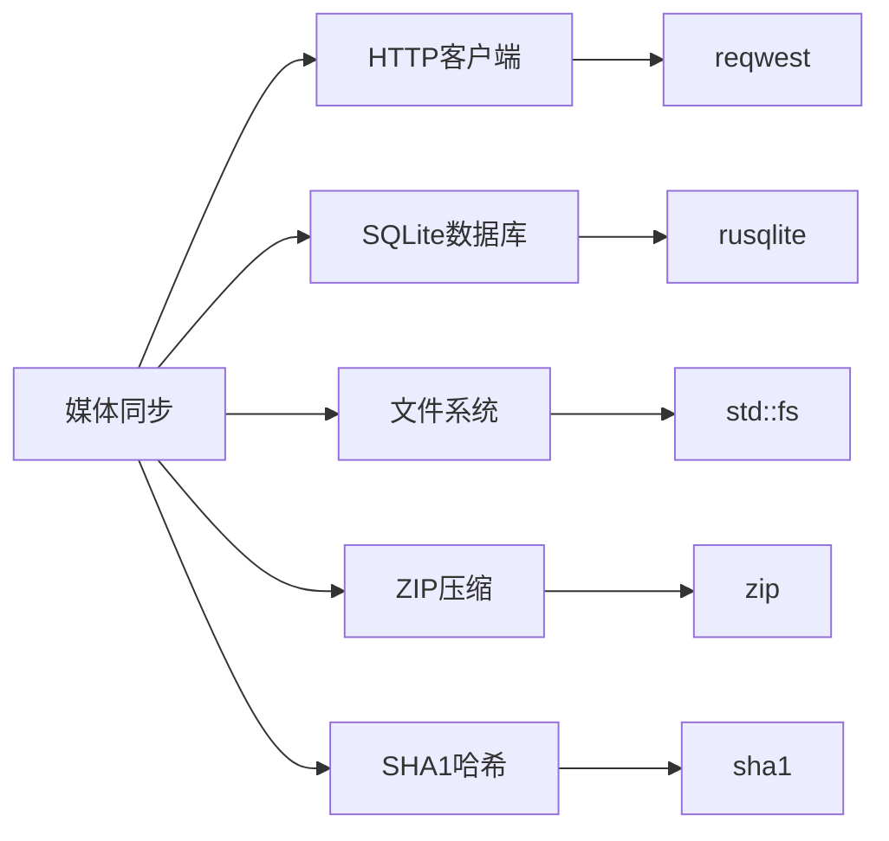

# 媒体同步

<cite>
**本文档中引用的文件**  
- [MediaSyncer](file://qt/aqt/mediasync.py#L23-L134)
- [syncer.rs](file://rslib/src/sync/media/syncer.rs#L0-L271)
- [changetracker.rs](file://rslib/src/sync/media/database/client/changetracker.rs#L0-L370)
- [mod.rs](file://rslib/src/sync/media/database/client/mod.rs#L0-L390)
- [schema.sql](file://rslib/src/sync/media/database/client/schema.sql#L0-L12)
- [changes.rs](file://rslib/src/sync/media/changes.rs#L0-L138)
- [download.rs](file://rslib/src/sync/media/download.rs#L0-L54)
- [upload.rs](file://rslib/src/sync/media/upload.rs#L0-L112)
- [zip.rs](file://rslib/src/sync/media/zip.rs#L0-L157)
- [protocol.rs](file://rslib/src/sync/media/protocol.rs#L0-L101)
- [entry/mod.rs](file://rslib/src/sync/media/database/server/entry/mod.rs#L0-L122)
- [meta/mod.rs](file://rslib/src/sync/media/database/server/meta/mod.rs#L0-L114)
- [upload.rs](file://rslib/src/sync/media/database/server/entry/upload.rs#L0-L100)
</cite>

## 目录
1. [简介](#简介)
2. [项目结构](#项目结构)
3. [核心组件](#核心组件)
4. [架构概述](#架构概述)
5. [详细组件分析](#详细组件分析)
6. [依赖分析](#依赖分析)
7. [性能考虑](#性能考虑)
8. [故障排除指南](#故障排除指南)
9. [结论](#结论)

## 简介
Anki的媒体同步机制旨在实现客户端与服务器之间媒体文件的高效、可靠同步。该系统采用增量同步策略，通过哈希校验确保数据一致性，并具备完善的冲突解决能力。同步过程涉及媒体数据库的变更跟踪、文件的上传下载以及元数据的同步。本系统与集合同步协调工作，支持大文件的分块传输，确保在各种网络条件下都能稳定运行。

## 项目结构
Anki的媒体同步功能主要分布在`rslib/src/sync/media`目录下，该目录包含了同步逻辑的核心实现。客户端界面部分位于`qt/aqt/mediasync.py`，负责启动和监控同步过程。媒体同步的数据库操作分为客户端和服务器端，分别在`database/client`和`database/server`目录中实现。协议定义、变更检测、文件传输等核心功能分布在各自的模块文件中，形成了清晰的分层架构。

```mermaid
graph TD
subgraph "客户端"
A[mediasync.py] --> B[syncer.rs]
B --> C[changetracker.rs]
B --> D[changes.rs]
B --> E[download.rs]
B --> F[upload.rs]
end
subgraph "服务器端"
G[entry/mod.rs]
H[meta/mod.rs]
I[upload.rs]
end
subgraph "共享组件"
J[protocol.rs]
K[zip.rs]
end
A --> B
B < --> G
B < --> H
B < --> I
J --> B
J --> G
K --> B
K --> G
```

**Diagram sources**
- [mediasync.py](file://qt/aqt/mediasync.py#L23-L134)
- [syncer.rs](file://rslib/src/sync/media/syncer.rs#L0-L271)
- [changetracker.rs](file://rslib/src/sync/media/database/client/changetracker.rs#L0-L370)
- [changes.rs](file://rslib/src/sync/media/changes.rs#L0-L138)
- [download.rs](file://rslib/src/sync/media/download.rs#L0-L54)
- [upload.rs](file://rslib/src/sync/media/upload.rs#L0-L112)
- [zip.rs](file://rslib/src/sync/media/zip.rs#L0-L157)
- [protocol.rs](file://rslib/src/sync/media/protocol.rs#L0-L101)
- [entry/mod.rs](file://rslib/src/sync/media/database/server/entry/mod.rs#L0-L122)
- [meta/mod.rs](file://rslib/src/sync/media/database/server/meta/mod.rs#L0-L114)
- [upload.rs](file://rslib/src/sync/media/database/server/entry/upload.rs#L0-L100)

**Section sources**
- [mediasync.py](file://qt/aqt/mediasync.py#L23-L134)
- [syncer.rs](file://rslib/src/sync/media/syncer.rs#L0-L271)

## 核心组件
媒体同步的核心组件包括变更跟踪器、同步协调器、文件传输模块和数据库管理层。变更跟踪器负责监控本地媒体文件夹的变化，同步协调器管理整个同步流程，文件传输模块处理文件的上传下载，数据库管理层则维护客户端和服务器端的媒体元数据。这些组件通过清晰的接口相互协作，确保同步过程的原子性和一致性。

**Section sources**
- [syncer.rs](file://rslib/src/sync/media/syncer.rs#L0-L271)
- [changetracker.rs](file://rslib/src/sync/media/database/client/changetracker.rs#L0-L370)
- [mod.rs](file://rslib/src/sync/media/database/client/mod.rs#L0-L390)

## 架构概述
Anki媒体同步采用客户端-服务器架构，通过HTTP协议进行通信。客户端首先检测本地媒体文件夹的变更，然后与服务器交换变更记录。根据变更情况，客户端从服务器下载新增或修改的文件，并将本地的变更上传到服务器。整个过程通过事务保证一致性，并通过哈希校验确保数据完整性。



**Diagram sources**
- [syncer.rs](file://rslib/src/sync/media/syncer.rs#L0-L271)
- [protocol.rs](file://rslib/src/sync/media/protocol.rs#L0-L101)

## 详细组件分析

### 变更检测与跟踪
媒体同步的变更检测通过监控文件夹的修改时间和文件内容哈希来实现。系统会记录每个文件的SHA1哈希值和修改时间，当文件发生变化时，会标记为需要同步。对于已删除的文件，系统会保留其记录但将哈希值设为null，以便在同步时通知服务器。



**Diagram sources**
- [changetracker.rs](file://rslib/src/sync/media/database/client/changetracker.rs#L0-L370)
- [mod.rs](file://rslib/src/sync/media/database/client/mod.rs#L0-L390)

**Section sources**
- [changetracker.rs](file://rslib/src/sync/media/database/client/changetracker.rs#L0-L370)
- [mod.rs](file://rslib/src/sync/media/database/client/mod.rs#L0-L390)

### 文件传输与压缩
媒体文件的传输采用ZIP压缩包的形式，以提高传输效率。上传时，客户端将待同步的文件打包成ZIP格式，包含一个元数据文件来映射压缩包内的文件名与实际文件名。下载时，服务器返回包含文件数据和元数据的ZIP包，客户端解压后根据元数据恢复文件。



**Diagram sources**
- [upload.rs](file://rslib/src/sync/media/upload.rs#L0-L112)
- [zip.rs](file://rslib/src/sync/media/zip.rs#L0-L157)
- [download.rs](file://rslib/src/sync/media/download.rs#L0-L54)

**Section sources**
- [upload.rs](file://rslib/src/sync/media/upload.rs#L0-L112)
- [zip.rs](file://rslib/src/sync/media/zip.rs#L0-L157)
- [download.rs](file://rslib/src/sync/media/download.rs#L0-L54)

### 冲突解决策略
媒体同步采用服务器优先的冲突解决策略。当客户端和服务器对同一文件有不同版本时，以服务器版本为准。系统通过比较文件的SHA1哈希值来判断是否发生冲突，并自动下载服务器版本以解决冲突。对于文件删除操作，系统会优先处理服务器的删除指令。



**Diagram sources**
- [changes.rs](file://rslib/src/sync/media/changes.rs#L0-L138)

**Section sources**
- [changes.rs](file://rslib/src/sync/media/changes.rs#L0-L138)

## 依赖分析
媒体同步系统依赖于多个核心模块，包括HTTP客户端、数据库访问层、文件操作工具和序列化库。这些依赖通过清晰的接口进行交互，确保了系统的模块化和可维护性。同步协议的实现依赖于serde进行JSON序列化，数据库操作依赖于rusqlite，文件压缩依赖于zip库。



**Diagram sources**
- [syncer.rs](file://rslib/src/sync/media/syncer.rs#L0-L271)
- [protocol.rs](file://rslib/src/sync/media/protocol.rs#L0-L101)

**Section sources**
- [syncer.rs](file://rslib/src/sync/media/syncer.rs#L0-L271)
- [protocol.rs](file://rslib/src/sync/media/protocol.rs#L0-L101)

## 性能考虑
媒体同步在设计时充分考虑了性能因素。通过增量同步减少不必要的数据传输，利用ZIP压缩提高网络效率，采用批量处理降低通信开销。系统还实现了进度报告机制，让用户了解同步状态。对于大文件，系统会跳过同步以避免影响用户体验。

## 故障排除指南
常见的媒体同步问题包括文件丢失、重复文件和带宽占用过高。对于文件丢失，可以尝试强制重新同步；对于重复文件，系统会自动清理；对于带宽问题，可以调整同步频率或在网络空闲时进行同步。如果同步失败，系统会记录错误日志，帮助诊断问题。

**Section sources**
- [syncer.rs](file://rslib/src/sync/media/syncer.rs#L0-L271)
- [sanity.rs](file://rslib/src/sync/media/sanity.rs)

## 结论
Anki的媒体同步系统是一个高效、可靠的分布式文件同步解决方案。它通过精细的变更检测、高效的传输机制和智能的冲突解决策略，确保了用户在不同设备间获得一致的媒体体验。系统的模块化设计和清晰的接口使其易于维护和扩展，为未来的功能增强奠定了坚实的基础。