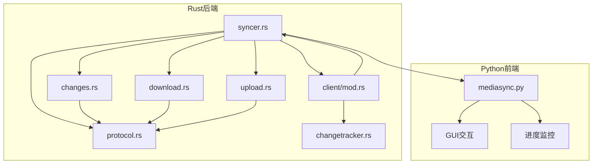
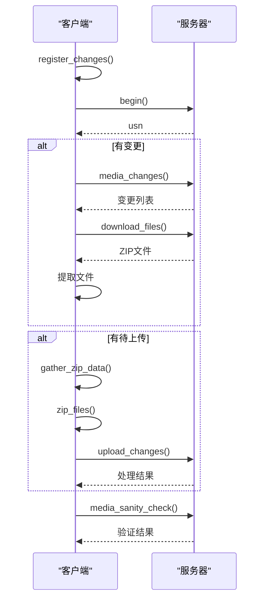
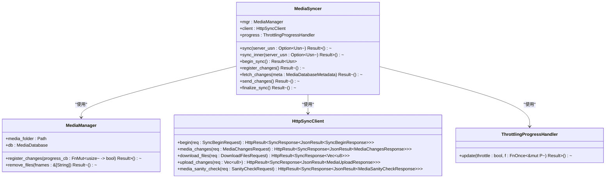
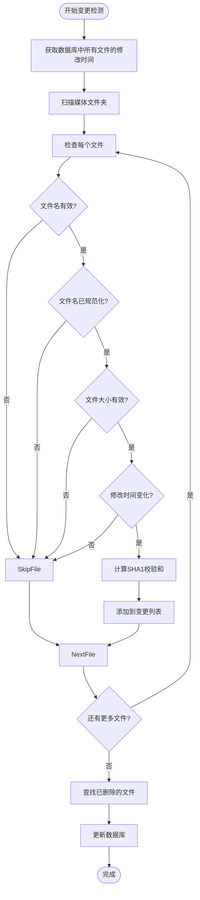
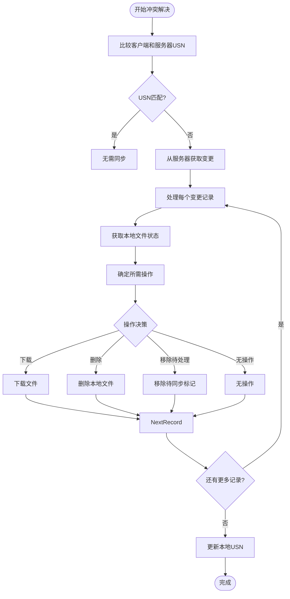
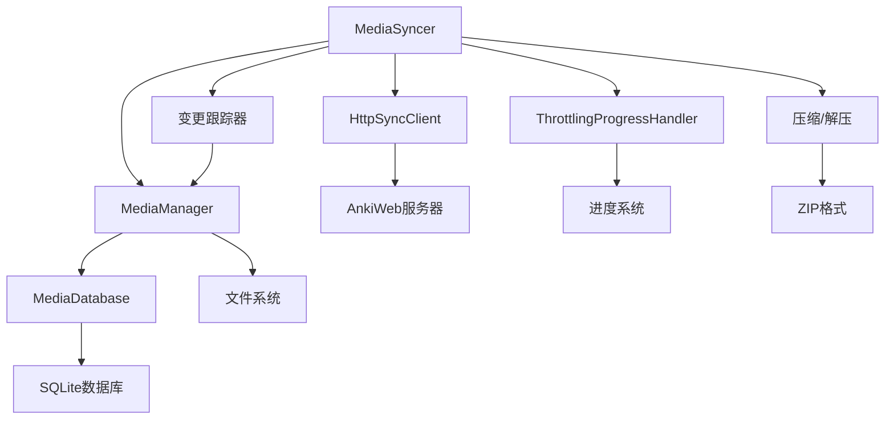

# 媒体同步器

<cite>
**本文档中引用的文件**  
- [syncer.rs](file://rslib/src/sync/media/syncer.rs)
- [mod.rs](file://rslib/src/sync/media/mod.rs)
- [changes.rs](file://rslib/src/sync/media/changes.rs)
- [download.rs](file://rslib/src/sync/media/download.rs)
- [upload.rs](file://rslib/src/sync/media/upload.rs)
- [protocol.rs](file://rslib/src/sync/media/protocol.rs)
- [progress.rs](file://rslib/src/sync/media/progress.rs)
- [begin.rs](file://rslib/src/sync/media/begin.rs)
- [sanity.rs](file://rslib/src/sync/media/sanity.rs)
- [client/mod.rs](file://rslib/src/sync/media/database/client/mod.rs)
- [client/changetracker.rs](file://rslib/src/sync/media/database/client/changetracker.rs)
- [mediasync.py](file://qt/aqt/mediasync.py)
</cite>

## 目录
1. [简介](#简介)
2. [项目结构](#项目结构)
3. [核心组件](#核心组件)
4. [架构概述](#架构概述)
5. [详细组件分析](#详细组件分析)
6. [依赖分析](#依赖分析)
7. [性能考虑](#性能考虑)
8. [故障排除指南](#故障排除指南)
9. [结论](#结论)

## 简介
Anki媒体同步器负责协调本地媒体文件与AnkiWeb服务器之间的同步。它实现了变更检测、状态管理、冲突解决和事务性保证等关键功能。同步器通过检测媒体文件夹中的文件变更，与服务器交换变更列表，并协调上传和下载操作来保持一致性。该系统为初学者提供了高层次的工作原理，同时为经验丰富的开发者提供了详细的同步算法和优化策略。

## 项目结构
媒体同步功能分布在多个模块中，主要位于rslib/src/sync/media目录下。核心逻辑由Rust实现，而Qt前端提供用户界面和进度反馈。

**图源**  
- [syncer.rs](file://rslib/src/sync/media/syncer.rs)
- [mediasync.py](file://qt/aqt/mediasync.py)

**节源**  
- [syncer.rs](file://rslib/src/sync/media/syncer.rs)
- [mediasync.py](file://qt/aqt/mediasync.py)

## 核心组件
媒体同步器的核心组件包括变更检测、同步协调、上传/下载管理和状态验证。系统通过MediaManager跟踪媒体文件夹的变更，使用HttpSyncClient与服务器通信，并通过ThrottlingProgressHandler提供进度反馈。同步过程分为三个主要阶段：注册变更、获取服务器变更和发送本地变更。

**节源**  
- [syncer.rs](file://rslib/src/sync/media/syncer.rs)
- [mod.rs](file://rslib/src/sync/media/mod.rs)

## 架构概述
媒体同步器采用客户端-服务器架构，通过HTTP协议与AnkiWeb服务器通信。系统实现了双向同步，能够处理文件的添加、修改和删除操作。同步过程包含事务性保证和错误恢复机制，确保数据一致性。

**图源**  
- [syncer.rs](file://rslib/src/sync/media/syncer.rs)
- [protocol.rs](file://rslib/src/sync/media/protocol.rs)

## 详细组件分析

### 同步协调器分析
MediaSyncer是媒体同步的核心协调器，负责管理整个同步流程。

#### 类图

**图源**  
- [syncer.rs](file://rslib/src/sync/media/syncer.rs)
- [client/mod.rs](file://rslib/src/sync/media/database/client/mod.rs)

### 变更检测分析
变更检测系统通过比较文件系统和数据库状态来识别需要同步的文件。

#### 流程图

**图源**  
- [client/changetracker.rs](file://rslib/src/sync/media/database/client/changetracker.rs)
- [client/mod.rs](file://rslib/src/sync/media/database/client/mod.rs)

### 冲突解决策略
系统通过USN（更新序列号）和SHA1校验和来解决同步冲突。

**图源**  
- [changes.rs](file://rslib/src/sync/media/changes.rs)
- [syncer.rs](file://rslib/src/sync/media/syncer.rs)

## 依赖分析
媒体同步器依赖于多个核心组件和外部服务。

**图源**  
- [syncer.rs](file://rslib/src/sync/media/syncer.rs)
- [client/mod.rs](file://rslib/src/sync/media/database/client/mod.rs)
- [mod.rs](file://rslib/src/sync/media/mod.rs)

**节源**  
- [syncer.rs](file://rslib/src/sync/media/syncer.rs)
- [client/mod.rs](file://rslib/src/sync/media/database/client/mod.rs)

## 性能考虑
媒体同步器在设计时考虑了多项性能优化：

1. **批量处理**：使用MAX_MEDIA_FILES_IN_ZIP（25个文件）和MEDIA_SYNC_TARGET_ZIP_BYTES（2.5MB）限制来优化传输效率
2. **增量同步**：只同步变更的文件，避免全量传输
3. **进度节流**：使用ThrottlingProgressHandler减少UI更新频率
4. **事务性操作**：将多个数据库操作组合在单个事务中
5. **流式处理**：直接处理ZIP流，避免中间文件

同步器还实现了错误恢复机制，当同步中断时可以从中断点继续，避免重新开始整个过程。

## 故障排除指南

### 常见问题及解决方案

| 问题 | 可能原因 | 解决方案 |
|------|---------|---------|
| 同步死锁 | 多个同步操作同时进行 | 确保同一时间只有一个同步操作在运行 |
| 状态不一致 | 数据库和文件系统状态不同步 | 运行媒体检查工具修复不一致 |
| 长时间运行 | 大量文件需要同步 | 分批同步，或检查网络连接 |
| 文件丢失 | 文件名规范化问题 | 确保文件名使用正确的Unicode规范化形式 |
| 同步失败 | 网络问题或服务器错误 | 检查网络连接，重试同步操作 |

### 调试技巧
1. 启用TRACESQL环境变量查看SQL查询
2. 使用syncer.rs中的debug日志跟踪同步流程
3. 检查媒体数据库的完整性
4. 监控网络请求和响应
5. 验证文件权限和磁盘空间

**节源**  
- [syncer.rs](file://rslib/src/sync/media/syncer.rs)
- [client/changetracker.rs](file://rslib/src/sync/media/database/client/changetracker.rs)
- [mediasync.py](file://qt/aqt/mediasync.py)

## 结论
Anki媒体同步器是一个复杂的系统，它通过精心设计的架构和算法确保媒体文件在不同设备间的一致性。系统实现了高效的变更检测、可靠的冲突解决和稳健的错误恢复。对于开发者来说，理解其工作原理有助于更好地使用和扩展同步功能。最佳实践包括定期同步、监控同步状态和及时处理同步错误。