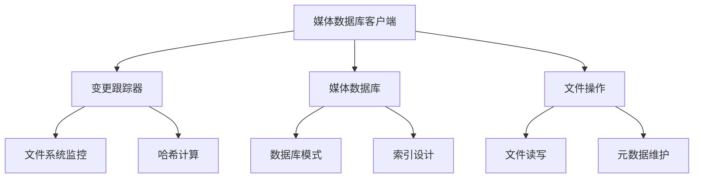
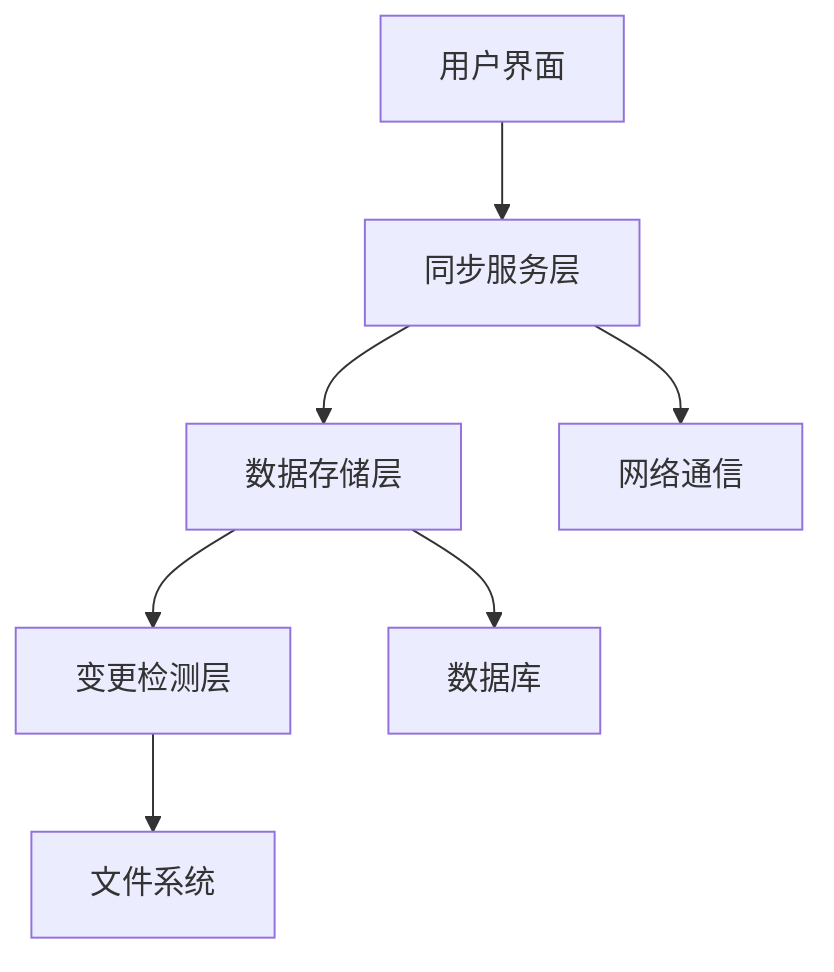
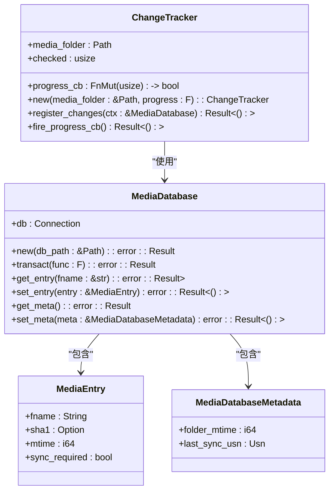
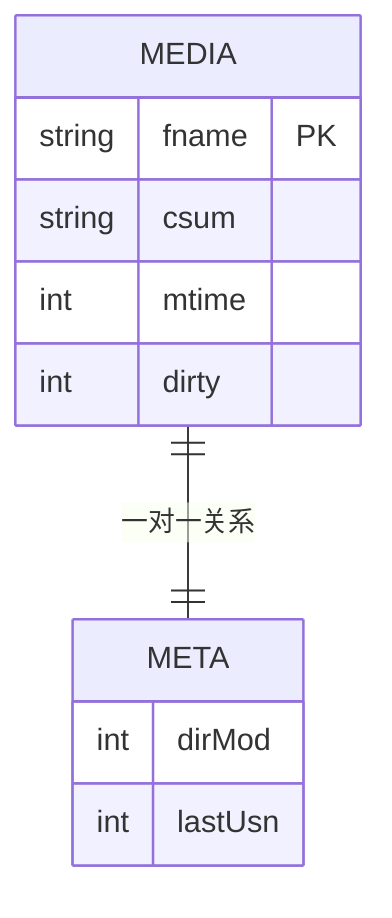
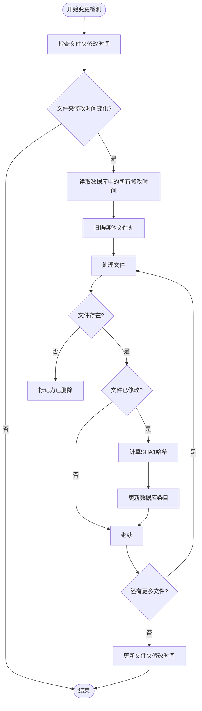
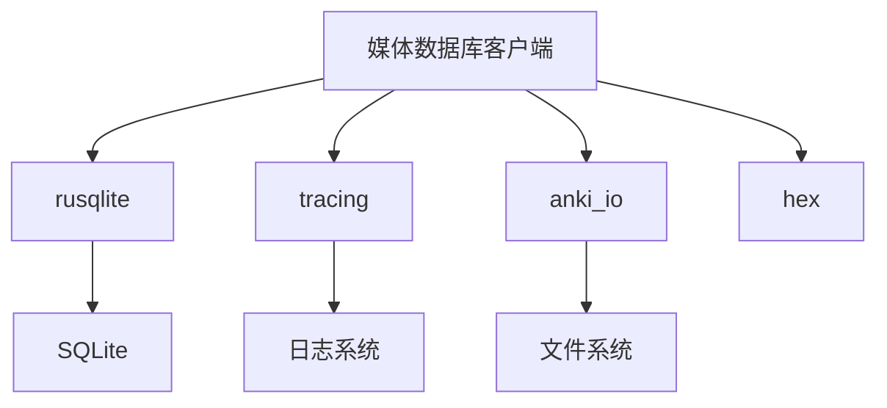

# 媒体数据库客户端

<cite>
**本文档中引用的文件**  
- [changetracker.rs](file://rslib/src/sync/media/database/client/changetracker.rs)
- [mod.rs](file://rslib/src/sync/media/database/client/mod.rs)
- [schema.sql](file://rslib/src/sync/media/database/client/schema.sql)
- [media.py](file://pylib/anki/media.py)
</cite>

## 目录
1. [简介](#简介)
2. [项目结构](#项目结构)
3. [核心组件](#核心组件)
4. [架构概述](#架构概述)
5. [详细组件分析](#详细组件分析)
6. [依赖分析](#依赖分析)
7. [性能考虑](#性能考虑)
8. [故障排除指南](#故障排除指南)
9. [结论](#结论)

## 简介
Anki媒体数据库客户端负责管理用户媒体文件的同步和变更跟踪。该系统通过高效的变更检测机制监控本地文件系统的变化，维护媒体元数据，并确保与服务器端的数据一致性。客户端实现了复杂的数据库模式和索引设计，以优化查询性能和事务一致性。本文档全面阐述了媒体数据库客户端的变更跟踪机制、数据库架构和性能优化策略。

## 项目结构
Anki媒体数据库客户端的代码主要分布在rslib和pylib两个目录中。rslib包含核心的Rust实现，而pylib提供Python接口。媒体同步相关的代码集中在rslib/src/sync/media目录下，其中database/client子目录包含了客户端媒体数据库的核心实现。

**图示来源**
- [changetracker.rs](file://rslib/src/sync/media/database/client/changetracker.rs)
- [mod.rs](file://rslib/src/sync/media/database/client/mod.rs)

**本节来源**
- [changetracker.rs](file://rslib/src/sync/media/database/client/changetracker.rs)
- [mod.rs](file://rslib/src/sync/media/database/client/mod.rs)

## 核心组件
媒体数据库客户端的核心组件包括变更跟踪器、媒体数据库和文件操作模块。变更跟踪器负责检测文件系统的变化，媒体数据库管理媒体元数据的存储和查询，文件操作模块处理具体的文件读写操作。这些组件协同工作，确保媒体文件的变更能够被准确捕获和同步。

**本节来源**
- [changetracker.rs](file://rslib/src/sync/media/database/client/changetracker.rs)
- [mod.rs](file://rslib/src/sync/media/database/client/mod.rs)

## 架构概述
媒体数据库客户端采用分层架构设计，包括变更检测层、数据存储层和同步服务层。变更检测层监控文件系统变化，数据存储层维护媒体元数据，同步服务层负责与服务器通信。这种分层设计提高了系统的可维护性和可扩展性。

**图示来源**
- [changetracker.rs](file://rslib/src/sync/media/database/client/changetracker.rs)
- [mod.rs](file://rslib/src/sync/media/database/client/mod.rs)

## 详细组件分析

### 变更跟踪器分析
变更跟踪器是媒体数据库客户端的核心组件，负责检测和记录媒体文件的变化。它通过监控文件夹的修改时间来判断是否需要进行变更检查，并使用SHA1哈希值来识别文件内容的变化。

#### 变更跟踪器类图

**图示来源**
- [changetracker.rs](file://rslib/src/sync/media/database/client/changetracker.rs)
- [mod.rs](file://rslib/src/sync/media/database/client/mod.rs)

### 数据库模式分析
媒体数据库客户端使用SQLite数据库存储媒体元数据。数据库模式经过精心设计，以支持高效的查询和变更跟踪。

#### 数据库模式图

**图示来源**
- [schema.sql](file://rslib/src/sync/media/database/client/schema.sql)
- [mod.rs](file://rslib/src/sync/media/database/client/mod.rs)

**本节来源**
- [schema.sql](file://rslib/src/sync/media/database/client/schema.sql)
- [mod.rs](file://rslib/src/sync/media/database/client/mod.rs)

### 变更检测流程分析
变更检测流程是媒体数据库客户端的关键功能，它确保了本地文件系统的变化能够被准确捕获。

#### 变更检测流程图

**图示来源**
- [changetracker.rs](file://rslib/src/sync/media/database/client/changetracker.rs)

**本节来源**
- [changetracker.rs](file://rslib/src/sync/media/database/client/changetracker.rs)

## 依赖分析
媒体数据库客户端依赖于多个外部库和内部模块。主要依赖包括rusqlite用于数据库操作，tracing用于日志记录，以及anki_io用于文件系统操作。这些依赖关系确保了客户端功能的完整性和可靠性。

**图示来源**
- [mod.rs](file://rslib/src/sync/media/database/client/mod.rs)
- [Cargo.toml](file://rslib/Cargo.toml)

**本节来源**
- [mod.rs](file://rslib/src/sync/media/database/client/mod.rs)

## 性能考虑
媒体数据库客户端在设计时充分考虑了性能因素。通过使用事务批量处理数据库操作，避免了频繁的磁盘I/O。索引设计优化了常用查询的性能，而增量变更检测机制减少了不必要的文件扫描。这些优化措施确保了客户端在处理大量媒体文件时仍能保持良好的性能。

## 故障排除指南
常见问题包括变更丢失、数据库锁定和性能下降。对于变更丢失问题，可以尝试强制重新同步。数据库锁定通常由并发访问引起，需要确保同一时间只有一个进程访问数据库。性能下降可能与大量文件或慢速存储设备有关，建议定期维护数据库并优化存储性能。

**本节来源**
- [changetracker.rs](file://rslib/src/sync/media/database/client/changetracker.rs)
- [mod.rs](file://rslib/src/sync/media/database/client/mod.rs)

## 结论
Anki媒体数据库客户端通过精心设计的架构和高效的实现，提供了可靠的媒体文件同步功能。其变更跟踪机制准确捕获文件系统变化，数据库模式和索引设计优化了查询性能，而分层架构确保了系统的可维护性。对于开发者而言，理解这些核心组件的工作原理有助于更好地使用和扩展客户端功能。