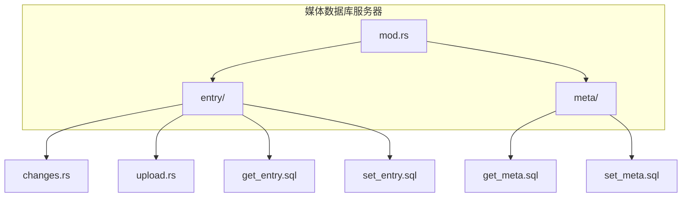
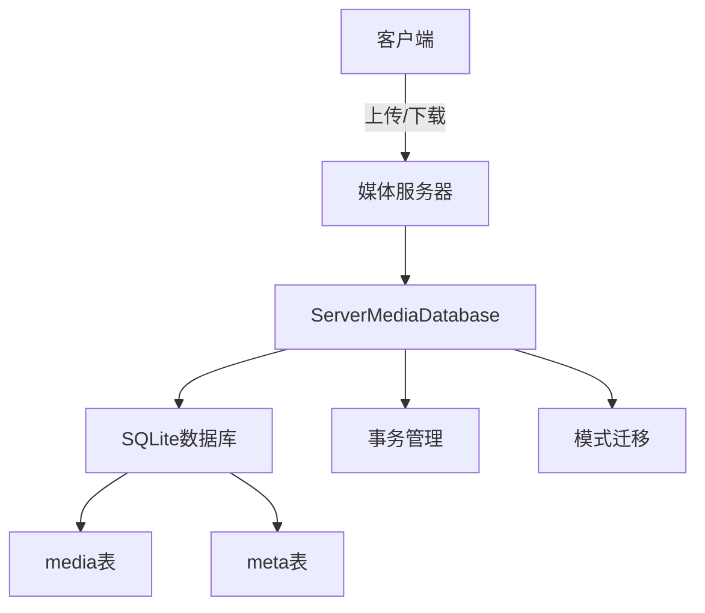
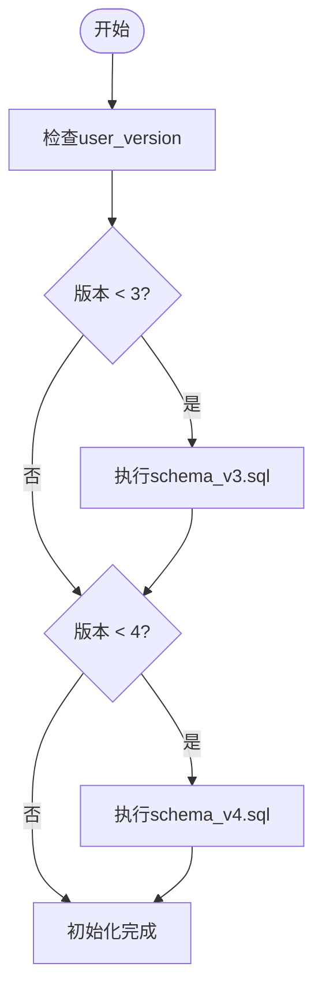
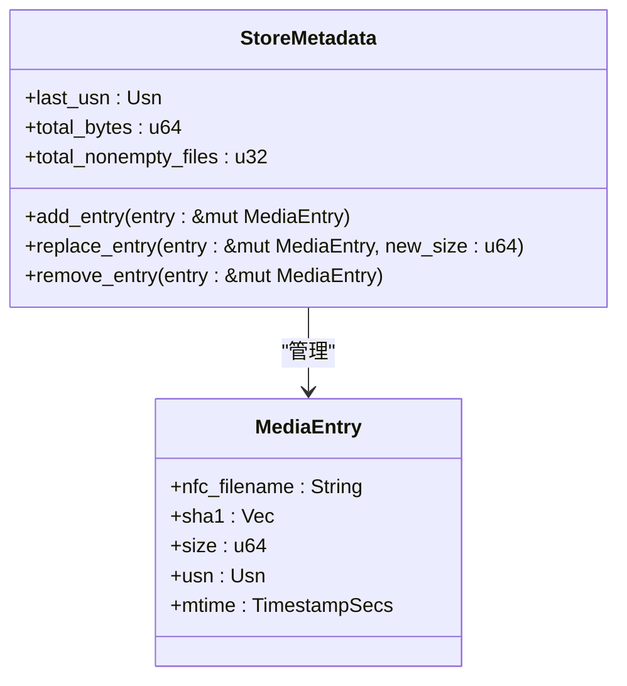
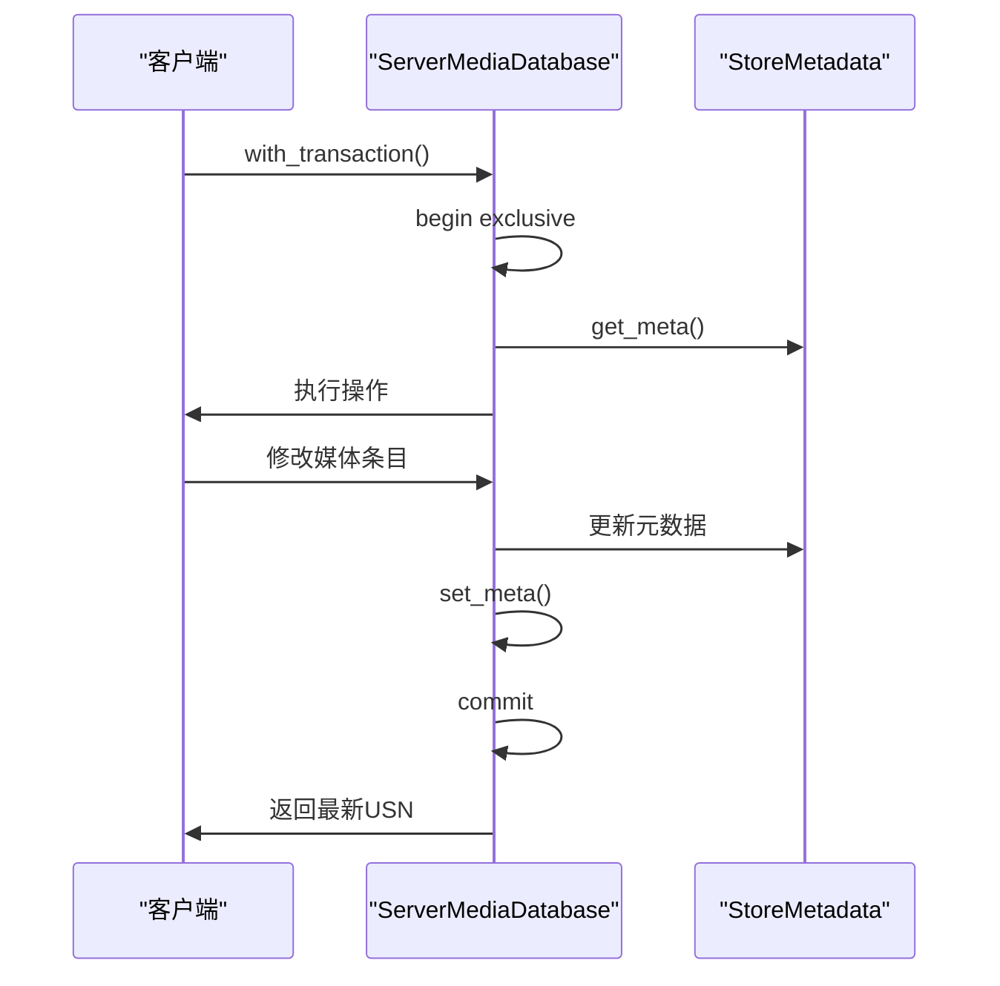
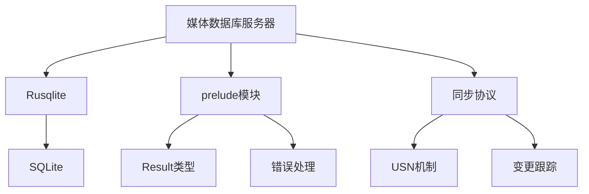

# 媒体数据库服务器

<cite>
**本文档中引用的文件**  
- [mod.rs](file://rslib/src/sync/media/database/server/mod.rs)
- [meta/mod.rs](file://rslib/src/sync/media/database/server/meta/mod.rs)
- [entry/mod.rs](file://rslib/src/sync/media/database/server/entry/mod.rs)
- [schema_v3.sql](file://rslib/src/sync/media/database/server/schema_v3.sql)
- [schema_v4.sql](file://rslib/src/sync/media/database/server/schema_v4.sql)
- [get_meta.sql](file://rslib/src/sync/media/database/server/meta/get_meta.sql)
- [set_meta.sql](file://rslib/src/sync/media/database/server/meta/set_meta.sql)
- [get_entry.sql](file://rslib/src/sync/media/database/server/entry/get_entry.sql)
- [set_entry.sql](file://rslib/src/sync/media/database/server/entry/set_entry.sql)
- [changes.rs](file://rslib/src/sync/media/database/server/entry/changes.rs)
- [upload.rs](file://rslib/src/sync/media/database/server/entry/upload.rs)
</cite>

## 目录
1. [简介](#简介)
2. [项目结构](#项目结构)
3. [核心组件](#核心组件)
4. [架构概述](#架构概述)
5. [详细组件分析](#详细组件分析)
6. [依赖分析](#依赖分析)
7. [性能考虑](#性能考虑)
8. [故障排除指南](#故障排除指南)
9. [结论](#结论)

## 简介
本文档深入解析Anki媒体数据库服务器的架构设计，涵盖元数据存储、变更跟踪和版本控制机制。文档详细说明了服务器端媒体数据库的实现，包括数据库操作、变更条目管理、元数据维护和模式迁移。同时，文档还描述了数据库的模式演进、向后兼容性处理和数据完整性保证，为初学者提供高层次理解，为经验丰富的开发者提供高并发访问处理、数据一致性保证和性能优化策略的详细说明。

## 项目结构
Anki媒体数据库服务器的代码主要位于`rslib/src/sync/media/database/server`目录下，采用模块化设计，分为`entry`和`meta`两个主要子模块，分别处理媒体条目和元数据管理。数据库使用SQLite作为存储引擎，通过Rusqlite库进行操作。

**Diagram sources**
- [mod.rs](file://rslib/src/sync/media/database/server/mod.rs)
- [entry/mod.rs](file://rslib/src/sync/media/database/server/entry/mod.rs)
- [meta/mod.rs](file://rslib/src/sync/media/database/server/meta/mod.rs)

**Section sources**
- [mod.rs](file://rslib/src/sync/media/database/server/mod.rs)
- [entry/mod.rs](file://rslib/src/sync/media/database/server/entry/mod.rs)
- [meta/mod.rs](file://rslib/src/sync/media/database/server/meta/mod.rs)

## 核心组件
媒体数据库服务器的核心组件包括`ServerMediaDatabase`结构体、`MediaEntry`结构体和`StoreMetadata`结构体。`ServerMediaDatabase`封装了数据库连接和主要操作接口，`MediaEntry`表示单个媒体文件的元数据，`StoreMetadata`则维护整个媒体库的统计信息和状态。

**Section sources**
- [mod.rs](file://rslib/src/sync/media/database/server/mod.rs)
- [entry/mod.rs](file://rslib/src/sync/media/database/server/entry/mod.rs)
- [meta/mod.rs](file://rslib/src/sync/media/database/server/meta/mod.rs)

## 架构概述
媒体数据库服务器采用客户端-服务器架构，通过SQLite数据库存储媒体文件的元数据。服务器端维护一个包含媒体文件名、SHA1校验和、大小、USN（更新序列号）和修改时间的数据库表。系统通过事务机制保证数据一致性，并支持模式版本迁移以实现向后兼容性。

**Diagram sources**
- [mod.rs](file://rslib/src/sync/media/database/server/mod.rs)
- [schema_v3.sql](file://rslib/src/sync/media/database/server/schema_v3.sql)
- [schema_v4.sql](file://rslib/src/sync/media/database/server/schema_v4.sql)

## 详细组件分析

### 数据库初始化与模式迁移
服务器在初始化时会检查数据库的`user_version`，并根据版本号执行相应的模式迁移脚本。系统支持从版本3迁移到版本4，迁移过程包括表结构重命名、索引重建和元数据表重构。

**Diagram sources**
- [mod.rs](file://rslib/src/sync/media/database/server/mod.rs)
- [schema_v3.sql](file://rslib/src/sync/media/database/server/schema_v3.sql)
- [schema_v4.sql](file://rslib/src/sync/media/database/server/schema_v4.sql)

**Section sources**
- [mod.rs](file://rslib/src/sync/media/database/server/mod.rs)

### 元数据管理
`StoreMetadata`结构体负责维护媒体库的全局元数据，包括最后使用的USN、总字节数和非空文件数量。所有对媒体条目的增删改操作都会通过`StoreMetadata`的方法进行，确保元数据的实时更新。

**Diagram sources**
- [meta/mod.rs](file://rslib/src/sync/media/database/server/meta/mod.rs)
- [entry/mod.rs](file://rslib/src/sync/media/database/server/entry/mod.rs)

**Section sources**
- [meta/mod.rs](file://rslib/src/sync/media/database/server/meta/mod.rs)

### 变更跟踪与事务管理
系统通过USN（更新序列号）机制跟踪媒体库的变更。每次修改操作都会递增USN，并记录在`MediaEntry`和`StoreMetadata`中。`with_transaction`方法提供事务支持，确保操作的原子性和一致性。

**Diagram sources**
- [meta/mod.rs](file://rslib/src/sync/media/database/server/meta/mod.rs)
- [entry/mod.rs](file://rslib/src/sync/media/database/server/entry/mod.rs)

**Section sources**
- [meta/mod.rs](file://rslib/src/sync/media/database/server/meta/mod.rs)

## 依赖分析
媒体数据库服务器依赖于Rusqlite库进行SQLite数据库操作，并通过`prelude`模块引入核心类型和错误处理机制。系统与Anki的同步协议紧密集成，支持媒体文件的增量同步和冲突解决。

**Diagram sources**
- [mod.rs](file://rslib/src/sync/media/database/server/mod.rs)
- [meta/mod.rs](file://rslib/src/sync/media/database/server/meta/mod.rs)

**Section sources**
- [mod.rs](file://rslib/src/sync/media/database/server/mod.rs)

## 性能考虑
服务器通过多种机制优化性能：使用WAL（Write-Ahead Logging）模式提高并发写入性能，设置exclusive锁定模式减少锁竞争，使用prepared statement缓存减少SQL解析开销。此外，系统通过索引优化查询性能，特别是在基于USN的变更查询方面。

## 故障排除指南
常见问题包括数据库版本不兼容、数据损坏和性能瓶颈。对于版本不兼容问题，应检查`user_version`并执行相应的迁移脚本。数据损坏可通过重新同步或从备份恢复解决。性能瓶颈通常与索引缺失或查询优化不足有关，建议定期分析查询计划并优化索引策略。

**Section sources**
- [mod.rs](file://rslib/src/sync/media/database/server/mod.rs)
- [schema_v3.sql](file://rslib/src/sync/media/database/server/schema_v3.sql)
- [schema_v4.sql](file://rslib/src/sync/media/database/server/schema_v4.sql)

## 结论
Anki媒体数据库服务器设计精巧，通过合理的架构和机制实现了高效、可靠的媒体文件管理。系统支持模式演进和向后兼容性，为未来的功能扩展提供了良好的基础。对于开发者而言，理解其事务管理、变更跟踪和元数据维护机制是进行二次开发和性能优化的关键。