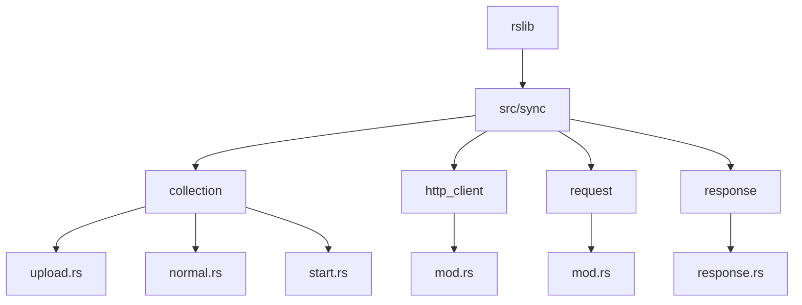
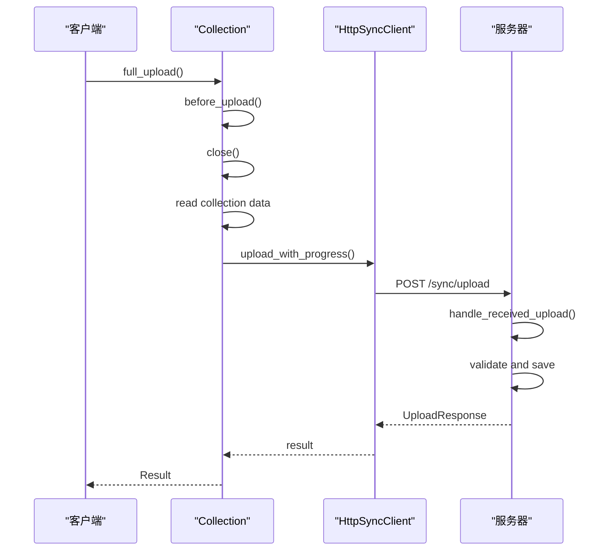
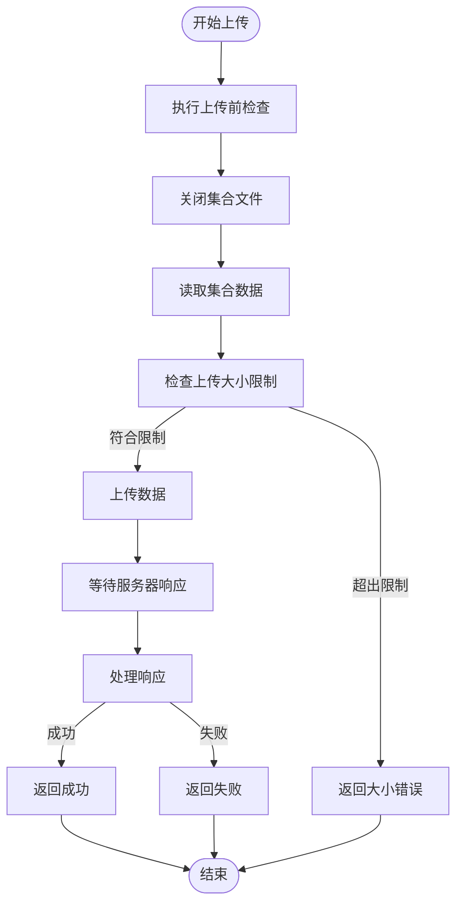
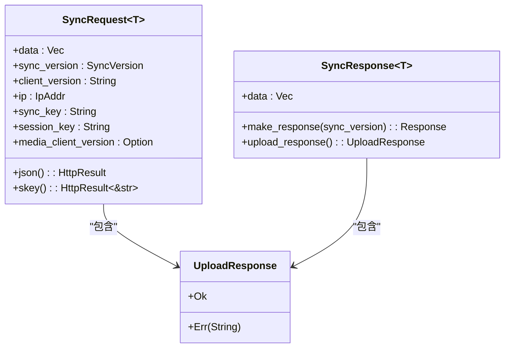
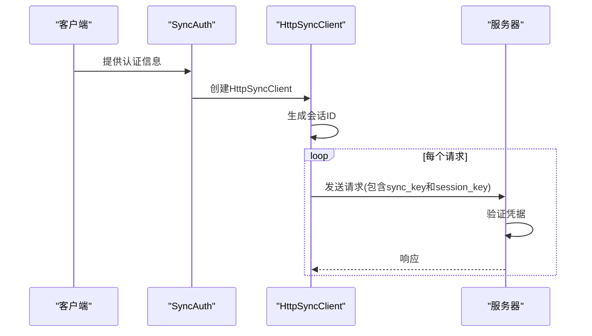
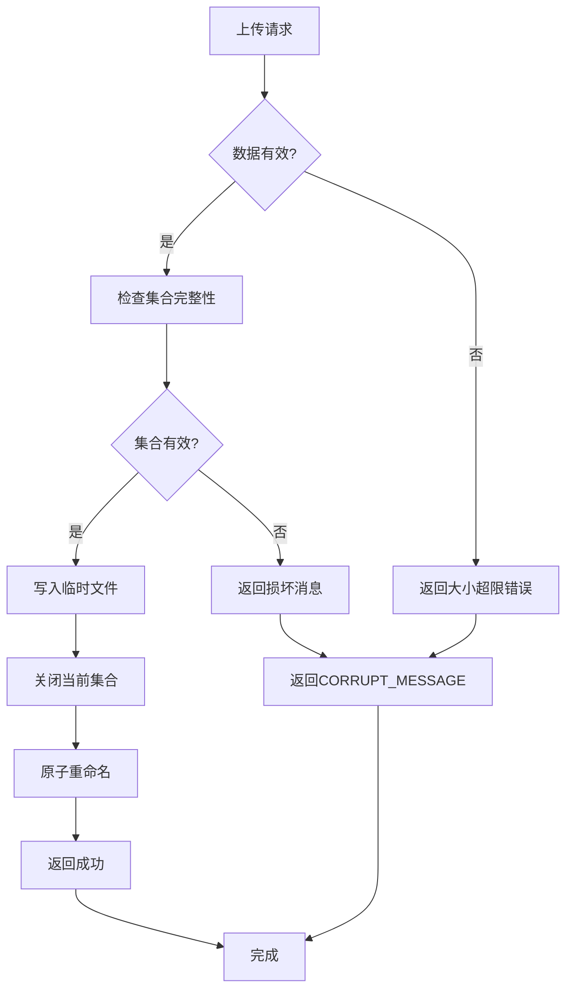
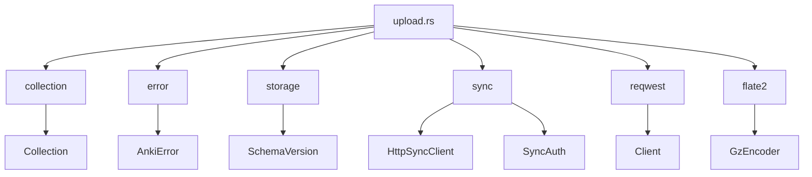

# 上传流程

<cite>
**本文档中引用的文件**   
- [upload.rs](file://rslib/src/sync/collection/upload.rs)
- [http_client/mod.rs](file://rslib/src/sync/http_client/mod.rs)
- [request/mod.rs](file://rslib/src/sync/request/mod.rs)
- [response.rs](file://rslib/src/sync/response.rs)
- [protocol.rs](file://rslib/src/sync/collection/protocol.rs)
- [normal.rs](file://rslib/src/sync/collection/normal.rs)
- [start.rs](file://rslib/src/sync/collection/start.rs)
</cite>

## 目录
1. [简介](#简介)
2. [项目结构](#项目结构)
3. [核心组件](#核心组件)
4. [架构概述](#架构概述)
5. [详细组件分析](#详细组件分析)
6. [依赖分析](#依赖分析)
7. [性能考虑](#性能考虑)
8. [故障排除指南](#故障排除指南)
9. [结论](#结论)

## 简介
Anki是一款流行的间隔重复软件，允许用户通过同步功能在多个设备间保持学习数据的一致性。本文档详细描述了Anki客户端如何将本地变更打包并安全上传到服务器的完整流程。重点分析了`rslib/src/sync/collection/upload.rs`中的实现，涵盖了数据序列化、校验机制、HTTP请求构造以及错误处理策略。文档还解释了上传协议的消息格式、认证机制和重试策略，并描述了上传过程如何与客户端事务管理集成以确保数据一致性。

## 项目结构
Anki的Rust后端库（rslib）包含同步功能的核心实现，位于`rslib/src/sync`目录下。集合同步相关的代码集中在`rslib/src/sync/collection`子目录中，其中`upload.rs`文件专门处理全量上传逻辑。同步系统采用模块化设计，各组件职责分明，包括HTTP客户端、请求/响应处理、协议定义和具体同步操作。

**Diagram sources**
- [upload.rs](file://rslib/src/sync/collection/upload.rs)
- [http_client/mod.rs](file://rslib/src/sync/http_client/mod.rs)
- [request/mod.rs](file://rslib/src/sync/request/mod.rs)

**Section sources**
- [upload.rs](file://rslib/src/sync/collection/upload.rs)
- [http_client/mod.rs](file://rslib/src/sync/http_client/mod.rs)

## 核心组件
Anki的上传流程涉及多个核心组件的协同工作。`Collection::full_upload`是上传操作的入口点，负责协调整个上传过程。`HttpSyncClient`处理与服务器的HTTP通信，`SyncRequest`和`SyncResponse`管理请求/响应的数据格式，而`UploadResponse`则定义了上传结果的可能状态。这些组件共同实现了可靠、安全的集合上传功能。

**Section sources**
- [upload.rs](file://rslib/src/sync/collection/upload.rs#L25-L100)
- [http_client/mod.rs](file://rslib/src/sync/http_client/mod.rs#L15-L80)

## 架构概述
Anki的上传架构采用分层设计，从应用层到网络层清晰分离。客户端首先准备集合数据，然后通过HTTP客户端发送到服务器。服务器接收到上传数据后进行验证和处理。整个流程包含数据准备、传输、验证和确认四个主要阶段，确保数据的完整性和一致性。

**Diagram sources**
- [upload.rs](file://rslib/src/sync/collection/upload.rs#L10-L50)
- [http_client/mod.rs](file://rslib/src/sync/http_client/mod.rs#L20-L40)

## 详细组件分析

### 上传流程分析
Anki的上传流程从客户端调用`Collection::full_upload`方法开始。该方法首先执行上传前检查，关闭当前打开的集合文件，然后读取整个集合数据到内存中。在上传到AnkiWeb时，会检查数据大小是否超过限制。最后，通过HTTP客户端将数据发送到服务器。

#### 上传实现

**Diagram sources**
- [upload.rs](file://rslib/src/sync/collection/upload.rs#L45-L120)
- [normal.rs](file://rslib/src/sync/collection/normal.rs#L15-L50)

### 协议与消息格式
Anki的同步协议定义了客户端与服务器之间通信的标准化格式。`SyncRequest`结构体封装了所有同步请求的通用信息，包括认证凭据、客户端版本和实际数据负载。`UploadResponse`枚举定义了上传操作的两种可能结果：成功（Ok）或带有错误消息的失败（Err）。

**Diagram sources**
- [request/mod.rs](file://rslib/src/sync/request/mod.rs#L50-L80)
- [response.rs](file://rslib/src/sync/response.rs#L30-L60)
- [upload.rs](file://rslib/src/sync/collection/upload.rs#L120-L130)

### 认证与安全机制
Anki的上传流程采用多层安全机制。`SyncAuth`结构体包含同步所需的所有认证信息，包括主机密钥（hkey）和端点URL。`HttpSyncClient`在构造时使用这些凭据，并在每个请求中包含会话密钥以防止并发访问冲突。服务器通过验证这些凭据来确保只有授权客户端才能上传数据。

**Diagram sources**
- [http_client/mod.rs](file://rslib/src/sync/http_client/mod.rs#L40-L70)
- [login.rs](file://rslib/src/sync/login.rs#L10-L30)

### 错误处理与重试策略
Anki的上传系统实现了健壮的错误处理机制。`handle_received_upload`函数在服务器端接收上传数据时会进行完整性检查，如果数据损坏则返回特定错误消息。客户端在上传失败时会收到详细的错误信息，包括大小超限等具体情况。系统还通过事务管理确保在上传失败时能够正确回滚。

**Diagram sources**
- [upload.rs](file://rslib/src/sync/collection/upload.rs#L60-L100)
- [normal.rs](file://rslib/src/sync/collection/normal.rs#L100-L130)

## 依赖分析
Anki的上传功能依赖于多个内部和外部组件。内部依赖包括集合管理、存储层和同步协议模块，外部依赖则包括HTTP客户端库（reqwest）和压缩库（flate2）。这些依赖关系确保了上传功能的完整性和可靠性。

**Diagram sources**
- [upload.rs](file://rslib/src/sync/collection/upload.rs#L1-L20)
- [Cargo.toml](file://rslib/Cargo.toml#L1-L10)

**Section sources**
- [upload.rs](file://rslib/src/sync/collection/upload.rs#L1-L30)
- [Cargo.toml](file://rslib/Cargo.toml#L1-L20)

## 性能考虑
Anki的上传流程在设计时考虑了性能优化。虽然全量上传不涉及分块传输，但系统仍然实现了进度报告功能。`MAXIMUM_SYNC_PAYLOAD_BYTES_UNCOMPRESSED`常量限制了可上传集合的最大大小，防止过大的上传请求影响服务器性能。此外，使用Gzip压缩可以减少网络传输的数据量。

**Section sources**
- [request/mod.rs](file://rslib/src/sync/request/mod.rs#L180-L190)
- [upload.rs](file://rslib/src/sync/collection/upload.rs#L130-L140)

## 故障排除指南
当上传失败时，应首先检查错误消息。如果是"collection exceeds size limit"，说明集合过大；如果是"uploaded file was corrupt/failed to open"，则可能是数据损坏。建议用户先执行"检查数据库"操作，或从备份恢复。网络问题可能导致上传中断，此时可以尝试重新上传。

**Section sources**
- [upload.rs](file://rslib/src/sync/collection/upload.rs#L70-L90)
- [error.rs](file://rslib/src/sync/error.rs#L10-L30)

## 结论
Anki的集合上传流程是一个精心设计的系统，确保了用户数据在设备间安全、可靠地同步。通过分析`rslib/src/sync/collection/upload.rs`的实现，我们可以看到Anki如何处理数据序列化、校验、HTTP传输和错误恢复。该系统与客户端事务管理紧密集成，确保了数据一致性。对于开发者而言，理解这一流程有助于更好地维护和扩展Anki的同步功能。