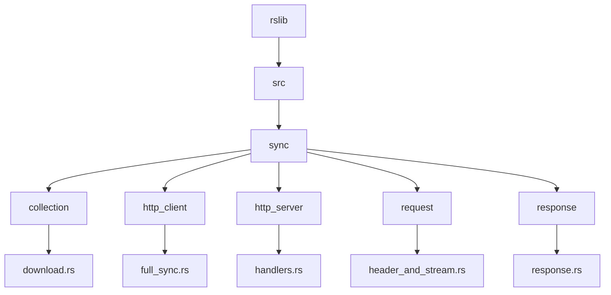
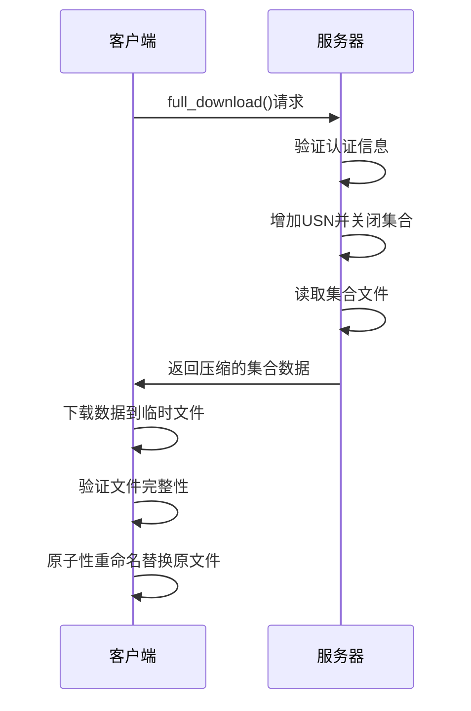
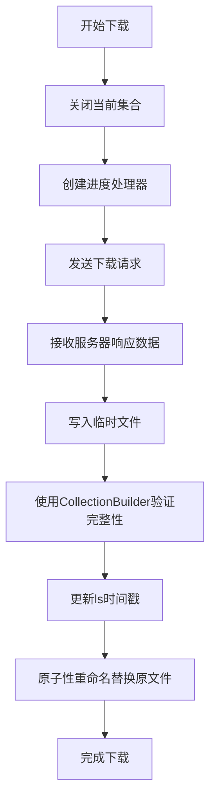
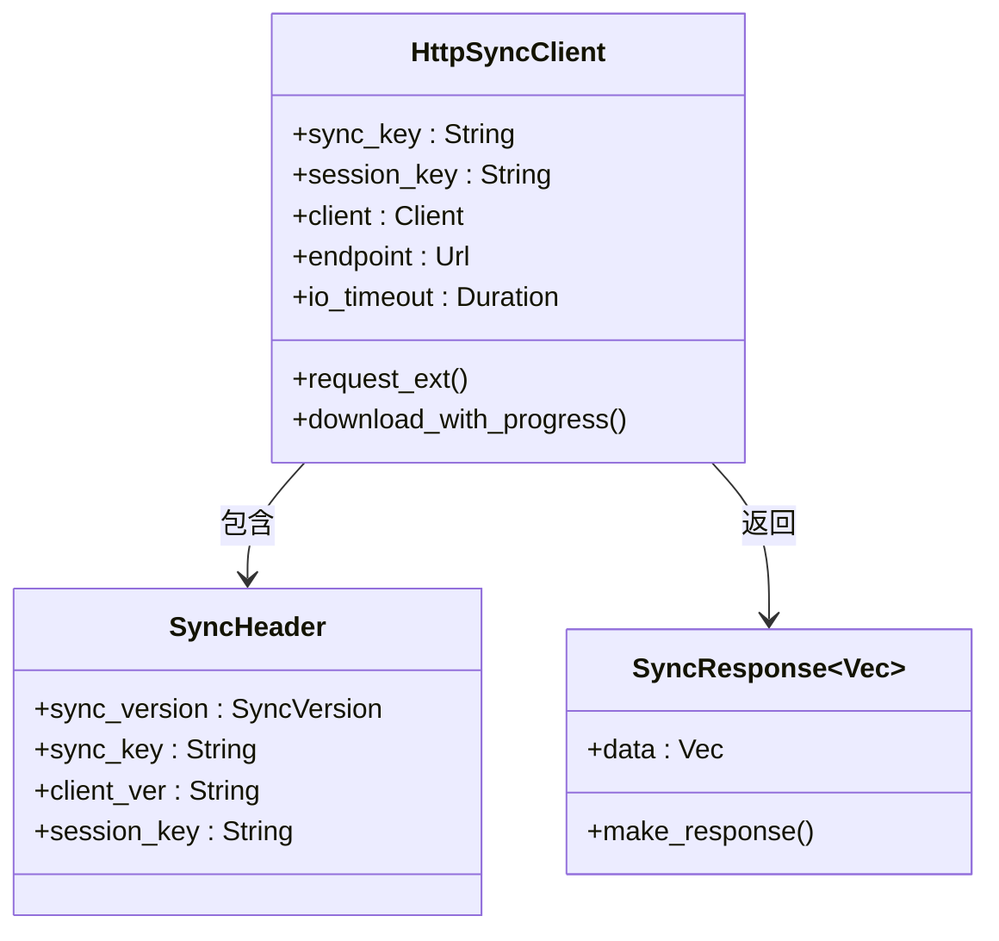
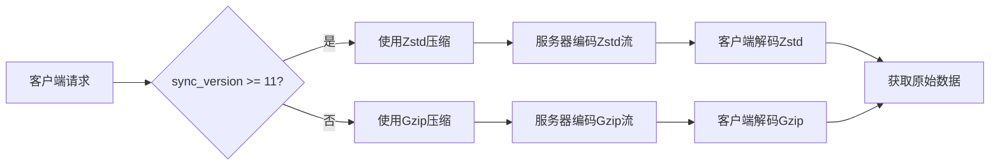
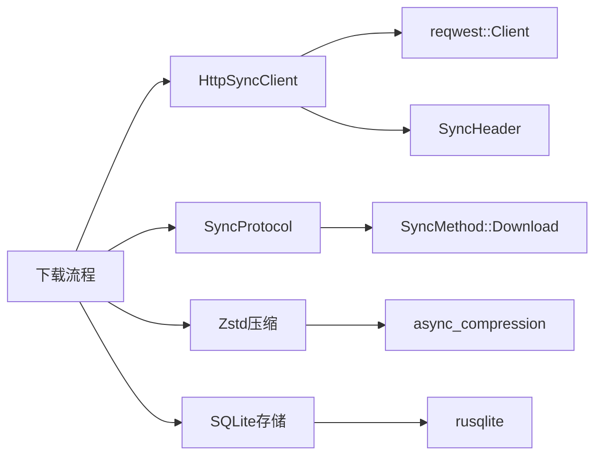

# 下载流程

<cite>
**本文档中引用的文件**
- [download.rs](file://rslib/src/sync/collection/download.rs)
- [full_sync.rs](file://rslib/src/sync/http_client/full_sync.rs)
- [handlers.rs](file://rslib/src/sync/http_server/handlers.rs)
- [version.rs](file://rslib/src/sync/version.rs)
- [header_and_stream.rs](file://rslib/src/sync/request/header_and_stream.rs)
- [response.rs](file://rslib/src/sync/response.rs)
- [sqlite.rs](file://rslib/src/storage/sqlite.rs)
- [protocol.rs](file://rslib/src/sync/collection/protocol.rs)
- [mod.rs](file://rslib/src/sync/http_client/mod.rs)
</cite>

## 目录
1. [简介](#简介)
2. [项目结构](#项目结构)
3. [核心组件](#核心组件)
4. [架构概述](#架构概述)
5. [详细组件分析](#详细组件分析)
6. [依赖分析](#依赖分析)
7. [性能考虑](#性能考虑)
8. [故障排除指南](#故障排除指南)
9. [结论](#结论)

## 简介
本文档深入解析Anki集合同步下载流程，详细说明客户端如何从服务器获取远程变更并安全地应用到本地数据库。文档涵盖下载协议的响应处理、数据解包和完整性验证机制，以及不同类型数据块（笔记、卡片、媒体等）的处理方式。同时解释了事务管理的重要性，确保在应用远程变更时的数据一致性，并提供了解决数据损坏恢复、版本冲突和部分下载处理等常见问题的方法。

## 项目结构
Anki的同步功能主要位于rslib/src/sync目录下，其中下载流程的核心实现分布在多个模块中。主要结构包括collection（集合操作）、http_client（HTTP客户端）、http_server（HTTP服务器）和request/response（请求响应处理）等组件。

**图示来源**
- [download.rs](file://rslib/src/sync/collection/download.rs)
- [full_sync.rs](file://rslib/src/sync/http_client/full_sync.rs)
- [handlers.rs](file://rslib/src/sync/http_server/handlers.rs)

**本节来源**
- [download.rs](file://rslib/src/sync/collection/download.rs)
- [project_structure](file://project_structure#L1-L10)

## 核心组件
下载流程的核心组件包括客户端下载实现、服务器端下载处理、数据压缩/解压缩机制和版本控制。这些组件协同工作，确保集合数据能够安全、高效地从服务器传输到客户端。

**本节来源**
- [download.rs](file://rslib/src/sync/collection/download.rs#L1-L63)
- [handlers.rs](file://rslib/src/sync/http_server/handlers.rs#L161-L189)

## 架构概述
Anki的下载流程采用客户端-服务器架构，通过HTTP协议进行通信。客户端发起下载请求，服务器验证请求并返回压缩的集合数据，客户端接收后进行完整性验证并替换本地集合文件。

**图示来源**
- [download.rs](file://rslib/src/sync/collection/download.rs#L25-L62)
- [handlers.rs](file://rslib/src/sync/http_server/handlers.rs#L180-L189)

## 详细组件分析

### 下载流程分析
Anki的下载流程分为客户端和服务器端两个部分，通过标准化的协议进行通信，确保数据的一致性和完整性。

#### 客户端下载实现

**图示来源**
- [download.rs](file://rslib/src/sync/collection/download.rs#L25-L45)
- [full_sync.rs](file://rslib/src/sync/http_client/full_sync.rs#L56-L81)

#### 服务器端下载处理

**图示来源**
- [handlers.rs](file://rslib/src/sync/http_server/handlers.rs#L180-L189)
- [mod.rs](file://rslib/src/sync/http_client/mod.rs#L45-L75)

#### 数据压缩与解压缩机制

**图示来源**
- [version.rs](file://rslib/src/sync/version.rs#L30-L79)
- [header_and_stream.rs](file://rslib/src/sync/request/header_and_stream.rs#L29-L72)
- [response.rs](file://rslib/src/sync/response.rs#L38-L86)

**本节来源**
- [download.rs](file://rslib/src/sync/collection/download.rs#L25-L62)
- [full_sync.rs](file://rslib/src/sync/http_client/full_sync.rs#L56-L81)
- [handlers.rs](file://rslib/src/sync/http_server/handlers.rs#L180-L189)
- [version.rs](file://rslib/src/sync/version.rs#L30-L79)

## 依赖分析
下载流程涉及多个组件之间的依赖关系，包括HTTP客户端、同步协议、数据压缩库和数据库存储等。

**图示来源**
- [mod.rs](file://rslib/src/sync/http_client/mod.rs)
- [protocol.rs](file://rslib/src/sync/collection/protocol.rs)
- [header_and_stream.rs](file://rslib/src/sync/request/header_and_stream.rs)

**本节来源**
- [download.rs](file://rslib/src/sync/collection/download.rs)
- [mod.rs](file://rslib/src/sync/http_client/mod.rs)
- [protocol.rs](file://rslib/src/sync/collection/protocol.rs)

## 性能考虑
下载流程在性能方面进行了多项优化，包括数据压缩、进度监控和原子性文件操作。Zstd压缩算法提供了良好的压缩比和速度平衡，进度监控机制允许用户了解下载状态，而原子性文件重命名确保了操作的完整性，避免了部分写入导致的数据损坏。

## 故障排除指南
常见问题及解决方案：
- **数据损坏恢复**：通过CollectionBuilder的完整性检查机制自动检测，若验证失败则保留原文件
- **版本冲突解决**：通过USN（更新序列号）机制确保数据一致性，下载前会增加本地USN
- **部分下载处理**：使用临时文件和原子性重命名，确保只有完整下载成功后才会替换原文件
- **网络中断恢复**：支持断点续传，通过进度监控机制记录已传输的字节数

**本节来源**
- [download.rs](file://rslib/src/sync/collection/download.rs#L45-L62)
- [sqlite.rs](file://rslib/src/storage/sqlite.rs#L436-L482)

## 结论
Anki的集合同步下载流程设计严谨，通过客户端-服务器架构、数据压缩、完整性验证和原子性操作等机制，确保了数据同步的安全性和可靠性。流程中的每个环节都经过精心设计，既考虑了性能优化，又兼顾了错误处理和数据完整性，为用户提供稳定可靠的同步体验。