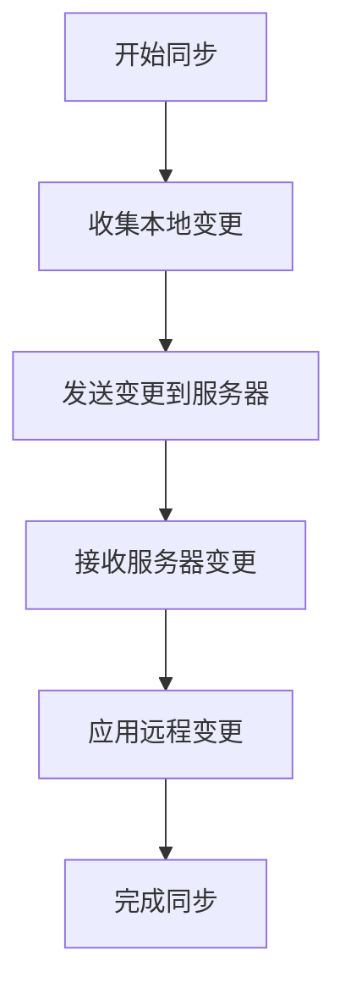
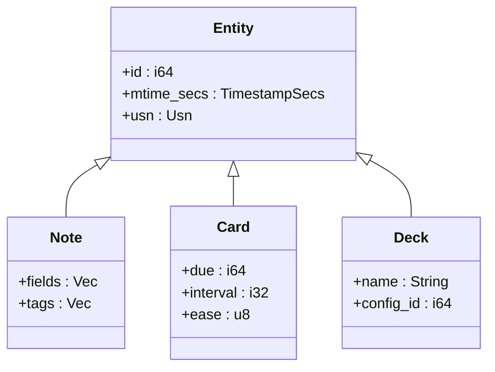
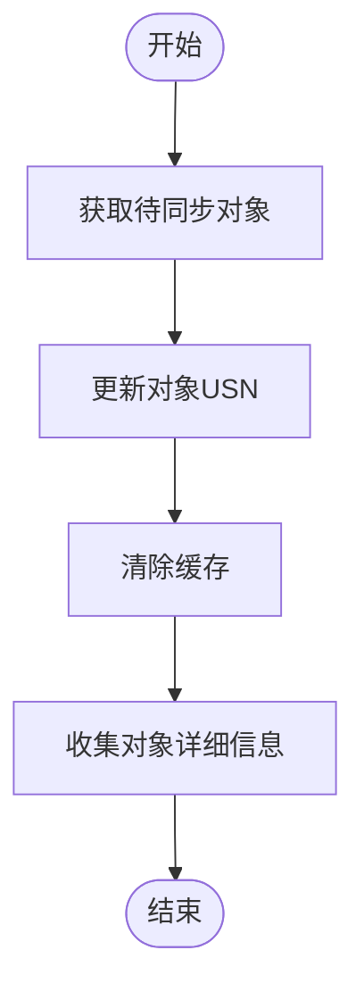
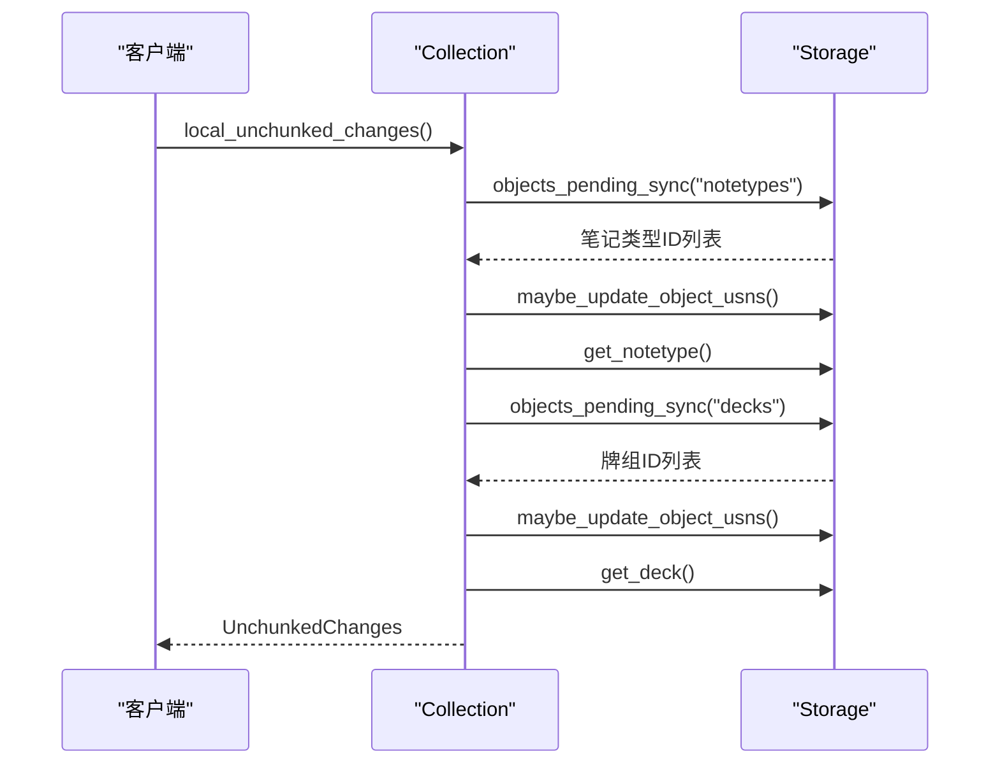
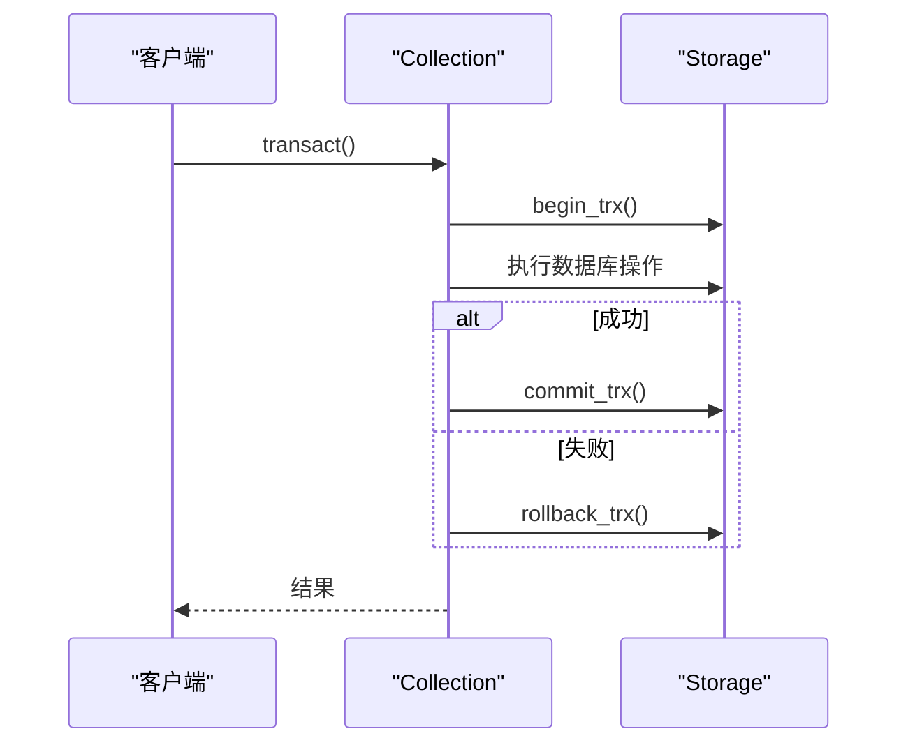
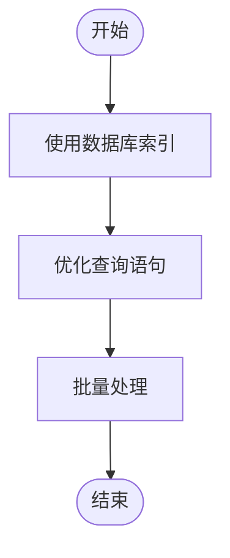
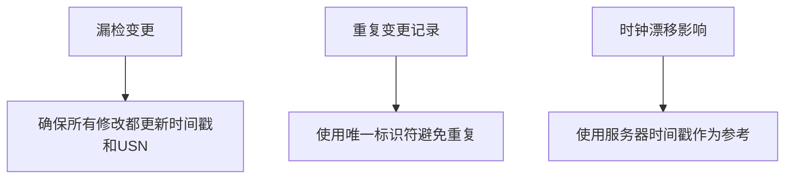

# 变更检测

<cite>
**本文档中引用的文件**  
- [changes.rs](file://rslib/src/sync/collection/changes.rs)
- [collection.rs](file://rslib/src/collection/mod.rs)
- [sqlite.rs](file://rslib/src/storage/sqlite.rs)
- [transact.rs](file://rslib/src/collection/transact.rs)
- [sync.rs](file://rslib/src/sync/mod.rs)
</cite>

## 目录
1. [简介](#简介)
2. [变更检测机制概述](#变更检测机制概述)
3. [时间戳与序列号跟踪](#时间戳与序列号跟踪)
4. [变更收集算法实现](#变更收集算法实现)
5. [变更记录生成过程](#变更记录生成过程)
6. [变更集分类与上传准备](#变更集分类与上传准备)
7. [数据库事务集成](#数据库事务集成)
8. [性能优化策略](#性能优化策略)
9. [常见问题与解决方案](#常见问题与解决方案)
10. [结论](#结论)

## 简介
Anki集合同步中的变更检测机制是确保数据一致性的重要组成部分。该机制通过时间戳和序列号来跟踪笔记、卡片、牌组等实体的修改，实现高效的数据同步。本文档将深入探讨这一机制的实现细节，为开发者提供全面的技术指导。

## 变更检测机制概述
Anki的变更检测机制主要通过`rslib/src/sync/collection/changes.rs`文件中的代码实现。该机制负责收集本地更改并将其应用到远程服务器，同时处理从服务器接收的更改。核心功能包括变更的收集、分类、应用和同步状态的管理。



**Diagram sources**
- [changes.rs](file://rslib/src/sync/collection/changes.rs#L1-L325)

**Section sources**
- [changes.rs](file://rslib/src/sync/collection/changes.rs#L1-L325)

## 时间戳与序列号跟踪
Anki使用时间戳和序列号（USN）来跟踪实体的修改。每个实体都有一个最后修改时间戳（mtime_secs）和一个更新序列号（usn）。当实体被修改时，其时间戳会被更新，同时USN会递增。



**Diagram sources**
- [changes.rs](file://rslib/src/sync/collection/changes.rs#L111-L136)
- [collection.rs](file://rslib/src/collection/mod.rs)

**Section sources**
- [changes.rs](file://rslib/src/sync/collection/changes.rs#L111-L136)
- [collection.rs](file://rslib/src/collection/mod.rs)

## 变更收集算法实现
变更收集算法通过增量查询、脏数据标记和批量处理策略来高效地识别和收集变更。算法首先确定待同步的对象，然后更新其USN，并最终收集这些对象的详细信息。



**Diagram sources**
- [changes.rs](file://rslib/src/sync/collection/changes.rs#L111-L136)
- [sqlite.rs](file://rslib/src/storage/sqlite.rs)

**Section sources**
- [changes.rs](file://rslib/src/sync/collection/changes.rs#L111-L136)
- [sqlite.rs](file://rslib/src/storage/sqlite.rs)

## 变更记录生成过程
变更记录的生成过程在`rslib/src/sync/collection/changes.rs`文件中实现。`local_unchunked_changes`函数负责生成本地变更记录，包括笔记类型、牌组、配置和标签的变更。



**Diagram sources**
- [changes.rs](file://rslib/src/sync/collection/changes.rs#L111-L136)

**Section sources**
- [changes.rs](file://rslib/src/sync/collection/changes.rs#L111-L136)

## 变更集分类与上传准备
变更集被分类为新增、修改和删除三种类型，并准备用于上传。`UnchunkedChanges`结构体包含了所有待同步的变更，包括笔记类型、牌组、配置和标签。

```mermaid
erDiagram
UNCHUNKED_CHANGES {
Vec<NotetypeSchema11> notetypes
DecksAndConfig decks_and_config
Vec<String> tags
Option<HashMap<String, Value>> config
Option<TimestampSecs> creation_stamp
}
DECKS_AND_CONFIG {
Vec<DeckSchema11> decks
Vec<DeckConfSchema11> config
}
UNCHUNKED_CHANGES ||--o{ DECKS_AND_CONFIG : 包含
```

**Diagram sources**
- [changes.rs](file://rslib/src/sync/collection/changes.rs#L20-L35)

**Section sources**
- [changes.rs](file://rslib/src/sync/collection/changes.rs#L20-L35)

## 数据库事务集成
变更检测机制与数据库事务紧密集成，确保变更检测的一致性和原子性。通过使用事务，Anki能够保证在发生错误时回滚所有更改，维护数据的完整性。



**Diagram sources**
- [transact.rs](file://rslib/src/collection/transact.rs)
- [sqlite.rs](file://rslib/src/storage/sqlite.rs)

**Section sources**
- [transact.rs](file://rslib/src/collection/transact.rs)
- [sqlite.rs](file://rslib/src/storage/sqlite.rs)

## 性能优化策略
为了提高性能，Anki采用了多种优化策略，包括索引使用和查询优化。通过合理使用数据库索引，可以显著提高查询效率，减少同步时间。



**Diagram sources**
- [sqlite.rs](file://rslib/src/storage/sqlite.rs)
- [changes.rs](file://rslib/src/sync/collection/changes.rs)

**Section sources**
- [sqlite.rs](file://rslib/src/storage/sqlite.rs)
- [changes.rs](file://rslib/src/sync/collection/changes.rs)

## 常见问题与解决方案
在使用Anki的变更检测机制时，可能会遇到一些常见问题，如漏检变更、重复变更记录和时钟漂移影响。针对这些问题，可以采取相应的解决方案。



**Diagram sources**
- [changes.rs](file://rslib/src/sync/collection/changes.rs)
- [sync.rs](file://rslib/src/sync/mod.rs)

**Section sources**
- [changes.rs](file://rslib/src/sync/collection/changes.rs)
- [sync.rs](file://rslib/src/sync/mod.rs)

## 结论
Anki的变更检测机制通过时间戳和序列号跟踪实体的修改，实现了高效的数据同步。通过深入理解这一机制的实现细节，开发者可以更好地优化应用程序性能，解决常见问题，确保数据的一致性和完整性。