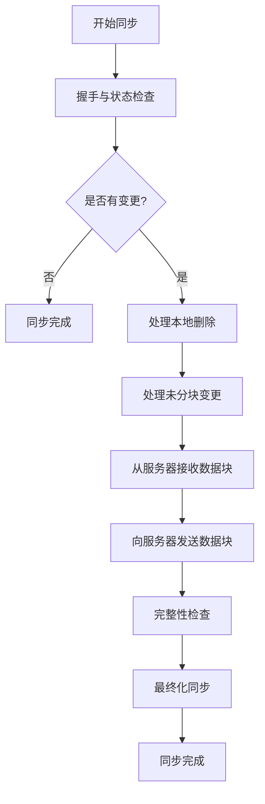
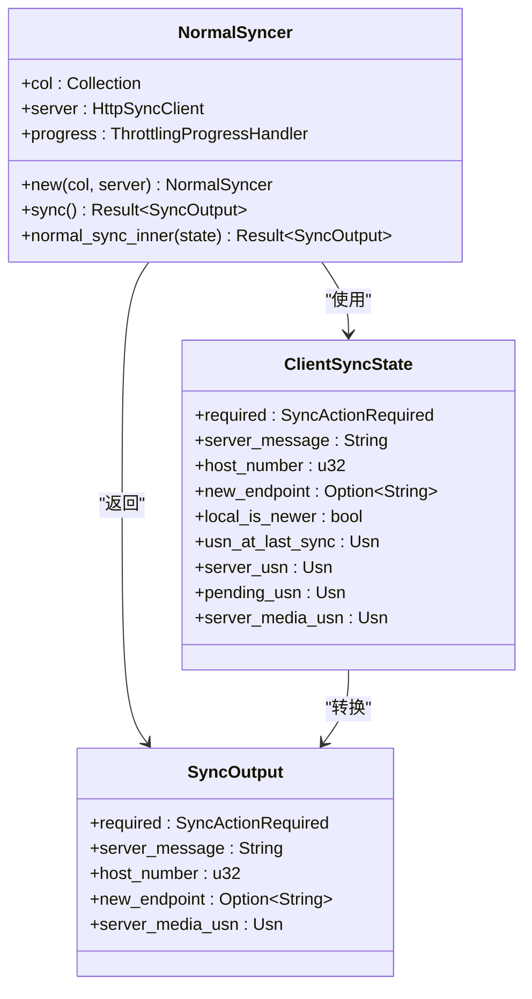
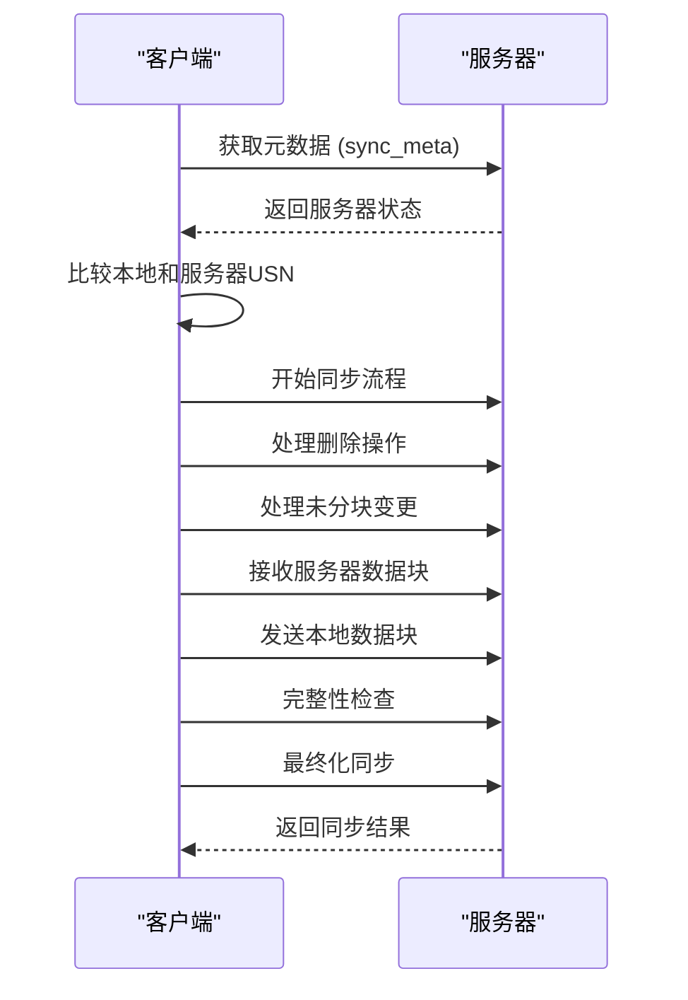
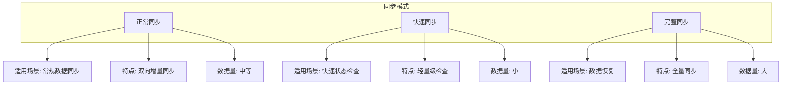
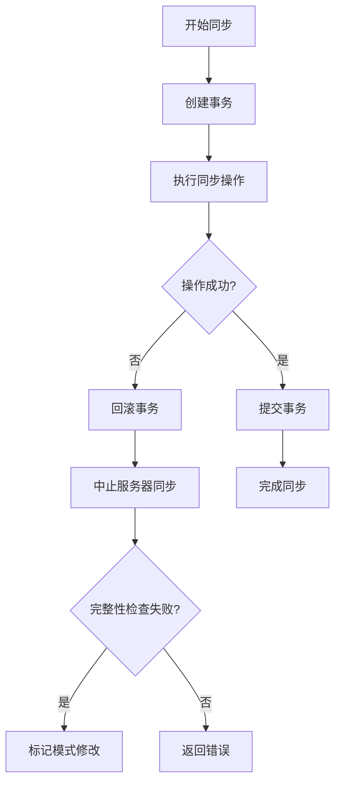
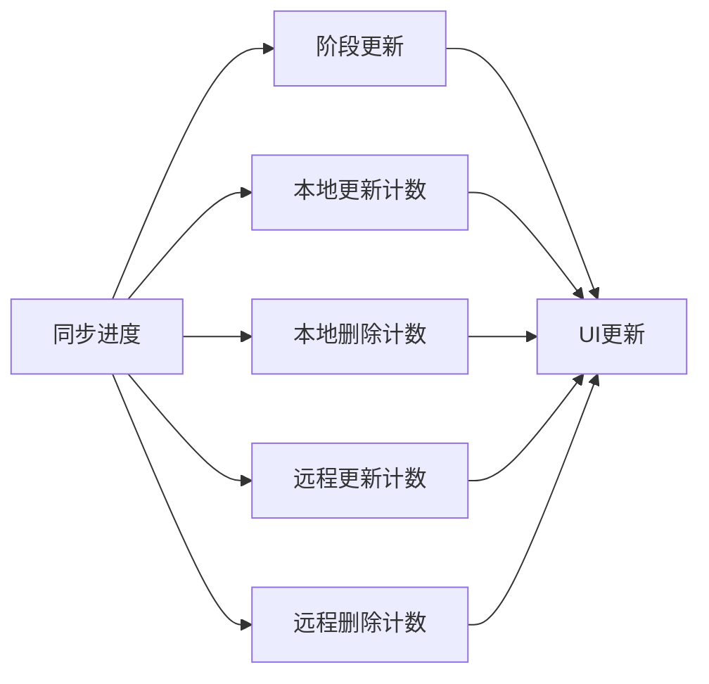

# 正常同步

<cite>
**本文档中引用的文件**  
- [normal.rs](file://rslib/src/sync/collection/normal.rs)
- [sync.py](file://qt/aqt/sync.py)
- [http_client.rs](file://rslib/src/sync/http_client/protocol.rs)
- [response.rs](file://rslib/src/sync/response.rs)
</cite>

## 目录
1. [简介](#简介)
2. [正常同步生命周期](#正常同步生命周期)
3. [状态机实现](#状态机实现)
4. [数据一致性保证](#数据一致性保证)
5. [与其他同步模式的对比](#与其他同步模式的对比)
6. [错误处理与恢复策略](#错误处理与恢复策略)
7. [常见问题与解决方案](#常见问题与解决方案)
8. [结论](#结论)

## 简介
正常同步是Anki同步系统中的核心双向同步模式，负责在客户端和服务器之间保持数据的最终一致性。该模式通过一系列协调的阶段来确保数据变更能够正确地在两端传播，同时处理各种边界情况和异常场景。

**Section sources**
- [normal.rs](file://rslib/src/sync/collection/normal.rs#L1-L20)

## 正常同步生命周期
正常同步会话包含五个主要阶段：握手、检查、上传、下载和完成。整个过程由`NormalSyncer`结构体协调管理。

**Diagram sources**
- [normal.rs](file://rslib/src/sync/collection/normal.rs#L43-L66)
- [normal.rs](file://rslib/src/sync/collection/normal.rs#L100-L130)

**Section sources**
- [normal.rs](file://rslib/src/sync/collection/normal.rs#L43-L178)

## 状态机实现
正常同步的状态机由`NormalSyncer`结构体实现，该结构体管理同步过程中的各个阶段和状态转换。

**Diagram sources**
- [normal.rs](file://rslib/src/sync/collection/normal.rs#L10-L40)
- [normal.rs](file://rslib/src/sync/collection/normal.rs#L43-L66)
- [normal.rs](file://rslib/src/sync/collection/normal.rs#L133-L177)

**Section sources**
- [normal.rs](file://rslib/src/sync/collection/normal.rs#L10-L178)

## 数据一致性保证
正常同步通过多种机制确保客户端和服务器端数据的最终一致性。

### USN（更新序列号）机制
同步过程使用USN（Update Sequence Number）来跟踪变更，确保所有变更都能被正确处理。

**Diagram sources**
- [normal.rs](file://rslib/src/sync/collection/normal.rs#L43-L66)
- [http_client.rs](file://rslib/src/sync/http_client/protocol.rs#L81-L124)

**Section sources**
- [normal.rs](file://rslib/src/sync/collection/normal.rs#L43-L66)
- [http_client.rs](file://rslib/src/sync/http_client/protocol.rs#L81-L124)

## 与其他同步模式的对比
正常同步与其他同步模式（如快速同步）在适用场景和功能特性上有所不同。

**Diagram sources**
- [normal.rs](file://rslib/src/sync/collection/normal.rs#L1-L178)
- [response.rs](file://rslib/src/sync/response.rs#L38-L86)

**Section sources**
- [normal.rs](file://rslib/src/sync/collection/normal.rs#L1-L178)

## 错误处理与恢复策略
正常同步实现了完善的错误处理和恢复机制，确保在异常情况下能够正确恢复。

### 超时与资源管理

**Diagram sources**
- [normal.rs](file://rslib/src/sync/collection/normal.rs#L50-L100)
- [http_client.rs](file://rslib/src/sync/http_client/protocol.rs#L81-L124)

**Section sources**
- [normal.rs](file://rslib/src/sync/collection/normal.rs#L50-L100)

## 常见问题与解决方案
### 同步死锁
当多个同步操作同时尝试修改相同的数据时可能发生死锁。解决方案包括使用事务隔离和适当的锁管理。

### 状态不一致
由于网络中断或客户端崩溃可能导致状态不一致。系统通过完整性检查和事务回滚机制来解决此问题。

### 长时间运行同步的监控

**Diagram sources**
- [normal.rs](file://rslib/src/sync/collection/normal.rs#L15-L25)
- [sync.py](file://qt/aqt/sync.py#L78-L91)

**Section sources**
- [normal.rs](file://rslib/src/sync/collection/normal.rs#L15-L25)
- [sync.py](file://qt/aqt/sync.py#L78-L91)

## 结论
正常同步模式是Anki数据同步的核心机制，通过精心设计的状态机和协调逻辑，确保了客户端和服务器之间数据的最终一致性。该模式能够有效处理各种边界情况，包括空集合、大规模数据变更等，并提供了完善的错误恢复机制。