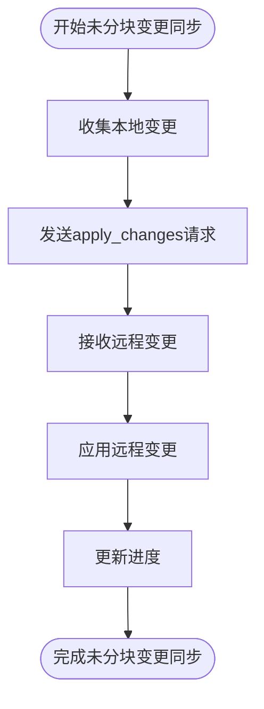

# 集合同步

<cite>
**本文档引用的文件**  
- [rslib/src/sync/collection/mod.rs](file://rslib/src/sync/collection/mod.rs)
- [rslib/src/sync/collection/protocol.rs](file://rslib/src/sync/collection/protocol.rs)
- [rslib/src/sync/collection/start.rs](file://rslib/src/sync/collection/start.rs)
- [rslib/src/sync/collection/changes.rs](file://rslib/src/sync/collection/changes.rs)
- [rslib/src/sync/collection/chunks.rs](file://rslib/src/sync/collection/chunks.rs)
- [rslib/src/sync/collection/finish.rs](file://rslib/src/sync/collection/finish.rs)
- [rslib/src/sync/collection/normal.rs](file://rslib/src/sync/collection/normal.rs)
- [rslib/src/sync/collection/status.rs](file://rslib/src/sync/collection/status.rs)
- [rslib/src/sync/collection/meta.rs](file://rslib/src/sync/collection/meta.rs)
- [rslib/src/sync/collection/sanity.rs](file://rslib/src/sync/collection/sanity.rs)
- [rslib/src/sync/collection/graves.rs](file://rslib/src/sync/collection/graves.rs)
- [rslib/src/sync/collection/upload.rs](file://rslib/src/sync/collection/upload.rs)
- [rslib/src/sync/collection/download.rs](file://rslib/src/sync/collection/download.rs)
</cite>

## 目录
1. [简介](#简介)
2. [同步会话生命周期](#同步会话生命周期)
3. [变更检测算法](#变更检测算法)
4. [增量同步协议](#增量同步协议)
5. [冲突解决机制](#冲突解决机制)
6. [数据序列化与校验](#数据序列化与校验)
7. [事务处理](#事务处理)
8. [正常同步与快速同步](#正常同步与快速同步)
9. [协议消息格式](#协议消息格式)
10. [状态机转换](#状态机转换)
11. [错误恢复策略](#错误恢复策略)
12. [常见问题处理](#常见问题处理)
13. [性能优化建议](#性能优化建议)

## 简介
Anki的集合同步系统实现了双向增量同步机制，确保多个设备间的集合数据一致性。该系统通过检测本地和远程集合的修改时间戳、模式变更和更新序列号（USN）来决定同步策略。同步过程分为元数据检查、删除处理、未分块变更同步、分块数据同步、完整性检查和最终化等阶段。系统支持正常同步和全量同步两种模式，能够处理部分同步失败、数据不一致和版本兼容性等复杂场景。

## 同步会话生命周期
Anki的同步会话遵循严格的生命周期管理，从状态检查开始，经过多个协调阶段，最终完成同步或处理错误。整个过程确保数据一致性和事务完整性。

**Diagram sources**
- [rslib/src/sync/collection/normal.rs](file://rslib/src/sync/collection/normal.rs#L100-L170)
- [rslib/src/sync/collection/status.rs](file://rslib/src/sync/collection/status.rs#L40-L55)

**Section sources**
- [rslib/src/sync/collection/normal.rs](file://rslib/src/sync/collection/normal.rs#L1-L178)
- [rslib/src/sync/collection/status.rs](file://rslib/src/sync/collection/status.rs#L1-L57)

## 变更检测算法
Anki使用多维度的变更检测算法来确定同步需求。系统通过比较本地和远程集合的修改时间戳、模式时间戳和更新序列号来判断数据是否发生变化。

**Diagram sources**
- [rslib/src/sync/collection/status.rs](file://rslib/src/sync/collection/status.rs#L10-L57)
- [rslib/src/sync/collection/meta.rs](file://rslib/src/sync/collection/meta.rs#L100-L185)

**Section sources**
- [rslib/src/sync/collection/status.rs](file://rslib/src/sync/collection/status.rs#L1-L57)
- [rslib/src/sync/collection/meta.rs](file://rslib/src/sync/collection/meta.rs#L1-L185)

## 增量同步协议
Anki的增量同步协议采用分阶段、分块的方式传输数据变更，确保大集合的高效同步。协议将变更分为未分块变更和分块数据两类进行处理。

### 未分块变更同步
未分块变更包括牌组、牌组配置、牌型和标签等元数据变更。这些变更在单个请求中批量传输。

**Diagram sources**
- [rslib/src/sync/collection/changes.rs](file://rslib/src/sync/collection/changes.rs#L50-L325)

### 分块数据同步
分块数据包括卡片、笔记和复习记录等大量数据。这些数据被分割成固定大小的块进行传输，每块包含250个对象。

**Diagram sources**
- [rslib/src/sync/collection/chunks.rs](file://rslib/src/sync/collection/chunks.rs#L100-L432)

**Section sources**
- [rslib/src/sync/collection/changes.rs](file://rslib/src/sync/collection/changes.rs#L1-L325)
- [rslib/src/sync/collection/chunks.rs](file://rslib/src/sync/collection/chunks.rs#L1-L432)

## 冲突解决机制
Anki的冲突解决机制基于最后写入获胜（Last Write Wins）原则，通过比较对象的修改时间戳来决定保留哪个版本。

**Diagram sources**
- [rslib/src/sync/collection/chunks.rs](file://rslib/src/sync/collection/chunks.rs#L200-L300)

**Section sources**
- [rslib/src/sync/collection/chunks.rs](file://rslib/src/sync/collection/chunks.rs#L1-L432)

## 数据序列化与校验
Anki使用JSON格式进行数据序列化，并通过完整性检查确保数据一致性。系统在同步完成后执行双向完整性检查。

**Diagram sources**
- [rslib/src/sync/collection/protocol.rs](file://rslib/src/sync/collection/protocol.rs#L1-L112)

**Section sources**
- [rslib/src/sync/collection/protocol.rs](file://rslib/src/sync/collection/protocol.rs#L1-L112)

## 事务处理
Anki的同步过程在数据库事务中执行，确保原子性和一致性。如果同步失败，系统会回滚所有更改。

**Diagram sources**
- [rslib/src/sync/collection/normal.rs](file://rslib/src/sync/collection/normal.rs#L120-L150)

**Section sources**
- [rslib/src/sync/collection/normal.rs](file://rslib/src/sync/collection/normal.rs#L1-L178)

## 正常同步与快速同步
Anki支持两种同步模式：正常同步和全量同步（快速同步）。系统根据元数据比较结果决定使用哪种模式。

**Diagram sources**
- [rslib/src/sync/collection/meta.rs](file://rslib/src/sync/collection/meta.rs#L150-L185)

**Section sources**
- [rslib/src/sync/collection/meta.rs](file://rslib/src/sync/collection/meta.rs#L1-L185)

## 协议消息格式
Anki同步协议定义了多种消息类型，每种类型对应特定的同步操作。消息通过HTTP端点进行传输。

**Diagram sources**
- [rslib/src/sync/collection/protocol.rs](file://rslib/src/sync/collection/protocol.rs#L50-L100)

**Section sources**
- [rslib/src/sync/collection/protocol.rs](file://rslib/src/sync/collection/protocol.rs#L1-L112)

## 状态机转换
同步过程可以看作一个状态机，每个阶段对应一个状态，通过特定事件触发状态转换。

**Diagram sources**
- [rslib/src/sync/collection/normal.rs](file://rslib/src/sync/collection/normal.rs#L100-L170)

**Section sources**
- [rslib/src/sync/collection/normal.rs](file://rslib/src/sync/collection/normal.rs#L1-L178)

## 错误恢复策略
Anki实现了全面的错误恢复机制，确保在各种故障情况下数据的完整性和一致性。

**Diagram sources**
- [rslib/src/sync/collection/normal.rs](file://rslib/src/sync/collection/normal.rs#L140-L150)

**Section sources**
- [rslib/src/sync/collection/normal.rs](file://rslib/src/sync/collection/normal.rs#L1-L178)

## 常见问题处理
### 部分同步失败
当同步过程中断时，Anki通过事务回滚确保数据一致性，并在下次同步时重新开始。

### 数据不一致检测
系统通过完整性检查（sanity check）验证本地和远程数据的一致性，如果发现不一致，会要求全量同步。

### 版本兼容性处理
Anki通过同步版本号和客户端版本信息确保向前和向后兼容性，不兼容的客户端会被阻止同步。

**Section sources**
- [rslib/src/sync/collection/sanity.rs](file://rslib/src/sync/collection/sanity.rs#L1-L122)
- [rslib/src/sync/collection/meta.rs](file://rslib/src/sync/collection/meta.rs#L100-L185)

## 性能优化建议
### 批量处理
- 使用分块机制批量处理大量数据
- 将相关变更组合在单个请求中

### 网络超时配置
- 根据网络条件调整超时设置
- 实现重试机制处理临时网络问题

### 带宽限制
- 支持压缩传输减少带宽使用
- 提供进度报告和取消功能

**Section sources**
- [rslib/src/sync/collection/chunks.rs](file://rslib/src/sync/collection/chunks.rs#L400-L432)
- [rslib/src/sync/collection/protocol.rs](file://rslib/src/sync/collection/protocol.rs#L1-L112)