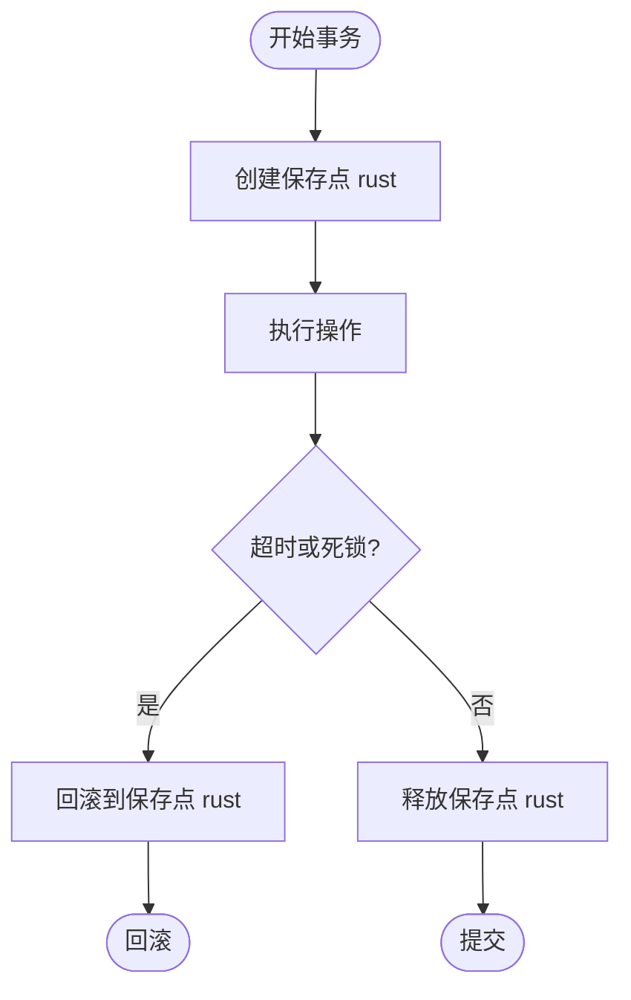

# 事务管理

<cite>
**本文档中引用的文件**  
- [transact.rs](file://rslib/src/collection/transact.rs)
- [undo/mod.rs](file://rslib/src/undo/mod.rs)
- [sqlite.rs](file://rslib/src/storage/sqlite.rs)
- [collection.py](file://pylib/anki/collection.py)
- [dbproxy.py](file://pylib/anki/dbproxy.py)
</cite>

## 目录
1. [引言](#引言)
2. [事务边界控制](#事务边界控制)
3. [嵌套事务处理](#嵌套事务处理)
4. [回滚策略](#回滚策略)
5. [数据一致性保障](#数据一致性保障)
6. [实际应用示例](#实际应用示例)
7. [事务API使用模式](#事务api使用模式)
8. [超时处理与死锁预防](#超时处理与死锁预防)
9. [与其他组件的交互](#与其他组件的交互)
10. [常见问题与最佳实践](#常见问题与最佳实践)

## 引言
Anki的事务管理机制是确保数据一致性和完整性的重要组成部分。该系统通过精心设计的事务边界控制、嵌套事务处理和自动回滚机制，为笔记修改、牌组重组等关键操作提供了可靠的保障。本文档详细说明了`transact.rs`中实现的事务管理机制，包括事务边界控制、嵌套事务处理和回滚策略。

## 事务边界控制
Anki的事务边界控制通过`transact_inner`方法实现，该方法定义了事务的开始和结束边界。事务边界由`begin_rust_trx`和`commit_rust_trx`或`rollback_rust_trx`方法界定。当调用`transact`方法时，系统会自动开始一个Rust事务，并在操作完成后提交或回滚。

**图示来源**
- [transact.rs](file://rslib/src/collection/transact.rs#L1-L75)

**本节来源**
- [transact.rs](file://rslib/src/collection/transact.rs#L1-L75)

## 嵌套事务处理
Anki的事务系统支持嵌套事务处理，通过`transact_inner`方法的递归调用实现。系统通过检查`autocommit`状态来决定使用哪种回滚机制。当外部事务处于自动提交模式时，使用`rollback_trx`进行回滚；否则使用`rollback_rust_trx`进行保存点回滚。

**图示来源**
- [transact.rs](file://rslib/src/collection/transact.rs#L1-L75)
- [sqlite.rs](file://rslib/src/storage/sqlite.rs#L585-L627)

**本节来源**
- [transact.rs](file://rslib/src/collection/transact.rs#L1-L75)
- [sqlite.rs](file://rslib/src/storage/sqlite.rs#L585-L627)

## 回滚策略
Anki的回滚策略基于Rust的`Result`类型和`or_else`方法实现。当事务中的操作返回错误时，系统会自动执行回滚操作。回滚过程包括丢弃撤销队列和根据事务状态选择适当的回滚方法。

**图示来源**
- [transact.rs](file://rslib/src/collection/transact.rs#L1-L75)
- [sqlite.rs](file://rslib/src/storage/sqlite.rs#L585-L627)
- [undo/mod.rs](file://rslib/src/undo/mod.rs#L50-L93)

**本节来源**
- [transact.rs](file://rslib/src/collection/transact.rs#L1-L75)
- [sqlite.rs](file://rslib/src/storage/sqlite.rs#L585-L627)
- [undo/mod.rs](file://rslib/src/undo/mod.rs#L50-L93)

## 数据一致性保障
Anki通过`Collection.transact()`方法确保数据一致性。该方法在事务成功完成时更新修改时间戳，并在发生错误时自动回滚所有更改。系统还通过`set_modified`方法确保任何更改都会更新集合的修改时间。

**图示来源**
- [transact.rs](file://rslib/src/collection/transact.rs#L18-L54)
- [undo/mod.rs](file://rslib/src/undo/mod.rs#L226-L265)

**本节来源**
- [transact.rs](file://rslib/src/collection/transact.rs#L18-L54)
- [undo/mod.rs](file://rslib/src/undo/mod.rs#L226-L265)

## 实际应用示例
### 笔记修改
在笔记修改操作中，Anki使用事务确保所有相关更改的原子性。当修改笔记时，系统会启动一个事务，更新笔记内容，并在成功时提交更改，失败时回滚。

### 牌组重组
牌组重组操作涉及多个数据库更改，Anki使用事务确保这些更改的完整性。系统会将所有重组操作包装在一个事务中，确保要么全部成功，要么全部回滚。

**图示来源**
- [transact.rs](file://rslib/src/collection/transact.rs#L1-L75)
- [notes/undo.rs](file://rslib/src/notes/undo.rs#L18-L49)

**本节来源**
- [transact.rs](file://rslib/src/collection/transact.rs#L1-L75)
- [notes/undo.rs](file://rslib/src/notes/undo.rs#L18-L49)

## 事务API使用模式
Anki提供了两种主要的事务API使用模式：`transact`和`transact_no_undo`。`transact`方法用于需要记录撤销状态的操作，而`transact_no_undo`用于不需要撤销功能的操作。

**图示来源**
- [transact.rs](file://rslib/src/collection/transact.rs#L56-L73)

**本节来源**
- [transact.rs](file://rslib/src/collection/transact.rs#L56-L73)

## 超时处理与死锁预防
Anki的事务系统通过使用保存点（savepoints）而不是长期运行的事务来预防死锁。系统还通过限制撤销步骤的数量（UNDO_LIMIT = 30）来防止内存泄漏和性能问题。

**图示来源**
- [sqlite.rs](file://rslib/src/storage/sqlite.rs#L585-L627)

**本节来源**
- [sqlite.rs](file://rslib/src/storage/sqlite.rs#L585-L627)

## 与其他组件的交互
### 撤销系统
事务系统与撤销系统紧密集成，通过`begin_undoable_operation`和`end_undoable_operation`方法管理撤销队列。当事务成功完成时，相关的更改会被添加到撤销队列中。

### 同步服务
事务系统与同步服务交互，确保在同步过程中数据的一致性。当检测到模式更改时，系统会标记模式修改，以便在同步时进行适当的处理。

**图示来源**
- [undo/mod.rs](file://rslib/src/undo/mod.rs#L50-L93)
- [sync/collection/changes.rs](file://rslib/src/sync/collection/changes.rs#L111-L136)

**本节来源**
- [undo/mod.rs](file://rslib/src/undo/mod.rs#L50-L93)
- [sync/collection/changes.rs](file://rslib/src/sync/collection/changes.rs#L111-L136)

## 常见问题与最佳实践
### 长时间运行事务的性能影响
长时间运行的事务可能导致性能下降和死锁风险。最佳实践是尽量缩短事务的持续时间，只在必要时才将多个操作组合在一个事务中。

### 事务隔离级别的选择
Anki使用"begin exclusive"来确保事务的排他性，这提供了最高的隔离级别。开发者应避免在事务中执行耗时的操作，以减少对其他操作的影响。

### 最佳实践指南
1. 使用`transact`方法包装所有数据库修改操作
2. 尽量减少事务中的操作数量
3. 避免在事务中执行网络请求或其他耗时操作
4. 正确处理事务中的错误，确保自动回滚
5. 在适当的情况下使用`transact_no_undo`以提高性能

**图示来源**
- [transact.rs](file://rslib/src/collection/transact.rs#L1-L75)
- [undo/mod.rs](file://rslib/src/undo/mod.rs#L50-L93)

**本节来源**
- [transact.rs](file://rslib/src/collection/transact.rs#L1-L75)
- [undo/mod.rs](file://rslib/src/undo/mod.rs#L50-L93)