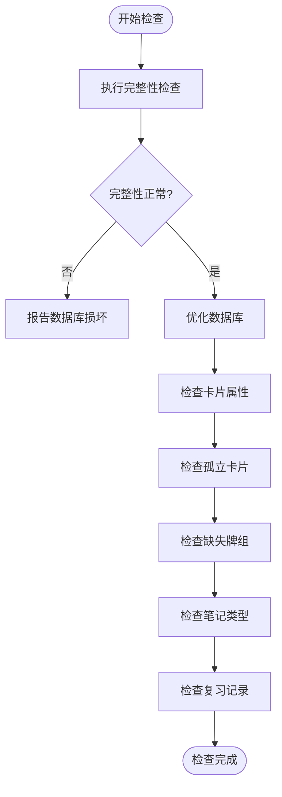
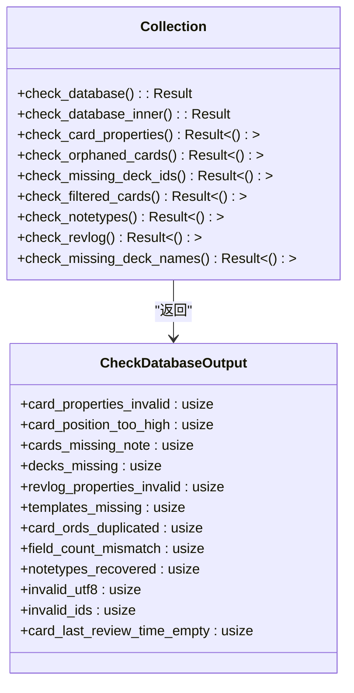
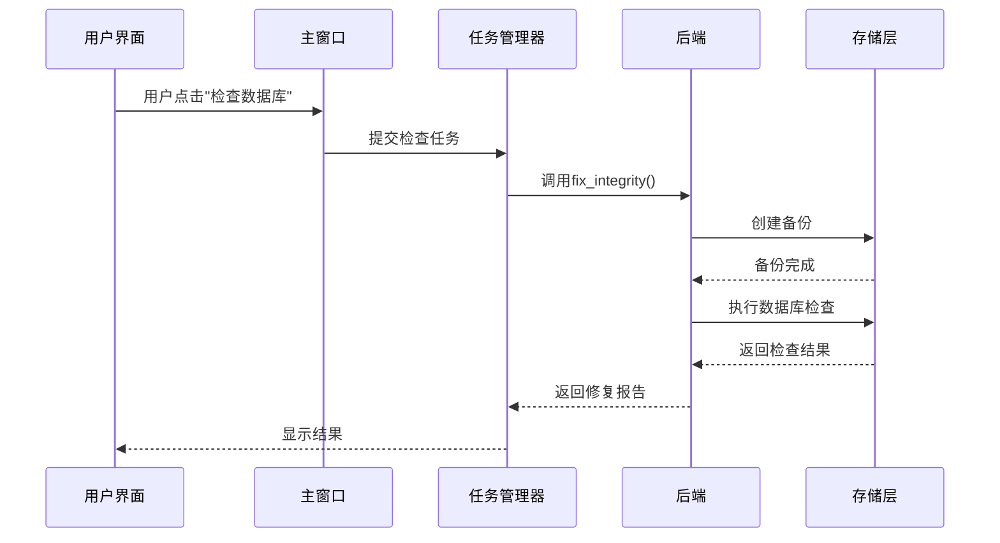

# 同步检查

<cite>
**本文档中引用的文件**  
- [dbcheck.rs](file://rslib/src/dbcheck.rs)
- [sync.rs](file://rslib/src/backend/sync.rs)
- [database-check.ftl](file://ftl/core/database-check.ftl)
- [dbcheck.py](file://qt/aqt/dbcheck.py)
- [collection.py](file://pylib/anki/collection.py)
</cite>

## 目录
1. [简介](#简介)
2. [核心组件](#核心组件)
3. [数据库完整性验证机制](#数据库完整性验证机制)
4. [检查流程触发与报告机制](#检查流程触发与报告机制)
5. [常见问题与修复策略](#常见问题与修复策略)
6. [API使用方法与性能考虑](#api使用方法与性能考虑)
7. [用户界面反馈](#用户界面反馈)
8. [数据访问隔离机制](#数据访问隔离机制)
9. [自定义检查规则开发指南](#自定义检查规则开发指南)

## 简介
Anki的同步检查功能是一套完整的数据库完整性验证系统，旨在确保用户学习数据的准确性和一致性。该系统通过Backend.check_database()接口触发，执行一系列深入的数据库检查，包括数据一致性验证、引用完整性检查和损坏检测。检查过程会自动修复发现的问题，并通过清晰的用户界面反馈结果。本文档详细解析了sync.rs和dbcheck.rs中实现的核心机制，为开发者和高级用户提供全面的技术参考。

## 核心组件

同步检查功能由多个核心组件协同工作，包括Rust后端的数据库检查引擎、Python前端的调用接口以及用户界面的进度反馈系统。这些组件共同构成了一个健壮的数据库维护框架。

**本节来源**
- [dbcheck.rs](file://rslib/src/dbcheck.rs#L0-L713)
- [collection.py](file://pylib/anki/collection.py#L1091-L1104)
- [dbcheck.py](file://qt/aqt/dbcheck.py#L0-L61)

## 数据库完整性验证机制

### 数据一致性检查
数据库检查系统首先执行快速完整性检查，验证数据库文件的基本结构完整性。如果快速检查通过，系统会继续执行优化操作，包括重新构建索引和整理数据库文件，以提高后续查询的性能。

**图表来源**
- [dbcheck.rs](file://rslib/src/dbcheck.rs#L94-L142)

### 引用完整性验证
系统会验证数据库中各实体之间的引用关系是否完整。这包括检查卡片是否引用了存在的笔记、牌组是否存在以及笔记类型是否有效。对于发现的引用问题，系统会自动进行修复，如删除孤立的卡片或恢复缺失的牌组。

**图表来源**
- [dbcheck.rs](file://rslib/src/dbcheck.rs#L46-L96)

### 损坏检测算法
损坏检测算法采用分阶段的检查策略，按照预定义的顺序执行不同类型的检查。检查进度通过DatabaseCheckProgress枚举进行跟踪，确保用户能够了解检查的当前状态。系统会检查各种潜在的数据问题，包括无效的UTF-8字符、未来的时间戳和重复的卡片序号。

**本节来源**
- [dbcheck.rs](file://rslib/src/dbcheck.rs#L46-L96)
- [dbcheck.rs](file://rslib/src/dbcheck.rs#L94-L142)

## 检查流程触发与报告机制

### 检查流程触发
检查流程通过Backend.check_database()接口触发，该接口在Collection对象中被封装为fix_integrity方法。当用户在Anki界面中选择"工具"->"检查数据库"时，会调用这个方法。在执行检查之前，系统会自动创建一个备份，以防止检查过程中出现问题。

**图表来源**
- [dbcheck.py](file://qt/aqt/dbcheck.py#L0-L61)
- [collection.py](file://pylib/anki/collection.py#L1091-L1104)

### 检查结果报告
检查结果以结构化的方式报告，包含所有发现并修复的问题。CheckDatabaseOutput结构体记录了各种问题的数量，如无效的卡片属性、缺失的笔记和重复的卡片序号。这些结果会被转换为本地化的字符串，以便用户理解。

**本节来源**
- [dbcheck.rs](file://rslib/src/dbcheck.rs#L46-L96)
- [database-check.ftl](file://ftl/core/database-check.ftl#L0-L68)

## 常见问题与修复策略

### 卡片相关问题
系统会检查并修复多种卡片相关的问题。对于序号重复的卡片，系统会删除重复的卡片实例。对于模板缺失的卡片，系统会将其删除，因为这些卡片无法正常显示。对于新卡片的序号过高的情况，系统会记录问题但不自动修复，建议用户在浏览界面中重新定位这些卡片。

### 笔记与牌组问题
当发现笔记的字段数量与笔记类型定义不符时，系统会自动调整字段数量，将多余的字段内容合并到最后一个字段中，或将缺失的字段填充为空白。对于缺失的牌组，系统会创建恢复的牌组，并记录此操作。

### 复习记录问题
系统会验证复习记录中的各项属性是否合理。例如，检查间隔时间(lastIvl)应该等于1，因为这是复习记录的标准值。对于不符合要求的记录，系统会进行修正。

**本节来源**
- [dbcheck.rs](file://rslib/src/dbcheck.rs#L527-L575)
- [dbcheck.rs](file://rslib/src/dbcheck.rs#L577-L624)

## API使用方法与性能考虑

### API使用方法
开发者可以通过调用Collection.fix_integrity()方法来触发数据库检查。该方法返回一个包含错误信息和成功状态的元组。在调用此方法之前，确保没有其他正在进行的数据库事务，以避免冲突。

### 性能考虑
数据库检查是一个资源密集型操作，可能需要较长时间才能完成，特别是对于大型集合。因此，检查过程在后台线程中执行，并通过进度更新向用户报告当前状态。系统使用事务来确保检查过程中的数据一致性，同时避免影响正常的数据库操作。

**本节来源**
- [dbcheck.py](file://qt/aqt/dbcheck.py#L0-L61)
- [collection.py](file://pylib/anki/collection.py#L1091-L1104)

## 用户界面反馈

### 进度显示
在检查过程中，用户界面会显示详细的进度信息。进度条会根据DatabaseCheckProgress枚举的当前值更新，显示当前正在执行的检查阶段，如"检查卡片..."或"检查笔记..."。这种实时反馈让用户了解检查的进展情况。

### 结果展示
检查完成后，结果会以用户友好的方式展示。如果未发现问题，会显示"数据库已重建并优化"的消息。如果发现了问题，会列出所有修复的操作，如"修复了3个无效的卡片属性"。对于严重问题，如数据库损坏，会显示明确的错误信息并建议恢复备份。

**本节来源**
- [database-check.ftl](file://ftl/core/database-check.ftl#L0-L68)
- [dbcheck.py](file://qt/aqt/dbcheck.py#L0-L61)

## 数据访问隔离机制

### 检查期间的数据访问
在执行数据库检查时，系统会确保检查操作与其他数据库操作隔离。检查过程在一个独立的事务中执行，使用transact_no_undo方法，这意味着检查过程中所做的修改不会进入撤销历史。这种设计确保了检查操作不会干扰用户的正常学习活动。

### 并发控制
系统通过锁机制管理对数据库的并发访问。当检查正在进行时，其他可能修改数据库的操作会被适当协调，以确保数据的一致性。这种隔离机制允许用户在检查进行的同时继续使用Anki的其他功能，而不会导致数据冲突。

**本节来源**
- [dbcheck.rs](file://rslib/src/dbcheck.rs#L94-L142)
- [dbcheck.rs](file://rslib/src/dbcheck.rs#L142-L165)

## 自定义检查规则开发指南

### 扩展检查功能
开发者可以通过扩展CheckDatabaseOutput结构体来添加新的检查规则。新的检查方法应该遵循现有的模式，在check_database_inner方法中调用，并将发现的问题记录到输出结构体中。确保新的检查规则不会对数据库性能产生过大影响。

### 最佳实践
在实现自定义检查规则时，应遵循以下最佳实践：首先执行快速的完整性检查，然后按逻辑顺序执行更详细的检查；使用事务确保数据一致性；提供清晰的本地化错误消息；在修复问题后适当更新集合的修改状态。

**本节来源**
- [dbcheck.rs](file://rslib/src/dbcheck.rs#L46-L713)
- [database-check.ftl](file://ftl/core/database-check.ftl#L0-L68)