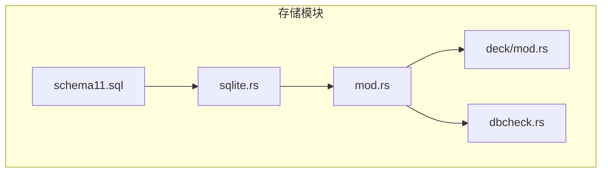
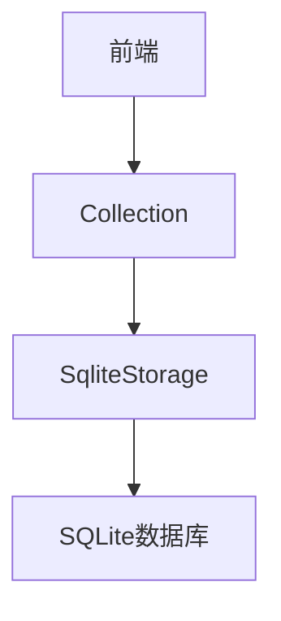
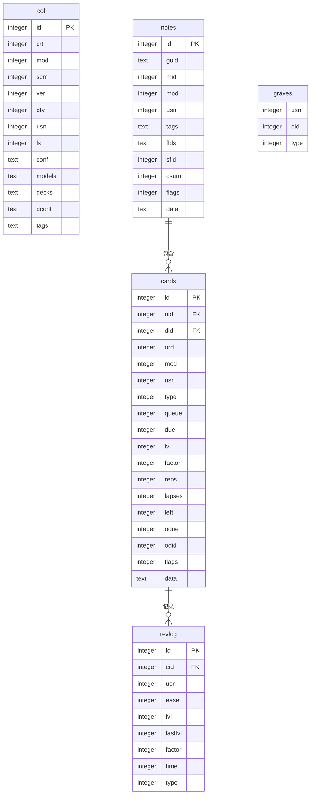
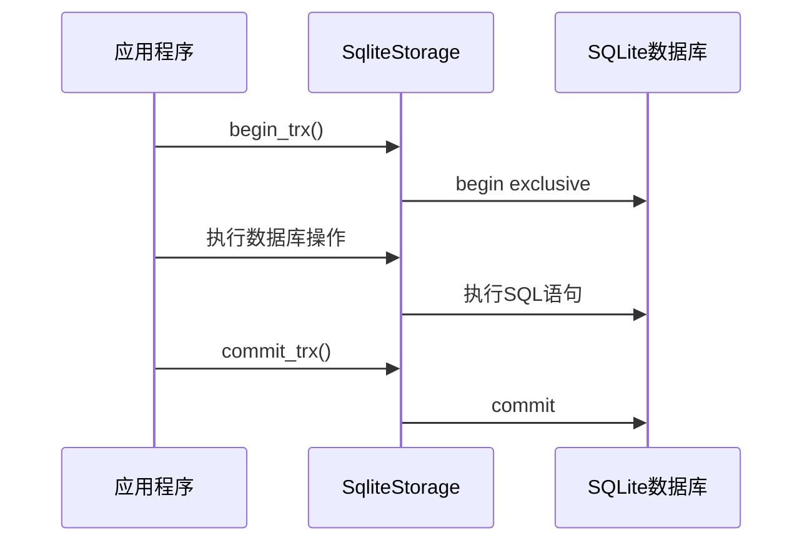
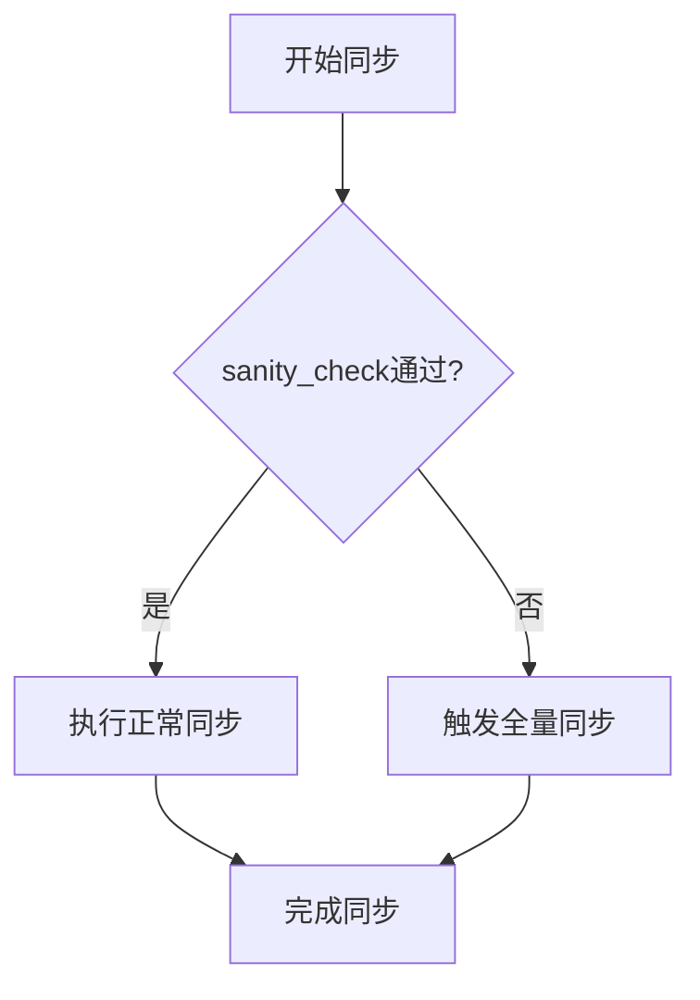
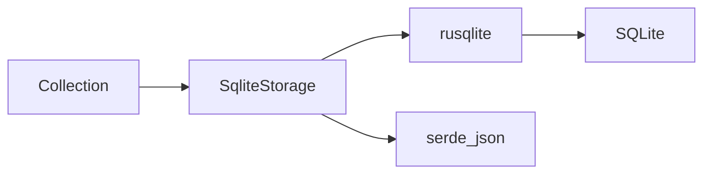

# 数据存储

<cite>
**本文档中引用的文件**  
- [schema11.sql](file://rslib/src/storage/schema11.sql)
- [sqlite.rs](file://rslib/src/storage/sqlite.rs)
- [mod.rs](file://rslib/src/storage/mod.rs)
- [deck/mod.rs](file://rslib/src/storage/deck/mod.rs)
- [dbcheck.rs](file://rslib/src/dbcheck.rs)
- [collection/normal.rs](file://rslib/src/sync/collection/normal.rs)
- [collection/sanity.rs](file://rslib/src/sync/collection/sanity.rs)
- [collection/tests.rs](file://rslib/src/sync/collection/tests.rs)
</cite>

## 目录
1. [简介](#简介)
2. [项目结构](#项目结构)
3. [核心组件](#核心组件)
4. [架构概述](#架构概述)
5. [详细组件分析](#详细组件分析)
6. [依赖分析](#依赖分析)
7. [性能考虑](#性能考虑)
8. [故障排除指南](#故障排除指南)
9. [结论](#结论)

## 简介
Anki 使用基于 SQLite 的持久化机制来存储用户的集合数据，包括笔记、卡片、牌组和复习记录。存储模块是 Anki 的核心组件之一，负责数据的持久化、完整性检查、事务管理和同步冲突处理。该模块通过 Rust 实现，确保了高性能和内存安全。数据库模式设计遵循 Schema11 规范，支持高效的查询和索引优化。

## 项目结构
Anki 的存储模块位于 `rslib/src/storage` 目录下，包含多个子模块，分别处理不同的数据实体和操作。主要文件包括 `schema11.sql` 定义数据库模式，`sqlite.rs` 提供数据库连接和事务管理功能，`mod.rs` 作为模块入口点。

**图表来源**  
- [schema11.sql](file://rslib/src/storage/schema11.sql)
- [sqlite.rs](file://rslib/src/storage/sqlite.rs)
- [mod.rs](file://rslib/src/storage/mod.rs)

**章节来源**  
- [schema11.sql](file://rslib/src/storage/schema11.sql)
- [sqlite.rs](file://rslib/src/storage/sqlite.rs)

## 核心组件
存储模块的核心组件包括数据库连接管理、事务处理、模式升级和数据完整性检查。`SqliteStorage` 结构体封装了数据库连接，并提供了事务开始、提交和回滚的方法。`SchemaVersion` 枚举定义了支持的模式版本，确保向后兼容性。

**章节来源**  
- [sqlite.rs](file://rslib/src/storage/sqlite.rs#L585-L627)
- [mod.rs](file://rslib/src/storage/mod.rs#L0-L94)

## 架构概述
Anki 的存储架构采用分层设计，上层业务逻辑通过 `Collection` 结构体与底层数据库交互。`Collection` 包含 `SqliteStorage` 实例，负责执行具体的数据库操作。事务管理通过 `begin_trx`、`commit_trx` 和 `rollback_trx` 方法实现，确保数据一致性。

**图表来源**  
- [sqlite.rs](file://rslib/src/storage/sqlite.rs#L585-L627)
- [collection/mod.rs](file://rslib/src/collection/mod.rs#L125-L158)

## 详细组件分析

### 数据库模式设计
Anki 的数据库模式定义在 `schema11.sql` 文件中，包含 `col`、`notes`、`cards`、`revlog` 和 `graves` 五个主要表。`col` 表存储集合元数据，`notes` 表存储笔记内容，`cards` 表存储卡片状态，`revlog` 表记录复习历史，`graves` 表跟踪已删除的实体。

#### 表结构和索引策略

**图表来源**  
- [schema11.sql](file://rslib/src/storage/schema11.sql)

**章节来源**  
- [schema11.sql](file://rslib/src/storage/schema11.sql)

### 事务管理
Anki 使用显式事务来保证数据一致性。`begin_trx` 方法开始一个独占事务，`commit_trx` 提交事务，`rollback_trx` 回滚事务。此外，还使用保存点（savepoint）机制实现更细粒度的事务控制，支持撤销操作。

#### 事务流程

**图表来源**  
- [sqlite.rs](file://rslib/src/storage/sqlite.rs#L585-L627)

**章节来源**  
- [sqlite.rs](file://rslib/src/storage/sqlite.rs#L585-L627)

### 同步冲突处理
在同步过程中，Anki 使用 `sanity_check` 机制验证客户端和服务器端的数据一致性。如果检测到冲突，会触发全量同步。`NormalSyncer` 在同步前调用 `sanity_check`，确保数据完整。

#### 同步冲突处理流程

**图表来源**  
- [collection/normal.rs](file://rslib/src/sync/collection/normal.rs#L68-L97)
- [collection/sanity.rs](file://rslib/src/sync/collection/sanity.rs#L52-L98)

**章节来源**  
- [collection/normal.rs](file://rslib/src/sync/collection/normal.rs#L68-L97)
- [collection/sanity.rs](file://rslib/src/sync/collection/sanity.rs#L52-L98)

## 依赖分析
存储模块依赖于 SQLite 数据库引擎和 Rust 的 `rusqlite` 库。`SqliteStorage` 通过 `Connection` 与数据库交互，使用 `serde_json` 序列化和反序列化复杂数据类型。`Collection` 结构体依赖 `SqliteStorage` 执行数据库操作。

**图表来源**  
- [collection/mod.rs](file://rslib/src/collection/mod.rs#L125-L158)
- [sqlite.rs](file://rslib/src/storage/sqlite.rs)

**章节来源**  
- [collection/mod.rs](file://rslib/src/collection/mod.rs#L125-L158)
- [sqlite.rs](file://rslib/src/storage/sqlite.rs)

## 性能考虑
为优化性能，Anki 在关键字段上创建了索引，如 `ix_notes_usn`、`ix_cards_usn` 和 `ix_revlog_usn`，加速同步操作。`optimize` 方法执行 `vacuum; reindex; analyze` 命令，定期优化数据库性能。大规模集合的查询通过分页和缓存策略优化。

## 故障排除指南
常见存储问题包括数据库损坏和查询性能瓶颈。`dbcheck` 模块提供完整性检查功能，修复无效的 UTF-8 数据。`checkpoint` 方法将 WAL 文件中的数据刷新到主数据库，确保备份安全。对于性能问题，建议定期运行 `optimize` 方法。

**章节来源**  
- [dbcheck.rs](file://rslib/src/dbcheck.rs#L330-L373)
- [sqlite.rs](file://rslib/src/storage/sqlite.rs#L542-L588)

## 结论
Anki 的数据存储模块通过精心设计的数据库模式、高效的事务管理和健壮的同步机制，确保了数据的持久性和一致性。开发者应遵循最佳实践，如定期优化数据库和处理同步冲突，以维护集合的健康状态。