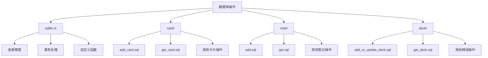
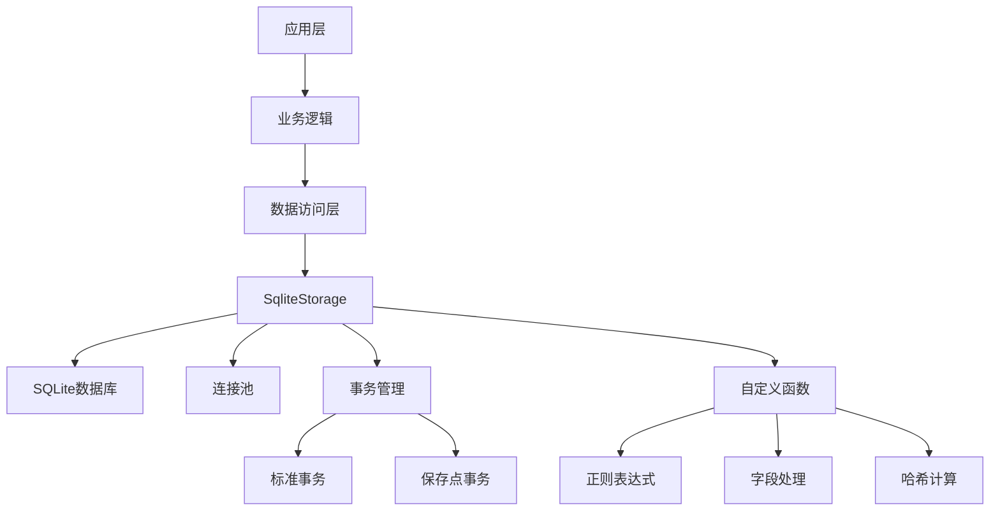
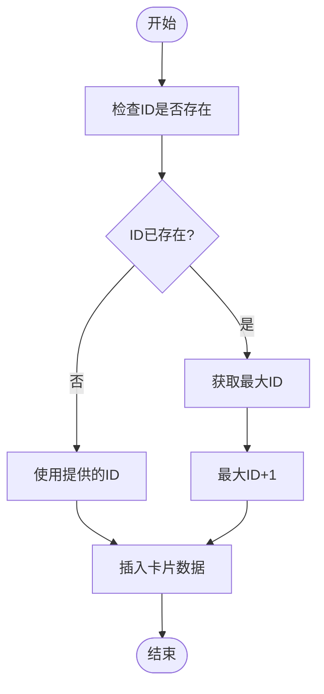
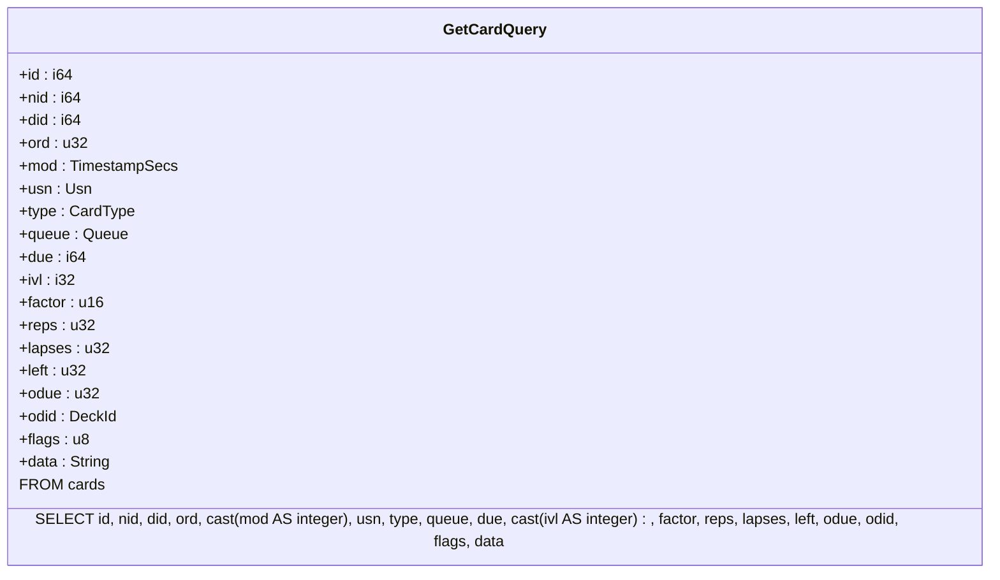
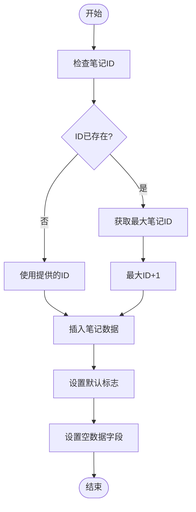
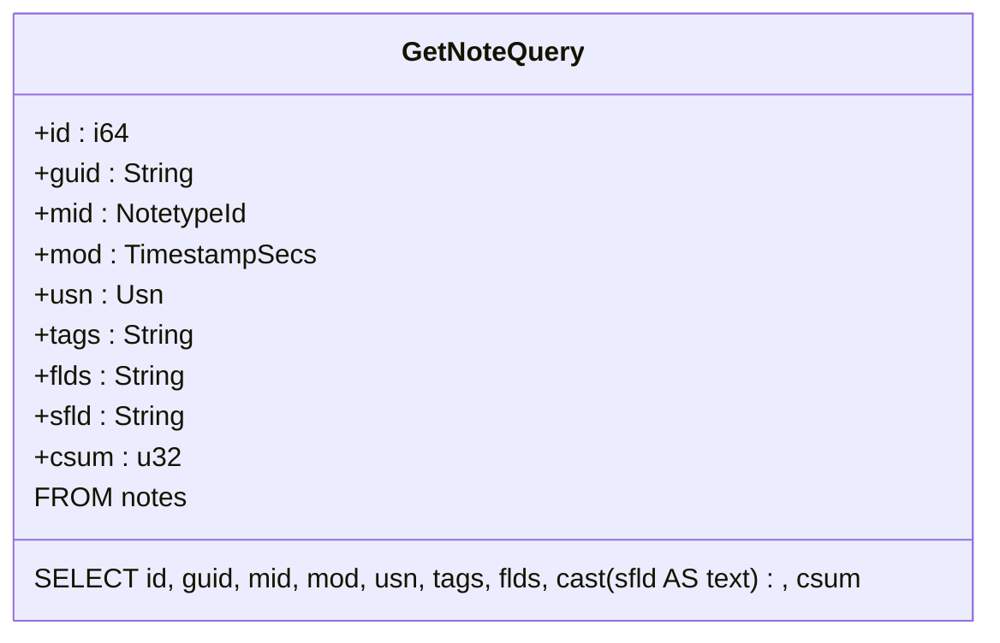
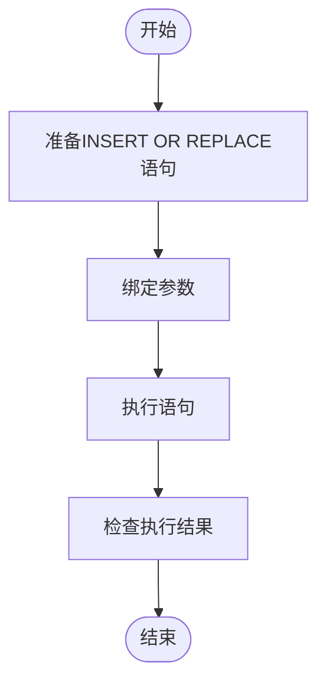
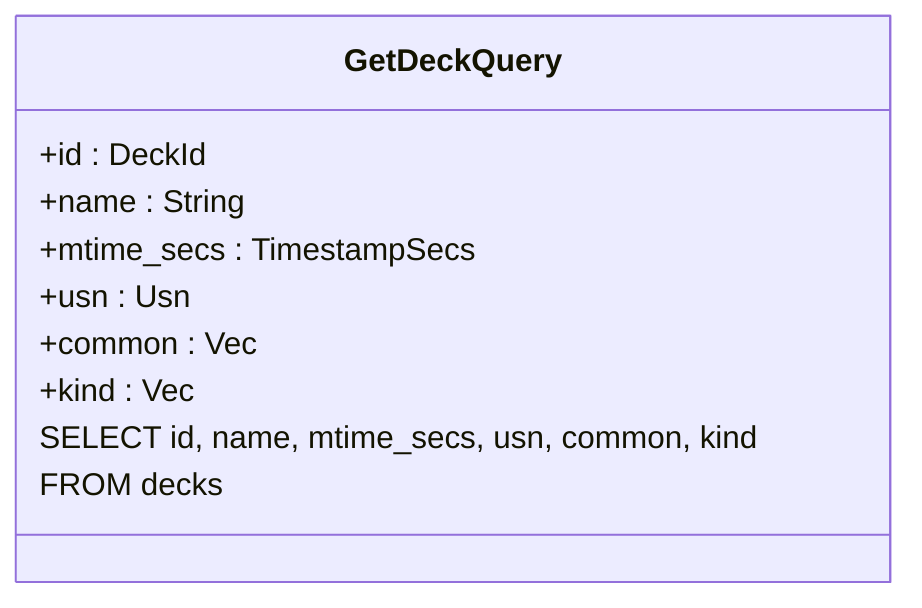
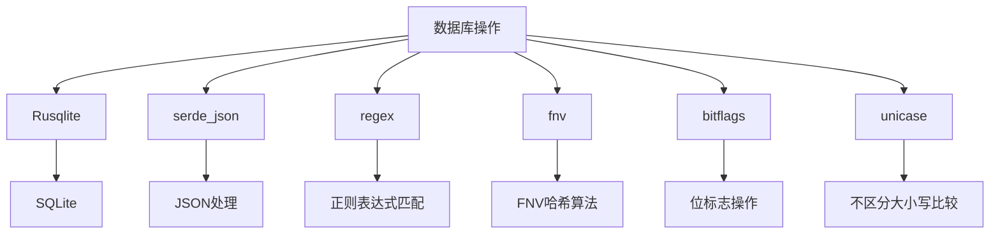

# 数据库操作

<cite>
**本文档中引用的文件**
- [sqlite.rs](file://rslib/src/storage/sqlite.rs)
- [add_card.sql](file://rslib/src/storage/card/add_card.sql)
- [get_card.sql](file://rslib/src/storage/card/get_card.sql)
- [add.sql](file://rslib/src/storage/note/add.sql)
- [get.sql](file://rslib/src/storage/note/get.sql)
- [add_or_update_deck.sql](file://rslib/src/storage/deck/add_or_update_deck.sql)
- [get_deck.sql](file://rslib/src/storage/deck/get_deck.sql)
</cite>

## 目录
1. [简介](#简介)
2. [项目结构](#项目结构)
3. [核心组件](#核心组件)
4. [架构概述](#架构概述)
5. [详细组件分析](#详细组件分析)
6. [依赖分析](#依赖分析)
7. [性能考虑](#性能考虑)
8. [故障排除指南](#故障排除指南)
9. [结论](#结论)

## 简介
本文档详细介绍了Anki数据存储模块中基于SQLite的数据库操作实现。重点阐述了卡片、笔记和牌组的CRUD操作机制，深入解析了连接池管理、预编译语句使用和错误处理策略。文档还涵盖了SQL注入防护、查询性能优化以及大规模数据操作的最佳实践，为不同层次的开发者提供实用指导。

## 项目结构
Anki的数据库操作主要集中在rslib/src/storage目录下，该目录包含了针对不同实体（卡片、笔记、牌组等）的操作实现。核心的数据库连接和管理功能在sqlite.rs文件中定义，而具体的SQL操作语句则分散在各个子目录的.sql文件中。

**图示来源**
- [sqlite.rs](file://rslib/src/storage/sqlite.rs)
- [add_card.sql](file://rslib/src/storage/card/add_card.sql)
- [get_card.sql](file://rslib/src/storage/card/get_card.sql)
- [add.sql](file://rslib/src/storage/note/add.sql)
- [get.sql](file://rslib/src/storage/note/get.sql)
- [add_or_update_deck.sql](file://rslib/src/storage/deck/add_or_update_deck.sql)
- [get_deck.sql](file://rslib/src/storage/deck/get_deck.sql)

**本节来源**
- [sqlite.rs](file://rslib/src/storage/sqlite.rs)
- [card/](file://rslib/src/storage/card/)
- [note/](file://rslib/src/storage/note/)
- [deck/](file://rslib/src/storage/deck/)

## 核心组件
数据库操作的核心组件包括SqliteStorage结构体、各种实体的CRUD操作接口以及自定义的SQL函数。SqliteStorage负责数据库连接的创建和管理，提供了事务处理、连接检查和优化等功能。各个实体的操作通过预编译的SQL语句实现，确保了操作的安全性和效率。

**本节来源**
- [sqlite.rs](file://rslib/src/storage/sqlite.rs)
- [add_card.sql](file://rslib/src/storage/card/add_card.sql)
- [add.sql](file://rslib/src/storage/note/add.sql)
- [add_or_update_deck.sql](file://rslib/src/storage/deck/add_or_update_deck.sql)

## 架构概述
Anki的数据库架构采用SQLite作为底层存储，通过Rusqlite库进行Rust语言的绑定。系统实现了连接池管理，确保多线程环境下的安全访问。架构中包含了完整的事务处理机制，支持标准事务和保存点事务，为数据一致性提供了保障。

**图示来源**
- [sqlite.rs](file://rslib/src/storage/sqlite.rs)

## 详细组件分析

### 卡片操作分析
卡片操作是Anki数据库中最频繁的操作之一，包括添加、获取、更新和删除卡片。这些操作通过预编译的SQL语句实现，确保了执行效率和安全性。

#### 添加卡片操作

**图示来源**
- [add_card.sql](file://rslib/src/storage/card/add_card.sql)

#### 获取卡片操作

**图示来源**
- [get_card.sql](file://rslib/src/storage/card/get_card.sql)

**本节来源**
- [add_card.sql](file://rslib/src/storage/card/add_card.sql)
- [get_card.sql](file://rslib/src/storage/card/get_card.sql)

### 笔记操作分析
笔记操作与卡片操作类似，但包含了更多的字段和更复杂的验证逻辑。笔记的添加操作同样需要处理ID冲突的情况。

#### 添加笔记操作

**图示来源**
- [add.sql](file://rslib/src/storage/note/add.sql)

#### 获取笔记操作

**图示来源**
- [get.sql](file://rslib/src/storage/note/get.sql)

**本节来源**
- [add.sql](file://rslib/src/storage/note/add.sql)
- [get.sql](file://rslib/src/storage/note/get.sql)

### 牌组操作分析
牌组操作相对简单，主要涉及牌组的添加、更新和获取。系统使用INSERT OR REPLACE语句来实现添加或更新的原子操作。

#### 添加或更新牌组操作

**图示来源**
- [add_or_update_deck.sql](file://rslib/src/storage/deck/add_or_update_deck.sql)

#### 获取牌组操作

**图示来源**
- [get_deck.sql](file://rslib/src/storage/deck/get_deck.sql)

**本节来源**
- [add_or_update_deck.sql](file://rslib/src/storage/deck/add_or_update_deck.sql)
- [get_deck.sql](file://rslib/src/storage/deck/get_deck.sql)

## 依赖分析
数据库操作模块依赖于多个外部库和内部组件。主要依赖包括Rusqlite库用于SQLite绑定，serde_json用于JSON序列化，以及各种正则表达式和哈希计算库。

**图示来源**
- [sqlite.rs](file://rslib/src/storage/sqlite.rs)

**本节来源**
- [sqlite.rs](file://rslib/src/storage/sqlite.rs)

## 性能考虑
为了优化数据库操作性能，系统采用了多种策略。包括预编译语句缓存、连接池管理、批量操作和索引优化。此外，系统还提供了checkpoint和optimize等维护功能，确保数据库的长期性能稳定。

## 故障排除指南
常见的数据库操作问题包括连接失败、事务冲突和查询性能低下。对于连接问题，应检查数据库文件路径和权限；对于事务冲突，需要确保正确使用事务边界；对于性能问题，建议使用EXPLAIN QUERY PLAN分析查询执行计划。

**本节来源**
- [sqlite.rs](file://rslib/src/storage/sqlite.rs)

## 结论
Anki的数据库操作模块设计精良，通过Rust语言的安全特性和SQLite的可靠性，实现了高效、安全的数据存储。系统在CRUD操作、事务管理和性能优化方面都表现出色，为Anki的核心功能提供了坚实的基础。