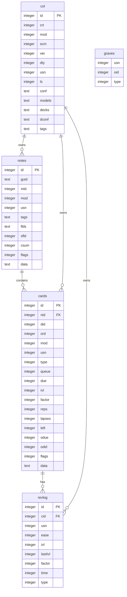

# 数据库模式

<cite>
**本文档中引用的文件**  
- [schema11.sql](file://rslib/src/storage/schema11.sql)
- [collection_timestamps.rs](file://rslib/src/storage/collection_timestamps.rs)
- [upgrades/mod.rs](file://rslib/src/storage/upgrades/mod.rs)
- [notetype/mod.rs](file://rslib/src/storage/notetype/mod.rs)
- [deckconfig/mod.rs](file://rslib/src/storage/deckconfig/mod.rs)
- [sqlite.rs](file://rslib/src/storage/sqlite.rs)
- [collection.py](file://pylib/anki/collection.py)
</cite>

## 目录
1. [简介](#简介)
2. [核心表结构](#核心表结构)
3. [实体关系图](#实体关系图)
4. [时间戳管理机制](#时间戳管理机制)
5. [模式版本控制与升级路径](#模式版本控制与升级路径)
6. [数据类型与范式化设计](#数据类型与范式化设计)
7. [索引策略与性能优化](#索引策略与性能优化)
8. [数据完整性约束](#数据完整性约束)
9. [模式设计权衡](#模式设计权衡)
10. [扩展与自定义最佳实践](#扩展与自定义最佳实践)

## 简介
Anki数据库模式采用SQLite作为持久化存储，其核心设计围绕卡片学习系统的关键实体：卡片(cards)、笔记(notes)、牌组(decks)等。该模式通过schema11.sql文件定义了基础数据库结构，并通过Rust实现的存储层进行管理。数据库设计注重性能优化，特别是在调度和同步场景下的查询效率。模式采用JSON序列化方式存储复杂配置，实现了灵活性与兼容性的平衡。本文档详细解析该数据库模式的设计原理、实现细节和最佳实践。

## 核心表结构

Anki数据库模式包含五个核心表：col、notes、cards、revlog和graves。这些表共同构成了Anki应用的数据基础。

### col表
`col`表存储集合级别的元数据和配置信息，是数据库的根表。该表仅包含单行记录，通过JSON格式存储复杂对象。

**字段定义：**
- `id`：主键，固定为1
- `crt`：创建时间戳（秒）
- `mod`：最后修改时间戳（毫秒）
- `scm`：模式修改时间戳（毫秒）
- `ver`：模式版本号
- `dty`：脏标记
- `usn`：更新序列号
- `ls`：最后同步时间戳（毫秒）
- `conf`：配置JSON
- `models`：笔记类型JSON
- `decks`：牌组JSON
- `dconf`：牌组配置JSON
- `tags`：标签JSON

**Section sources**
- [schema11.sql](file://rslib/src/storage/schema11.sql#L1-L10)

### notes表
`notes`表存储用户创建的笔记数据，每个笔记对应一个或多个卡片。

**字段定义：**
- `id`：主键，笔记ID
- `guid`：全局唯一标识符
- `mid`：笔记类型ID
- `mod`：最后修改时间戳
- `usn`：更新序列号
- `tags`：标签字符串
- `flds`：字段内容（拼接字符串）
- `sfld`：用于排序的字段（整数）
- `csum`：内容校验和
- `flags`：标志位
- `data`：附加数据

**Section sources**
- [schema11.sql](file://rslib/src/storage/schema11.sql#L11-L25)

### cards表
`cards`表存储由笔记生成的卡片实例，是调度算法的核心操作对象。

**字段定义：**
- `id`：主键，卡片ID
- `nid`：关联的笔记ID
- `did`：所属牌组ID
- `ord`：模板序号
- `mod`：最后修改时间戳
- `usn`：更新序列号
- `type`：卡片类型
- `queue`：队列状态
- `due`：到期时间
- `ivl`：间隔
- `factor`：易度因子
- `reps`：复习次数
- `lapses`：失误次数
- `left`：剩余学习数
- `odue`：原牌组到期时间
- `odid`：原牌组ID
- `flags`：标志位
- `data`：附加数据

**Section sources**
- [schema11.sql](file://rslib/src/storage/schema11.sql#L26-L44)

### revlog表
`revlog`表记录所有卡片的复习历史，用于统计分析和算法优化。

**字段定义：**
- `id`：主键，时间戳
- `cid`：关联的卡片ID
- `usn`：更新序列号
- `ease`：回答 ease
- `ivl`：复习间隔
- `lastIvl`：上次间隔
- `factor`：易度因子
- `time`：花费时间（毫秒）
- `type`：复习类型

**Section sources**
- [schema11.sql](file://rslib/src/storage/schema11.sql#L45-L55)

### graves表
`graves`表记录已删除实体的墓碑信息，用于同步冲突解决。

**字段定义：**
- `usn`：更新序列号
- `oid`：原始ID
- `type`：实体类型

**Section sources**
- [schema11.sql](file://rslib/src/storage/schema11.sql#L56-L59)

## 实体关系图



**Diagram sources**
- [schema11.sql](file://rslib/src/storage/schema11.sql#L1-L93)

## 时间戳管理机制

Anki数据库通过`collection_timestamps.rs`文件实现了一套完整的时间戳管理系统，用于跟踪集合的各种状态变化。

### 时间戳类型
系统维护三种主要时间戳：
- **集合修改时间戳**：记录集合的最后修改时间
- **模式修改时间戳**：记录数据库模式的最后修改时间
- **最后同步时间戳**：记录最后一次同步的时间

### 实现机制
时间戳管理通过`SqliteStorage`结构体的特定方法实现：

```rust
impl SqliteStorage {
    pub(crate) fn get_collection_timestamps(&self) -> Result<CollectionTimestamps> {
        self.db
            .prepare_cached("select mod, scm, ls from col")?
            .query_row([], |row| {
                Ok(CollectionTimestamps {
                    collection_change: row.get(0)?,
                    schema_change: row.get(1)?,
                    last_sync: row.get(2)?,
                })
            })
            .map_err(Into::into)
    }

    pub(crate) fn set_schema_modified_time(&self, stamp: TimestampMillis) -> Result<()> {
        self.db
            .prepare_cached("update col set scm = ?")?
            .execute([stamp])?;
        Ok(())
    }
}
```

这些方法直接操作`col`表中的对应字段，确保时间戳更新的原子性和一致性。

**Section sources**
- [collection_timestamps.rs](file://rslib/src/storage/collection_timestamps.rs#L4-L58)

## 模式版本控制与升级路径

Anki数据库模式采用渐进式版本控制策略，支持从旧版本平滑升级到新版本。

### 版本范围
系统定义了明确的版本边界：
- `SCHEMA_MIN_VERSION`：可打开的最低模式版本（11）
- `SCHEMA_STARTING_VERSION`：新文件的初始版本（11）
- `SCHEMA_MAX_VERSION`：可打开的最高模式版本（18）

### 降级机制
当需要兼容旧版本时，系统提供降级功能：

```rust
fn downgrade_to_schema_11(&self) -> Result<()> {
    self.begin_trx()?;
    self.db.execute_batch(include_str!("schema18_downgrade.sql"))?;
    self.downgrade_deck_conf_from_schema16()?;
    self.downgrade_decks_from_schema15()?;
    self.downgrade_notetypes_from_schema15()?;
    self.downgrade_config_from_schema14()?;
    self.downgrade_tags_from_schema14()?;
    self.db.execute_batch(include_str!("schema11_downgrade.sql"))?;
    self.commit_trx()?;
    Ok(())
}
```

降级过程包括执行SQL脚本和调用特定模块的降级方法，确保数据完整性。

**Section sources**
- [upgrades/mod.rs](file://rslib/src/storage/upgrades/mod.rs#L48-L92)
- [schema11_downgrade.sql](file://rslib/src/storage/upgrades/schema11_downgrade.sql#L1-L10)

## 数据类型与范式化设计

Anki数据库在数据类型选择和范式化程度上做出了精心的权衡。

### 数据类型选择
- **整数类型**：广泛使用`integer`类型存储ID、时间戳和计数器
- **文本类型**：使用`text`存储JSON序列化数据和字符串内容
- **主键设计**：所有主键均为`integer PRIMARY KEY`，利用SQLite的整数主键优化

### 范式化程度
数据库采用混合范式化策略：
- **高度范式化**：核心实体（notes、cards、revlog）采用第三范式
- **反范式化**：`col`表使用JSON字段存储复杂配置，牺牲部分范式化换取灵活性
- **字段拼接**：`notes`表的`flds`字段将多个字段内容拼接存储，优化读取性能

这种设计在数据完整性与查询性能之间取得了良好平衡。

**Section sources**
- [schema11.sql](file://rslib/src/storage/schema11.sql#L1-L93)

## 索引策略与性能优化

Anki数据库通过精心设计的索引策略优化关键查询路径的性能。

### 核心索引
系统创建了多个针对性索引：

```sql
CREATE INDEX ix_notes_usn ON notes (usn);
CREATE INDEX ix_cards_usn ON cards (usn);
CREATE INDEX ix_revlog_usn ON revlog (usn);
CREATE INDEX ix_cards_nid ON cards (nid);
CREATE INDEX ix_cards_sched ON cards (did, queue, due);
CREATE INDEX ix_revlog_cid ON revlog (cid);
CREATE INDEX ix_notes_csum ON notes (csum);
```

### 索引用途
- **同步索引**：`ix_notes_usn`、`ix_cards_usn`、`ix_revlog_usn`用于快速识别变更
- **关联查询**：`ix_cards_nid`优化从笔记到卡片的查询
- **调度查询**：`ix_cards_sched`支持高效的牌组和队列筛选
- **去重查询**：`ix_notes_csum`基于内容校验和实现字段唯一性

这些索引显著提升了Anki核心功能（如复习调度和数据同步）的性能。

**Section sources**
- [schema11.sql](file://rslib/src/storage/schema11.sql#L60-L75)

## 数据完整性约束

Anki数据库通过多种机制确保数据完整性。

### 内置约束
- **主键约束**：所有表都有主键约束
- **非空约束**：关键字段标记为`NOT NULL`
- **外键约束**：虽然未显式声明，但通过应用层逻辑维护

### 应用层验证
系统在应用层实施额外的完整性检查：

```rust
pub(crate) fn fix_invalid_ids(&self, max_valid_id: i64, new_id: i64) -> Result<()> {
    require!(new_id <= max_valid_id, "new_id is invalid");
    for (source_table, foreign_table) in [
        ("notes", Some(("cards", "nid"))),
        ("cards", Some(("revlog", "cid"))),
        ("revlog", None),
    ] {
        self.setup_invalid_ids_table(source_table, max_valid_id, new_id)?;
        self.update_invalid_ids_from_table(source_table, "id")?;
        if let Some((target_table, id_column)) = foreign_table {
            self.update_invalid_ids_from_table(target_table, id_column)?;
        }
    }
    self.db.execute(include_str!("invalid_ids_drop.sql"), [])?;
    Ok(())
}
```

此方法确保所有ID在有效范围内，防止数据损坏。

**Section sources**
- [dbcheck/mod.rs](file://rslib/src/storage/dbcheck/mod.rs#L15-L49)

## 模式设计权衡

Anki数据库模式在多个方面做出了重要的设计权衡。

### 读写性能平衡
- **读取优化**：通过预计算字段（如`sfld`）和复合索引优化查询性能
- **写入代价**：频繁更新`mod`和`usn`字段，但通过批量操作最小化影响

### 存储空间优化
- **紧凑存储**：使用整数而非字符串存储状态码
- **JSON压缩**：将复杂配置序列化为紧凑的JSON字符串
- **字段拼接**：减少行数和索引开销

### 兼容性与扩展性
- **向后兼容**：通过版本控制支持旧版本文件
- **向前兼容**：预留字段和灵活的JSON结构支持未来扩展

这些权衡使Anki能够在资源受限的设备上高效运行，同时保持良好的扩展性。

## 扩展与自定义最佳实践

为开发者提供以下模式扩展和自定义的最佳实践。

### 安全扩展
- **使用data字段**：通过`cards.data`和`notes.data`字段存储自定义数据
- **避免模式修改**：不要直接修改核心表结构
- **遵循版本控制**：在升级时正确处理模式版本

### 自定义实现
- **插件系统**：通过Anki的插件API进行功能扩展
- **外部存储**：将大量自定义数据存储在外部文件中，仅在数据库中保存引用
- **索引优化**：根据自定义查询模式添加适当的索引

### 数据迁移
- **事务处理**：在模式变更时使用事务确保原子性
- **备份机制**：在重大变更前创建数据库备份
- **验证步骤**：变更后执行完整性检查

遵循这些实践可以确保自定义功能的稳定性和兼容性。