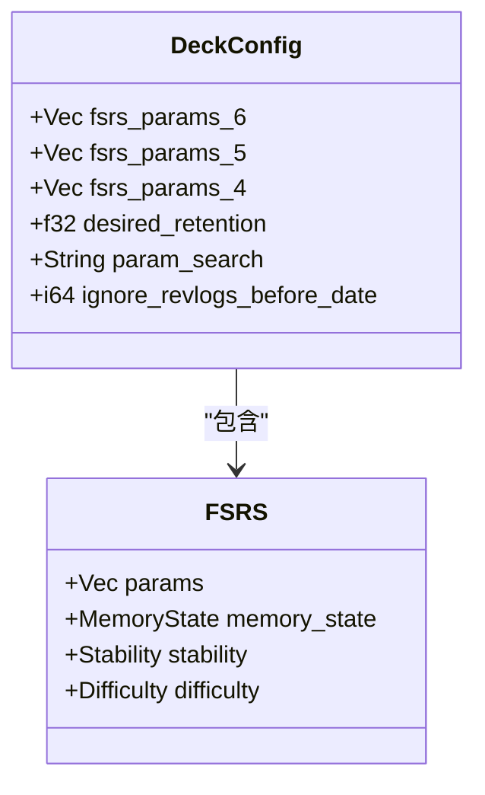
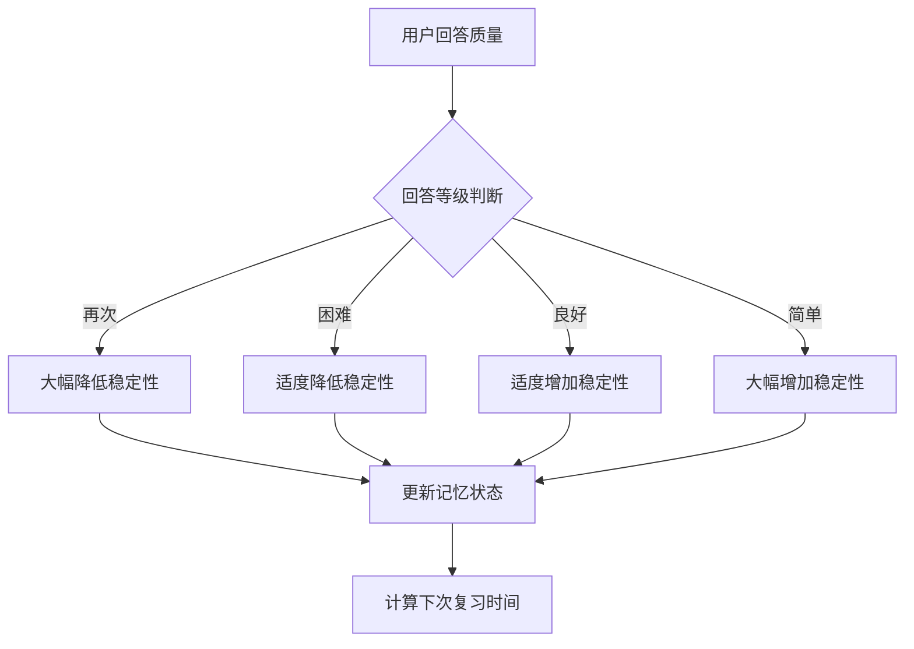
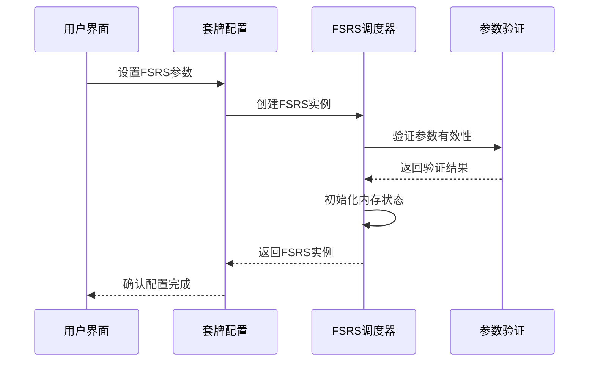
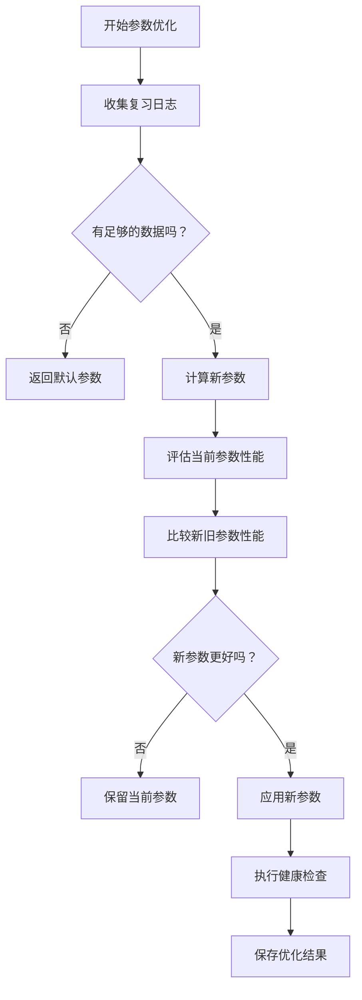
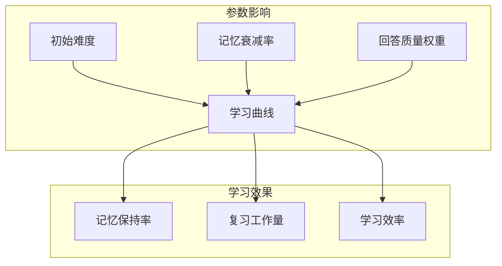

# FSRS参数管理

<cite>
**本文档中引用的文件**
- [params.rs](file://rslib/src/scheduler/fsrs/params.rs)
- [simulator.rs](file://rslib/src/scheduler/fsrs/simulator.rs)
- [error.rs](file://rslib/src/scheduler/fsrs/error.rs)
- [update.rs](file://rslib/src/deckconfig/update.rs)
- [deck-config.ftl](file://ftl/core/deck-config.ftl)
- [sqlite.rs](file://rslib/src/storage/sqlite.rs)
- [service/mod.rs](file://rslib/src/scheduler/service/mod.rs)
</cite>

## 目录
1. [引言](#引言)
2. [FSRS参数结构](#fsrs参数结构)
3. [核心参数详解](#核心参数详解)
4. [参数初始化与配置](#参数初始化与配置)
5. [参数优化流程](#参数优化流程)
6. [参数对学习曲线的影响](#参数对学习曲线的影响)
7. [参数调优实用指南](#参数调优实用指南)
8. [参数间关系与约束](#参数间关系与约束)
9. [常见问题与解决方案](#常见问题与解决方案)
10. [结论](#结论)

## 引言
FSRS（Free Spaced Repetition Scheduler）算法是Anki中用于优化记忆卡片复习调度的先进算法。该算法通过可配置的参数来调整记忆模型，以适应不同用户的学习习惯和记忆特征。本文档全面解释FSRS算法中所有可配置参数的含义、默认值和调整策略，为用户提供详细的参数管理指导。

## FSRS参数结构
FSRS参数在Anki系统中以向量形式存储，支持多个版本的参数配置。系统优先使用最新版本的参数，若最新版本为空则回退到旧版本。

**图示来源**
- [update.rs](file://rslib/src/deckconfig/update.rs#L158-L186)
- [params.rs](file://rslib/src/scheduler/fsrs/params.rs#L93-L107)

**本节来源**
- [update.rs](file://rslib/src/deckconfig/update.rs#L158-L186)
- [params.rs](file://rslib/src/scheduler/fsrs/params.rs#L93-L107)

## 核心参数详解
FSRS算法包含多个关键参数，每个参数都有特定的含义和作用范围。

### 初始难度
初始难度参数控制新学习项目初始记忆难度的估计值。该值影响新卡片的初始稳定性计算。

### 记忆衰减率
记忆衰减率参数描述记忆随时间推移的自然衰退速度。该参数与用户的实际记忆表现密切相关，需要根据个人记忆特征进行调整。

### 回答质量权重
回答质量权重参数将用户的回答质量（如"再次"、"困难"、"良好"、"简单"）映射到记忆状态变化的程度。不同回答等级对应不同的权重值。

### 期望记忆保持率
期望记忆保持率参数定义用户希望在下次复习时能够回忆起卡片内容的概率。该值通常设置在80%-90%之间，过高会导致复习过于频繁，过低则可能导致遗忘。

**图示来源**
- [params.rs](file://rslib/src/scheduler/fsrs/params.rs#L136-L160)
- [simulator.rs](file://rslib/src/scheduler/fsrs/simulator.rs#L276-L308)

**本节来源**
- [params.rs](file://rslib/src/scheduler/fsrs/params.rs#L136-L160)
- [simulator.rs](file://rslib/src/scheduler/fsrs/simulator.rs#L276-L308)

## 参数初始化与配置
FSRS参数的初始化和配置通过系统服务接口完成，确保参数的有效性和一致性。

### 参数结构体定义
参数结构体在系统中定义为浮点数向量，包含所有必要的调度参数。

### 初始化过程
初始化过程包括参数验证、默认值设置和内存状态初始化三个主要步骤。系统在创建FSRS实例时会自动执行这些步骤。

**图示来源**
- [update.rs](file://rslib/src/deckconfig/update.rs#L158-L186)
- [error.rs](file://rslib/src/scheduler/fsrs/error.rs#L0-L31)

**本节来源**
- [update.rs](file://rslib/src/deckconfig/update.rs#L158-L186)
- [error.rs](file://rslib/src/scheduler/fsrs/error.rs#L0-L31)

## 参数优化流程
FSRS参数优化是一个基于用户复习历史数据的自动化过程，旨在找到最适合用户记忆特征的参数组合。

### 数据收集
系统首先收集用户的复习日志数据，包括回答质量、复习时间间隔和记忆表现等信息。

### 参数计算
使用收集到的数据，系统通过优化算法计算新的参数值。计算过程考虑了短期记忆和长期记忆的不同特征。

### 健康检查
在应用新参数前，系统会进行健康检查，评估新参数的预测准确性和稳定性。

**图示来源**
- [params.rs](file://rslib/src/scheduler/fsrs/params.rs#L136-L197)
- [update.rs](file://rslib/src/deckconfig/update.rs#L365-L401)

**本节来源**
- [params.rs](file://rslib/src/scheduler/fsrs/params.rs#L136-L197)
- [update.rs](file://rslib/src/deckconfig/update.rs#L365-L401)

## 参数对学习曲线的影响
FSRS参数直接影响学习曲线的形状和复习工作量的分布。

### 记忆保持曲线
期望记忆保持率参数直接决定了记忆保持曲线的目标水平。较高的保持率会导致更频繁的复习，从而维持更高的记忆水平。

### 复习工作量
参数设置会影响每日复习卡片的数量。不当的参数可能导致复习工作量过大或过小，影响学习效率。

### 学习效率
优化的参数能够最大化学习效率，在保证记忆效果的同时最小化复习时间投入。

**图示来源**
- [simulator.rs](file://rslib/src/scheduler/fsrs/simulator.rs#L276-L308)
- [service/mod.rs](file://rslib/src/scheduler/service/mod.rs#L279-L330)

**本节来源**
- [simulator.rs](file://rslib/src/scheduler/fsrs/simulator.rs#L276-L308)
- [service/mod.rs](file://rslib/src/scheduler/service/mod.rs#L279-L330)

## 参数调优实用指南
有效的参数调优需要结合个人学习习惯和实际使用情况进行。

### 个性化调整策略
根据个人记忆特征调整参数，如记忆力较强者可适当提高期望保持率，记忆力较弱者可降低期望保持率。

### 分阶段优化
建议采用分阶段优化策略，先使用默认参数积累足够复习数据，再进行参数优化。

### 持续监控
定期检查参数性能，根据学习进展和记忆表现进行微调。

## 参数间关系与约束
FSRS参数之间存在复杂的相互关系和约束条件。

### 参数依赖关系
某些参数的取值依赖于其他参数的值，如记忆衰减率与期望保持率之间存在数学关系。

### 约束条件
系统对参数取值范围有严格约束，超出范围的参数会导致调度异常。

### 冲突处理
当参数间出现冲突时，系统会采用预定义的策略进行处理，如优先保证记忆稳定性。

## 常见问题与解决方案
### 参数无效错误
当提供无效参数时，系统会返回`FsrsParamsInvalid`错误。解决方案是检查参数格式和取值范围。

### 数据不足错误
当复习历史数据不足时，系统无法进行有效参数优化。解决方案是积累更多复习数据后再尝试优化。

### 优化失败
在某些情况下，系统可能无法找到更优的参数组合。这通常意味着当前参数已经较为理想。

**本节来源**
- [error.rs](file://rslib/src/scheduler/fsrs/error.rs#L0-L31)
- [deck-config.ftl](file://ftl/core/deck-config.ftl#L467-L486)

## 结论
FSRS参数管理是优化Anki学习效果的关键环节。通过理解各参数的含义和相互关系，用户可以根据个人学习习惯进行个性化调整，从而最大化学习效率。建议用户定期进行参数优化，并持续监控学习效果，以实现最佳的记忆保持和学习效率平衡。