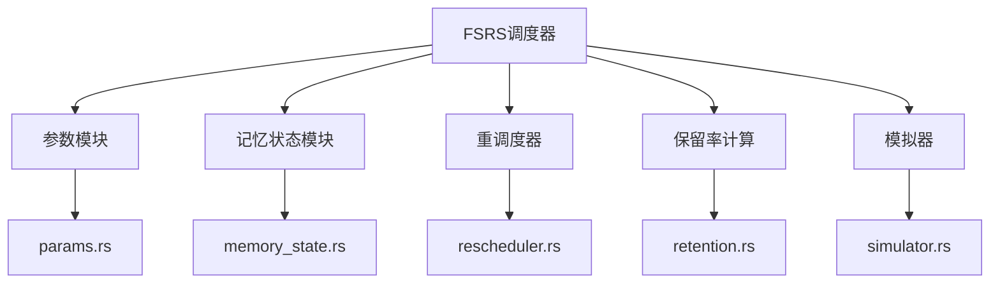
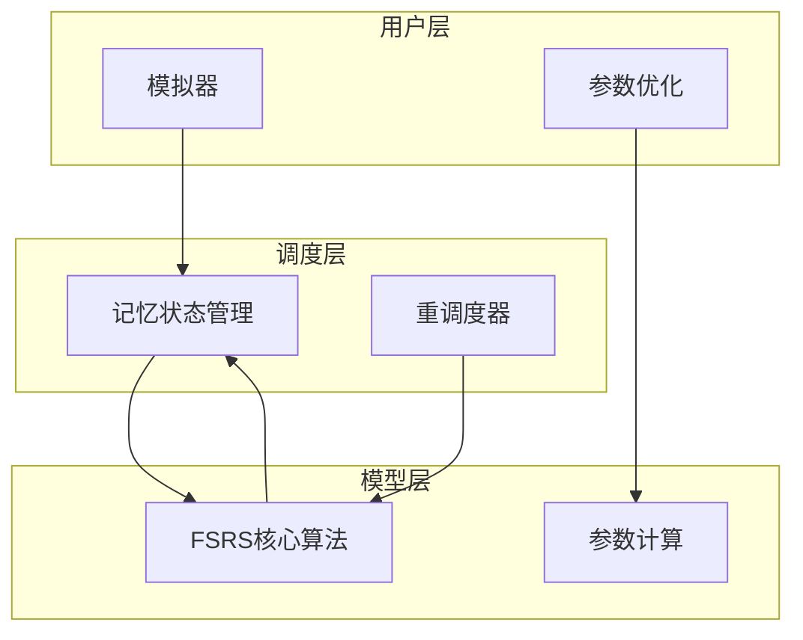
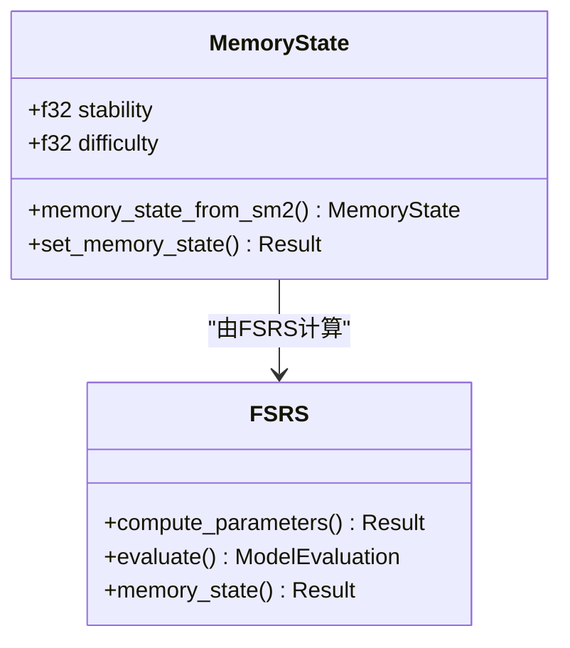
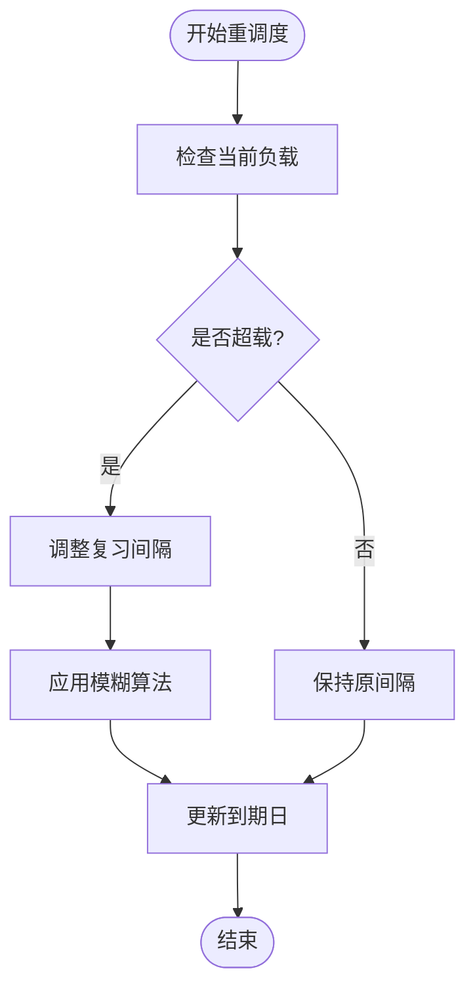
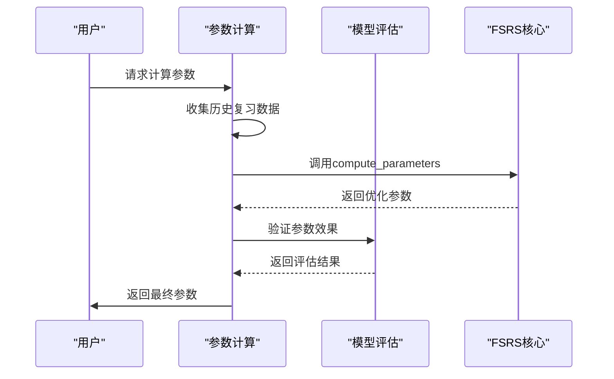
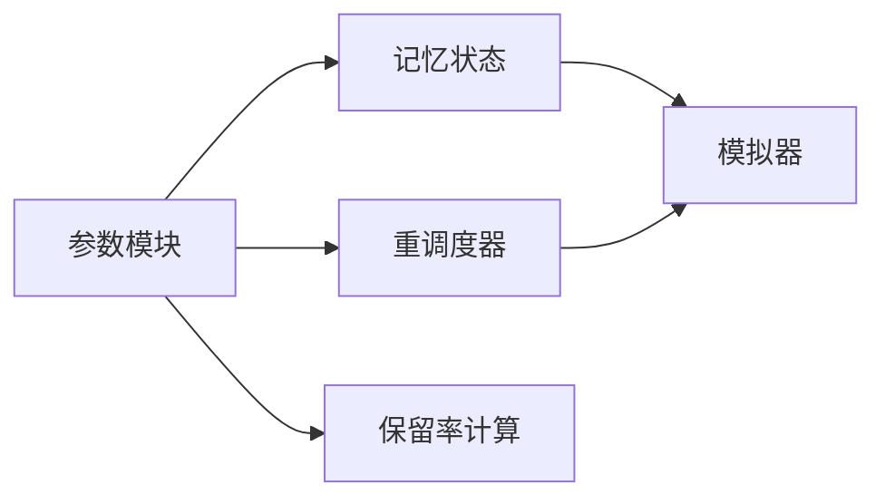

# FSRS算法实现

<cite>
**本文档中引用的文件**  
- [error.rs](file://rslib/src/scheduler/fsrs/error.rs)
- [memory_state.rs](file://rslib/src/scheduler/fsrs/memory_state.rs)
- [mod.rs](file://rslib/src/scheduler/fsrs/mod.rs)
- [params.rs](file://rslib/src/scheduler/fsrs/params.rs)
- [rescheduler.rs](file://rslib/src/scheduler/fsrs/rescheduler.rs)
- [retention.rs](file://rslib/src/scheduler/fsrs/retention.rs)
- [simulator.rs](file://rslib/src/scheduler/fsrs/simulator.rs)
- [try_collect.rs](file://rslib/src/scheduler/fsrs/try_collect.rs)
</cite>

## 目录
1. [引言](#引言)
2. [项目结构](#项目结构)
3. [核心组件](#核心组件)
4. [架构概述](#架构概述)
5. [详细组件分析](#详细组件分析)
6. [依赖分析](#依赖分析)
7. [性能考虑](#性能考虑)
8. [故障排除指南](#故障排除指南)
9. [结论](#结论)

## 引言
FSRS（Free Spaced Repetition Scheduler）算法是Anki中用于智能记忆调度的核心机制。该算法通过数学建模和参数优化，实现对学习者记忆状态的精准预测与复习计划的动态调整。相比传统SM2算法，FSRS能够更准确地反映记忆衰减规律，并根据个体学习表现自适应调整复习间隔。本文档深入解析FSRS算法的实现原理、核心组件协同机制及实际应用中的最佳实践。

## 项目结构
FSRS算法的实现位于`rslib/src/scheduler/fsrs`目录下，采用模块化设计，各组件职责分明。主要包含参数计算、记忆状态管理、重调度器等核心模块，共同构成完整的智能调度系统。

**图示来源**
- [mod.rs](file://rslib/src/scheduler/fsrs/mod.rs#L1-L10)

**本节来源**
- [mod.rs](file://rslib/src/scheduler/fsrs/mod.rs#L1-L10)

## 核心组件
FSRS算法的核心组件包括记忆状态（memory_state）、重调度器（rescheduler）和参数管理（params）。这些组件协同工作，实现从记忆状态预测到复习计划生成的完整闭环。记忆状态模块负责维护和更新每个卡片的记忆特征，重调度器处理复习负载均衡，参数模块则通过机器学习方法优化算法参数。

**本节来源**
- [memory_state.rs](file://rslib/src/scheduler/fsrs/memory_state.rs#L1-L508)
- [rescheduler.rs](file://rslib/src/scheduler/fsrs/rescheduler.rs#L1-L183)
- [params.rs](file://rslib/src/scheduler/fsrs/params.rs#L1-L799)

## 架构概述
FSRS算法采用分层架构设计，底层为数学模型和参数计算，中层为记忆状态管理和调度决策，上层为用户交互和模拟功能。这种架构确保了算法的可扩展性和可维护性，同时支持复杂的调度策略和个性化学习需求。

**图示来源**
- [simulator.rs](file://rslib/src/scheduler/fsrs/simulator.rs#L1-L347)
- [params.rs](file://rslib/src/scheduler/fsrs/params.rs#L1-L799)

## 详细组件分析

### 记忆状态分析
记忆状态模块是FSRS算法的核心，负责维护每个学习项目的记忆特征。通过`MemoryState`结构体存储稳定性和难度两个关键指标，这些指标随每次复习反馈动态更新，形成个性化的记忆模型。

**图示来源**
- [memory_state.rs](file://rslib/src/scheduler/fsrs/memory_state.rs#L1-L508)
- [params.rs](file://rslib/src/scheduler/fsrs/params.rs#L1-L799)

**本节来源**
- [memory_state.rs](file://rslib/src/scheduler/fsrs/memory_state.rs#L1-L508)

### 重调度器分析
重调度器模块负责在保持学习效果的同时优化每日复习负载。通过考虑易日设置和负载均衡策略，智能调整复习间隔，避免学习负担过重或过轻。

**图示来源**
- [rescheduler.rs](file://rslib/src/scheduler/fsrs/rescheduler.rs#L1-L183)

**本节来源**
- [rescheduler.rs](file://rslib/src/scheduler/fsrs/rescheduler.rs#L1-L183)

### 参数计算分析
参数计算模块通过分析用户的历史复习数据，使用机器学习方法优化FSRS算法的17个核心参数。该过程涉及复杂的数学运算和模型评估，确保参数配置能够最大化学习效率。

**图示来源**
- [params.rs](file://rslib/src/scheduler/fsrs/params.rs#L1-L799)

**本节来源**
- [params.rs](file://rslib/src/scheduler/fsrs/params.rs#L1-L799)

## 依赖分析
FSRS算法的各个组件之间存在紧密的依赖关系。参数模块为记忆状态和重调度器提供基础配置，记忆状态模块为调度决策提供数据支持，重调度器则依赖于前两者的结果进行负载优化。

**图示来源**
- [mod.rs](file://rslib/src/scheduler/fsrs/mod.rs#L1-L10)
- [params.rs](file://rslib/src/scheduler/fsrs/params.rs#L1-L799)

**本节来源**
- [mod.rs](file://rslib/src/scheduler/fsrs/mod.rs#L1-L10)
- [params.rs](file://rslib/src/scheduler/fsrs/params.rs#L1-L799)

## 性能考虑
FSRS算法在设计时充分考虑了性能因素。通过并行计算、进度跟踪和中断处理机制，确保在处理大量复习数据时仍能保持良好的响应性。参数计算过程支持进度报告和用户中断，避免长时间阻塞用户操作。

## 故障排除指南
当FSRS算法出现异常时，首先检查参数配置是否合理，确认历史复习数据是否充足。对于参数优化失败的情况，可尝试增加最小复习条目数或调整忽略历史数据的时间范围。若记忆状态计算异常，需验证卡片的复习记录是否完整。

**本节来源**
- [error.rs](file://rslib/src/scheduler/fsrs/error.rs#L1-L31)
- [params.rs](file://rslib/src/scheduler/fsrs/params.rs#L1-L799)

## 结论
FSRS算法通过科学的记忆建模和智能调度策略，显著提升了间隔重复学习的效果。其模块化设计和参数优化能力使得算法能够适应不同学习者的需求，为个性化学习提供了强大的技术支持。未来可通过进一步优化参数计算效率和增强模型预测准确性来提升用户体验。