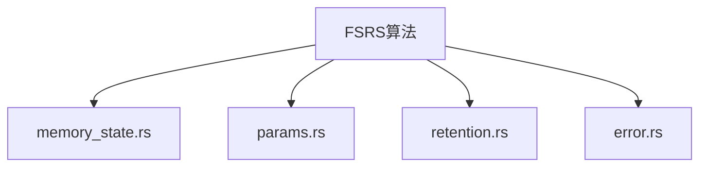
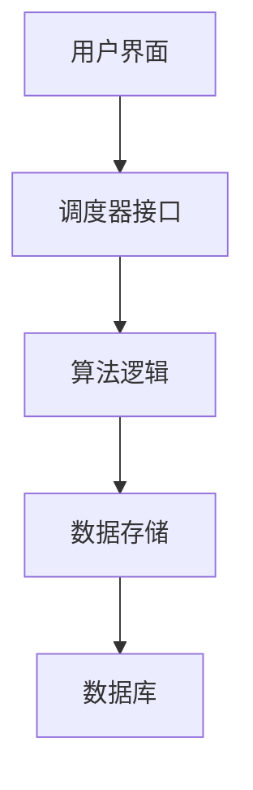
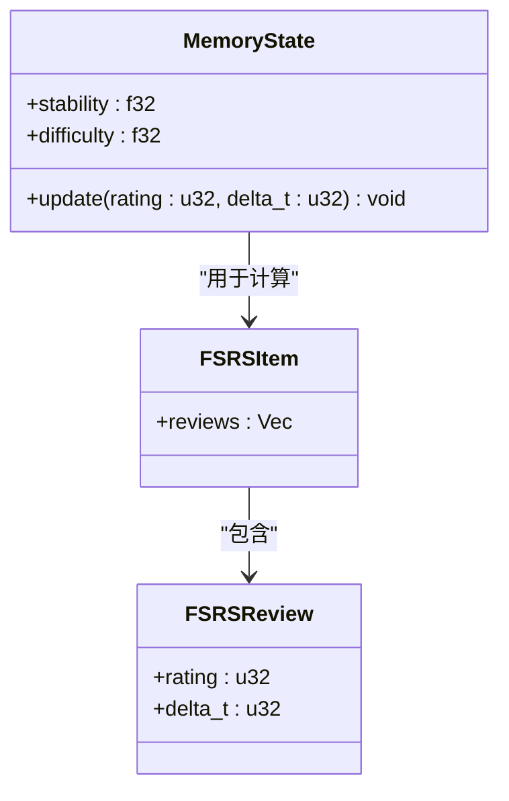
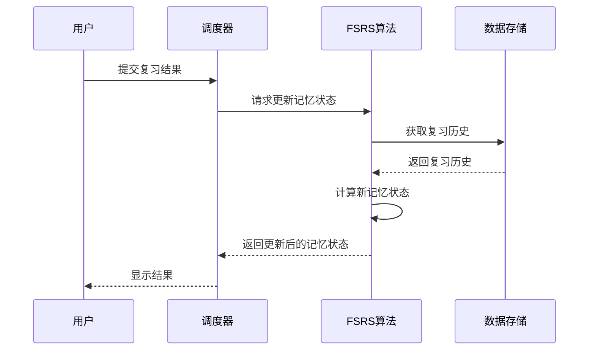
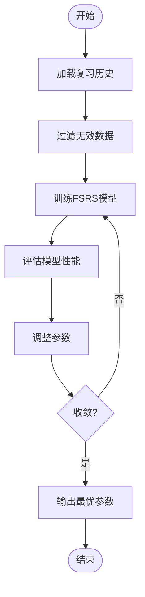
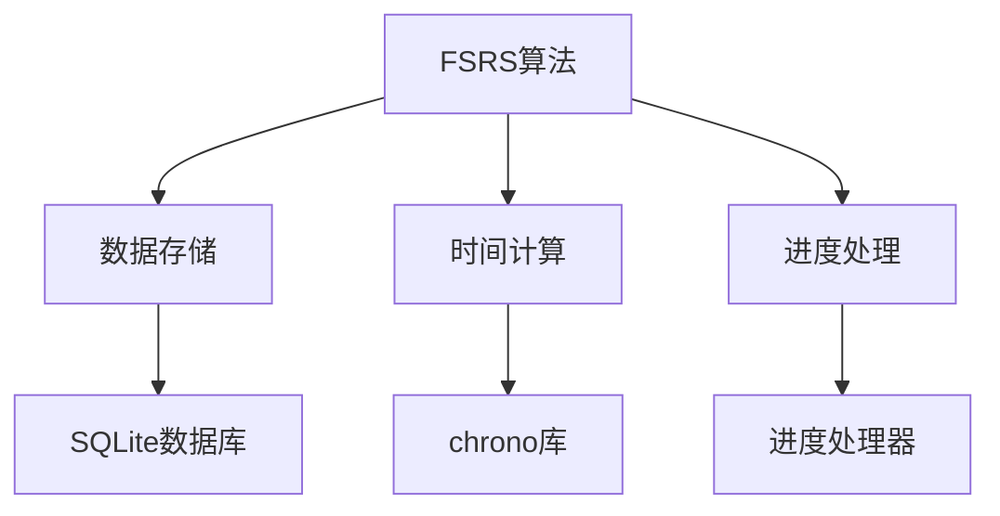

# FSRS算法核心

<cite>
**本文档中引用的文件**  
- [memory_state.rs](file://rslib/src/scheduler/fsrs/memory_state.rs)
- [params.rs](file://rslib/src/scheduler/fsrs/params.rs)
- [retention.rs](file://rslib/src/scheduler/fsrs/retention.rs)
- [error.rs](file://rslib/src/scheduler/fsrs/error.rs)
</cite>

## 目录
1. [简介](#简介)
2. [项目结构](#项目结构)
3. [核心组件](#核心组件)
4. [架构概述](#架构概述)
5. [详细组件分析](#详细组件分析)
6. [依赖分析](#依赖分析)
7. [性能考虑](#性能考虑)
8. [故障排除指南](#故障排除指南)
9. [结论](#结论)

## 简介
FSRS（Free Spaced Repetition Scheduler）是一种先进的间隔重复算法，用于优化Anki中的记忆卡片复习调度。该算法通过数学建模和机器学习技术，动态调整卡片的复习间隔，以最大化长期记忆保留率。本文件深入解析FSRS算法的核心实现，重点说明其记忆状态表示、参数计算逻辑以及调度决策机制。

## 项目结构
FSRS算法的实现位于`rslib/src/scheduler/fsrs`目录下，包含多个模块化文件，分别处理不同的功能方面。主要文件包括`memory_state.rs`（记忆状态管理）、`params.rs`（参数计算）、`retention.rs`（保留率模拟）和`error.rs`（错误处理）。

**图示来源**  
- [memory_state.rs](file://rslib/src/scheduler/fsrs/memory_state.rs#L0-L508)
- [params.rs](file://rslib/src/scheduler/fsrs/params.rs#L0-L867)
- [retention.rs](file://rslib/src/scheduler/fsrs/retention.rs#L0-L81)
- [error.rs](file://rslib/src/scheduler/fsrs/error.rs#L0-L31)

**本节来源**  
- [memory_state.rs](file://rslib/src/scheduler/fsrs/memory_state.rs#L0-L508)
- [params.rs](file://rslib/src/scheduler/fsrs/params.rs#L0-L867)

## 核心组件
FSRS算法的核心组件包括记忆状态计算、参数优化、保留率模拟和错误处理。这些组件协同工作，确保算法能够根据用户的复习历史动态调整复习计划。

**本节来源**  
- [memory_state.rs](file://rslib/src/scheduler/fsrs/memory_state.rs#L0-L508)
- [params.rs](file://rslib/src/scheduler/fsrs/params.rs#L0-L867)

## 架构概述
FSRS算法的整体架构基于一个分层设计，其中顶层是调度器接口，中间层是算法逻辑，底层是数据存储和检索。这种设计使得算法可以灵活地适应不同的用户需求和数据环境。

**图示来源**  
- [memory_state.rs](file://rslib/src/scheduler/fsrs/memory_state.rs#L0-L508)
- [params.rs](file://rslib/src/scheduler/fsrs/params.rs#L0-L867)

## 详细组件分析

### 记忆状态分析
记忆状态是FSRS算法的核心概念之一，它表示用户对某个记忆项目的掌握程度。记忆状态由稳定性和难度两个参数组成，这两个参数通过用户的复习历史动态更新。

#### 记忆状态类图

**图示来源**  
- [memory_state.rs](file://rslib/src/scheduler/fsrs/memory_state.rs#L0-L508)

#### 记忆状态更新序列图

**图示来源**  
- [memory_state.rs](file://rslib/src/scheduler/fsrs/memory_state.rs#L0-L508)

**本节来源**  
- [memory_state.rs](file://rslib/src/scheduler/fsrs/memory_state.rs#L0-L508)

### 参数计算分析
参数计算模块负责根据用户的复习历史优化FSRS算法的参数，以提高预测准确性。该模块使用统计方法和机器学习技术来确定最佳参数值。

#### 参数计算流程图

**图示来源**  
- [params.rs](file://rslib/src/scheduler/fsrs/params.rs#L0-L867)

**本节来源**  
- [params.rs](file://rslib/src/scheduler/fsrs/params.rs#L0-L867)

## 依赖分析
FSRS算法依赖于多个外部组件和库，包括数据存储、时间计算和进度处理。这些依赖关系确保了算法能够在不同环境下稳定运行。

**图示来源**  
- [memory_state.rs](file://rslib/src/scheduler/fsrs/memory_state.rs#L0-L508)
- [params.rs](file://rslib/src/scheduler/fsrs/params.rs#L0-L867)

**本节来源**  
- [memory_state.rs](file://rslib/src/scheduler/fsrs/memory_state.rs#L0-L508)
- [params.rs](file://rslib/src/scheduler/fsrs/params.rs#L0-L867)

## 性能考虑
在实现FSRS算法时，需要考虑多个性能因素，包括计算效率、内存使用和响应时间。通过优化数据结构和算法逻辑，可以显著提高算法的运行效率。

## 故障排除指南
当FSRS算法出现异常时，可以通过检查日志文件、验证输入数据和调试代码来定位问题。常见的问题包括数据不完整、参数设置不当和计算溢出。

**本节来源**  
- [error.rs](file://rslib/src/scheduler/fsrs/error.rs#L0-L31)

## 结论
FSRS算法通过复杂的数学模型和动态参数调整，为Anki用户提供了一个高效的记忆复习系统。通过对记忆状态的精确建模和参数优化，该算法能够显著提高学习效果和记忆保留率。