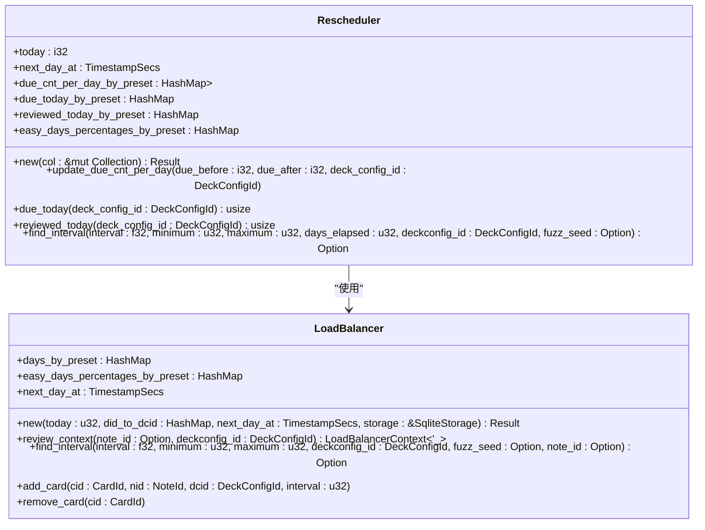
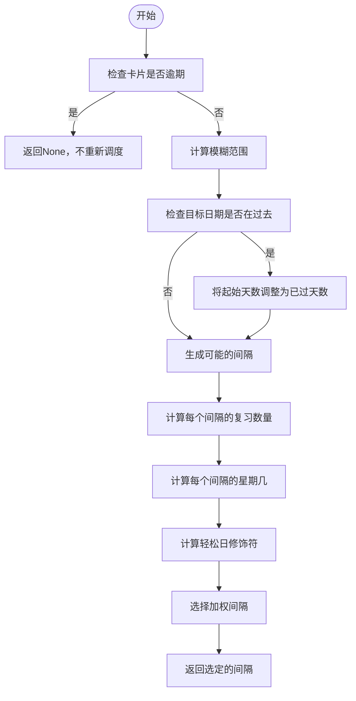
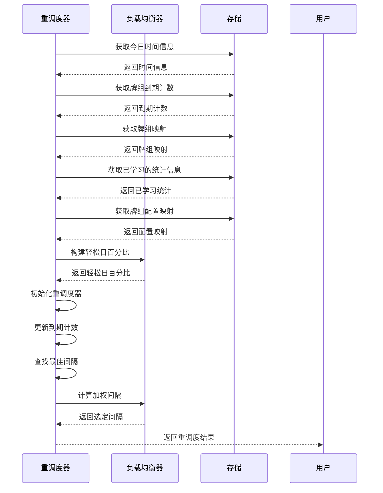
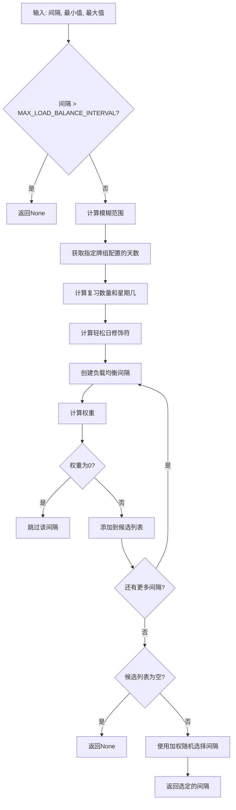

# FSRS重调度机制

<cite>
**本文档引用的文件**
- [rescheduler.rs](file://rslib/src/scheduler/fsrs/rescheduler.rs)
- [fuzz.rs](file://rslib/src/scheduler/states/fuzz.rs)
- [load_balancer.rs](file://rslib/src/scheduler/states/load_balancer.rs)
- [memory_state.rs](file://rslib/src/scheduler/fsrs/memory_state.rs)
- [simulator.rs](file://rslib/src/scheduler/fsrs/simulator.rs)
</cite>

## 目录
1. [引言](#引言)
2. [核心组件](#核心组件)
3. [重调度算法实现](#重调度算法实现)
4. [时间偏移处理](#时间偏移处理)
5. [计划重新分布算法](#计划重新分布算法)
6. [负载均衡机制](#负载均衡机制)
7. [配置选项与最佳实践](#配置选项与最佳实践)
8. [常见场景处理](#常见场景处理)
9. [性能权衡](#性能权衡)
10. [结论](#结论)

## 引言
FSRS（Free Spaced Repetition Scheduler）重调度机制是Anki学习系统中的核心功能，用于在用户学习行为偏离预期时（如延迟复习、批量学习等）重新计算和调整未来的复习计划。该机制通过复杂的算法确保学习计划的科学性和适应性，帮助用户在非理想学习模式下仍能保持高效的学习效果。

## 核心组件
FSRS重调度机制的核心组件包括重调度器（Rescheduler）、模糊处理（Fuzz）、负载均衡器（LoadBalancer）等。这些组件协同工作，确保在用户行为变化时能够动态调整复习计划。

**本节来源**
- [rescheduler.rs](file://rslib/src/scheduler/fsrs/rescheduler.rs#L1-L182)
- [fuzz.rs](file://rslib/src/scheduler/states/fuzz.rs#L1-L181)
- [load_balancer.rs](file://rslib/src/scheduler/states/load_balancer.rs#L1-L399)

## 重调度算法实现
重调度算法的核心在于根据用户的实际学习行为重新计算复习间隔。当用户延迟复习或进行批量学习时，系统会重新评估卡片的复习计划，确保学习效果不受影响。

**图表来源**
- [rescheduler.rs](file://rslib/src/scheduler/fsrs/rescheduler.rs#L1-L182)
- [load_balancer.rs](file://rslib/src/scheduler/states/load_balancer.rs#L1-L399)

**本节来源**
- [rescheduler.rs](file://rslib/src/scheduler/fsrs/rescheduler.rs#L1-L182)
- [load_balancer.rs](file://rslib/src/scheduler/states/load_balancer.rs#L1-L399)

## 时间偏移处理
时间偏移处理是重调度机制的重要组成部分，用于应对用户延迟复习的情况。系统通过计算实际复习时间与计划复习时间的差异，调整后续复习计划。

**图表来源**
- [rescheduler.rs](file://rslib/src/scheduler/fsrs/rescheduler.rs#L1-L182)
- [fuzz.rs](file://rslib/src/scheduler/states/fuzz.rs#L1-L181)

**本节来源**
- [rescheduler.rs](file://rslib/src/scheduler/fsrs/rescheduler.rs#L1-L182)
- [fuzz.rs](file://rslib/src/scheduler/states/fuzz.rs#L1-L181)

## 计划重新分布算法
计划重新分布算法通过负载均衡机制，将复习任务均匀分布在未来的日子里，避免某一天任务过重。该算法考虑了每天的复习数量、目标间隔、兄弟卡片和轻松日设置等因素。

**图表来源**
- [rescheduler.rs](file://rslib/src/scheduler/fsrs/rescheduler.rs#L1-L182)
- [load_balancer.rs](file://rslib/src/scheduler/states/load_balancer.rs#L1-L399)

**本节来源**
- [rescheduler.rs](file://rslib/src/scheduler/fsrs/rescheduler.rs#L1-L182)
- [load_balancer.rs](file://rslib/src/scheduler/states/load_balancer.rs#L1-L399)

## 负载均衡机制
负载均衡机制是FSRS重调度的核心，通过复杂的加权算法确保复习任务的均匀分布。该机制考虑了多个因素，包括当天的复习数量、目标间隔、兄弟卡片和轻松日设置。

**图表来源**
- [load_balancer.rs](file://rslib/src/scheduler/states/load_balancer.rs#L1-L399)

**本节来源**
- [load_balancer.rs](file://rslib/src/scheduler/states/load_balancer.rs#L1-L399)

## 配置选项与最佳实践
FSRS重调度机制提供了多种配置选项，允许用户根据自己的学习习惯进行个性化设置。最佳实践包括合理设置轻松日、避免过度使用批量学习功能等。

**本节来源**
- [rescheduler.rs](file://rslib/src/scheduler/fsrs/rescheduler.rs#L1-L182)
- [load_balancer.rs](file://rslib/src/scheduler/states/load_balancer.rs#L1-L399)

## 常见场景处理
FSRS重调度机制能够有效处理多种常见学习场景，包括延迟复习、批量学习、跨天学习等。系统会根据具体情况动态调整复习计划，确保学习效果不受影响。

**本节来源**
- [rescheduler.rs](file://rslib/src/scheduler/fsrs/rescheduler.rs#L1-L182)
- [load_balancer.rs](file://rslib/src/scheduler/states/load_balancer.rs#L1-L399)

## 性能权衡
FSRS重调度机制在确保学习效果的同时，也考虑了系统性能。通过限制最大负载均衡间隔和使用高效的算法，系统能够在保证功能完整性的同时保持良好的性能表现。

**本节来源**
- [load_balancer.rs](file://rslib/src/scheduler/states/load_balancer.rs#L1-L399)
- [fuzz.rs](file://rslib/src/scheduler/states/fuzz.rs#L1-L181)

## 结论
FSRS重调度机制是Anki学习系统中的一项重要创新，通过复杂的算法和精心设计的组件，有效应对了用户学习行为的不确定性。该机制不仅提高了学习的灵活性，还确保了长期记忆效果的稳定性，为用户提供了更加智能和个性化的学习体验。