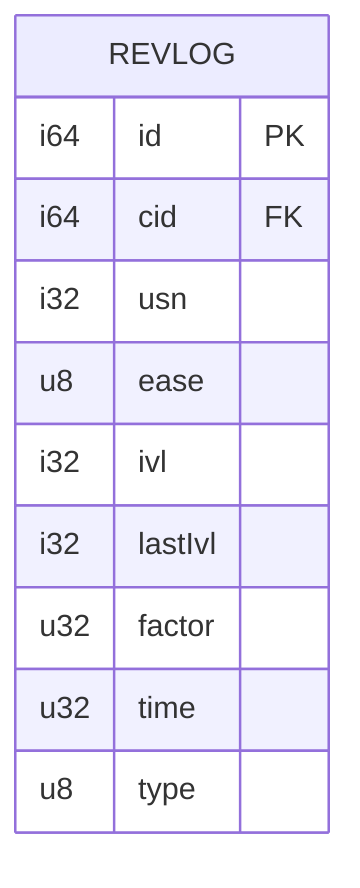
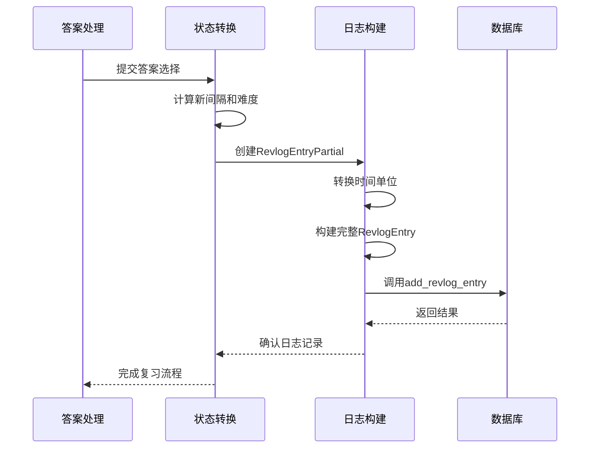

# 复习日志管理

<cite>
**本文档中引用的文件**
- [revlog.rs](file://rslib/src/scheduler/answering/revlog.rs)
- [mod.rs](file://rslib/src/revlog/mod.rs)
- [add.sql](file://rslib/src/storage/revlog/add.sql)
- [get.sql](file://rslib/src/storage/revlog/get.sql)
- [mod.rs](file://rslib/src/storage/revlog/mod.rs)
- [undo.rs](file://rslib/src/revlog/undo.rs)
- [fix_props.sql](file://rslib/src/storage/revlog/fix_props.sql)
</cite>

## 目录
1. [简介](#简介)
2. [数据模型与字段定义](#数据模型与字段定义)
3. [日志记录流程](#日志记录流程)
4. [存储机制与数据库操作](#存储机制与数据库操作)
5. [索引策略与查询优化](#索引策略与查询优化)
6. [完整性保证与撤销机制](#完整性保证与撤销机制)
7. [常见问题与解决方案](#常见问题与解决方案)
8. [性能优化建议](#性能优化建议)

## 简介
Anki系统通过复习日志（revlog）详细记录每次卡片评估的完整信息，包括时间戳、得分、间隔、难度和状态变化。该系统实现了高效的数据结构和存储机制，确保评估结果能够快速写入数据库并支持后续的统计分析。复习日志不仅用于跟踪用户的学习进度，还为算法调度和性能分析提供关键数据支持。

**Section sources**
- [revlog.rs](file://rslib/src/scheduler/answering/revlog.rs#L1-L54)
- [mod.rs](file://rslib/src/revlog/mod.rs#L1-L32)

## 数据模型与字段定义
复习日志的核心数据结构`RevlogEntry`包含以下关键字段：

- **id**: `RevlogId`类型，表示日志条目的唯一标识，由时间戳转换而来
- **cid**: `CardId`类型，关联的卡片ID
- **usn**: 用户序列号，用于同步冲突解决
- **button_chosen**: 用户选择的答案按钮（1-4），0表示手动重调度
- **interval**: 下次复习间隔，正值表示天数，负值表示秒数
- **last_interval**: 上次复习间隔，格式同上
- **ease_factor**: 卡片难度因子，存储为百分比的10倍值（如2500表示250%）
- **taken_millis**: 回答所用的毫秒数
- **review_kind**: 复习类型枚举，区分学习、复习、重新学习等场景

数据模型通过serde序列化框架进行JSON转换，并使用`deserialize_int_from_number`确保数值字段的正确解析。



**Diagram sources**
- [mod.rs](file://rslib/src/revlog/mod.rs#L28-L59)
- [add.sql](file://rslib/src/storage/revlog/add.sql#L1-L34)

**Section sources**
- [mod.rs](file://rslib/src/revlog/mod.rs#L28-L59)

## 日志记录流程
复习日志的记录流程从答案处理开始，经过状态转换，最终生成完整的日志条目：

1. 创建`RevlogEntryPartial`临时对象，包含当前和下一个卡片状态
2. 使用`maybe_as_days`方法将间隔时间转换为合适的单位（天或秒）
3. 调用`into_revlog_entry`方法完成最终日志条目的构建
4. 将ease_factor乘以1000并四舍五入为整数存储
5. 使用当前时间戳作为日志ID

该流程确保了日志数据的准确性和一致性，同时优化了存储效率。



**Diagram sources**
- [revlog.rs](file://rslib/src/scheduler/answering/revlog.rs#L1-L54)
- [mod.rs](file://rslib/src/revlog/mod.rs#L28-L59)

**Section sources**
- [revlog.rs](file://rslib/src/scheduler/answering/revlog.rs#L1-L54)

## 存储机制与数据库操作
复习日志的存储机制基于SQLite数据库，通过预编译SQL语句实现高效的数据写入和读取：

### 写入操作
使用`add.sql`中的INSERT OR IGNORE语句确保日志条目的唯一性。当`uniquify`参数为true时，如果ID冲突，系统会自动分配新的ID（max(id)+1）。

### 读取操作
提供多种查询方法：
- `get_all_revlog_entries_in_card_order`: 按卡片ID和日志ID排序获取所有条目
- `get_all_revlog_entries`: 获取指定时间点之后的所有条目
- `get_revlog_entries_for_export_dataset`: 获取用于导出数据集的条目

### 数据修复
`fix_props.sql`脚本用于修复异常数据，包括：
- 限制间隔值在合理范围内（-2147483648到2147483647）
- 确保时间值非负
- 修正特殊类型的标记

```mermaid
flowchart TD
开始[开始日志记录] --> 唯一性检查{ID是否唯一?}
唯一性检查 --> |是| 直接插入[执行INSERT语句]
唯一性检查 --> |否| 冲突处理{uniquify=true?}
冲突处理 --> |是| 分配新ID[获取max(id)+1]
冲突处理 --> |否| 忽略插入[使用OR IGNORE]
分配新ID --> 执行插入
忽略插入 --> 执行插入
执行插入 --> 完成[记录完成]
```

**Diagram sources**
- [add.sql](file://rslib/src/storage/revlog/add.sql#L1-L34)
- [mod.rs](file://rslib/src/storage/revlog/mod.rs#L47-L86)
- [fix_props.sql](file://rslib/src/storage/revlog/fix_props.sql#L1-L22)

**Section sources**
- [mod.rs](file://rslib/src/storage/revlog/mod.rs#L47-L86)
- [add.sql](file://rslib/src/storage/revlog/add.sql#L1-L34)

## 索引策略与查询优化
复习日志表的查询优化主要依赖于复合索引和查询条件的设计：

- 主要查询模式按`cid`（卡片ID）和`id`（日志ID）排序，这有利于按卡片组织复习历史
- 时间