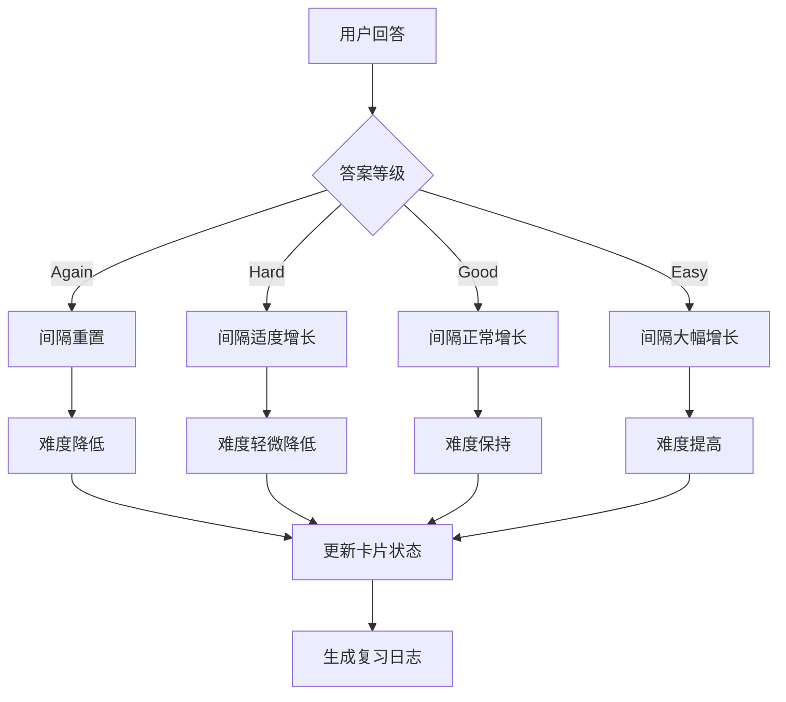
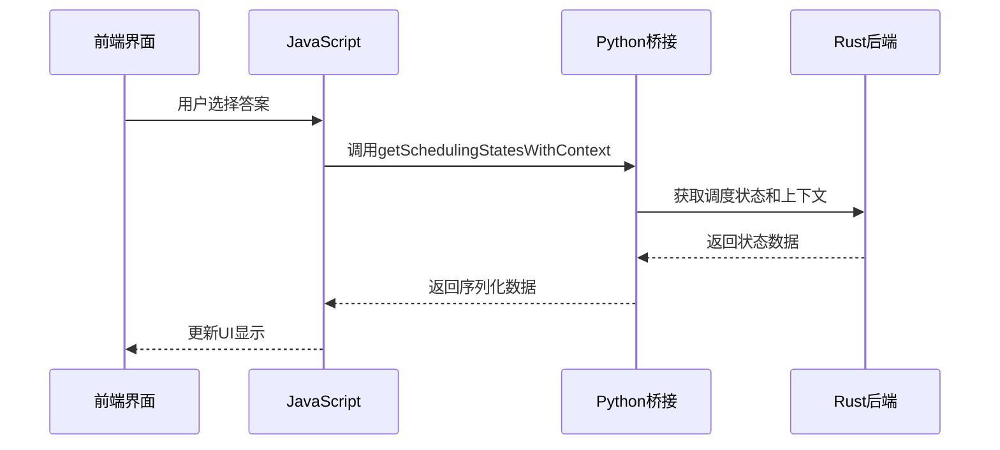
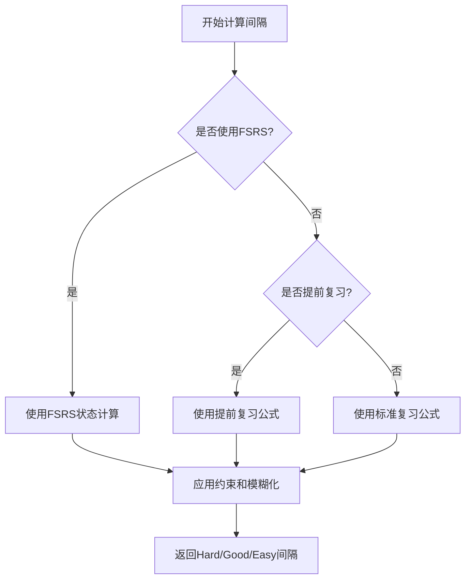
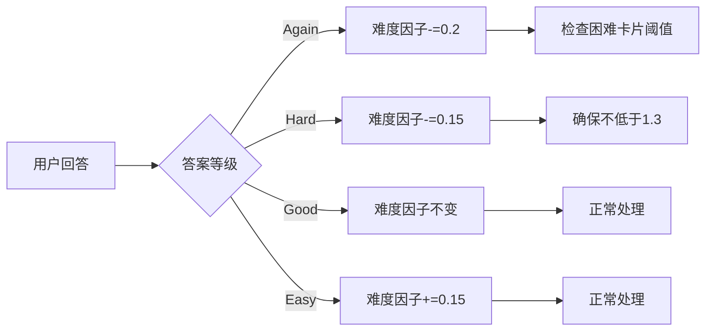
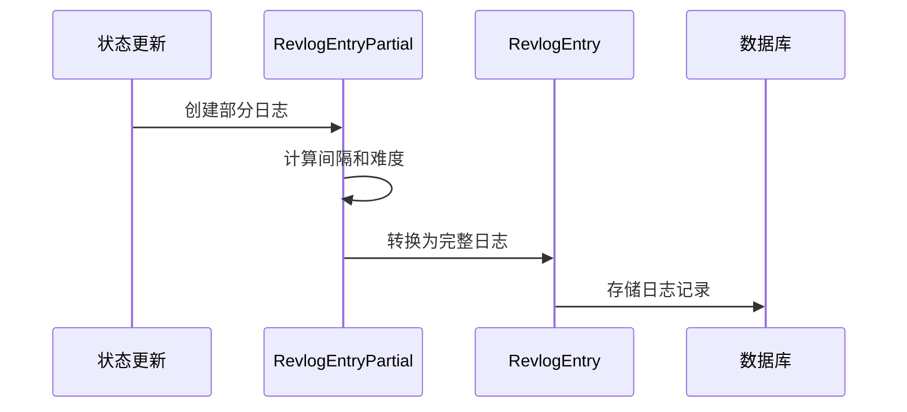

# 复习评估

<cite>
**本文档中引用的文件**  
- [review.rs](file://rslib/src/scheduler/answering/review.rs)
- [review.rs](file://rslib/src/scheduler/states/review.rs)
- [mod.rs](file://rslib/src/scheduler/states/mod.rs)
- [revlog.rs](file://rslib/src/scheduler/answering/revlog.rs)
- [answering.ts](file://ts/reviewer/answering.ts)
- [mediasrv.py](file://qt/aqt/mediasrv.py)
- [v3.py](file://pylib/anki/scheduler/v3.py)
</cite>

## 目录
1. [简介](#简介)
2. [复习评估机制概述](#复习评估机制概述)
3. [答案处理流程](#答案处理流程)
4. [间隔计算算法](#间隔计算算法)
5. [难度调整机制](#难度调整机制)
6. [复习日志生成](#复习日志生成)
7. [常见问题与解决方案](#常见问题与解决方案)
8. [最佳实践](#最佳实践)
9. [结论](#结论)

## 简介
Anki的复习评估机制是其智能记忆算法的核心组成部分。该系统通过四个难度等级（Again、Hard、Good、Easy）来评估用户对卡片的记忆程度，并据此动态调整复习间隔。本文件详细说明了Anki如何处理用户在常规复习中的答案选择，包括间隔计算、难度调整和复习日志生成等关键过程。

## 复习评估机制概述
Anki的复习评估机制基于SuperMemo算法的改进版本，通过分析用户对卡片的回答质量来预测最佳复习时间。系统为每张卡片维护一个状态，包括当前间隔、难度因子和记忆状态等信息。当用户完成一次复习时，系统会根据选择的答案等级更新这些状态参数。

复习评估过程主要涉及以下几个核心组件：
- 答案处理逻辑
- 间隔计算算法
- 难度调整机制
- 复习日志记录



**图示来源**
- [review.rs](file://rslib/src/scheduler/answering/review.rs#L1-L39)
- [review.rs](file://rslib/src/scheduler/states/review.rs#L1-L394)

**本节来源**
- [review.rs](file://rslib/src/scheduler/answering/review.rs#L1-L39)
- [review.rs](file://rslib/src/scheduler/states/review.rs#L1-L394)

## 答案处理流程
当用户在Anki中完成一次卡片复习时，系统会根据选择的答案等级执行相应的处理逻辑。答案处理流程从用户界面开始，经过前端JavaScript代码，最终由Rust后端实现核心算法。

前端JavaScript代码通过调用后端API获取调度状态：



**图示来源**
- [answering.ts](file://ts/reviewer/answering.ts#L48-L48)
- [mediasrv.py](file://qt/aqt/mediasrv.py#L497-L501)
- [v3.py](file://pylib/anki/scheduler/v3.py#L33-L33)

**本节来源**
- [answering.ts](file://ts/reviewer/answering.ts#L48-L48)
- [mediasrv.py](file://qt/aqt/mediasrv.py#L497-L501)

## 间隔计算算法
Anki的间隔计算算法是其复习系统的核心。算法根据卡片的当前状态、历史表现和用户选择的答案等级来计算新的复习间隔。

### 基础参数
系统定义了几个关键的常量参数：
- `INITIAL_EASE_FACTOR`: 初始难度因子，值为2.5
- `MINIMUM_EASE_FACTOR`: 最小难度因子，值为1.3
- `EASE_FACTOR_AGAIN_DELTA`: Again答案的难度变化，值为-0.2
- `EASE_FACTOR_HARD_DELTA`: Hard答案的难度变化，值为-0.15
- `EASE_FACTOR_EASY_DELTA`: Easy答案的难度变化，值为+0.15

### 间隔计算逻辑
间隔计算主要在`passing_review_intervals`方法中实现，根据不同的情况采用不同的计算策略：



对于标准复习情况，算法使用以下公式：
- Hard间隔 = 当前间隔 × Hard乘数
- Good间隔 = (当前间隔 + 延迟天数/2) × 难度因子
- Easy间隔 = (当前间隔 + 延迟天数) × 难度因子 × Easy乘数

所有计算结果都会经过`constrain_passing_interval`函数的约束处理，确保间隔在合理范围内。

**图示来源**
- [review.rs](file://rslib/src/scheduler/states/review.rs#L1-L394)
- [mod.rs](file://rslib/src/scheduler/states/mod.rs#L1-L223)

**本节来源**
- [review.rs](file://rslib/src/scheduler/states/review.rs#L1-L394)

## 难度调整机制
Anki的难度调整机制通过"难度因子"(ease factor)来量化卡片的难易程度。难度因子直接影响未来的复习间隔长度。

### 难度因子更新规则
根据用户选择的答案等级，系统会相应调整难度因子：

| 答案等级 | 难度因子变化 | 说明 |
|---------|------------|------|
| Again | -0.2 | 难度显著降低，卡片被认为很难 |
| Hard | -0.15 | 难度轻微降低，卡片被认为较难 |
| Good | 0 | 难度保持不变，卡片难度适中 |
| Easy | +0.15 | 难度提高，卡片被认为很容易 |

### 难度边界处理
系统确保难度因子不会低于最小值1.3：

```rust
ease_factor: (self.ease_factor + EASE_FACTOR_AGAIN_DELTA).max(MINIMUM_EASE_FACTOR)
```

当用户连续多次选择Again答案时，系统会检测是否达到"困难卡片"阈值（leech threshold），并可能采取特殊处理。



**图示来源**
- [review.rs](file://rslib/src/scheduler/states/review.rs#L1-L394)

**本节来源**
- [review.rs](file://rslib/src/scheduler/states/review.rs#L1-L394)

## 复习日志生成
每次复习完成后，Anki都会生成一条复习日志记录，用于追踪卡片的学习历史和性能分析。

### 日志数据结构
复习日志包含以下关键信息：
- `id`: 日志条目ID（基于回答时间）
- `cid`: 卡片ID
- `usn`: 用户序列号
- `button_chosen`: 用户选择的答案等级
- `interval`: 新的复习间隔
- `last_interval`: 上一次的复习间隔
- `ease_factor`: 当前难度因子
- `taken_millis`: 回答耗时（毫秒）
- `review_kind`: 复习类型

### 日志生成流程
日志生成主要在`RevlogEntryPartial`结构体中实现：



`RevlogEntryPartial`首先收集必要的状态信息，然后通过`into_revlog_entry`方法转换为完整的日志条目。

**图示来源**
- [revlog.rs](file://rslib/src/scheduler/answering/revlog.rs#L1-L55)
- [review.rs](file://rslib/src/scheduler/answering/review.rs#L1-L39)

**本节来源**
- [revlog.rs](file://rslib/src/scheduler/answering/revlog.rs#L1-L55)

## 常见问题与解决方案
### 间隔计算偏差
**问题描述**：有时用户会发现计算出的复习间隔与预期不符。

**可能原因**：
1. 模糊化(fuzz)机制的影响
2. 最大/最小间隔限制
3. 提前复习的特殊处理

**解决方案**：
- 检查卡片的调度配置
- 确认是否启用了模糊化
- 验证最大复习间隔设置

### 难度调整异常
**问题描述**：卡片难度变化不符合预期规则。

**可能原因**：
1. 难度因子已达到最小值1.3
2. 卡片被标记为困难卡片(leeched)
3. 使用了FSRS算法

**解决方案**：
- 检查卡片的难度因子历史
- 确认困难卡片阈值设置
- 验证是否启用了FSRS

### 复习日志缺失
**问题描述**：某些复习操作没有生成相应的日志记录。

**可能原因**：
1. 操作未正确提交
2. 数据库写入失败
3. 同步过程中丢失

**解决方案**：
- 检查数据库完整性
- 验证同步状态
- 查看错误日志

**本节来源**
- [review.rs](file://rslib/src/scheduler/states/review.rs#L1-L394)
- [revlog.rs](file://rslib/src/scheduler/answering/revlog.rs#L1-L55)

## 最佳实践
### 确保评估准确性
1. **保持一致的评估标准**：为每个答案等级建立明确的判断标准
2. **避免过度使用Easy**：仅在真正轻松回忆时选择Easy
3. **及时标记困难卡片**：让系统能够识别并特殊处理困难内容

### 性能优化建议
1. **合理设置调度参数**：
   - 调整Hard和Easy乘数以适应个人学习风格
   - 设置合适的最大复习间隔
   - 配置合理的困难卡片阈值

2. **监控学习数据**：
   - 定期查看统计图表
   - 分析复习成功率趋势
   - 调整学习计划基于数据反馈

3. **维护卡片质量**：
   - 定期审查和修改卡片内容
   - 删除或修改难以记忆的卡片
   - 优化卡片模板和格式

**本节来源**
- [review.rs](file://rslib/src/scheduler/states/review.rs#L1-L394)
- [mod.rs](file://rslib/src/scheduler/states/mod.rs#L1-L223)

## 结论
Anki的复习评估机制是一个复杂而精密的系统，通过科学的算法和细致的状态管理来优化学习效果。理解这一机制的工作原理有助于用户更好地利用Anki进行高效学习。核心要点包括：
- 四个答案等级对应不同的间隔增长策略
- 难度因子动态调整以反映卡片的真实难度
- 复习日志提供详细的学习历史追踪
- 算法考虑了多种特殊情况（如提前复习、困难卡片等）

通过遵循最佳实践并理解系统行为，用户可以最大化Anki的学习效益。