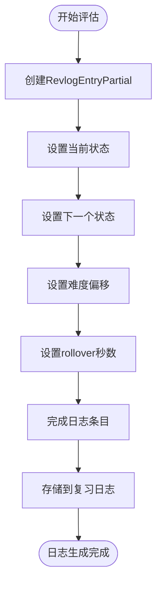

# 学习评估

<cite>
**本文档中引用的文件**  
- [learning.rs](file://rslib/src/scheduler/answering/learning.rs)
- [learning.rs](file://rslib/src/scheduler/states/learning.rs)
- [learning.rs](file://rslib/src/scheduler/service/states/learning.rs)
</cite>

## 目录
1. [简介](#简介)
2. [学习阶段调度机制](#学习阶段调度机制)
3. [学习状态转换逻辑](#学习状态转换逻辑)
4. [学习步骤与间隔计算](#学习步骤与间隔计算)
5. [学习日志生成](#学习日志生成)
6. [常见问题与解决方案](#常见问题与解决方案)
7. [最佳实践](#最佳实践)
8. [结论](#结论)

## 简介
Anki的学习评估机制是其智能记忆算法的核心组成部分，负责处理用户在学习新卡片或重新学习卡片时的答案。该系统通过复杂的调度规则来优化学习效果，确保用户能够在最佳时间点复习卡片。学习评估机制不仅处理学习阶段的特殊调度规则，还负责在完成学习阶段后平稳过渡到常规复习阶段。本文档将深入分析Anki中实现的算法，详细说明学习评估的完整流程。

## 学习阶段调度机制

**Diagram sources**
- [learning.rs](file://rslib/src/scheduler/answering/learning.rs#L39-L79)
- [learning.rs](file://rslib/src/scheduler/states/learning.rs#L85-L153)

**Section sources**
- [learning.rs](file://rslib/src/scheduler/answering/learning.rs#L1-L96)
- [learning.rs](file://rslib/src/scheduler/states/learning.rs#L1-L196)

## 学习状态转换逻辑

**Diagram sources**
- [learning.rs](file://rslib/src/scheduler/states/learning.rs#L8-L196)
- [learning.rs](file://rslib/src/scheduler/answering/learning.rs#L1-L96)

**Section sources**
- [learning.rs](file://rslib/src/scheduler/states/learning.rs#L85-L153)
- [learning.rs](file://rslib/src/scheduler/answering/learning.rs#L39-L79)

## 学习步骤与间隔计算

**Diagram sources**
- [learning.rs](file://rslib/src/scheduler/answering/learning.rs#L39-L79)
- [learning.rs](file://rslib/src/scheduler/states/learning.rs#L85-L153)

**Section sources**
- [learning.rs](file://rslib/src/scheduler/answering/learning.rs#L50-L79)
- [learning.rs](file://rslib/src/scheduler/states/learning.rs#L85-L153)

## 学习日志生成

**Diagram sources**
- [learning.rs](file://rslib/src/scheduler/answering/learning.rs#L39-L79)

**Section sources**
- [learning.rs](file://rslib/src/scheduler/answering/learning.rs#L65-L79)

## 常见问题与解决方案

### 学习步骤卡顿问题
当学习步骤配置不正确或系统无法正确读取步骤时，可能会出现学习步骤卡顿的问题。这通常发生在自定义学习步骤配置中。

**解决方案**：
1. 检查学习步骤配置是否正确
2. 确保步骤值在合理范围内
3. 验证步骤数组是否为空

### 延迟计算错误
延迟计算错误可能由于模糊算法参数设置不当或时间计算逻辑错误导致。

**解决方案**：
1. 检查fuzz_seed是否正确生成
2. 验证学习间隔模糊算法的实现
3. 确保时间戳计算准确

**Section sources**
- [learning.rs](file://rslib/src/scheduler/answering/learning.rs#L70-L79)
- [learning.rs](file://rslib/src/scheduler/states/learning.rs#L85-L153)

## 最佳实践

### 优化学习阶段用户体验
1. **合理设置学习步骤**：确保学习步骤间隔合理，避免过短或过长的间隔
2. **启用模糊算法**：使用模糊算法增加学习时间的随机性，避免机械记忆
3. **监控学习进度**：定期检查学习卡片的进度和完成情况

### 性能优化建议
1. **缓存状态上下文**：避免重复创建StateContext对象
2. **优化时间计算**：使用高效的时间戳计算方法
3. **减少内存分配**：重用对象以减少垃圾回收压力

**Section sources**
- [learning.rs](file://rslib/src/scheduler/answering/learning.rs#L70-L79)
- [learning.rs](file://rslib/src/scheduler/states/learning.rs#L85-L153)

## 结论
Anki的学习评估机制通过精心设计的算法实现了智能记忆调度。系统能够根据用户的回答动态调整学习步骤和间隔，确保学习效果最大化。通过理解学习状态转换逻辑、间隔计算方法和日志生成机制，开发者可以更好地优化学习体验。未来的工作可以集中在进一步优化模糊算法和提高系统性能上。