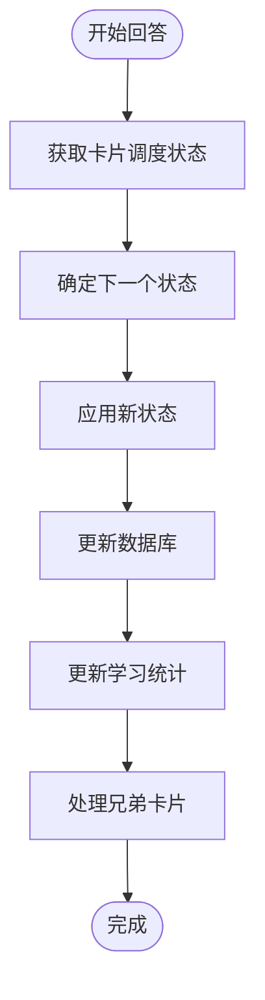
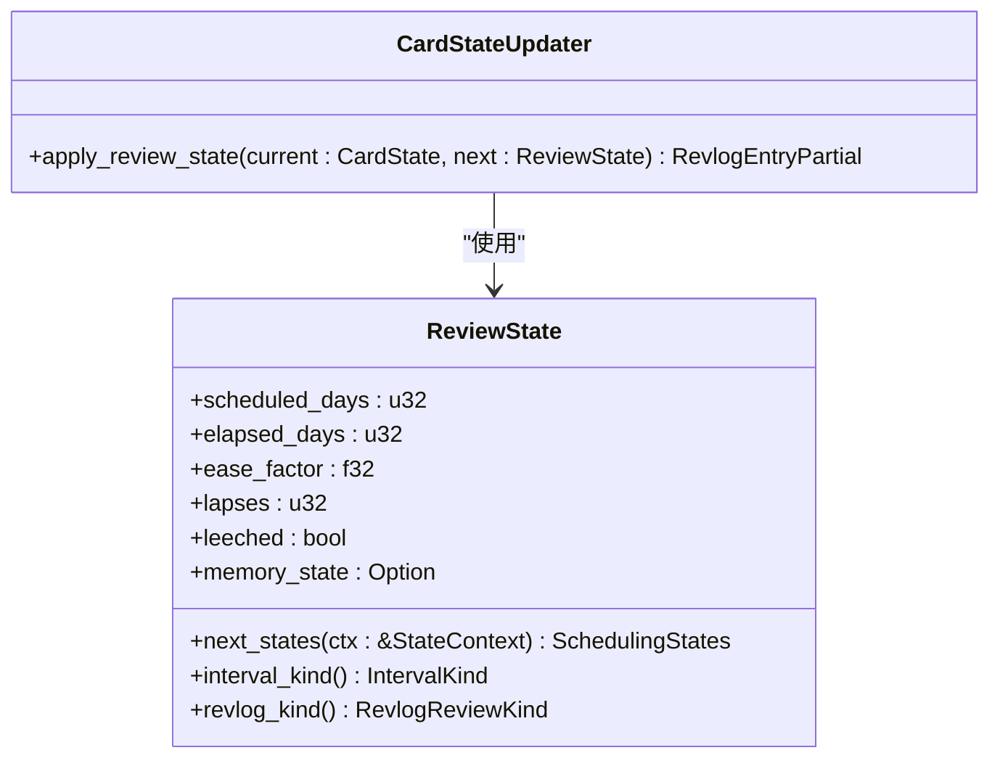
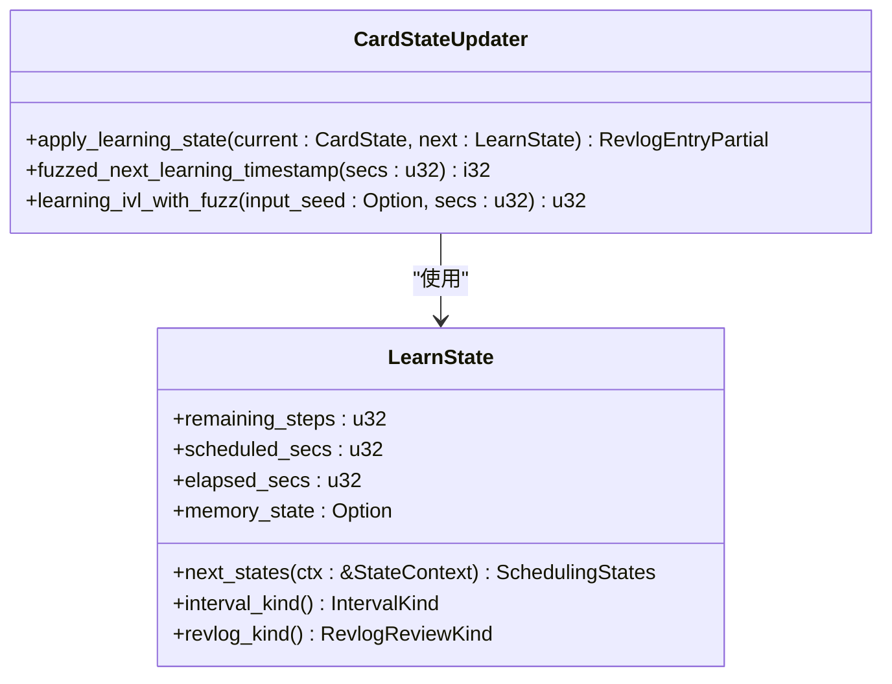
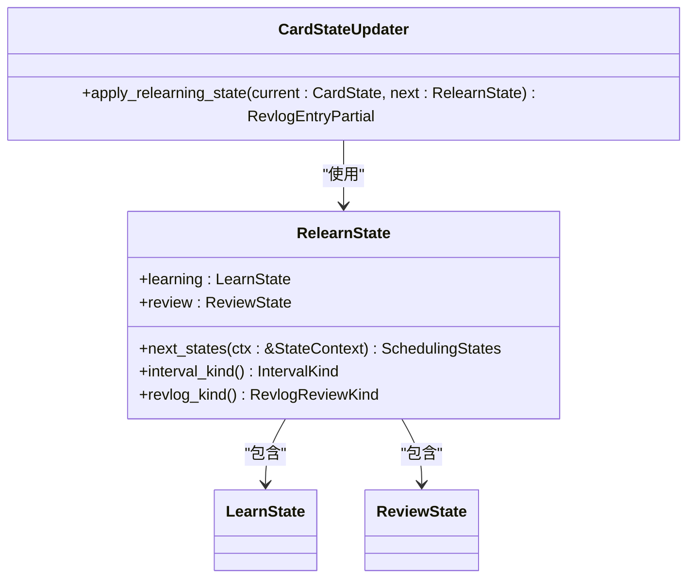
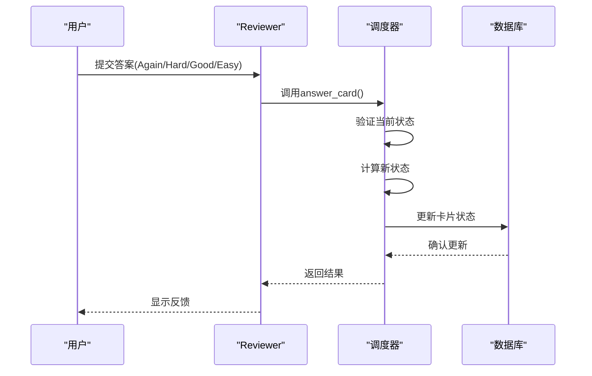
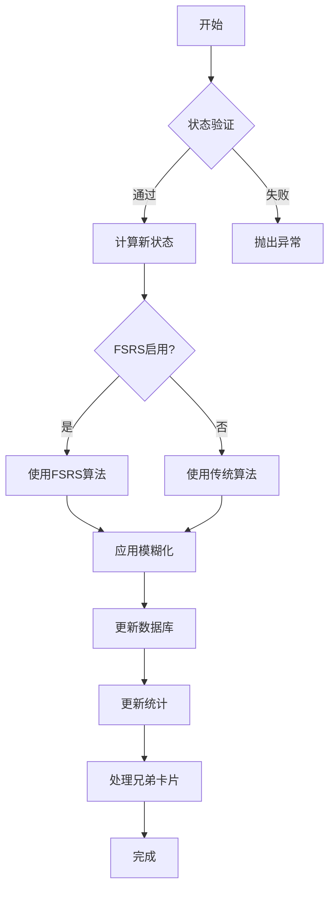

# 答案处理与评估

<cite>
**本文档中引用的文件**  
- [answering/mod.rs](file://rslib/src/scheduler/answering/mod.rs)
- [answering/review.rs](file://rslib/src/scheduler/answering/review.rs)
- [answering/learning.rs](file://rslib/src/scheduler/answering/learning.rs)
- [answering/relearning.rs](file://rslib/src/scheduler/answering/relearning.rs)
- [states/mod.rs](file://rslib/src/scheduler/states/mod.rs)
- [states/review.rs](file://rslib/src/scheduler/states/review.rs)
- [states/learning.rs](file://rslib/src/scheduler/states/learning.rs)
- [states/relearning.rs](file://rslib/src/scheduler/states/relearning.rs)
- [states/new.rs](file://rslib/src/scheduler/states/new.rs)
</cite>

## 目录
1. [简介](#简介)
2. [答案处理流程](#答案处理流程)
3. [评估场景实现差异](#评估场景实现差异)
4. [卡片状态更新与调度计算](#卡片状态更新与调度计算)
5. [常见问题与最佳实践](#常见问题与最佳实践)

## 简介
Anki的答案处理与评估系统负责管理用户对学习卡片的响应，根据用户的回答质量决定后续的学习调度。该系统实现了多种评估场景，包括新卡片学习、常规复习和重新学习等，每种场景都有不同的调度逻辑和状态转换规则。系统通过复杂的算法计算新的复习间隔和难度系数，以优化学习效果。

## 答案处理流程

Anki的答案处理流程始于用户对卡片的回答，系统根据回答质量（Again、Hard、Good、Easy）执行相应的调度决策。核心处理逻辑位于`rslib/src/scheduler/answering`模块中，主要通过`CardStateUpdater`结构体来管理卡片状态的转换。

当用户回答卡片时，系统首先获取当前卡片的调度状态，然后根据回答评级计算新的状态。`answer_card`方法是答案处理的主要入口，它接收`CardAnswer`结构体作为输入，包含卡片ID、当前状态、新状态、回答评级等信息。系统验证当前状态与预期状态一致后，应用新的状态并更新数据库。

**Diagram sources**
- [answering/mod.rs](file://rslib/src/scheduler/answering/mod.rs#L1-L100)

**Section sources**
- [answering/mod.rs](file://rslib/src/scheduler/answering/mod.rs#L1-L100)

## 评估场景实现差异

Anki系统实现了多种评估场景，每种场景有不同的实现逻辑和调度规则。

### 复习场景
复习场景处理已经学习过的卡片，主要逻辑在`apply_review_state`方法中实现。当用户回答复习卡片时，系统根据回答质量调整间隔和难度系数。Good和Easy回答会增加间隔，Again回答会导致卡片重新进入学习阶段。

**Diagram sources**
- [answering/review.rs](file://rslib/src/scheduler/answering/review.rs#L1-L40)
- [states/review.rs](file://rslib/src/scheduler/states/review.rs#L1-L50)

**Section sources**
- [answering/review.rs](file://rslib/src/scheduler/answering/review.rs#L1-L40)
- [states/review.rs](file://rslib/src/scheduler/states/review.rs#L1-L50)

### 学习场景
学习场景处理新卡片或学习阶段的卡片，主要逻辑在`apply_learning_state`方法中实现。学习阶段的卡片有剩余步骤计数，系统根据回答质量决定是继续学习步骤还是毕业进入复习阶段。

**Diagram sources**
- [answering/learning.rs](file://rslib/src/scheduler/answering/learning.rs#L1-L97)
- [states/learning.rs](file://rslib/src/scheduler/states/learning.rs#L1-L50)

**Section sources**
- [answering/learning.rs](file://rslib/src/scheduler/answering/learning.rs#L1-L97)
- [states/learning.rs](file://rslib/src/scheduler/states/learning.rs#L1-L50)

### 重新学习场景
重新学习场景处理曾经忘记的卡片，主要逻辑在`apply_relearning_state`方法中实现。当用户再次忘记一个卡片时，它会进入重新学习阶段，具有独立的学习步骤和复习间隔。

**Diagram sources**
- [answering/relearning.rs](file://rslib/src/scheduler/answering/relearning.rs#L1-L53)
- [states/relearning.rs](file://rslib/src/scheduler/states/relearning.rs#L1-L50)

**Section sources**
- [answering/relearning.rs](file://rslib/src/scheduler/answering/relearning.rs#L1-L53)
- [states/relearning.rs](file://rslib/src/scheduler/states/relearning.rs#L1-L50)

## 卡片状态更新与调度计算

### 状态更新机制
卡片状态更新通过`CardStateUpdater`结构体实现，该结构体封装了卡片、牌组、配置和时间信息。当应用新状态时，系统会更新卡片的队列、类型、间隔、到期时间、难度系数等属性。

**Diagram sources**
- [answering/mod.rs](file://rslib/src/scheduler/answering/mod.rs#L100-L200)
- [answering/review.rs](file://rslib/src/scheduler/answering/review.rs#L1-L40)

**Section sources**
- [answering/mod.rs](file://rslib/src/scheduler/answering/mod.rs#L100-L200)
- [answering/review.rs](file://rslib/src/scheduler/answering/review.rs#L1-L40)

### 间隔与难度计算
系统根据回答质量计算新的复习间隔和难度系数。对于复习卡片，间隔计算考虑了当前间隔、难度系数、回答质量等因素。难度系数（ease factor）会根据回答质量进行调整，Again回答会降低难度系数，Easy回答会提高难度系数。

新间隔的计算公式根据不同回答质量而异：
- Again：卡片重新进入学习阶段，间隔重置
- Hard：新间隔 = 当前间隔 × 硬度乘数 × 间隔乘数
- Good：新间隔 = (当前间隔 + 延迟天数/2) × 难度系数 × 间隔乘数
- Easy：新间隔 = (当前间隔 + 延迟天数) × 难度系数 × 简单乘数 × 间隔乘数

系统还实现了模糊化（fuzzing）机制，为计算出的间隔添加随机偏移，以分散复习负载。

## 常见问题与最佳实践

### 常见问题
1. **答案记录错误**：确保在调用`answer_card`前，当前状态与系统计算的状态一致。系统会验证状态匹配，不匹配时会抛出异常。
2. **间隔计算偏差**：检查牌组配置中的间隔乘数、简单乘数、难度系数等参数设置是否合理。
3. **学习步骤问题**：确认学习步骤配置正确，特别是重新学习步骤的设置。

### 最佳实践
1. **答案处理准确性**：在生产环境中，确保使用正确的模糊化种子，以保证间隔计算的一致性。
2. **性能优化**：批量处理答案时，考虑使用事务来提高数据库操作效率。
3. **状态管理**：正确管理卡片状态转换，避免状态不一致问题。
4. **配置管理**：合理设置牌组调度参数，根据学习目标调整难度阈值和间隔参数。

**Diagram sources**
- [answering/mod.rs](file://rslib/src/scheduler/answering/mod.rs#L1-L100)
- [states/mod.rs](file://rslib/src/scheduler/states/mod.rs#L1-L50)

**Section sources**
- [answering/mod.rs](file://rslib/src/scheduler/answering/mod.rs#L1-L100)
- [states/mod.rs](file://rslib/src/scheduler/states/mod.rs#L1-L50)