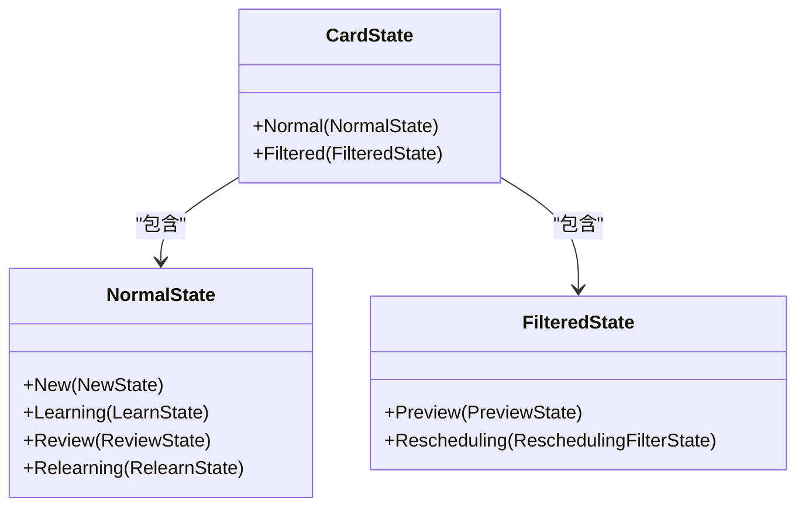
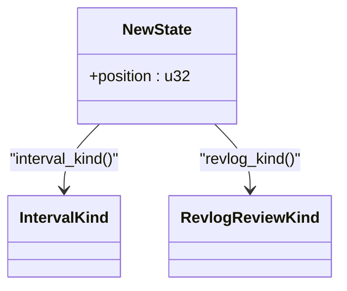
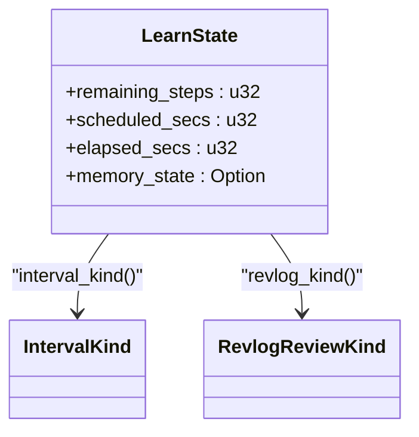
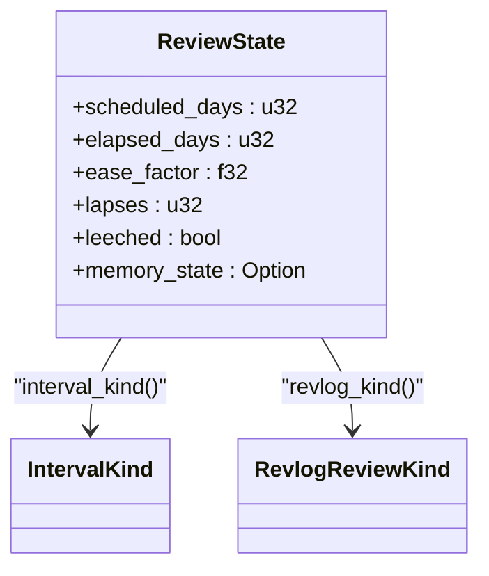
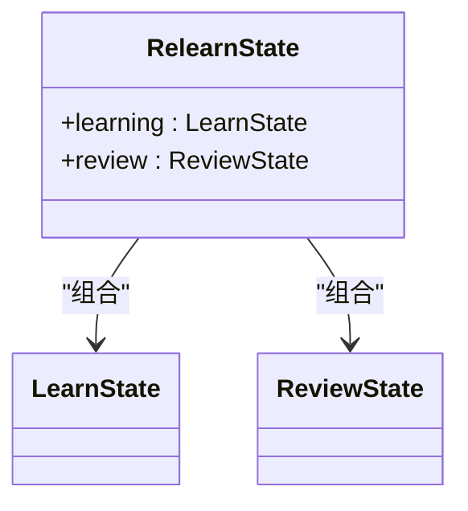
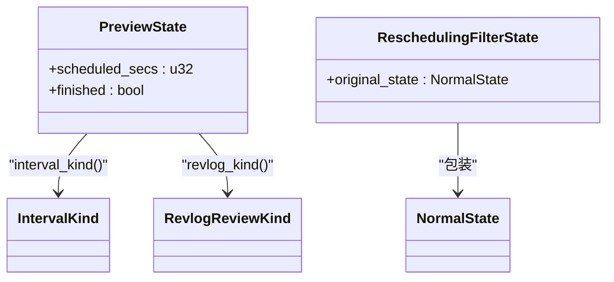
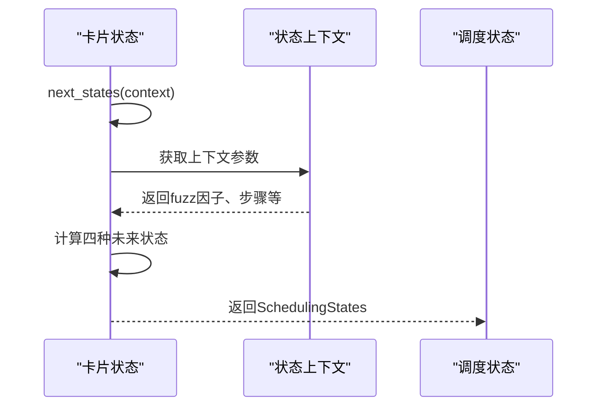
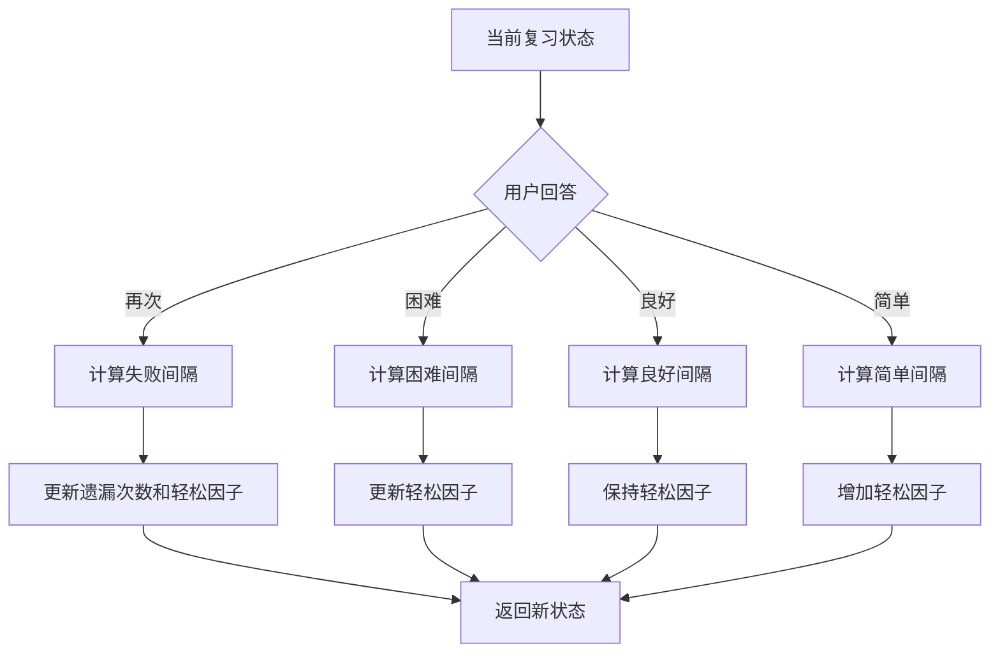
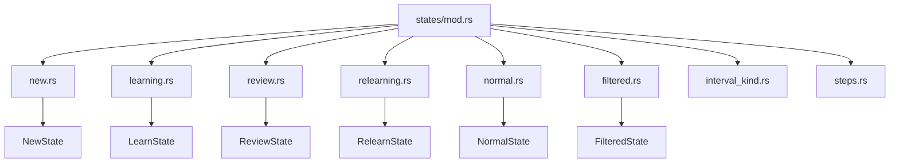

# 状态管理

<cite>
**本文档中引用的文件**  
- [rslib/src/scheduler/states/mod.rs](file://rslib/src/scheduler/states/mod.rs)
- [rslib/src/scheduler/states/new.rs](file://rslib/src/scheduler/states/new.rs)
- [rslib/src/scheduler/states/learning.rs](file://rslib/src/scheduler/states/learning.rs)
- [rslib/src/scheduler/states/review.rs](file://rslib/src/scheduler/states/review.rs)
- [rslib/src/scheduler/states/relearning.rs](file://rslib/src/scheduler/states/relearning.rs)
- [rslib/src/scheduler/states/normal.rs](file://rslib/src/scheduler/states/normal.rs)
- [rslib/src/scheduler/states/filtered.rs](file://rslib/src/scheduler/states/filtered.rs)
- [rslib/src/scheduler/states/rescheduling_filter.rs](file://rslib/src/scheduler/states/rescheduling_filter.rs)
- [rslib/src/scheduler/states/preview_filter.rs](file://rslib/src/scheduler/states/preview_filter.rs)
- [rslib/src/scheduler/mod.rs](file://rslib/src/scheduler/mod.rs)
</cite>

## 目录
1. [简介](#简介)
2. [核心状态定义](#核心状态定义)
3. [状态转换逻辑](#状态转换逻辑)
4. [状态生命周期管理](#状态生命周期管理)
5. [模块组织结构](#模块组织结构)
6. [状态数据结构设计](#状态数据结构设计)
7. [性能考量](#性能考量)
8. [常见问题与调试](#常见问题与调试)
9. [结论](#结论)

## 简介
Anki调度服务的状态管理系统负责管理卡片在其学习周期中的各种状态，包括新卡片、学习中、复习、重新学习以及过滤牌组等特殊状态。该系统通过清晰的状态定义和转换规则，确保卡片能够按照预定的学习算法进行调度。状态管理模块采用Rust语言实现，位于rslib/src/scheduler/states目录下，通过mod.rs文件组织各个状态的实现。

**状态管理**系统的核心目标是准确跟踪每张卡片的当前状态，并根据用户的学习行为（如再次、困难、良好、简单）计算出未来可能的状态。这种设计不仅支持传统的SM-2算法，还为FSRS（Free Spaced Repetition Scheduler）等更先进的算法提供了扩展能力。

## 核心状态定义

### 卡片状态枚举
卡片状态由`CardState`枚举表示，分为两种主要类型：`Normal`（正常状态）和`Filtered`（过滤状态）。这种设计允许系统区分常规学习流程和特殊牌组（如预览牌组或自定义学习牌组）中的卡片。

**图示来源**
- [rslib/src/scheduler/states/mod.rs](file://rslib/src/scheduler/states/mod.rs#L14-L24)
- [rslib/src/scheduler/states/normal.rs](file://rslib/src/scheduler/states/normal.rs#L10-L17)
- [rslib/src/scheduler/states/filtered.rs](file://rslib/src/scheduler/states/filtered.rs#L10-L15)

### 新卡片状态
`NewState`表示一张全新的卡片，尚未进入学习流程。该状态仅包含一个`position`字段，用于记录卡片在新卡片队列中的位置。

**图示来源**
- [rslib/src/scheduler/states/new.rs](file://rslib/src/scheduler/states/new.rs#L8-L15)

### 学习状态
`LearnState`表示卡片处于学习阶段，具有基于秒的倒计时。该状态包含剩余步骤数、计划秒数和已过秒数等字段，支持多步学习流程。

**图示来源**
- [rslib/src/scheduler/states/learning.rs](file://rslib/src/scheduler/states/learning.rs#L10-L16)

### 复习状态
`ReviewState`表示卡片处于复习阶段，是Anki调度算法的核心。该状态包含计划天数、已过天数、轻松因子、遗漏次数等关键字段，直接影响未来的间隔计算。

**图示来源**
- [rslib/src/scheduler/states/review.rs](file://rslib/src/scheduler/states/review.rs#L25-L36)

### 重新学习状态
`RelearnState`是一个复合状态，包含`LearnState`和`ReviewState`两个部分。当用户在复习中答错卡片时，卡片会进入重新学习流程，此时需要同时跟踪短期学习倒计时和长期复习间隔。

**图示来源**
- [rslib/src/scheduler/states/relearning.rs](file://rslib/src/scheduler/states/relearning.rs#L10-L17)

### 过滤状态
过滤状态用于处理特殊牌组中的卡片，包括`PreviewState`（预览状态）和`ReschedulingFilterState`（重新调度过滤状态）。这些状态允许用户在不影响主牌组的情况下查看或学习卡片。

**图示来源**
- [rslib/src/scheduler/states/preview_filter.rs](file://rslib/src/scheduler/states/preview_filter.rs#L10-L17)
- [rslib/src/scheduler/states/rescheduling_filter.rs](file://rslib/src/scheduler/states/rescheduling_filter.rs#L10-L17)

## 状态转换逻辑

### 状态转换框架
状态转换由`next_states`方法统一管理，该方法接收`StateContext`参数并返回`SchedulingStates`结构体，包含当前状态以及再次、困难、良好、简单四种回答对应的未来状态。

**图示来源**
- [rslib/src/scheduler/states/review.rs](file://rslib/src/scheduler/states/review.rs#L50-L58)
- [rslib/src/scheduler/states/learning.rs](file://rslib/src/scheduler/states/learning.rs#L28-L36)

### 新卡片转换
新卡片状态的转换模拟了学习卡片失败的行为。当用户对新卡片进行回答时，系统会根据学习步骤配置将其转换为相应的学习状态。

**状态来源**
- [rslib/src/scheduler/states/normal.rs](file://rslib/src/scheduler/states/normal.rs#L45-L55)

### 学习状态转换
学习状态的转换逻辑较为复杂，需要考虑多种情况：
- 如果配置了特定步骤，根据剩余步骤数返回相应的延迟
- 如果启用了FSRS算法且允许短期记忆，可能保持在学习状态
- 否则转换为复习状态，使用初始轻松因子

**状态来源**
- [rslib/src/scheduler/states/learning.rs](file://rslib/src/scheduler/states/learning.rs#L40-L185)

### 复习状态转换
复习状态的转换是Anki调度算法的核心，根据用户回答的质量（再次、困难、良好、简单）计算不同的未来间隔：
- **再次**：间隔乘以遗漏乘数，轻松因子降低，遗漏次数增加
- **困难**：间隔乘以困难乘数，轻松因子轻微降低
- **良好**：间隔乘以轻松因子和间隔乘数
- **简单**：间隔乘以轻松因子、简单乘数和间隔乘数

**图示来源**
- [rslib/src/scheduler/states/review.rs](file://rslib/src/scheduler/states/review.rs#L70-L394)

### 重新学习状态转换
重新学习状态的转换结合了学习状态和复习状态的特点。短期倒计时遵循学习步骤，而长期间隔则基于原始的复习状态进行更新。

**状态来源**
- [rslib/src/scheduler/states/relearning.rs](file://rslib/src/scheduler/states/relearning.rs#L30-L195)

### 过滤状态转换
过滤状态的转换相对简单，主要用于预览牌组。`PreviewState`根据预览延迟配置返回相应的未来状态，而`ReschedulingFilterState`则将其内部包装的正常状态进行转换。

**状态来源**
- [rslib/src/scheduler/states/preview_filter.rs](file://rslib/src/scheduler/states/preview_filter.rs#L28-L45)
- [rslib/src/scheduler/states/rescheduling_filter.rs](file://rslib/src/scheduler/states/rescheduling_filter.rs#L35-L55)

## 状态生命周期管理

### 状态持久化
所有状态数据都持久化存储在Anki的SQLite数据库中。每个状态的关键字段都被映射到数据库表的相应列，确保状态信息在应用重启后不会丢失。

### 状态转换约束
状态转换受到多种约束条件的限制：
- 最小和最大复习间隔：确保间隔不会过短或过长
- 轻松因子边界：防止轻松因子过低导致卡片难以毕业
- 漏洞阈值：当遗漏次数达到阈值时，卡片被标记为"漏洞"（leech）

### 状态一致性保证
系统通过以下机制保证状态一致性：
- 所有状态转换都在事务中执行
- 状态对象是不可变的，每次转换都创建新的状态实例
- 使用Rust的所有权系统防止数据竞争

## 模块组织结构

### mod.rs文件组织
状态模块通过`mod.rs`文件进行组织，采用层级化的模块结构：
- 根模块`states/mod.rs`定义了顶层状态枚举和上下文
- 子模块分别实现具体的状态类型（new、learning、review等）
- `interval_kind.rs`和`steps.rs`等辅助模块提供共享功能

**图示来源**
- [rslib/src/scheduler/states/mod.rs](file://rslib/src/scheduler/states/mod.rs)

### 状态上下文设计
`StateContext`结构体封装了状态转换所需的所有配置参数，避免了在方法调用中传递大量参数。这种设计提高了代码的可读性和可维护性。

**状态来源**
- [rslib/src/scheduler/states/mod.rs](file://rslib/src/scheduler/states/mod.rs#L75-L124)

## 状态数据结构设计

### 内存占用优化
状态数据结构经过精心设计以最小化内存占用：
- 使用`u32`而非`u64`存储时间相关字段
- 采用`Option`类型避免不必要的默认值存储
- 利用Rust的枚举内存布局优化

### 访问效率考量
数据结构设计考虑了访问效率：
- 频繁访问的字段位于结构体开头
- 使用`Copy` trait允许高效复制
- 方法设计遵循函数式编程原则，避免副作用

## 性能考量

### 状态转换性能
状态转换操作经过优化以确保高性能：
- 避免动态分配，尽可能使用栈内存
- 关键路径上的计算都经过性能测试
- 使用预计算和缓存减少重复计算

### 内存使用效率
系统在内存使用方面表现出色：
- 每个状态对象的大小经过精确控制
- 状态转换不产生额外的堆分配
- 利用Rust的零成本抽象特性

## 常见问题与调试

### 状态不一致问题
状态不一致通常由以下原因引起：
- 并发修改：确保所有状态修改都在单线程中进行
- 数据库损坏：使用`collection.check()`命令检查和修复
- 版本兼容性：确保Anki版本与数据库格式匹配

### 转换失败问题
转换失败可能表现为：
- 卡片卡在某个状态无法前进
- 间隔计算异常
- 学习步骤不按预期工作

### 调试和日志追踪
系统提供了多种调试手段：
- 详细的错误日志记录
- 状态转换的审计日志
- 内置的调试工具和检查命令

## 结论
Anki的状态管理系统是一个精心设计的、类型安全的状态机实现。通过清晰的状态分离和严格的转换规则，系统能够准确地管理卡片的学习生命周期。模块化的组织结构和高效的内存使用使得该系统既灵活又高性能，为Anki的核心调度功能提供了坚实的基础。